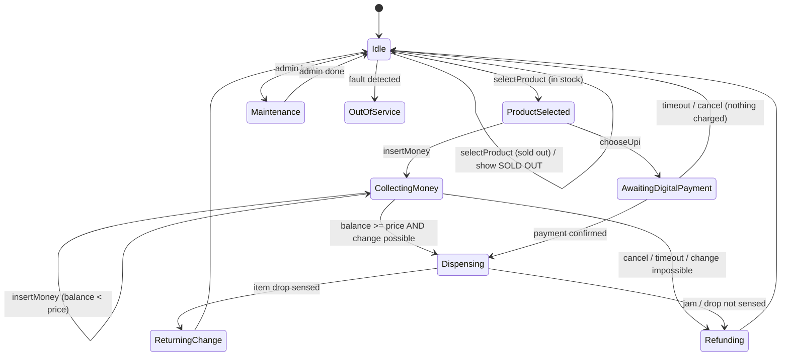

# Design a Vending Machine — State Pattern, Making Change, and Hardware That Fails

> **Low-Level Design · Classic LLD** — The vending machine is *the* State-pattern interview question. Most answers stop at a state diagram. This one also handles the parts real machines deal with: making change with limited coins, a motor that jams, power loss mid-sale, and UPI payments that confirm late.

---

## Table of Contents

1. The Ticket-Counter Clerk Analogy
2. Requirements & Clarifying Questions
3. Why the State Pattern (and What Goes Wrong Without It)
4. States, Events, and Transitions
5. Implementing the State Pattern in Java
6. Making Change — The Coin Problem
7. Inventory, Pricing, and the Admin Mode
8. Failure Handling: Jams, Power Loss, Late Digital Payments
9. Concurrency & Hardware Abstraction
10. Testing a State Machine
11. Practice Assignments (Low / Medium / High)
12. Mini Project — Vending Machine Simulator with Fault Injection
13. Interview Corner
14. Quick Reference

---

## 1. The Ticket-Counter Clerk Analogy

A railway ticket clerk behaves differently depending on the situation:

- **Idle**: "Next please."
- **Taking money**: counts your cash, tells you how much more is needed.
- **Issuing the ticket**: prints it — and won't accept more money meanwhile.
- **Giving change**: counts out coins; if the drawer lacks coins, says "exact fare only".
- **Counter closed**: "Out of service."

The *same request* ("here's ₹20") gets a different response in each situation. Writing that as one method full of `if (state == ...)` checks gets messy fast. The **State pattern** gives each situation its own class that knows what to do.

---

## 2. Requirements & Clarifying Questions

**Functional**

- Select a product (by slot code, e.g., "B3"), pay, receive the product and change.
- Accept coins/notes (₹1, ₹2, ₹5, ₹10, ₹20, ₹50, ₹100) and optionally UPI/card.
- Cancel before dispensing → refund inserted money.
- Return change using the coins in the machine; refuse transactions it can't make change for.
- Admin mode: restock, set prices, collect cash, view sales.

**Non-functional**

- Never lose a customer's money: every rupee inserted ends up as product + change or a refund.
- Recover safely from power loss and dispense failures.
- Auditable transaction log for reconciliation.

| Clarifying question | Impact |
|---------------------|--------|
| Select-then-pay or pay-then-select? | Changes the state flow |
| Multiple items per transaction? | Usually no — keeps states simple |
| Digital payments? | Asynchronous confirmation states |
| What if exact change can't be given? | Refuse upfront ("exact change only") vs refund |

---

## 3. Why the State Pattern (and What Goes Wrong Without It)

❌ The switch-statement machine:

```java
public void insertMoney(Denomination d) {
    switch (state) {
        case IDLE -> { balance += d.value(); state = HAS_MONEY; }
        case HAS_MONEY -> balance += d.value();
        case DISPENSING -> reject(d);
        case OUT_OF_SERVICE -> reject(d);
        // ...every method repeats this switch; adding a state = editing every method
    }
}
```

Every action (`selectProduct`, `insertMoney`, `cancel`, `dispense`) has the same `switch`. Adding a `MAINTENANCE` or `AWAITING_UPI` state means editing all of them — easy to miss one, leaving an illegal transition possible.

✅ **State pattern**: one class per state, each implementing all actions. The machine delegates to its current state. A new state is a new class; illegal actions are explicit rejections in one place.

---

## 4. States, Events, and Transitions



| Event \ State | Idle | ProductSelected | CollectingMoney | Dispensing |
|---------------|------|-----------------|-----------------|------------|
| selectProduct | select | change selection | reject | reject |
| insertMoney | reject (select first) | accept → Collecting | accept | reject → return coin |
| cancel | no-op | → Idle | → Refunding | reject (too late) |

---

## 5. Implementing the State Pattern in Java

```java
public interface VendingState {
    default void onEnter(VendingMachine m) { }                  // side effects when the state is entered
    default void selectProduct(VendingMachine m, String slot) { m.display("Not available now"); }
    default void insertMoney(VendingMachine m, Denomination d)  { m.hardware().returnCoin(d); }
    default void cancel(VendingMachine m)                        { m.display("Nothing to cancel"); }
    default void onItemDropSensed(VendingMachine m)              { }
    default void onDispenseFailed(VendingMachine m)              { }
}

public final class IdleState implements VendingState {
    @Override public void selectProduct(VendingMachine m, String slot) {
        Slot s = m.inventory().slot(slot);
        if (s == null || s.isEmpty()) { m.display("Sold out"); return; }
        m.startTransaction(s);
        m.transitionTo(new ProductSelectedState());
        m.display("Price " + s.price() + ". Insert money or choose UPI.");
    }
}

public final class CollectingMoneyState implements VendingState {
    @Override public void insertMoney(VendingMachine m, Denomination d) {
        m.transaction().add(d);                                  // coins go to escrow, not the cash box yet
        Money balance = m.transaction().inserted();
        Money price = m.transaction().price();
        if (balance.compareTo(price) < 0) { m.display("Insert " + price.minus(balance)); return; }

        Optional<List<Denomination>> change = m.changeMaker().makeChange(balance.minus(price));
        if (change.isEmpty()) {                                  // can't give change → refund, don't keep money
            m.display("Cannot make change. Refunding.");
            m.transitionTo(new RefundingState());
            return;
        }
        m.transaction().reserveChange(change.get());
        m.transitionTo(new DispensingState());
        m.hardware().dispense(m.transaction().slot());           // async: sensor reports the result
    }

    @Override public void cancel(VendingMachine m) {
        m.transitionTo(new RefundingState());
    }
}

public final class VendingMachine {
    private VendingState state = new IdleState();
    private final Hardware hardware;
    private final Inventory inventory;
    private final ChangeMaker changeMaker;
    private final TransactionLog log;
    private Transaction transaction;

    // All events enter here, one at a time (see section 9)
    public synchronized void selectProduct(String slot) { state.selectProduct(this, slot); }
    public synchronized void insertMoney(Denomination d) { state.insertMoney(this, d); }
    public synchronized void cancel()                     { state.cancel(this); }
    public synchronized void onItemDropSensed()           { state.onItemDropSensed(this); }

    void transitionTo(VendingState next) {
        log.record(transaction, state, next);                    // persisted before acting (recovery)
        this.state = next;
        next.onEnter(this);
    }
    // getters: hardware(), inventory(), changeMaker(), transaction(), display(...)
}
```

<div class="callout-info">

**Where does "enter" logic go?** Add an `onEnter(VendingMachine m)` hook to the interface: `RefundingState.onEnter` returns all escrowed coins and transitions to Idle; `ReturningChangeState.onEnter` pays out the reserved change. This keeps each state's side effects inside that state.

</div>

---

## 6. Making Change — The Coin Problem

The machine has a **limited** number of each coin. Paying ₹17 in change needs a combination actually present in the coin tubes.

```java
public final class ChangeMaker {
    private final EnumMap<Denomination, Integer> available;       // counts in coin tubes

    /** Returns coins for the amount using the fewest coins available, or empty if impossible. */
    public Optional<List<Denomination>> makeChange(Money amount) {
        int target = (int) amount.minorUnits() / 100;             // whole rupees in this machine
        List<Denomination> denoms = Denomination.coinsDescending();
        // Bounded knapsack: treat each physical coin as a separate item that can be used once.
        // best[v] = fewest coins making exactly v; used[v] = how many of each denomination that uses.
        int[] best = new int[target + 1];
        int[][] used = new int[target + 1][];
        Arrays.fill(best, Integer.MAX_VALUE);
        best[0] = 0;
        used[0] = new int[denoms.size()];
        for (int i = 0; i < denoms.size(); i++) {
            int c = denoms.get(i).rupees();
            for (int copy = 0; copy < available.get(denoms.get(i)); copy++) {   // each coin in the tube
                for (int v = target; v >= c; v--) {                             // downward: each coin used once
                    if (best[v - c] == Integer.MAX_VALUE || best[v - c] + 1 >= best[v]) continue;
                    best[v] = best[v - c] + 1;
                    used[v] = used[v - c].clone();
                    used[v][i]++;
                }
            }
        }
        if (best[target] == Integer.MAX_VALUE) return Optional.empty();
        List<Denomination> coins = new ArrayList<>();
        for (int i = 0; i < denoms.size(); i++)
            for (int k = 0; k < used[target][i]; k++) coins.add(denoms.get(i));
        return Optional.of(coins);
    }
}
```

| Approach | Works when |
|----------|-----------|
| **Greedy** (largest coin first) | Unlimited coins **and** a "canonical" coin system (₹1, 2, 5, 10 is canonical) |
| Greedy with limited coins | ❌ Can fail even when change is possible (e.g., owe ₹6 with coins {5, 2, 2, 2}: greedy takes 5 and gets stuck; 2+2+2 works) |
| **Bounded dynamic programming** | Always correct with limited counts — amounts in a vending machine are small, so it's cheap |

<div class="callout-scenario">

**Scenario**: A machine keeps sales in the log but customers complain they "lost ₹20". Investigation: the note was accepted, the item dispensed, but change couldn't be made and the machine displayed "insert exact change" *after* taking the money. **Decision**: Check change feasibility **before** committing (while the money is still in escrow); if change is impossible, refund the escrow immediately. Also, show "Exact change only" in Idle whenever coin tubes are low, so customers know before paying.

</div>

---

## 7. Inventory, Pricing, and the Admin Mode

| Component | Design |
|-----------|--------|
| `Slot` | code ("B3"), product, price (`Money`), quantity, capacity |
| `Inventory` | Map of slot → Slot; decrement **only after** the drop sensor confirms dispensing |
| Pricing | Price per slot; optional promotions via a pricing Strategy (happy hour, combo) |
| Admin mode | `MaintenanceState`: only accessible with an admin key/PIN; restock, set prices, collect cash (with counts recorded), run diagnostics |
| Telemetry | Machine reports sales, stock levels, faults, and cash to a backend for route planning ("restock B-row at machine 42") |

---

## 8. Failure Handling: Jams, Power Loss, Late Digital Payments

| Failure | Detection | Handling |
|---------|-----------|----------|
| **Item jam** (motor ran, nothing dropped) | Drop sensor (infrared beam) didn't fire within N seconds | Retry the motor once; if still nothing → refund escrow, mark slot faulty, alert operator |
| **Power loss mid-transaction** | On boot, the transaction log shows an unfinished transaction | Recover from the last persisted state: refund if dispensing wasn't confirmed, pay out reserved change if it was (idempotent) |
| **Coin acceptor rejects fake coins** | Hardware validation | Return the coin; count rejections for fraud monitoring |
| **Change tubes empty** | Coin counts | "Exact change only" mode in Idle |
| **UPI payment confirms after timeout** | Payment callback arrives when the machine is back in Idle | Never dispense late (the customer may have left); the backend auto-refunds, and the transaction is logged as `REFUNDED_LATE` |
| **Door open / tilt sensor** | Sensors | OutOfService + alert |

<div class="callout-warn">

**Persist before you act.** Write the transition ("DISPENSING slot B3, escrow ₹40, change reserved ₹10") to non-volatile storage *before* telling the motor to turn. After a power cut, the machine must be able to reconstruct exactly how much money it holds for the customer and what it has already done — otherwise it either loses customer money or gives away free snacks.

</div>

---

## 9. Concurrency & Hardware Abstraction

Events arrive from different sources: button presses, the coin acceptor, sensors, a network callback for UPI, and timers. They must be processed **one at a time** — a state machine is not thread-safe if two events mutate it at once.

| Option | How |
|--------|-----|
| `synchronized` entry points (above) | Simple; fine for one machine |
| **Single event loop** (a `BlockingQueue<Event>` + one worker thread) | Cleaner for real devices: all hardware callbacks enqueue events; no locks inside states |
| Actor model | Same idea at scale (e.g., a backend simulating many machines) |

```java
public interface Hardware {                // the port; a real driver and a fake implement it
    void dispense(Slot slot);             // result arrives later as onItemDropSensed / onDispenseFailed
    void returnCoins(List<Denomination> coins);
    void display(String text);
}
```

<div class="callout-tip">

**Applying this** — Put all hardware behind an interface (hexagonal architecture). Your state machine then runs in unit tests with a `FakeHardware` that can simulate jams, slow sensors, and power cuts deterministically — the same technique you'd use to test a payment gateway integration without calling the real gateway.

</div>

---

## 10. Testing a State Machine

| Test type | Example |
|-----------|---------|
| Happy path | Select B3 (₹35) → insert ₹20 + ₹20 → dispensed → ₹5 change → Idle |
| Illegal transitions | Insert money in Dispensing → coin returned, state unchanged |
| Cancel | Select → insert ₹10 → cancel → ₹10 refunded, inventory unchanged |
| Change impossible | Price ₹35, insert ₹50, tubes have only ₹10 coins → full refund |
| Jam | FakeHardware never fires the drop sensor → refund + slot marked faulty |
| Power loss | Kill after "DISPENSING" persisted → restart → recovery refunds or pays change exactly once |
| **Money conservation property** | For any random sequence of events: money in = sales + change + refunds + escrow (always) |

---

## 11. 🏋️ Practice Assignments

### 🟢 Low — Build the reflexes

**L1.** List the states for a pay-then-select vending machine (coins only).

<details>
<summary>Show answer</summary>

Idle → HasMoney (collecting; select allowed once enough money) → Dispensing → ReturningChange → Idle; plus Refunding (cancel/failure), Maintenance, OutOfService. The difference from select-then-pay: the price check happens on selection (`balance >= price`), and HasMoney accepts more money until a product is chosen.

</details>

**L2.** Why does the inventory decrement only after the drop sensor confirms, not when the motor starts?

<details>
<summary>Show answer</summary>

The motor can run without the product dropping (a jam). Decrementing early would record a sale that didn't happen, leave inventory counts wrong, and complicate the refund. The sensor confirmation is the fact that the customer received the item.

</details>

**L3.** With unlimited coins of ₹1, ₹2, ₹5, ₹10, does greedy give the minimum number of coins for ₹18?

<details>
<summary>Show answer</summary>

Yes: 10 + 5 + 2 + 1 = 4 coins, which is optimal. The Indian coin system is canonical, so greedy is optimal with unlimited coins. It can fail when counts are limited.

</details>

### 🟡 Medium — Apply it

**M1.** Add a `MaintenanceState` so an operator can restock and collect cash. Which events does it accept and reject?

<details>
<summary>Show answer</summary>

Entered only from Idle via an admin key/PIN event (never mid-transaction). Accepts: `restock(slot, qty)`, `setPrice(slot, price)`, `collectCash()` (records counted amounts to the log and resets the cash box counter), `refillCoins(denomination, count)`, `runDiagnostics()`, `exitMaintenance()` → Idle. Rejects customer events: `insertMoney` returns the coin, `selectProduct` shows "Out of service". Every admin action is logged with the operator ID for audits.

</details>

**M2.** Design the UPI flow: the machine shows a QR code, and payment confirmation arrives from the backend.

<details>
<summary>Show answer</summary>

`ProductSelected --chooseUpi--> AwaitingDigitalPayment`: the machine requests a payment intent from the backend (amount, machine ID, transaction ID) and displays the dynamic QR with a timeout (e.g., 90 s). The backend receives the gateway webhook (verified, idempotent) and pushes a confirmation to the machine (MQTT/WebSocket), which enqueues `onPaymentConfirmed(txId)`; the state checks the transaction ID matches the current one → Dispensing. Timeout/cancel → Idle and the intent is cancelled. If confirmation arrives after the machine left that state, it is ignored locally and the backend auto-refunds. If dispensing fails, the machine reports it and the backend refunds. No change handling needed.

</details>

**M3.** Find a case where greedy change-making fails with limited coins, and show how DP fixes it.

<details>
<summary>Show answer</summary>

Owe ₹6; tubes contain one ₹5 coin and three ₹2 coins (no ₹1). Greedy takes ₹5, leaving ₹1, which it can't make → reports "no change" (and refunds unnecessarily). Bounded DP explores combinations and finds 2 + 2 + 2 = ₹6. Since vending amounts are small (< a few hundred), DP over the amount is effectively instant.

</details>

### 🔴 High — Think like a senior

**H1.** Design the backend for a fleet of 5,000 machines: telemetry, remote price updates, restock routing, and reconciliation of cash and UPI.

<details>
<summary>Show answer</summary>

Machines connect via MQTT (lightweight, intermittent connectivity) to an IoT broker; each has a device identity (certificate). **Telemetry** (sales, stock per slot, faults, coin levels, cash box totals) is sent as events with local sequence numbers, buffered offline and replayed on reconnect (idempotent by machine ID + sequence). **Config** (prices, promotions) is pushed as versioned documents; the machine applies them only in Idle and acknowledges the version. **Restock routing**: stock projections per machine feed a daily route plan for field staff (prioritize predicted stock-outs of best sellers). **Reconciliation**: per machine per day, sales from the log vs cash collected (counted by the operator) vs UPI settlements from the gateway; mismatches above a threshold create investigation tickets. **Remote actions** (reboot, disable a slot) require auth and are audited. A time-series store for telemetry, a relational DB for machines/config/reconciliation, dashboards for faults and stock-outs.

</details>

**H2.** Prove your machine never loses customer money. What invariants and mechanisms guarantee it?

<details>
<summary>Show answer</summary>

Invariant: at every point, `inserted = escrow + paid_out_change + refunded + revenue_of_confirmed_sales` for the current and past transactions. Mechanisms: (1) inserted money stays in **escrow** (a logical bucket, and on real hardware often a physical escrow) until a sale is confirmed; (2) change feasibility is checked before committing; (3) state transitions are **persisted before side effects** (write-ahead log), and side effects are idempotent (paying out change records coin counts paid, so recovery doesn't pay twice); (4) dispensing is confirmed by a sensor, and any failure path leads to Refunding; (5) recovery on boot finishes or refunds any open transaction; (6) property-based tests generate random event sequences (including crashes and jams) and assert the invariant; (7) daily reconciliation against collected cash detects hardware-level discrepancies.

</details>

---

## 12. 🛠️ Mini Project — Vending Machine Simulator with Fault Injection

**Goal**: A state machine you can break on purpose and prove correct. 2 evenings, plain Java.

**Build**

1. States as classes (Idle, ProductSelected, CollectingMoney, Dispensing, ReturningChange, Refunding, Maintenance, OutOfService) with `onEnter` hooks.
2. `ChangeMaker` with bounded DP and coin counts.
3. `Hardware` interface with a `FakeHardware` supporting: jam probability, sensor delay, "power cut after next transition".
4. A single-threaded event loop (`BlockingQueue<Event>`) that all inputs go through.
5. A write-ahead `TransactionLog` (a file of JSON lines) and a recovery routine on startup.
6. A CLI: `select B3`, `insert 20`, `cancel`, `admin`, `restock B3 10`, `status`.
7. **Property test**: generate 10,000 random event sequences with random faults; after each, assert money conservation and that inventory counts match confirmed sales.

**Acceptance criteria**

- No `switch` on state anywhere in the machine.
- Recovery after a simulated power cut never double-pays change.
- The README contains the state diagram and the invariant.

---

## 🎯 Interview Corner

<div class="callout-interview">

**Q: "Design a vending machine. Why use the State pattern?"**

The machine responds differently to the same event depending on where it is in the transaction. Inserting a coin is accepted while collecting money, returned while dispensing, and rejected in maintenance. Without the State pattern, every action method grows a switch over states, and adding a state means editing all of them. With it, each state — Idle, ProductSelected, CollectingMoney, Dispensing, Refunding, Maintenance — is a class implementing all events, with safe defaults that reject illegal actions, and the machine just delegates to its current state and records transitions. New behavior like a UPI-payment state becomes a new class, and illegal transitions are impossible by construction.

</div>

<div class="callout-interview">

**Q: "How does your machine give change, and what if it can't?"**

Change feasibility is decided before the sale is committed, while the customer's money is still in escrow. I compute change from the actual coin counts in the tubes using bounded dynamic programming, because greedy can fail when some coins are exhausted. For example, owing ₹6 with one ₹5 coin and three ₹2 coins has a valid answer greedy misses. If no combination works, the machine refunds the escrow immediately rather than taking the money. In Idle it shows "exact change only" when coin levels are low, so customers know upfront.

</div>

<div class="callout-interview">

**Q: "What happens if the power goes out while an item is being dispensed?"**

Every transition is written to non-volatile storage before the side effect happens: the transaction ID, the escrow amount, the reserved change, and "dispensing slot B3". On restart, a recovery routine reads the last state of any open transaction. If the drop sensor's confirmation was never recorded, the item wasn't dispensed, so it refunds the escrow. If it was recorded, the sale completed, and it pays out any change not yet marked as paid. Side effects are recorded so they're idempotent, which means recovery never pays twice. Daily reconciliation with collected cash catches anything the hardware got wrong.

</div>

---

## Quick Reference

| Concept | One-Liner |
|---------|-----------|
| Pattern | State: one class per state; machine delegates; default = reject |
| Key states | Idle, ProductSelected, CollectingMoney, AwaitingDigitalPayment, Dispensing, ReturningChange, Refunding, Maintenance, OutOfService |
| Escrow | Customer money held until the sale is confirmed |
| Change | Bounded DP over actual coin counts; decide before committing |
| Inventory | Decrement only after the drop sensor confirms |
| Failures | Jam → refund + slot fault; late UPI → backend refund |
| Recovery | Persist transitions before acting; idempotent side effects |
| Concurrency | Single event loop (or synchronized entry points) |
| Hardware | Behind an interface; fake it in tests with fault injection |
| Invariant | Money in = sales + change + refunds + escrow |

---

## Related Topics

- `lld-thinking-framework` — general LLD method
- `lld-elevator` — another state-machine-heavy design
- `java-oop` — polymorphism behind the State pattern
- `dsa-recursion` — DP foundations for change-making

> **A vending machine is a promise made of states: whatever happens — jams, power cuts, missing coins — the customer gets the product or their money back. Design the states so no other outcome is possible.**

---

<!-- journey-link:start -->

<div class="callout-journey">

🛒 **ShopNorth Journey** — ShopNorth's order lifecycle (PENDING_PAYMENT → PAID → SHIPPED …) is a state machine guarded just like this one.

**Continue the story:** [Chapter 3 · Low-Level Design](/tutorials/journey-03-low-level-design) · **New here?** [Start the journey](/tutorials/journey-start)

</div>

<!-- journey-link:end -->
