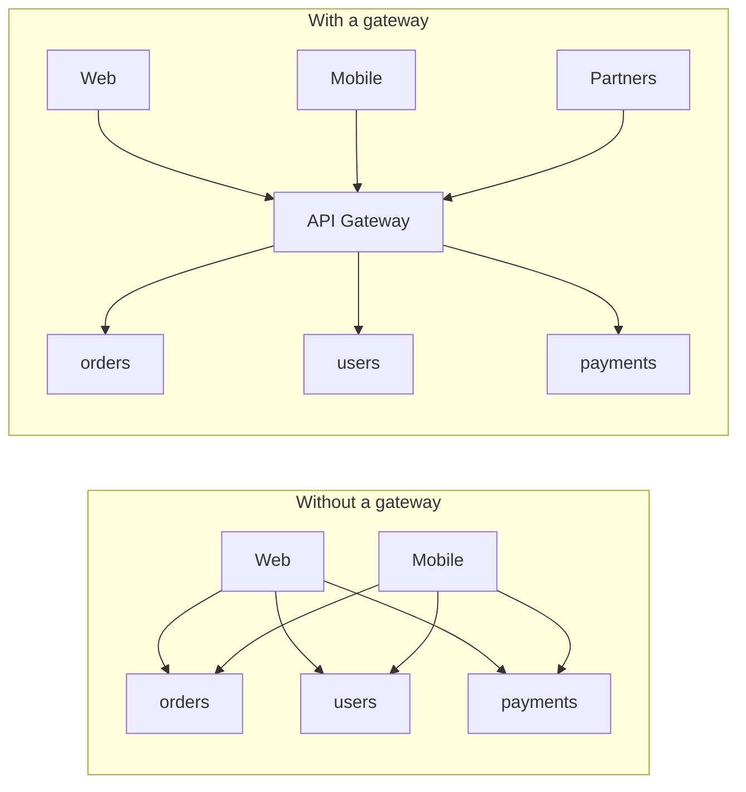
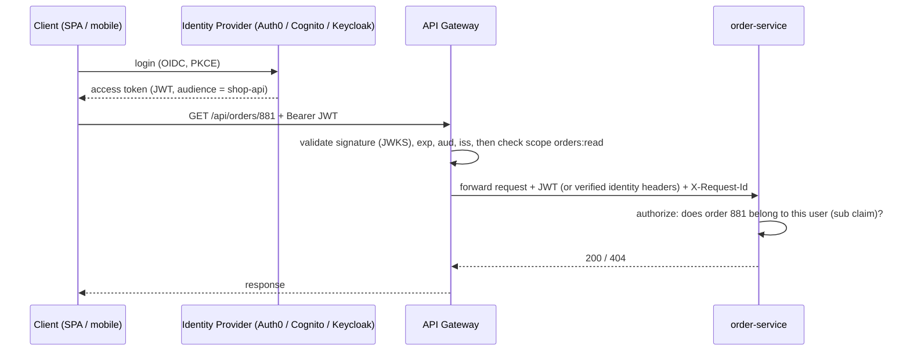
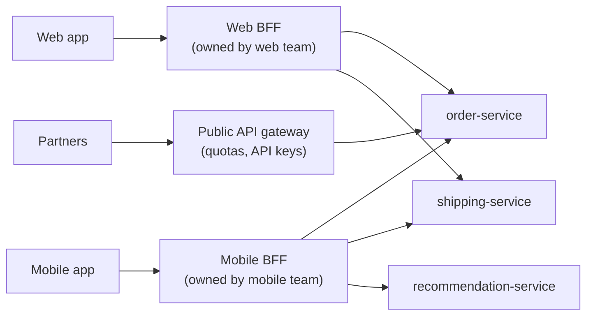

# API Gateway Pattern — The Front Door of Microservices (and How Not to Turn It into a Monolith)

> **Microservices · Patterns & Approaches** — Every microservices architecture ends up with a front door. Done well, it centralizes the boring-but-critical concerns — TLS, authentication, rate limiting, routing, observability. Done badly, it becomes a new monolith that every team must queue behind. This page shows both, with a working Spring Cloud Gateway setup.

---

## Table of Contents

1. The Hotel Reception Analogy
2. What Problem a Gateway Solves
3. Gateway Responsibilities (and What Stays Out)
4. Authentication at the Edge — and Authorization in the Services
5. Rate Limiting, Quotas, and Abuse Protection
6. Resilience: Timeouts, Retries, Circuit Breakers
7. Aggregation and the BFF Pattern
8. Hands-On: Spring Cloud Gateway
9. Gateway vs Ingress vs Service Mesh vs API Management
10. Anti-Patterns and Failure Modes
11. Practice Assignments (Low / Medium / High)
12. Mini Project — Gateway for a 3-Service Shop
13. Interview Corner
14. Quick Reference

---

## 1. The Hotel Reception Analogy

Guests don't wander into the kitchen, the laundry, or the manager's office. They go to **reception**, which:

- checks their **identity** (key card) — authentication,
- directs them to the right place — routing,
- stops anyone ordering 400 room-service meals a minute — rate limiting,
- answers simple questions itself ("checkout is at 11") — caching,
- and for a "full stay summary" collects information from housekeeping, the restaurant, and the spa — aggregation.

But reception **doesn't cook the food**. If the receptionist starts making business decisions for every department, the whole hotel slows down to the pace of one desk.

---

## 2. What Problem a Gateway Solves

Without a gateway, every client (web, iOS, Android, partners) talks to every service directly:



| Problem without a gateway | Gateway solution |
|---------------------------|------------------|
| Every service implements TLS, JWT validation, CORS, rate limits | Done once at the edge |
| Clients know internal hostnames and topology | One public host; internal changes are invisible |
| Mobile apps make 6 calls per screen over slow networks | Aggregation / BFF |
| No single place for access logs, request IDs, metrics | Uniform edge telemetry |
| Every service is publicly exposed | Services stay private (ClusterIP / private subnets) |

---

## 3. Gateway Responsibilities (and What Stays Out)

| ✅ Belongs in the gateway (cross-cutting) | ❌ Stays in the services (business) |
|------------------------------------------|-------------------------------------|
| TLS termination, HTTP/2, compression | Business validation ("is this coupon valid?") |
| Routing by host/path/header, versioning (`/v2/...`) | Domain decisions and workflows |
| **Authentication** (validate tokens), coarse checks (scopes) | **Fine-grained authorization** ("can user X see order Y?") |
| Rate limiting, quotas, IP allow/deny, WAF integration | Data ownership and persistence |
| Request IDs, access logs, metrics, tracing headers | Complex transformations with business meaning |
| CORS, security headers | Orchestration of business transactions (sagas) |
| Simple response caching for public, cacheable GETs | Per-user caching of business data |
| Timeouts, circuit breakers, fallbacks for dependencies | — |

<div class="callout-warn">

**The gateway must not know your business.** The moment you write "if order total > ₹50,000 then call fraud-service" in gateway config, every business change requires a change to a shared component owned by a platform team. That's how gateways become distributed monoliths.

</div>

---

## 4. Authentication at the Edge — and Authorization in the Services



| Approach | How | Trade-off |
|----------|-----|-----------|
| **Forward the JWT** to services; services validate it too | Defense in depth; services don't trust the network | Each service needs JWT validation (a shared library/Spring Security makes it easy) |
| Gateway validates, forwards **signed internal identity headers** | Services trust headers only from the gateway (mTLS/network policy) | Simpler services; the network boundary becomes critical |
| Token exchange at the gateway | Gateway swaps the external token for an internal one with narrower scopes | Most secure, more moving parts |

<div class="callout-interview">

**Q: "Should authorization happen in the API gateway?"**

Authentication and coarse-grained checks, yes: validating the token's signature, expiry, audience, and required scopes at the edge rejects bad traffic early. But fine-grained authorization — whether this user may see this specific order — depends on business data only the owning service has, so it stays in the service. I also forward the token or verified identity so services can enforce their own checks, which gives defense in depth if something bypasses the gateway.

</div>

---

## 5. Rate Limiting, Quotas, and Abuse Protection

| Limit | Key | Example |
|-------|-----|---------|
| Per user | JWT `sub` | 100 requests/minute to `/api/**` |
| Per API key / partner | Client ID | 1,000 requests/minute, 1M/month quota |
| Per IP | Client IP (careful with NAT and proxies) | Login endpoint: 10 attempts/minute |
| Per route | Path | `/api/search` stricter than `/api/products/{id}` |
| Global protection | Backend capacity | Shed load when the service is overloaded (return 503 early) |

Return **429 Too Many Requests** with `Retry-After` and rate-limit headers so well-behaved clients back off. For distributed gateways, limits are shared via Redis (token bucket / sliding window — see `rate-limiter`).

<div class="callout-scenario">

**Scenario**: A partner's buggy integration retries failed calls in a tight loop, generating 20K requests/second and degrading the site for everyone. **Decision**: Per-client quotas at the gateway (by API key) would have capped them at their contracted rate while everyone else was unaffected; add circuit-breaking and retry guidance to partner docs (exponential backoff, honor `Retry-After`), alerts on per-client traffic anomalies, and the ability to temporarily block or throttle one client ID without a deploy.

</div>

---

## 6. Resilience: Timeouts, Retries, Circuit Breakers

| Setting | Guidance |
|---------|----------|
| **Timeouts** | Every route has one, shorter than the client's; slow backends shouldn't tie up gateway connections |
| **Retries** | Only for **idempotent** methods (GET, PUT with idempotent semantics) and only on connection errors / 502 / 503; with backoff and a retry budget |
| **Circuit breaker** | Per backend; fail fast with a fallback (cached data, "temporarily unavailable") |
| **Bulkheads** | Separate connection pools per backend so one slow service can't exhaust the gateway |
| **Load shedding** | Reject early with 503 when overloaded, rather than queueing until everything times out |

<div class="callout-warn">

**Never auto-retry POSTs at the gateway** (payments, orders) unless the API supports idempotency keys. A timeout doesn't mean the backend didn't process the request — a blind retry can charge a customer twice.

</div>

---

## 7. Aggregation and the BFF Pattern

A mobile "Order details" screen needs order info, shipment tracking, and recommended products — three services.

| Option | Pros | Cons |
|--------|------|------|
| Client calls 3 APIs | Simple backend | Slow on mobile networks; client coupled to service layout |
| Gateway aggregation (generic) | One round trip | Business logic creeps into the shared gateway |
| **BFF (Backend for Frontend)** — a small service per client type, owned by that client's team | Tailored responses; the frontend team moves independently | More services to run; duplicated logic across BFFs if unmanaged |
| GraphQL gateway / federation | Clients request exactly what they need | Query cost control, caching, and N+1 resolver problems to manage |



<div class="callout-tip">

**Applying this** — Keep the edge gateway **generic** (auth, limits, routing) and put client-specific aggregation in **BFFs** owned by frontend teams. The BFF calls services in parallel (e.g., `CompletableFuture` / WebClient), applies per-call timeouts, and degrades gracefully: if recommendations time out, return the order screen without them.

</div>

---

## 8. Hands-On: Spring Cloud Gateway

Spring Cloud Gateway is a reactive (WebFlux/Netty) gateway configured with **routes**, **predicates** (match conditions), and **filters** (behavior).

```yaml
spring:
  cloud:
    gateway:            # newer releases use spring.cloud.gateway.server.webflux.* — check your version's docs
      default-filters:
        - AddResponseHeader=X-Content-Type-Options, nosniff
      routes:
        - id: orders
          uri: http://order-service:8080          # or lb://order-service with service discovery
          predicates:
            - Path=/api/orders/**
          filters:
            - name: RequestRateLimiter
              args:
                redis-rate-limiter.replenishRate: 20      # tokens per second
                redis-rate-limiter.burstCapacity: 40
                key-resolver: "#{@userKeyResolver}"
            - name: CircuitBreaker
              args:
                name: orders
                fallbackUri: forward:/fallback/orders
            - name: Retry
              args:
                retries: 2
                methods: GET
                statuses: BAD_GATEWAY, SERVICE_UNAVAILABLE
        - id: payments
          uri: http://payment-service:8080
          predicates:
            - Path=/api/payments/**
```

```java
@Configuration
class GatewayConfig {
    @Bean
    KeyResolver userKeyResolver() {                       // rate-limit per authenticated user
        return exchange -> exchange.getPrincipal()
            .map(Principal::getName)
            .defaultIfEmpty("anonymous");
    }

    @Bean
    SecurityWebFilterChain security(ServerHttpSecurity http) {
        return http
            .authorizeExchange(ex -> ex
                .pathMatchers("/api/public/**", "/actuator/health").permitAll()
                .pathMatchers(HttpMethod.GET, "/api/orders/**").hasAuthority("SCOPE_orders:read")
                .anyExchange().authenticated())
            .oauth2ResourceServer(o -> o.jwt(Customizer.withDefaults()))   // validates JWTs via the issuer's JWKS
            .csrf(ServerHttpSecurity.CsrfSpec::disable)                     // stateless bearer-token API
            .build();
    }
}
```

```yaml
spring:
  security:
    oauth2:
      resourceserver:
        jwt:
          issuer-uri: https://your-tenant.auth0.com/     # discovers JWKS; validates iss/exp/signature
          audiences: shop-api
```

<div class="callout-info">

**Request IDs and tracing**: with Micrometer Tracing on the gateway and services, a `traceparent` header propagates automatically, so one request's path across gateway → order-service → payment-service shows up as a single trace. Always return the trace/request ID in error responses so support can find it.

</div>

---

## 9. Gateway vs Ingress vs Service Mesh vs API Management

| Tool | Traffic | Main purpose | Examples |
|------|---------|--------------|----------|
| **Ingress / Gateway API controller** | North-south (into the cluster) | Basic HTTP routing and TLS | NGINX, Envoy Gateway, AWS LB Controller |
| **API gateway** | North-south | Auth, rate limits, transformations, API-level policies | Spring Cloud Gateway, Kong, Tyk, AWS API Gateway, Azure APIM |
| **Service mesh** | East-west (service to service) | mTLS, retries, L7 routing, telemetry between services | Istio, Linkerd |
| **API management platform** | North-south, external APIs | Developer portal, API keys, monetization, analytics, lifecycle | Apigee, Azure APIM, Kong Konnect |

These layer together: e.g., a cloud load balancer → Kubernetes Gateway API → an API gateway for public APIs → a service mesh inside the cluster. Don't adopt all of them on day one.

---

## 10. Anti-Patterns and Failure Modes

| Anti-pattern | Symptom | Fix |
|--------------|---------|-----|
| **God gateway** — business logic in routes/filters | Every feature needs a gateway release; platform team bottleneck | Keep it generic; move logic to services/BFFs |
| Single gateway instance | One pod failure = full outage | Multiple replicas across zones, health checks, autoscaling |
| No timeouts | Slow backend exhausts gateway threads/connections | Per-route timeouts, bulkheads |
| Blind retries on non-idempotent calls | Duplicate orders/payments | Retry only idempotent methods; idempotency keys |
| Trusting headers from the internet | Client sends `X-User-Id: admin` | Strip incoming identity headers at the edge; set them only after verification |
| Gateway as the only security layer | A misrouted internal call bypasses checks | Services validate tokens/authorize too (defense in depth) |
| One shared gateway config edited by 20 teams | Merge conflicts, outages from unrelated changes | Per-team route files with validation in CI, or delegated routing (Gateway API `HTTPRoute`) |

---

## 11. 🏋️ Practice Assignments

### 🟢 Low — Build the reflexes

**L1.** Put each responsibility in "gateway" or "service": (a) JWT signature validation, (b) checking a user owns order 881, (c) 100 req/min per user, (d) calculating shipping fees, (e) adding a request ID.

<details>
<summary>Show answer</summary>

Gateway: (a), (c), (e). Service: (b) fine-grained authorization needs business data, (d) business logic. (Services may *also* validate the JWT for defense in depth.)

</details>

**L2.** A client sends `X-User-Id: 1` in its request to the gateway. What should the gateway do?

<details>
<summary>Show answer</summary>

Strip it. Identity headers must be set only by the gateway after verifying a token; accepting client-supplied identity headers lets anyone impersonate any user. Internally, services should only trust such headers from the gateway (network policies / mTLS) or validate the JWT themselves.

</details>

**L3.** What should a rate-limited response contain?

<details>
<summary>Show answer</summary>

HTTP **429 Too Many Requests**, a `Retry-After` header (seconds), and ideally rate-limit headers (limit, remaining, reset), plus a machine-readable error body (e.g., ProblemDetail with an error code).

</details>

### 🟡 Medium — Apply it

**M1.** Write Spring Cloud Gateway routes so `/api/v1/orders/**` goes to `order-service-v1` and `/api/v2/orders/**` to `order-service-v2`, with a 3-second response timeout on v2.

<details>
<summary>Show answer</summary>

```yaml
spring:
  cloud:
    gateway:
      routes:
        - id: orders-v1
          uri: http://order-service-v1:8080
          predicates: [ "Path=/api/v1/orders/**" ]
        - id: orders-v2
          uri: http://order-service-v2:8080
          predicates: [ "Path=/api/v2/orders/**" ]
          metadata:
            response-timeout: 3000        # per-route timeout in milliseconds
            connect-timeout: 1000
```

Document the v1 deprecation timeline, return a `Deprecation`/`Sunset` header on v1 responses, and track v1 traffic by client to know when it's safe to remove.

</details>

**M2.** The mobile home screen needs data from 5 services and takes 2.4 s on 4G. Propose a design.

<details>
<summary>Show answer</summary>

A **mobile BFF** owned by the mobile team: one endpoint `GET /mobile/home` that calls the 5 services **in parallel** with per-call timeouts (e.g., 300 ms), returns a response shaped exactly for the screen (trimmed fields), degrades gracefully (omit recommendations on timeout), and caches non-personalized parts (banners, categories) for short periods. The client makes 1 request instead of 5 sequential ones; payload shrinks. Measure p95 before/after on real network conditions.

</details>

**M3.** Configure per-partner quotas: partner A 50 req/s, partner B 200 req/s, identified by API key. How do you implement it in Spring Cloud Gateway?

<details>
<summary>Show answer</summary>

A `KeyResolver` returning the API key (from a header, validated against a key store) and per-partner limits. Spring Cloud Gateway's Redis rate limiter supports different `replenishRate` / `burstCapacity` per key via a custom `RateLimiter` bean (or separate routes/predicates per partner plan). Alternatively, use an API management layer (Kong, Apigee) where plans and quotas are first-class. Add monthly quota tracking separately (a counter per key per month) if contracts require it.

</details>

### 🔴 High — Think like a senior

**H1.** Your company runs one gateway configured by a platform team; 25 product teams wait days for route changes, and a bad regex in one route caused a site-wide outage. Redesign.

<details>
<summary>Show answer</summary>

Move from a centrally edited config to **delegated, validated routing**: the platform team owns the gateway infrastructure and global policies (TLS, auth, default limits, security headers); product teams own their routes in their own repos (e.g., Kubernetes Gateway API `HTTPRoute`s or per-team config fragments) deployed through GitOps. CI validates route definitions (schema, conflicts, forbidden patterns like overlapping paths), and a canary gateway tier applies new config to a small share of traffic first with automatic rollback on error-rate increases. Split into multiple gateway deployments by domain or criticality (public checkout vs internal tools) to limit blast radius. Outcome: route changes in minutes by the owning team, and one bad route can't take down unrelated traffic.

</details>

**H2.** Design the edge for a public API used by 3,000 partner integrations and your own apps, with monetized plans.

<details>
<summary>Show answer</summary>

Separate entry points: **public partner API** through an API management platform (developer portal, API key/OAuth client credentials issuance, plans with quotas and rate limits, usage analytics and billing export, versioned API products, sandbox environment), and **first-party apps** through lightweight gateways/BFFs with user-based OIDC auth. Shared behind them: a WAF, bot protection, and the same internal services with defense-in-depth authorization. Partner tokens carry scopes mapped to API products; quotas enforced per client ID; `429` with `Retry-After`; per-partner dashboards and alerting on anomalies; versioning with deprecation headers and published timelines; contract tests (OpenAPI) run against every release so partners aren't broken. Isolate noisy partners (per-plan capacity pools) so free-tier abuse can't affect paid customers.

</details>

---

## 12. 🛠️ Mini Project — Gateway for a 3-Service Shop

**Goal**: A real gateway with auth, limits, resilience, and a BFF. 2-3 evenings.

**Build**

1. Three small Spring Boot services: `order-service`, `catalog-service`, `review-service` (in-memory data is fine), each validating JWTs (resource server) and doing ownership checks on orders.
2. **Spring Cloud Gateway**: routes for `/api/orders/**`, `/api/catalog/**`, `/api/reviews/**`; JWT validation against a local Keycloak (Docker) or a mock issuer; scope checks per route.
3. Redis-backed per-user rate limiting (429 + `Retry-After`); per-route timeouts; a circuit breaker with a fallback for `review-service`; GET-only retries.
4. A **mobile BFF** endpoint `GET /bff/product/{id}` aggregating catalog + reviews in parallel with a 300 ms timeout on reviews.
5. Strip incoming `X-User-*` headers; propagate tracing headers; return the trace ID in error bodies.
6. Load test with k6: show rate limiting working, and the site staying up when `review-service` is killed.

**Acceptance criteria**

- An invalid/expired JWT gets 401 at the gateway; a valid JWT accessing another user's order gets 404/403 from the service.
- Killing `review-service` keeps product pages working (without reviews) with p95 < 400 ms.
- A README diagram and a table of which concern lives where.

---

## 🎯 Interview Corner

<div class="callout-interview">

**Q: "What does an API gateway do, and when do you need one?"**

It's the single entry point for external clients. It centralizes cross-cutting concerns: TLS termination, routing to internal services, token validation and coarse scope checks, rate limits and quotas, CORS and security headers, request IDs, access logs, metrics and tracing, timeouts and circuit breakers, and sometimes caching of public responses. That keeps services private and simple, and hides the internal topology from clients. You need one as soon as you have several services exposed to external clients, or multiple client types with different needs. A single monolith behind a load balancer usually doesn't.

</div>

<div class="callout-interview">

**Q: "What's the BFF pattern, and how is it different from putting aggregation in the gateway?"**

A Backend for Frontend is a small service per client type — web, mobile, partner — owned by that client's team, which aggregates and shapes data for its screens: calling services in parallel, trimming payloads, and degrading gracefully. Putting that aggregation in the shared gateway mixes client-specific, business-flavored logic into a platform component every team depends on, so it becomes a bottleneck and a risk. The edge gateway stays generic and the BFFs carry client-specific composition. The trade-off is more services to operate, so I'd introduce BFFs when client needs actually diverge.

**Follow-up trap**: "Isn't a BFF just a mini monolith?" → Only if it grows domain logic. A BFF should orchestrate and shape data, while business rules stay in the domain services.

</div>

<div class="callout-interview">

**Q: "How do you prevent the API gateway from becoming a single point of failure?"**

Run multiple replicas across availability zones behind a load balancer, with health checks and autoscaling. Keep the gateway stateless, with rate-limit state in a replicated Redis that fails open or closed according to a deliberate policy. Use per-route timeouts, bulkheads, and circuit breakers so one slow backend can't exhaust it. Roll out config changes gradually with validation in CI and canaries, and optionally split gateways by domain or criticality to limit blast radius. Load-test the gateway itself, because its capacity caps the whole platform's.

</div>

---

## Quick Reference

| Concern | Practice |
|---------|----------|
| Scope | Cross-cutting only; no business logic |
| Auth | Validate JWT at the edge (sig, exp, aud, iss, scopes); services authorize resources |
| Headers | Strip client identity headers; propagate trace IDs |
| Limits | Per user / API key / IP / route; 429 + Retry-After; Redis-backed |
| Resilience | Timeouts per route, retries only idempotent, circuit breakers, bulkheads, load shedding |
| Aggregation | BFF per client type, parallel calls, graceful degradation |
| Tools | Spring Cloud Gateway, Kong, AWS API Gateway, Apigee; ingress and mesh are different layers |
| Availability | Stateless replicas across zones; canary config changes |

---

## Related Topics

- `rate-limiter` — algorithms behind gateway limits
- `auth0-deep-dive` — the tokens the gateway validates
- `service-communication` — sync calls between services behind the gateway
- `k8s-networking` — Ingress and Gateway API at the cluster edge

> **A good gateway is boring on purpose: it checks IDs, directs traffic, and keeps the crowd orderly. The moment it starts making business decisions, it stops being a front door and becomes a bottleneck.**

---

<!-- journey-link:start -->

<div class="callout-journey">

🛒 **ShopNorth Journey** — ShopNorth's gateway is the one door in: routing, token checks, and rate limits — no business logic.

**Continue the story:** [Chapter 6 · Microservices & Events](/tutorials/journey-06-microservices) · **New here?** [Start the journey](/tutorials/journey-start)

</div>

<!-- journey-link:end -->
