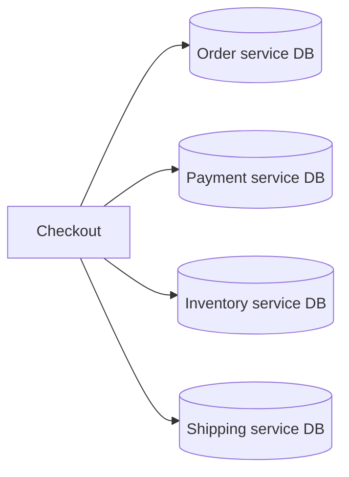
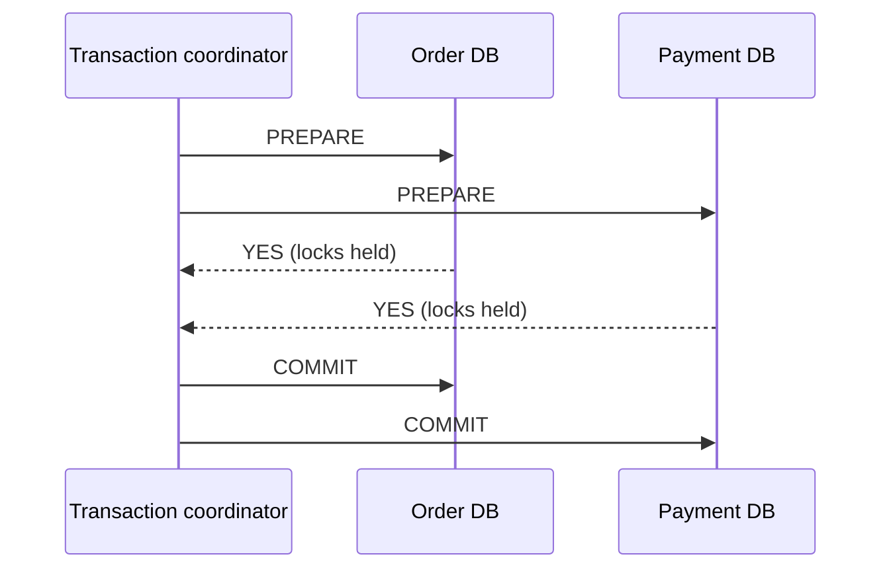
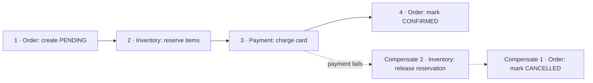
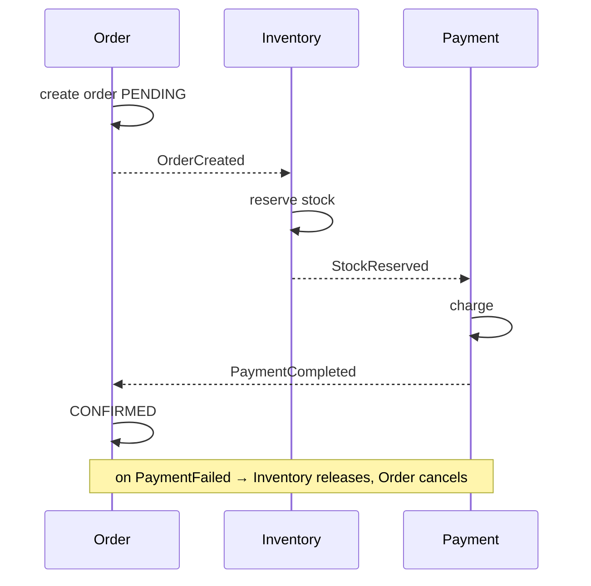
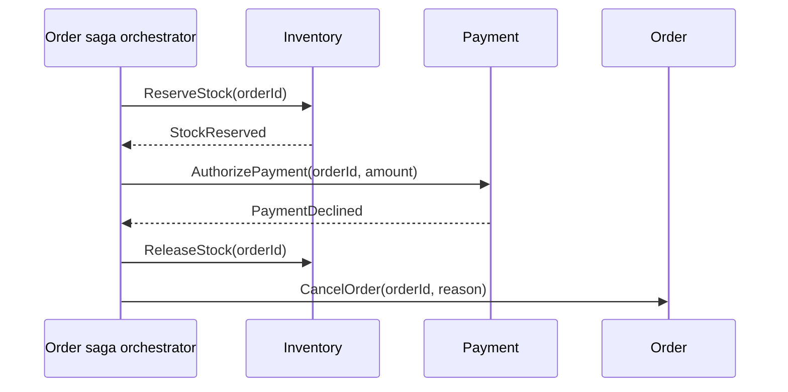

# Distributed Transactions — 2PC, Sagas, Outbox, and Designing for Failure Between Services

> **Microservices · Data Management** — In a monolith, one `@Transactional` keeps an order, a payment, and an inventory update consistent. Split them into three services with three databases, and that guarantee is gone. This page shows what replaces it — and the failure scenarios that separate a working saga from a whiteboard diagram.

---

## Table of Contents

1. The Travel Agent Analogy
2. The Problem: One Business Action, Many Databases
3. Two-Phase Commit — and Why Microservices Avoid It
4. The Saga Pattern
5. Choreography vs Orchestration
6. Compensations — Undo Is Not Rollback
7. The Building Blocks: Outbox, Idempotency, Timeouts
8. Isolation Problems in Sagas (and Countermeasures)
9. Orchestration in Practice (Spring, Temporal, Camunda)
10. Failure Scenarios Walkthrough
11. Practice Assignments (Low / Medium / High)
12. Mini Project — Order Saga with Failure Injection
13. Interview Corner
14. Quick Reference

---

## 1. The Travel Agent Analogy

A travel agent books your trip: flight, hotel, and a rental car — three different companies, three different systems. There's no single "commit" button across airlines and hotels.

So the agent does it step by step:

1. Book the flight ✅
2. Book the hotel ✅
3. Book the car ❌ — sold out.

Now the agent **compensates**: cancel the hotel, cancel the flight (maybe paying a cancellation fee). You end up in a consistent state — no trip, money refunded minus fees — but for a while, the flight *was* booked. That's a **saga**: a sequence of local transactions with compensating actions, accepting temporary inconsistency.

---

## 2. The Problem: One Business Action, Many Databases



"Place order" must: create the order, reserve stock, charge the customer, create a shipment. Each service owns its database (the **database-per-service** principle), so no single ACID transaction spans them.

| Approach | Consistency | Availability & coupling | Fit for microservices |
|----------|-------------|-------------------------|-----------------------|
| Shared database for all services | ACID | Tight coupling; schema changes block teams | ❌ Defeats the purpose |
| **Two-phase commit (2PC / XA)** | Atomic | Blocking, coordinator dependency, poor availability | ❌ Rarely |
| **Saga** | Eventual (with compensations) | Loosely coupled, available | ✅ The default |

---

## 3. Two-Phase Commit — and Why Microservices Avoid It



| Problem | Why it hurts |
|---------|--------------|
| **Blocking** | Participants hold locks between PREPARE and COMMIT; if the coordinator crashes, they wait (in-doubt transactions) |
| Availability | Every participant must be up for any transaction to succeed |
| Latency | Multiple round trips while holding locks |
| Support | Kafka, most NoSQL stores, and third-party APIs (Stripe, a shipping provider) don't participate in XA |
| Coupling | Services coordinate at the database level |

<div class="callout-info">

**Where 2PC-style protocols still live**: inside a single distributed database (e.g., Spanner, CockroachDB, Postgres with multiple nodes use their own internal commit protocols), and in some legacy enterprise stacks (JTA/XA with app servers and message brokers). The database handles it for you there — the problem is doing it *across independently owned services*.

</div>

---

## 4. The Saga Pattern

A **saga** is a sequence of **local transactions**. Each step commits in its own service and publishes an event or reply that triggers the next step. If a step fails, previously completed steps are undone by **compensating transactions**.



| Step type | Meaning |
|-----------|---------|
| **Compensatable** | Can be undone semantically (reserve stock → release) |
| **Pivot** | The point of no return; after it succeeds, the saga must complete (e.g., the payment capture) |
| **Retryable** | Steps after the pivot that must eventually succeed (retry until done — e.g., "send confirmation", "create shipment") |

<div class="callout-tip">

**Applying this** — Order your steps so that the risky, hard-to-undo step (the pivot) comes **as late as possible**, after all cheap, reversible validations (reserve stock, check fraud score, authorize — not capture — the payment). Everything after the pivot should be retryable, so it never needs compensation.

</div>

---

## 5. Choreography vs Orchestration

### Choreography — services react to each other's events



### Orchestration — one coordinator tells each service what to do



| | Choreography | Orchestration |
|--|--------------|---------------|
| Control | Distributed; each service knows what to react to | Central; the orchestrator owns the flow |
| Coupling | Services coupled via events | Orchestrator knows all participants |
| Visibility | Flow is implicit — hard to see "where is order 881 stuck?" | Explicit state per saga instance |
| Adding steps | Easy for simple flows; gets tangled (cyclic event dependencies) | Change one place |
| Best for | 2-4 steps, simple flows, independent reactions | Complex, long-running flows with many steps, timeouts, and human tasks |

<div class="callout-interview">

**Q: "Choreography or orchestration for sagas?"**

For a short flow with few participants, choreography is simple: services react to domain events and nobody owns the whole process. As flows grow, with more steps, timeouts, branching, and compensations, choreography becomes hard to reason about and debug, because the process is only implicit in event subscriptions. Then I prefer an orchestrator with explicit saga state — a state machine in a service, or a workflow engine like Temporal or Camunda — which makes the flow visible, testable, and easy to change. Both need the same foundations: an outbox for reliable messaging, idempotent handlers, and timeouts.

</div>

---

## 6. Compensations — Undo Is Not Rollback

A compensation is a **new business action** that semantically reverses an earlier one — it doesn't erase history.

| Step | Compensation | Notes |
|------|--------------|-------|
| Reserve stock | Release reservation | Straightforward |
| Authorize payment | Void authorization | Cheap if before capture |
| Capture payment | **Refund** | Costs fees; takes days to reach the customer — avoid by capturing late |
| Send email "order confirmed" | Send "order cancelled" email | You can't unsend — hence send emails after the pivot |
| Book a flight | Cancel booking (with fee) | Compensations can partially fail — design for it |

Rules:

- **Compensations must be idempotent and retryable** — they will be retried after crashes.
- **Compensations may themselves fail** (the payment provider is down) → retry with backoff; if impossible, escalate to a human queue. Never silently give up.
- Record every step and compensation in the saga log for audit and support.

---

## 7. The Building Blocks: Outbox, Idempotency, Timeouts

| Building block | Why it's mandatory |
|----------------|--------------------|
| **Transactional outbox** | Each local transaction must *reliably* emit its event/command — see `messaging-decisions`. Without it, a crash between commit and publish stalls the saga forever |
| **Idempotent handlers** | Messages are delivered at least once; "reserve stock for order 881" twice must reserve once (dedupe by message ID or use the order ID as the natural key) |
| **Timeouts** | A participant that never replies must not block the saga forever; the orchestrator times out and compensates or retries |
| **Correlation IDs** | Every message carries `sagaId`/`orderId` and a trace ID for debugging |
| **Saga state persistence** | The orchestrator stores current state in its DB so it survives restarts |

```java
// Inventory service: idempotent command handler using the orderId as the natural key
@Transactional
public void on(ReserveStockCommand cmd) {
    if (reservations.existsByOrderId(cmd.orderId())) {          // already processed → just re-reply
        outbox.add(new StockReserved(cmd.orderId()));
        return;
    }
    boolean ok = stock.tryReserve(cmd.items());                   // conditional UPDATE ... WHERE available >= qty
    if (ok) {
        reservations.save(Reservation.of(cmd.orderId(), cmd.items(), clock.instant().plus(RESERVATION_TTL)));
        outbox.add(new StockReserved(cmd.orderId()));
    } else {
        outbox.add(new StockReservationFailed(cmd.orderId(), "INSUFFICIENT_STOCK"));
    }
}
```

---

## 8. Isolation Problems in Sagas (and Countermeasures)

Sagas are **ACD without I**: intermediate states are visible to other transactions.

| Anomaly | Example | Countermeasure |
|---------|---------|----------------|
| **Dirty read** | A report counts stock as sold while the saga may still cancel | **Semantic lock**: mark records `PENDING`/`RESERVED` and treat them specially |
| **Lost update** | Saga A cancels order 881 while saga B tries to update its address | Semantic lock on the order (state checks: reject changes to PENDING orders) or versioning |
| **Fuzzy read** | A step reads a customer's credit limit that another saga changes midway | Reread / version checks; make risky steps late |
| User-visible inconsistency | UI shows "confirmed" before payment completes | Show `PENDING` states honestly in the UI |

<div class="callout-scenario">

**Scenario**: During a flash sale, orders are cancelled because payment failed, but the reserved stock isn't released for 30 minutes — the product shows "sold out" while units sit in abandoned reservations. **Decision**: Compensations must be fast and reliable (release immediately on `PaymentFailed`), and every reservation has a **TTL** as a safety net (a sweeper releases expired reservations in case a compensation message is lost). Monitor "reserved but not confirmed" stock age.

</div>

---

## 9. Orchestration in Practice (Spring, Temporal, Camunda)

### A minimal orchestrator as a state machine

```java
public enum OrderSagaState { STARTED, STOCK_RESERVED, PAYMENT_AUTHORIZED, CONFIRMED,
                             COMPENSATING, CANCELLED, FAILED_NEEDS_ATTENTION }

@Service
class OrderSagaOrchestrator {
    @Transactional
    public void on(StockReserved e) {
        OrderSaga saga = sagas.findForUpdate(e.orderId());
        if (saga.state() != OrderSagaState.STARTED) return;                 // duplicate/out-of-order → ignore
        saga.transitionTo(OrderSagaState.STOCK_RESERVED);
        outbox.add(new AuthorizePayment(e.orderId(), saga.amount(), saga.paymentMethodId()));
        timeouts.schedule(e.orderId(), "payment", Duration.ofMinutes(2));
    }

    @Transactional
    public void on(PaymentDeclined e) {
        OrderSaga saga = sagas.findForUpdate(e.orderId());
        if (saga.state() != OrderSagaState.STOCK_RESERVED) return;
        saga.transitionTo(OrderSagaState.COMPENSATING);
        outbox.add(new ReleaseStock(e.orderId()));
        outbox.add(new CancelOrder(e.orderId(), "PAYMENT_DECLINED"));
    }
}
```

### Workflow engines

| Engine | Model | Good for |
|--------|-------|----------|
| **Temporal** (or Cadence) | Workflows as code (Java SDK); durable execution with automatic state persistence, retries, timers | Long-running sagas in code, developer-friendly |
| **Camunda / Zeebe** | BPMN diagrams executed by an engine | Business-visible processes, human tasks |
| AWS Step Functions | JSON/visual state machines | AWS-native serverless orchestration |
| Hand-rolled state machine | Your DB + outbox | Few simple sagas; full control |

<div class="callout-tip">

**Applying this** — Temporal-style durable execution removes most of the plumbing (persisting saga state, timers, retries) — your saga reads like normal sequential Java code with `try/catch` for compensations, while the engine guarantees it continues after crashes. It's worth evaluating once you have several long-running business processes.

</div>

---

## 10. Failure Scenarios Walkthrough

| Failure | What happens with a correct design |
|---------|-------------------------------------|
| Order service crashes after committing the order, before publishing | Outbox row exists → relay publishes after restart → saga continues |
| Inventory receives `ReserveStock` twice | Idempotent handler (orderId key) reserves once, replies twice; orchestrator ignores the duplicate reply |
| Payment service is down | Command waits in the queue; orchestrator timeout fires → retry or compensate per policy |
| Payment authorized, but the reply is lost | Timeout → orchestrator queries payment status (or retries idempotently with the same idempotency key) instead of blindly compensating |
| Compensation "release stock" fails | Retried with backoff; the reservation TTL releases it anyway; alert if still stuck |
| Refund fails permanently (card closed) | Saga moves to `FAILED_NEEDS_ATTENTION` → human queue with full context |
| Orchestrator crashes mid-saga | State is in its DB; on restart, it resumes from the last state and pending timeouts |

<div class="callout-warn">

**"Timeout" doesn't mean "failed".** When a payment call times out, the payment may have succeeded. Compensating immediately (cancelling the order) can leave a customer charged for a cancelled order. Always query the participant's status or retry with an idempotency key before deciding.

</div>

---

## 11. 🏋️ Practice Assignments

### 🟢 Low — Build the reflexes

**L1.** Name three reasons 2PC is avoided between microservices.

<details>
<summary>Show answer</summary>

Blocking locks during the prepare phase (and in-doubt transactions if the coordinator fails); reduced availability (all participants must be up); many resources (Kafka, NoSQL, SaaS APIs) don't support XA; tight coupling between independently owned services.

</details>

**L2.** For "reserve stock → capture payment → send confirmation email", identify the compensatable, pivot, and retryable steps.

<details>
<summary>Show answer</summary>

Reserve stock: **compensatable** (release). Capture payment: **pivot** (after success, the saga must complete). Send confirmation email: **retryable** (after the pivot; retry until it succeeds — never compensate it).

</details>

**L3.** Why must saga handlers be idempotent?

<details>
<summary>Show answer</summary>

Messaging is at-least-once, relays can publish outbox rows twice, and orchestrators retry after timeouts. Without idempotency, a duplicate "charge payment" or "reserve stock" message causes double charges or double reservations.

</details>

### 🟡 Medium — Apply it

**M1.** Design the saga for a food-delivery order: create order, charge the customer, restaurant accepts (within 3 minutes), assign a rider. Include compensations and timeouts.

<details>
<summary>Show answer</summary>

Orchestrated: (1) create order `PENDING`; (2) **authorize** payment (not capture) — compensation: void; (3) send to restaurant, timeout 3 min — on reject/timeout: void payment, cancel order, notify customer; (4) on accept → **capture** payment (pivot: after capture, compensation = refund, so capture only after restaurant acceptance); (5) assign rider (retryable: keep retrying/escalating; if no rider in N minutes, a policy decides — refund + cancel with restaurant compensation, or delayed delivery); (6) notifications after each state. Saga state persisted; idempotency keys for payment calls; correlation IDs across services.

</details>

**M2.** An orchestrator sends `AuthorizePayment` and gets no reply for 2 minutes. Write the decision logic.

<details>
<summary>Show answer</summary>

1. Query the payment service (or provider) for the status of this order's payment using the idempotency key/order ID.
2. If `AUTHORIZED` → continue the saga (the reply was lost).
3. If `DECLINED` → compensate (release stock, cancel order).
4. If `NOT_FOUND` → the command never arrived; resend `AuthorizePayment` with the same idempotency key (safe to retry).
5. If the payment service is unreachable → back off and retry the query; after a longer deadline, move to `NEEDS_ATTENTION` rather than compensating blindly, and hold the stock reservation (with its TTL as a safety net).

</details>

**M3.** In a choreographed saga with 6 services, support asks "why is order 881 stuck?" and nobody can answer. What would you change?

<details>
<summary>Show answer</summary>

Short term: distributed tracing across message hops (trace context in message headers) and a correlation ID in every log line, plus an "order timeline" view built from events consumed into a store (who did what, when). Longer term: move this flow to **orchestration** with explicit per-order saga state and timeouts, so "stuck" is a queryable state with a reason and a deadline, and alerts fire for sagas exceeding their expected duration.

</details>

### 🔴 High — Think like a senior

**H1.** Migrate a monolith's "place order" (one big `@Transactional` touching orders, inventory, payments, loyalty) to microservices without breaking consistency guarantees users rely on.

<details>
<summary>Show answer</summary>

Step 1: map the current transaction's invariants — which must be strongly consistent (never sell stock that doesn't exist, never charge without an order) and which can be eventual (loyalty points, emails). Step 2: extract the eventual parts first (loyalty, notifications) as event consumers via an **outbox** from the monolith — low risk. Step 3: extract inventory with a reservation API and TTLs; the monolith orchestrates the saga (it becomes the orchestrator temporarily). Step 4: extract payment with idempotency keys and authorize/capture separation; capture as the pivot, late. Step 5: move the orchestration into a dedicated order service or a workflow engine. Throughout: UI shows `PENDING` states honestly; reconciliation jobs compare orders, reservations, and payments daily; feature flags per step with the ability to route back to the monolith path; strong observability on saga durations and stuck states.

</details>

**H2.** A bank asks you to use sagas for money transfers between accounts held in two different core banking systems. What are the risks and how do you design it?

<details>
<summary>Show answer</summary>

Money needs strong guarantees and auditability. Design as a **ledger-based saga**: (1) debit the source account into a **suspense/in-transit ledger account** (a local transaction in system A, with the transfer ID as an idempotency key); (2) credit the destination in system B (idempotent by transfer ID); (3) on B failure, **compensate** by reversing A's debit from suspense back to the source — never "delete" entries, always post reversing entries. Isolation: funds in suspense are visible as "pending" to the customer, preventing double spending. Timeouts query B's status before compensating (the credit may have succeeded). A reconciliation process compares both systems and the suspense account daily (suspense must net to zero for completed transfers); anything unresolved goes to operations with full audit trails. Regulators and auditors can follow every leg. Consider whether the systems support a stronger protocol or a single ledger service to reduce complexity.

</details>

---

## 12. 🛠️ Mini Project — Order Saga with Failure Injection

**Goal**: Build an orchestrated saga that survives every failure in section 10. 1 week of evenings.

**Stack**: Spring Boot services (order, inventory, payment), Kafka (or RabbitMQ), Postgres per service, outbox relay (poller or Debezium).

**Build**

1. Order service = orchestrator with a persisted saga state machine, outbox, and a timeout scheduler (a table of due timeouts polled every few seconds).
2. Inventory: idempotent reserve/release with reservation TTL and a sweeper.
3. Payment: fake provider with authorize/capture/void/refund and idempotency keys; configurable failure modes (decline, timeout, success-but-lost-reply).
4. Failure injection flags: crash a service mid-handler, duplicate messages, delay replies, drop replies.
5. A `GET /orders/{id}/timeline` endpoint showing every saga step, command, reply, and compensation.
6. A chaos test: 1,000 orders with random failures; at the end, assert invariants — no captured payment without a confirmed order, no active reservation for a cancelled order, every saga in a terminal state or `NEEDS_ATTENTION`.

**Acceptance criteria**

- Invariants hold across 10 chaos runs.
- A README with the state diagram and a failure table like section 10, filled with your observed behavior.

**Stretch**: reimplement the orchestrator with Temporal's Java SDK and compare code size and failure handling.

---

## 🎯 Interview Corner

<div class="callout-interview">

**Q: "How do you handle a transaction that spans multiple microservices?"**

I avoid distributed ACID transactions like 2PC because they block, reduce availability, and most brokers and external APIs don't support them. Instead I use a saga: a sequence of local transactions, each committed in its own service, with compensating actions to semantically undo earlier steps if a later one fails. I order the steps so reversible ones come first and the point of no return — usually capturing payment — comes as late as possible, with everything after it retryable. The foundations are a transactional outbox so every step reliably emits its message, idempotent handlers because delivery is at-least-once, timeouts with status checks before compensating, and persisted saga state for visibility.

</div>

<div class="callout-interview">

**Q: "What are the downsides of sagas?"**

They give up isolation: intermediate states are visible, so other operations can read data that may later be compensated. I counter that with semantic locks like pending statuses, version checks, and honest pending states in the UI. Compensations aren't true rollbacks either — a refund isn't the same as never charging, and you can't unsend an email — so step ordering matters. There's more complexity: failure handling, timeouts, idempotency, monitoring stuck sagas, and reconciliation jobs. For highly interdependent data, sometimes the better answer is to reconsider the service boundaries and keep that data in one service with a local transaction.

**Follow-up trap**: "So should everything be a saga?" → No. If a business operation constantly needs atomic changes across two services, that's often a sign those services should be one.

</div>

<div class="callout-interview">

**Q: "Your saga's payment step times out. Do you compensate?"**

Not immediately, because a timeout is ambiguous — the payment may have succeeded and only the reply was lost. The orchestrator first queries the payment service or provider using the order's idempotency key. If authorized, it continues. If declined, it compensates. If there's no record, it safely resends the same idempotent command. If the service is unreachable, it keeps retrying the status check with backoff, and after a longer deadline escalates to a needs-attention state instead of guessing, with reservations protected by their own TTLs. Compensating blindly on timeouts is how customers get charged for cancelled orders.

</div>

---

## Quick Reference

| Concept | One-Liner |
|---------|-----------|
| Problem | One business action, many databases — no shared ACID |
| 2PC | Atomic but blocking, coupled, unsupported by most brokers/APIs |
| Saga | Local transactions + compensations; eventual consistency |
| Step types | Compensatable → pivot (as late as possible) → retryable |
| Choreography | Event reactions; simple flows; implicit process |
| Orchestration | Central state machine/workflow engine; complex flows; visible state |
| Compensation | New business action (refund, release) — idempotent, retried, audited |
| Foundations | Outbox, idempotent handlers, timeouts, correlation IDs, persisted state |
| Isolation | Semantic locks (PENDING), versioning, reservation TTLs |
| Timeouts | Query status before compensating |

---

## Related Topics

- `messaging-decisions` — outbox and delivery guarantees
- `payment-gateway` — idempotency and authorize/capture
- `spring-transactional` — the local transactions inside each step
- `lld-bookmyshow` — holds with TTLs as a reservation pattern

> **Across services there is no rollback — only forward steps and thoughtful undo. Order the steps so undo is cheap, make every message safe to repeat, and never mistake silence for failure.**

---

<!-- journey-link:start -->

<div class="callout-journey">

🛒 **ShopNorth Journey** — ShopNorth's checkout spans four services, so it's a saga with compensations (release stock, refund) instead of one transaction.

**Continue the story:** [Chapter 6 · Microservices & Events](/tutorials/journey-06-microservices) · **New here?** [Start the journey](/tutorials/journey-start)

</div>

<!-- journey-link:end -->
