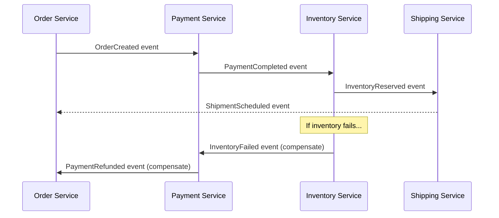
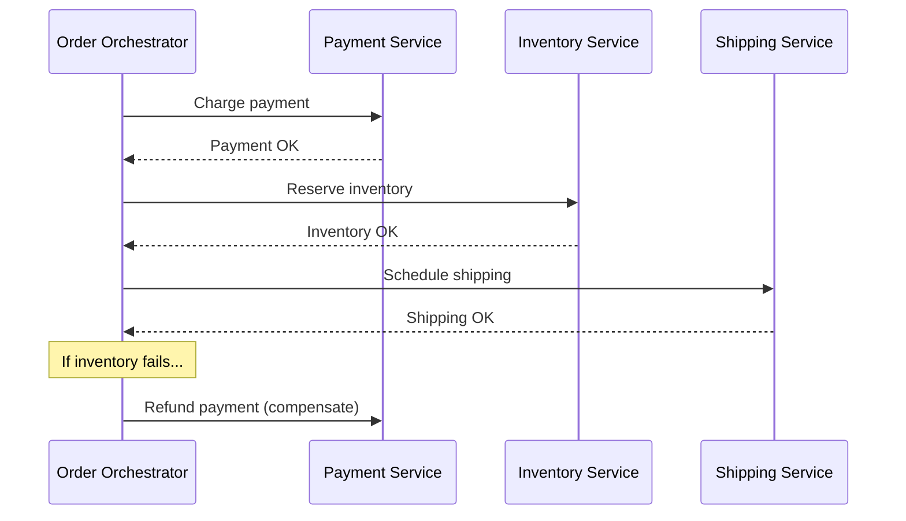
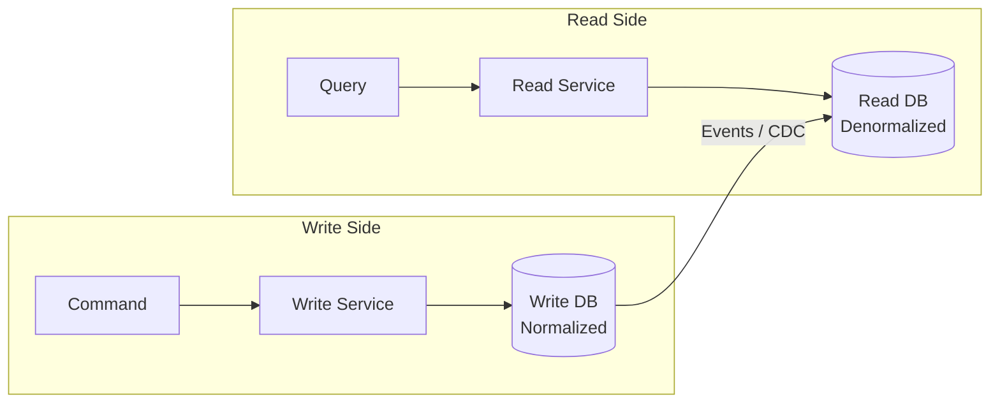
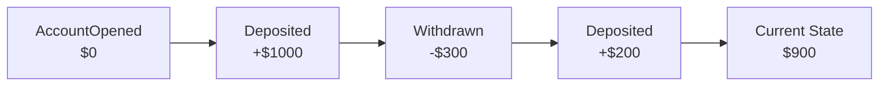
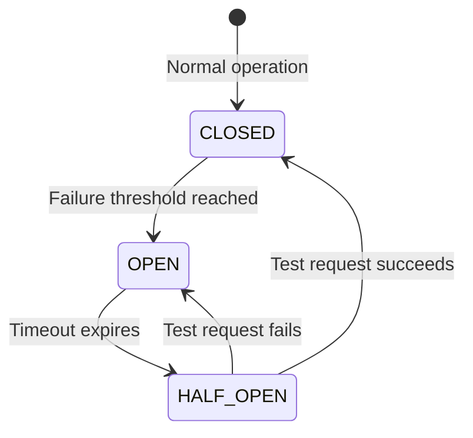
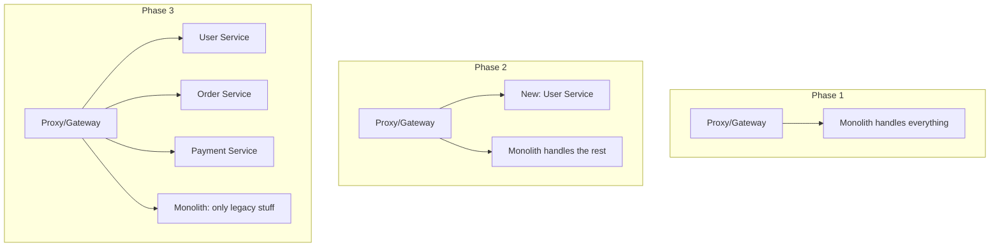

# Microservices Patterns — When and Why to Use Each

## The City Analogy

A monolith is like a **single mega-mall** — everything under one roof. If the food court catches fire, the entire mall shuts down.

Microservices are like a **city** — separate buildings (services) connected by roads (APIs). If one restaurant burns down, the rest of the city keeps running.

But a city needs **traffic rules, postal systems, and emergency protocols**. Those are the patterns we'll learn.

---

## 1. Saga Pattern — Distributed Transactions

### The Problem

In a monolith, you wrap everything in one database transaction. In microservices, each service has its own database. How do you ensure consistency across services?

### Scenario: E-commerce order

```
1. Order Service → Create order
2. Payment Service → Charge customer
3. Inventory Service → Reserve items
4. Shipping Service → Schedule delivery
```

If payment succeeds but inventory fails — you need to **undo the payment**. That's a Saga.

### Choreography (Event-Driven)



- Each service listens to events and reacts
- **Pros**: Loose coupling, simple
- **Cons**: Hard to track the overall flow, debugging is painful

### Orchestration (Central Coordinator)



- Central orchestrator controls the flow
- **Pros**: Easy to understand, easy to debug
- **Cons**: Orchestrator is a single point of failure

---

## 2. CQRS — Command Query Responsibility Segregation

### The Problem

Your read model and write model have different needs. Writes need validation, consistency. Reads need speed, denormalized data.

### The Pattern



### Scenario: Social media feed

- **Write**: User posts a message → validate, store in PostgreSQL (normalized)
- **Read**: Show feed → read from Redis/Elasticsearch (denormalized, pre-computed)
- **Sync**: Changes propagate via events (eventual consistency)

### When to use CQRS

| ✅ Use when | ❌ Don't use when |
|------------|------------------|
| Read/write patterns are very different | Simple CRUD app |
| Need different scaling for reads vs writes | Strong consistency required everywhere |
| Complex domain with many aggregates | Small team, simple domain |

---

## 3. Event Sourcing

### The Problem

Traditional: Store the **current state**. You know the balance is $500, but not *how* it got there.

Event Sourcing: Store **every event** that happened. Replay events to get current state.

### Scenario: Bank account

```
Events:
1. AccountOpened(amount: 0)
2. MoneyDeposited(amount: 1000)
3. MoneyWithdrawn(amount: 300)
4. MoneyDeposited(amount: 200)

Current state: 0 + 1000 - 300 + 200 = $900
```



### Benefits

- **Complete audit trail** — you know exactly what happened and when
- **Time travel** — rebuild state at any point in time
- **Debug production issues** — replay events to reproduce bugs

---

## 4. Circuit Breaker

### The Analogy

Like an electrical circuit breaker in your house. If there's a short circuit (service failure), the breaker trips to prevent damage (cascading failure).

### States



- **CLOSED**: Requests flow normally. Count failures.
- **OPEN**: All requests fail immediately (fast fail). Don't even try calling the service.
- **HALF_OPEN**: Allow one test request. If it succeeds → CLOSED. If it fails → OPEN again.

### Implementation with Resilience4j

```java
CircuitBreakerConfig config = CircuitBreakerConfig.custom()
    .failureRateThreshold(50)           // open after 50% failures
    .waitDurationInOpenState(Duration.ofSeconds(30))  // wait 30s before half-open
    .slidingWindowSize(10)              // evaluate last 10 calls
    .build();

CircuitBreaker breaker = CircuitBreaker.of("paymentService", config);

Supplier<Payment> decorated = CircuitBreaker
    .decorateSupplier(breaker, () -> paymentService.process(order));

Try<Payment> result = Try.ofSupplier(decorated)
    .recover(ex -> fallbackPayment(order));  // fallback when circuit is open
```

---

## 5. Bulkhead Pattern

### The Analogy

Ships have bulkheads — watertight compartments. If one compartment floods, the others stay dry. The ship doesn't sink.

### Scenario: Isolate service calls

```java
// Without bulkhead: if PaymentService is slow, ALL threads are stuck waiting
// With bulkhead: PaymentService gets max 10 threads, others are protected

BulkheadConfig config = BulkheadConfig.custom()
    .maxConcurrentCalls(10)
    .maxWaitDuration(Duration.ofMillis(500))
    .build();

Bulkhead bulkhead = Bulkhead.of("paymentService", config);
```

---

## 6. Strangler Fig Pattern — Migrating from Monolith

### The Approach

Don't rewrite everything at once. Gradually replace pieces of the monolith with microservices, like a strangler fig tree slowly wrapping around a host tree.



---

## Pattern Decision Matrix

| Problem | Pattern | Complexity |
|---------|---------|-----------|
| Distributed transactions | Saga | High |
| Different read/write needs | CQRS | Medium-High |
| Full audit trail needed | Event Sourcing | High |
| Cascading failures | Circuit Breaker | Low |
| Resource isolation | Bulkhead | Low |
| Monolith migration | Strangler Fig | Medium |
| Service-to-service auth | Sidecar / Service Mesh | Medium |

---

---

<!-- practice-pack -->

## 🏢 Real-World Scenarios

<div class="callout-scenario">

**Scenario**: The recommendations service becomes slow (5-second responses). Within minutes, the product page, cart, and checkout all fail, because every request thread in the web tier is stuck waiting on recommendations. **Decision**: A **circuit breaker** on the recommendations client (open after the failure/slow-call rate threshold, fail fast with an empty fallback), a **timeout** of a few hundred milliseconds, and a **bulkhead** (a separate, small concurrency limit for recommendation calls) so an optional dependency can never consume the threads needed by critical features.

</div>

<div class="callout-scenario">

**Scenario**: An order dashboard needs "orders with customer name, items, shipment status, and payment state", joining data owned by four services. Calling all four per page load is slow and fragile. **Decision**: **CQRS read model** — each service publishes events; a dashboard projection service consumes them into a denormalized `order_view` table optimized for the query. Reads are one fast query; the trade-off is eventual consistency (the view lags by seconds), which is acceptable for a dashboard, and must be shown honestly in the UI when relevant.

</div>

## 🏋️ Practice Assignments

### 🟢 Low — Build the reflexes

**L1.** Match the pattern: (a) stop calling a failing service for a while, (b) isolate thread pools per dependency, (c) migrate a monolith piece by piece, (d) separate write and read models, (e) store state as a sequence of events.

<details>
<summary>Show answer</summary>

(a) Circuit breaker. (b) Bulkhead. (c) Strangler fig. (d) CQRS. (e) Event sourcing.

</details>

**L2.** Name the three circuit breaker states and what triggers each transition.

<details>
<summary>Show answer</summary>

**Closed** (calls flow; failures counted) → **Open** when the failure or slow-call rate exceeds the threshold over the sliding window (calls fail fast) → **Half-open** after the wait duration (a limited number of trial calls) → back to Closed if they succeed, or Open again if they fail.

</details>

**L3.** When should you **not** use event sourcing?

<details>
<summary>Show answer</summary>

For simple CRUD domains without a need for full history, temporal queries, or audit replay; when the team lacks experience with event versioning and projections; when strong read-your-writes consistency on complex queries is needed everywhere. Event sourcing adds complexity (schema evolution of events, snapshots, rebuilding projections) that must pay for itself.

</details>

### 🟡 Medium — Apply it

**M1.** Configure a Resilience4j circuit breaker, retry, and time limiter for a `PricingClient` in Spring Boot. Explain the order in which they wrap the call.

<details>
<summary>Show answer</summary>

```yaml
resilience4j:
  circuitbreaker:
    instances:
      pricing:
        sliding-window-type: COUNT_BASED
        sliding-window-size: 50
        failure-rate-threshold: 50
        slow-call-duration-threshold: 800ms
        slow-call-rate-threshold: 60
        wait-duration-in-open-state: 20s
        permitted-number-of-calls-in-half-open-state: 5
  retry:
    instances:
      pricing:
        max-attempts: 3
        wait-duration: 200ms
        enable-exponential-backoff: true
        retry-exceptions: [java.io.IOException, java.util.concurrent.TimeoutException]
  timelimiter:
    instances:
      pricing:
        timeout-duration: 1s
```

```java
@CircuitBreaker(name = "pricing", fallbackMethod = "cachedPrice")
@Retry(name = "pricing")
public Money price(String sku) { return pricingApi.get(sku); }
```

With annotations, Resilience4j's default aspect order is Retry (outermost) → CircuitBreaker → RateLimiter → TimeLimiter → Bulkhead (innermost), so each retry attempt passes through the circuit breaker, and an open circuit stops retries quickly. Only retry idempotent calls. (`TimeLimiter` applies to asynchronous methods returning `CompletableFuture`; for blocking calls, set timeouts on the HTTP client.)

</details>

**M2.** Design the strangler fig migration of "invoicing" out of a monolith, including data migration.

<details>
<summary>Show answer</summary>

1. Put a routing layer (gateway) in front of the monolith. 2. Build `invoice-service` with its own DB; populate it by **backfilling** historical invoices and **syncing changes** from the monolith (CDC with Debezium, or the monolith publishing events via an outbox). 3. Shadow/compare: run new reads in parallel and compare results. 4. Switch **reads** for invoice APIs to the new service. 5. Switch **writes**: the monolith calls or emits events to the new service instead of writing its own tables. 6. Stop syncing, remove the old module and tables. Each step reversible via routing flags; reconciliation reports during the transition.

</details>

**M3.** Why can a CQRS read model show stale data, and how do you handle "I just updated my profile and the page still shows the old name"?

<details>
<summary>Show answer</summary>

The read model is updated asynchronously from events, so there's a lag. For read-your-own-writes: return the updated data in the command's response and render it directly; read from the write model for the user's own recent changes; or have the client wait for the projection to catch up to the event's version (the command returns a version; the query endpoint waits briefly until the projection reaches it). Show "saving…"/"updated just now" states honestly.

</details>

### 🔴 High — Think like a senior

**H1.** Your system has 40 services, each with its own ad-hoc retries. During an incident, a slow database caused a retry storm that multiplied traffic by 27x. Explain the math and design a policy.

<details>
<summary>Show answer</summary>

Retries multiply across layers: if 3 layers each retry 3 times (1 attempt + 2 retries = 3 calls), one user request can become 3 × 3 × 3 = **27** database calls. Policy: retry at **one** layer only (usually closest to the failure, e.g., the client of the failing dependency); use exponential backoff with jitter; retry only idempotent operations and only on retryable errors; **retry budgets** (e.g., retries may add at most 10% extra traffic per client); circuit breakers so an overloaded dependency gets relief; timeouts that decrease down the call chain (deadline propagation) so outer layers don't retry work that inner layers are still doing. Encode it in a shared client library and review it like an API.

</details>

**H2.** When would you choose event sourcing for an order system, and how would you design snapshots, projections, and schema evolution?

<details>
<summary>Show answer</summary>

Choose it when the history itself is valuable: auditability (regulated domains), complex state transitions where "how did we get here" matters, temporal queries, and multiple read models derived from the same events. Design: an append-only event store keyed by aggregate ID with optimistic concurrency (expected version); **snapshots** every N events (e.g., 100) to rebuild aggregates quickly; **projections** consumed from the event stream into read models, rebuildable from scratch; **schema evolution** via versioned event types and upcasters (old events transformed to the new shape when read), never mutating stored events; idempotent projections with checkpoints. Keep event sourcing within the bounded contexts that need it, not system-wide.

</details>

## 🛠️ Mini Project — Resilience Patterns Lab

**Goal**: Watch patterns prevent cascading failures. 2 evenings.

**Build**

1. Three Spring Boot services: `product-page` → `pricing` (critical), `reviews` (optional), `recommendations` (optional). Each downstream has endpoints to inject latency and errors.
2. Baseline: call all three with no protection; load test (k6) and inject 5 s latency into `recommendations` — observe the product page failing.
3. Add Resilience4j: timeouts, circuit breakers with fallbacks for optional services, a bulkhead for `recommendations`, retries only for `pricing` GETs with backoff.
4. Repeat the failure injection; show the product page stays up with degraded content.
5. Expose Resilience4j metrics to Prometheus/Grafana; screenshot the circuit opening and closing.
6. Bonus: a CQRS projection — `reviews` publishes `ReviewAdded` events to Kafka; `product-page` maintains a local rating summary table instead of calling `reviews` synchronously.

**Acceptance criteria**: with a 5-second downstream delay, product-page p95 stays under 500 ms and error rate under 1%; README with before/after graphs.

---

## 🎯 Interview Corner

<div class="callout-interview">

**Q: "Explain the Saga pattern with a real example. How do you handle failures?"**

Take an e-commerce order flow: Create Order → Charge Payment → Reserve Inventory → Schedule Shipping. Each step is a local transaction in its own service. Each step has a compensating action: Cancel Order, Refund Payment, Release Inventory. If Reserve Inventory fails after Payment succeeded, the orchestrator (or event chain) triggers Refund Payment then Cancel Order — in reverse order. The key design principle: every forward action must have an idempotent compensating action. "Idempotent" because the compensation might run twice if there's a retry — refunding the same payment twice should not double-refund.

</div>

<div class="callout-interview">

**Q: "What's the Circuit Breaker pattern and when would you use it?"**

It prevents cascading failures. If Service A calls Service B and B is down, without a circuit breaker, A keeps sending requests, its threads pile up waiting for timeouts, and eventually A goes down too — cascading failure. The circuit breaker has three states: CLOSED (normal, requests flow), OPEN (B is failing, all requests fail immediately without calling B), HALF-OPEN (after a cooldown, send one test request — if it succeeds, close the circuit; if it fails, stay open). I'd use it on every inter-service call in production. With Resilience4j, you configure failure rate threshold (e.g., open after 50% failures in last 10 calls) and wait duration before half-open.

**Follow-up trap**: "What's the difference between Circuit Breaker and Retry?" → Retry helps with transient failures (network blip). Circuit Breaker helps with sustained failures (service is down). Use both together: retry 2-3 times for transient errors, but if the failure rate crosses a threshold, open the circuit and stop retrying entirely. Retrying a dead service just adds load.

</div>

<div class="callout-interview">

**Q: "How would you migrate a monolith to microservices?"**

Strangler Fig pattern. Don't rewrite everything — that's a multi-year project that usually fails. Instead, put a proxy/API gateway in front of the monolith. For each new feature, build it as a microservice and route traffic through the gateway. For existing features, extract them one at a time: identify a bounded context (e.g., User Management), build the microservice, migrate data, route traffic to the new service, and decommission that part of the monolith. Start with the least coupled, most independently deployable piece. The monolith shrinks over time until only legacy code remains.

</div>

<div class="callout-interview">

**Q: "CQRS — when is it worth the complexity?"**

When your read and write patterns are fundamentally different. Example: an e-commerce product catalog. Writes are rare (admin updates products), reads are massive (millions of users browsing). The write model needs normalization and validation (PostgreSQL). The read model needs denormalized, pre-computed views optimized for queries (Elasticsearch or Redis). CQRS lets you scale reads and writes independently and optimize each for its access pattern. Don't use it for simple CRUD apps — the eventual consistency between read and write models adds complexity that isn't worth it unless you have a clear scaling or performance need.

</div>

<div class="callout-tip">

**Applying this** — In interviews, don't just name patterns — explain the problem they solve and when you'd NOT use them. "I'd use Saga for distributed transactions because 2PC doesn't scale, but for a simple 2-service flow, I'd just use the Outbox pattern — Saga is overkill." Showing you know when NOT to use a pattern is more impressive than knowing the pattern itself.

</div>

---

> **The golden rule**: Don't use a pattern just because it's cool. Every pattern adds complexity. Start simple, add patterns when you feel the pain they solve. If you don't have the problem, you don't need the pattern.

---

<!-- journey-link:start -->

<div class="callout-journey">

🛒 **ShopNorth Journey** — ShopNorth's checkout runs as a saga with the transactional outbox and idempotent consumers.

**Continue the story:** [Chapter 6 · Microservices & Events](/tutorials/journey-06-microservices) · **New here?** [Start the journey](/tutorials/journey-start)

</div>

<!-- journey-link:end -->
