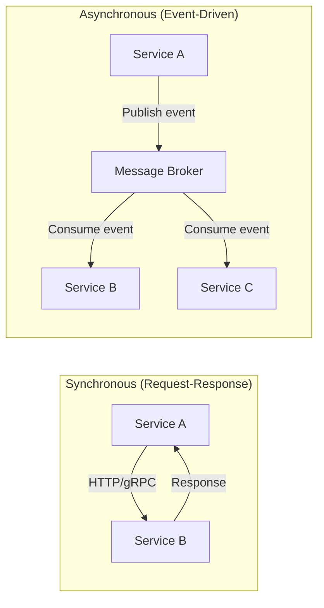
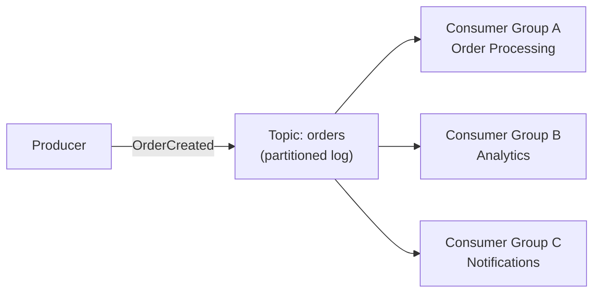
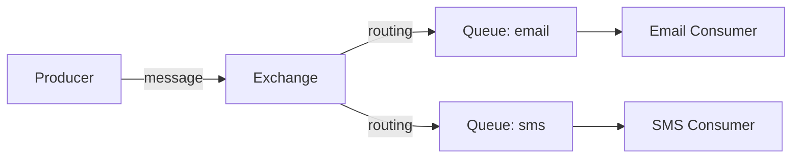
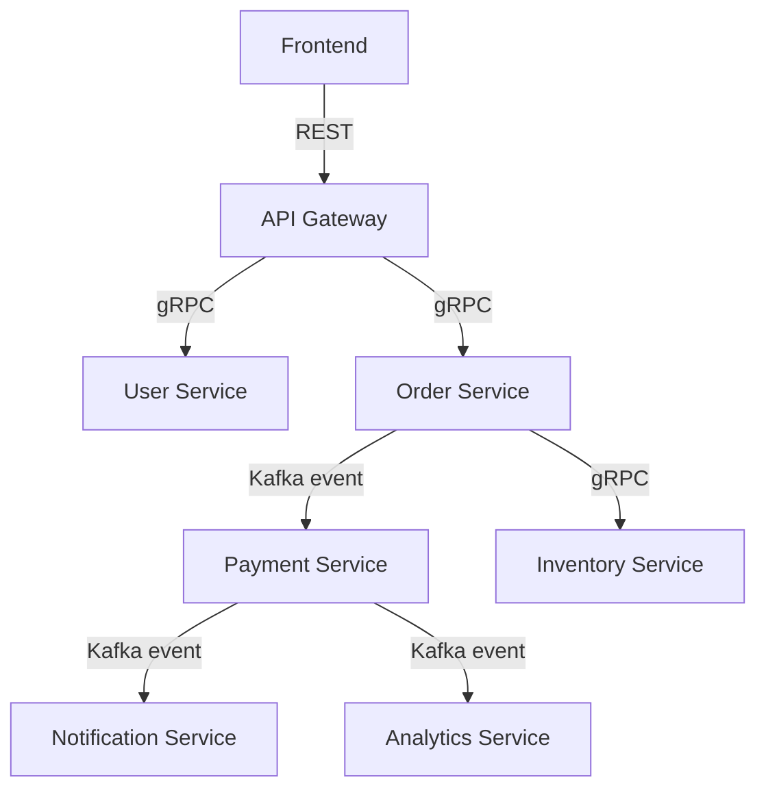

# Service Communication — REST vs gRPC vs Messaging

## The Phone Call Analogy

- **REST** = Sending a letter. Simple, everyone understands it, but slow for back-and-forth.
- **gRPC** = A phone call. Fast, real-time, but both sides need to speak the same language (protobuf).
- **Messaging (Kafka/RabbitMQ)** = Leaving a voicemail. You don't need the other person to be available right now.

---

## 1. Synchronous vs Asynchronous



| | Synchronous | Asynchronous |
|---|------------|-------------|
| Coupling | Tight — caller waits | Loose — fire and forget |
| Latency | Caller blocked until response | Caller continues immediately |
| Failure | If B is down, A fails | If B is down, message waits in queue |
| Use case | Need immediate response | Background processing, notifications |

---

## 2. REST — The Universal Language

```java
// Spring Boot REST endpoint
@RestController
@RequestMapping("/api/users")
public class UserController {

    @GetMapping("/{id}")
    public ResponseEntity<User> getUser(@PathVariable Long id) {
        return ResponseEntity.ok(userService.findById(id));
    }

    @PostMapping
    public ResponseEntity<User> createUser(@RequestBody CreateUserRequest request) {
        User user = userService.create(request);
        return ResponseEntity.status(HttpStatus.CREATED).body(user);
    }
}
```

### When to use REST

- Public APIs (everyone speaks HTTP)
- Simple CRUD operations
- When you need caching (HTTP caching is built-in)
- Browser-to-server communication

### REST Best Practices

| Practice | Example |
|----------|---------|
| Use nouns, not verbs | `/users/123` not `/getUser?id=123` |
| Use HTTP methods correctly | GET=read, POST=create, PUT=update, DELETE=delete |
| Version your API | `/api/v1/users` |
| Use proper status codes | 200, 201, 400, 404, 500 |
| Paginate large results | `?page=1&size=20` |

---

## 3. gRPC — The Fast Lane

### Why gRPC?

- **Binary protocol** (protobuf) — 5-10x faster than JSON
- **HTTP/2** — multiplexing, streaming, header compression
- **Strongly typed** — contract defined in `.proto` file
- **Code generation** — client/server stubs auto-generated

### Define the contract

```protobuf
// user.proto
syntax = "proto3";

service UserService {
  rpc GetUser (GetUserRequest) returns (User);
  rpc ListUsers (ListUsersRequest) returns (stream User);  // server streaming
}

message GetUserRequest {
  int64 id = 1;
}

message User {
  int64 id = 1;
  string name = 2;
  string email = 3;
}
```

### When to use gRPC

- Internal service-to-service communication
- High-performance, low-latency requirements
- Streaming data (real-time feeds, logs)
- Polyglot environments (Java ↔ Go ↔ Python)

---

## 4. Message Brokers — Kafka vs RabbitMQ

### Kafka — The Event Log



- Messages are **persisted** (replay anytime)
- **Ordered within a partition**
- Multiple consumer groups can read independently
- Best for: event streaming, audit logs, high throughput

### RabbitMQ — The Smart Router



- Messages are **consumed and deleted**
- Complex routing (direct, topic, fanout, headers)
- Best for: task queues, RPC, complex routing

### Comparison

| Feature | Kafka | RabbitMQ |
|---------|-------|----------|
| Model | Distributed log | Message queue |
| Persistence | Yes (configurable retention) | Until consumed |
| Ordering | Per partition | Per queue |
| Throughput | Millions/sec | Thousands/sec |
| Replay | Yes | No |
| Use case | Event streaming, CDC | Task queues, RPC |

---

## 5. Scenario: Choosing the Right Communication

### E-commerce system



| Communication | Why |
|--------------|-----|
| Frontend → Gateway: **REST** | Browser compatibility, simplicity |
| Gateway → Services: **gRPC** | Internal, fast, typed contracts |
| Order → Payment: **Kafka** | Async, decoupled, reliable |
| Payment → Notification: **Kafka** | Fire-and-forget, multiple consumers |
| Order → Inventory: **gRPC** | Need immediate response (is item in stock?) |

---

## Decision Flowchart

```
Need immediate response?
├── Yes → Need high performance?
│   ├── Yes → gRPC
│   └── No → REST
└── No → Need message replay?
    ├── Yes → Kafka
    └── No → Need complex routing?
        ├── Yes → RabbitMQ
        └── No → Kafka (simpler, more versatile)
```

---

---

<!-- practice-pack -->

## 🏢 Real-World Scenarios

<div class="callout-scenario">

**Scenario**: The order service calls the email service synchronously after placing an order. When the email provider is slow, checkout latency jumps from 300 ms to 6 seconds and conversion drops. **Decision**: The user doesn't need to wait for the email. Publish an `OrderPlaced` event (via outbox) and let the email service consume it asynchronously. Keep synchronous calls only for information the caller needs *right now* to answer the user (e.g., "is this item in stock?").

</div>

<div class="callout-scenario">

**Scenario**: A mobile team adds a required field to a REST response DTO's request contract, and older app versions (which can't be force-updated) start failing with 400 errors. **Decision**: APIs used by clients you don't control need **backward-compatible evolution**: only add optional fields, never rename or remove fields in place, tolerate unknown fields on read, and version breaking changes (`/v2` or media types) with a deprecation window. Contract tests (Spring Cloud Contract, Pact) catch breaking changes in CI before release.

</div>

## 🏋️ Practice Assignments

### 🟢 Low — Build the reflexes

**L1.** Sync or async: (a) validate a coupon while the user waits, (b) update the search index after a product change, (c) charge a card during checkout, (d) send a welcome email, (e) generate a monthly statement PDF.

<details>
<summary>Show answer</summary>

(a) Sync. (b) Async (event). (c) Sync call to the payment provider (the user waits for the result), with idempotency keys and a status-polling fallback. (d) Async. (e) Async (a job/queue; notify when ready).

</details>

**L2.** REST vs gRPC: give two strengths of each.

<details>
<summary>Show answer</summary>

REST/JSON: universally supported (browsers, partners, tools), human-readable and easy to debug; great for public APIs. gRPC: compact binary Protobuf and HTTP/2 multiplexing (lower latency and bandwidth), strongly typed contracts with generated clients, and streaming — great for internal service-to-service calls.

</details>

**L3.** Which HTTP methods are idempotent, and why does it matter for retries?

<details>
<summary>Show answer</summary>

GET, HEAD, PUT, DELETE, OPTIONS are idempotent by definition (repeating them has the same effect); POST and PATCH are not in general. Automatic retries are safe for idempotent methods; retrying a POST (create order, charge card) can duplicate effects unless the API supports an **idempotency key**.

</details>

### 🟡 Medium — Apply it

**M1.** Design an idempotent `POST /payments` API.

<details>
<summary>Show answer</summary>

Clients send an `Idempotency-Key` header (UUID per payment intent). The server stores `(client_id, key)` → request hash + result with a unique constraint and a TTL (e.g., 24 h). On a new key: process and store the result. On a repeated key with the same request body: return the stored result (same status and body). On a repeated key with a **different** body: return 422 (key reuse). While the first request is still processing: return 409 or wait briefly. This is how Stripe-style APIs make retries safe.

</details>

**M2.** A service calls 4 downstream services sequentially (100 ms each). How do you cut latency, and what must you watch?

<details>
<summary>Show answer</summary>

Call independent dependencies **in parallel** (CompletableFuture/virtual threads/WebClient `zip`) → ~100 ms instead of 400 ms; cache stable data (catalog, config); batch requests (one call for 20 items instead of 20 calls); move non-essential calls out of the request path (async events). Watch: per-call timeouts and a total deadline, fallbacks for optional data, connection pool sizing for the added concurrency, and downstream load (parallelism multiplies concurrent requests).

</details>

**M3.** Write a gRPC service definition for inventory reservation, including errors.

<details>
<summary>Show answer</summary>

```protobuf
syntax = "proto3";
package inventory.v1;

service InventoryService {
  rpc ReserveStock(ReserveStockRequest) returns (ReserveStockResponse);
}

message ReserveStockRequest {
  string order_id = 1;               // idempotency: one reservation per order
  repeated Item items = 2;
}
message Item { string sku = 1; int32 quantity = 2; }

message ReserveStockResponse {
  string reservation_id = 1;
  int64 expires_at_epoch_ms = 2;
}
// Errors via gRPC status codes: FAILED_PRECONDITION (insufficient stock, with details),
// INVALID_ARGUMENT (bad quantity), ALREADY_EXISTS is avoided by returning the existing reservation.
```

Field numbers are the contract — never reuse or renumber them; add new fields with new numbers.

</details>

### 🔴 High — Think like a senior

**H1.** Your architecture has a chain: gateway → orders → pricing → promotions → catalog, all synchronous, with p99 latency of 3 seconds. Redesign the communication.

<details>
<summary>Show answer</summary>

Break the chain. (1) Orders shouldn't depend on catalog through pricing through promotions at request time: replicate the data each service needs via events (pricing keeps a local copy of catalog attributes it needs; promotions rules cached in pricing). (2) Make pricing a single call that returns the final price with promotions applied, backed by local data. (3) Set a deadline at the gateway and propagate it (gRPC deadlines or a header) so downstream services stop work when the caller has given up. (4) Add timeouts/circuit breakers per hop and fallbacks where business allows (e.g., list price if promotions are unavailable). (5) Trace the chain (OpenTelemetry) to find the biggest contributors before and after. Target: at most 1-2 synchronous hops on the critical path.

</details>

**H2.** Define the API contract governance for 30 teams exposing internal REST and gRPC APIs.

<details>
<summary>Show answer</summary>

Contracts as code: OpenAPI for REST, Protobuf for gRPC, versioned in each service repo and published to a registry/catalog (e.g., Backstage). CI checks: linting rules (naming, pagination, error format — ProblemDetail), **breaking-change detection** (openapi-diff, `buf breaking` for Protobuf) that blocks merges unless a new version is created; consumer-driven contract tests (Pact) for key integrations. Standards: idempotency keys for POSTs that create resources, standard auth, pagination, correlation IDs, deprecation headers and timelines. An API review for new public endpoints (lightweight, async). Metrics on usage of deprecated versions to know when they can be removed.

</details>

## 🛠️ Mini Project — Order Flow with REST, gRPC, and Events

**Goal**: Use each communication style where it fits. 2-3 evenings.

**Build**

1. `order-service` (REST API for clients), `inventory-service` (gRPC), `notification-service` (Kafka consumer).
2. `POST /orders` (with `Idempotency-Key`) → gRPC `ReserveStock` with a deadline of 500 ms → persist the order + outbox event in one transaction → return 201.
3. The outbox relay publishes `OrderPlaced`; `notification-service` consumes it idempotently and "sends" an email (log).
4. Failure tests: inventory slow (deadline exceeded → clean error), duplicate POST (same order returned), Kafka down during order creation (order still saved; event published later).
5. Contract checks: OpenAPI spec for the REST API with openapi-diff in CI; `buf breaking` for the proto.
6. Tracing: one trace from the REST call through gRPC and Kafka to the consumer (OpenTelemetry).

**Acceptance criteria**: all failure tests pass; a trace screenshot showing the whole flow; README explaining why each hop uses its style.

---

## 🎯 Interview Corner

<div class="callout-interview">

**Q: "REST vs gRPC — when would you pick one over the other?"**

REST for external/public APIs — every client speaks HTTP, it's cacheable, and tooling is universal (Postman, curl, browsers). gRPC for internal service-to-service calls — binary protobuf is 5-10x faster than JSON, HTTP/2 gives multiplexing and streaming, and the .proto contract generates client/server code in any language. The trade-off: gRPC is harder to debug (binary, not human-readable), doesn't work in browsers without a proxy (grpc-web), and requires both sides to share the .proto file. In practice, most companies use REST at the edge (client → gateway) and gRPC internally (service → service).

</div>

<div class="callout-interview">

**Q: "When would you use async messaging (Kafka/RabbitMQ) instead of synchronous calls?"**

When the caller doesn't need an immediate response. Three scenarios: (1) Fire-and-forget — order placed, send confirmation email. The order service doesn't need to wait for the email to be sent. (2) Fan-out — one event triggers multiple consumers. Order created → payment, inventory, analytics, notifications all react independently. (3) Load leveling — if the downstream service can only handle 100 RPS but you get 1000 RPS bursts, a queue absorbs the spike. The key benefit: if the consumer is down, messages wait in the queue. With sync calls, the caller fails immediately.

**Follow-up trap**: "What about data consistency with async messaging?" → You get eventual consistency, not immediate. The order is created, but the inventory reservation happens milliseconds to seconds later. Design your UI to handle this — show "processing" states, use optimistic updates, and handle the case where a downstream step fails (compensating actions).

</div>

<div class="callout-interview">

**Q: "You're designing a new microservices system. How do you decide the communication pattern between services?"**

I ask three questions for each interaction: (1) Does the caller need an immediate response? If yes → sync (REST/gRPC). If no → async (messaging). (2) Is it a query or a command? Queries ("get user profile") are naturally sync. Commands ("process this order") can often be async. (3) How many consumers need this data? One consumer → direct call. Multiple consumers → event/message broker. For example, in an e-commerce system: "Is this item in stock?" → sync gRPC (need immediate answer). "Order was placed" → async Kafka event (payment, inventory, notifications all consume independently).

</div>

<div class="callout-tip">

**Applying this** — Start with REST for everything. It's simple, everyone knows it, and it works. When you measure latency and find internal calls are a bottleneck, switch those to gRPC. When you find services are tightly coupled or failing together, introduce async messaging for the decoupling. Don't over-engineer communication patterns on day one.

</div>

---

> **The pragmatic approach**: Start with REST for everything. When you feel the pain (latency, coupling, throughput), introduce gRPC for internal calls and Kafka for async flows. Don't over-engineer from day one.

---

<!-- journey-link:start -->

<div class="callout-journey">

🛒 **ShopNorth Journey** — ShopNorth calls Inventory synchronously to reserve stock, but uses events for everything that only reacts to a fact.

**Continue the story:** [Chapter 6 · Microservices & Events](/tutorials/journey-06-microservices) · **New here?** [Start the journey](/tutorials/journey-start)

</div>

<!-- journey-link:end -->
