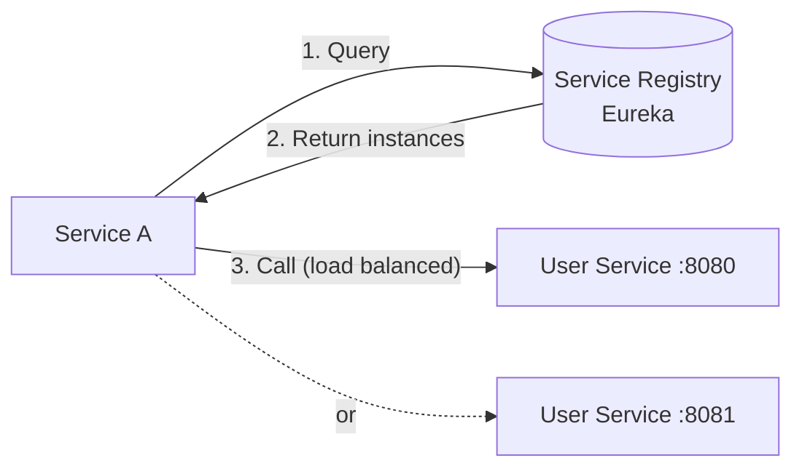
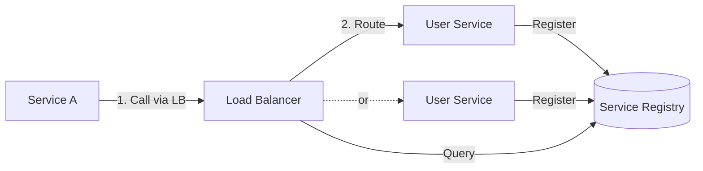
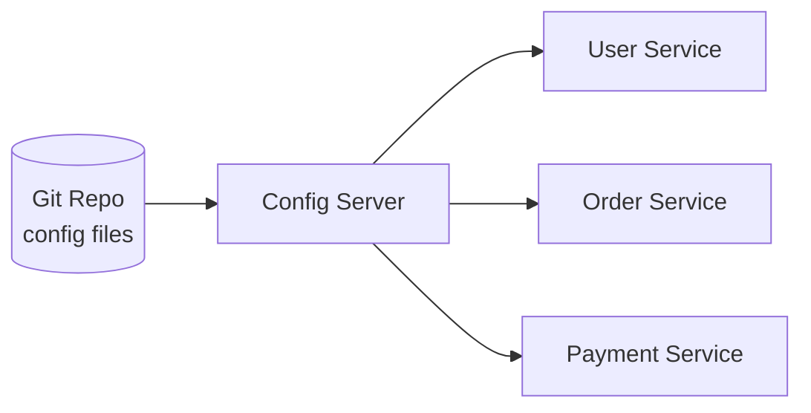

# Service Discovery & Configuration

## The Problem

In a monolith, everything is at `localhost`. In microservices, services run on different machines, ports change, instances scale up/down. How does Service A find Service B?

```
Service A needs to call User Service.
But User Service has 5 instances:
  - 10.0.1.5:8080
  - 10.0.1.6:8080
  - 10.0.2.3:8080
  - 10.0.2.4:8080  ← just started
  - 10.0.1.7:8080  ← just died

Which one to call? How to know which are alive?
```

---

## 1. Client-Side Discovery



- Client queries the registry and picks an instance
- **Eureka** (Netflix), **Consul** (HashiCorp)
- Pros: No extra hop, client controls load balancing
- Cons: Client needs discovery logic in every language

### Spring Cloud + Eureka Example

```java
// Service registers itself
@SpringBootApplication
@EnableEurekaClient
public class UserServiceApplication { }

// application.yml
eureka:
  client:
    serviceUrl:
      defaultZone: http://eureka-server:8761/eureka/
  instance:
    preferIpAddress: true

// Calling service uses service name, not URL
@FeignClient(name = "user-service")
public interface UserClient {
    @GetMapping("/users/{id}")
    User getUser(@PathVariable Long id);
}
```

---

## 2. Server-Side Discovery



- Load balancer handles discovery
- **AWS ALB/NLB**, **Kubernetes Services**
- Pros: Client is simple, language-agnostic
- Cons: Extra network hop through LB

---

## 3. Kubernetes DNS — The Modern Way

In Kubernetes, service discovery is built-in:

```yaml
# Kubernetes Service
apiVersion: v1
kind: Service
metadata:
  name: user-service
spec:
  selector:
    app: user-service
  ports:
    - port: 80
      targetPort: 8080
```

```java
// Just use the service name as hostname!
String url = "http://user-service/users/123";
// Kubernetes DNS resolves "user-service" to the right pod IPs
```

---

## 4. Externalized Configuration

### The Problem

```java
// Hardcoded config — need to redeploy to change!
String dbUrl = "jdbc:mysql://prod-db:3306/users";
int cacheTimeout = 3600;
```

### Spring Cloud Config Server



```yaml
# application-prod.yml (in Git)
database:
  url: jdbc:mysql://prod-db:3306/users
  pool-size: 20
cache:
  timeout: 3600
feature-flags:
  new-checkout: true
```

- Config stored in Git (versioned, auditable)
- Services fetch config at startup
- **@RefreshScope** allows runtime config updates without restart

---

## 5. Health Checks

Services must report their health so the registry can remove dead instances:

```java
@Component
public class CustomHealthIndicator implements HealthIndicator {
    @Override
    public Health health() {
        if (canConnectToDatabase()) {
            return Health.up().withDetail("db", "reachable").build();
        }
        return Health.down().withDetail("db", "unreachable").build();
    }
}
```

```
GET /actuator/health
{
  "status": "UP",
  "components": {
    "db": { "status": "UP" },
    "redis": { "status": "UP" },
    "diskSpace": { "status": "UP" }
  }
}
```

---

## 6. Comparison

| Solution | Best For | Complexity |
|----------|---------|-----------|
| Eureka | Spring Cloud ecosystem | Medium |
| Consul | Multi-language, key-value config | Medium |
| Kubernetes DNS | K8s-native apps | Low (built-in) |
| AWS Cloud Map | AWS-native apps | Low |

---

---

<!-- practice-pack -->

## 🏢 Real-World Scenarios

<div class="callout-scenario">

**Scenario**: After a deployment, 2% of requests fail for about 30 seconds with connection errors. The client-side service registry still lists instances that were already shut down. **Decision**: Discovery is eventually consistent — registries and client caches lag behind reality. Deregister instances **before** shutdown (graceful shutdown with a pre-stop delay), keep client cache refresh intervals short, retry idempotent calls on another instance, and use readiness probes so new instances only receive traffic when ready. On Kubernetes, rely on Service/EndpointSlices, which remove terminating pods from endpoints automatically.

</div>

<div class="callout-scenario">

**Scenario**: A team migrating from Eureka to Kubernetes keeps both — Spring Cloud Kubernetes discovery plus Eureka — and debugging routing issues takes days because two systems disagree. **Decision**: On Kubernetes, the platform already provides discovery (DNS + Services) and load balancing; application-level registries are usually redundant. Use plain Service DNS names (`http://inventory.shop`), remove Eureka and Ribbon-style client-side discovery during the migration, and keep configuration in ConfigMaps/Secrets or a config server only where runtime refresh is truly needed.

</div>

## 🏋️ Practice Assignments

### 🟢 Low — Build the reflexes

**L1.** Client-side vs server-side discovery — who picks the instance in each?

<details>
<summary>Show answer</summary>

Client-side: the calling service queries the registry (e.g., Eureka) and load-balances itself (Spring Cloud LoadBalancer). Server-side: the client calls a stable address (a load balancer, Kubernetes Service, or service mesh proxy) that picks the instance.

</details>

**L2.** How does a pod in namespace `orders` reach the `inventory` service in namespace `shop` on Kubernetes?

<details>
<summary>Show answer</summary>

Via DNS: `http://inventory.shop` (or the fully qualified `inventory.shop.svc.cluster.local`). CoreDNS resolves it to the Service's ClusterIP, and kube-proxy routes to a ready pod.

</details>

**L3.** Liveness vs readiness — which one removes an instance from load balancing?

<details>
<summary>Show answer</summary>

**Readiness**: a failing readiness probe removes the instance from Service endpoints (no traffic) without restarting it. **Liveness** failure restarts the container. Registries use analogous health checks to evict unhealthy instances.

</details>

### 🟡 Medium — Apply it

**M1.** Configure a Spring Boot `RestClient` to call `inventory-service` via Spring Cloud LoadBalancer with a timeout. When is this approach appropriate?

<details>
<summary>Show answer</summary>

```java
@Bean
@LoadBalanced
RestClient.Builder loadBalancedRestClientBuilder() {
    var factory = new SimpleClientHttpRequestFactory();          // Spring Framework 6.1+ accepts Duration
    factory.setConnectTimeout(Duration.ofMillis(500));
    factory.setReadTimeout(Duration.ofSeconds(2));
    return RestClient.builder().requestFactory(factory);
}

@Bean
RestClient inventoryClient(@LoadBalanced RestClient.Builder builder) {
    return builder.baseUrl("http://inventory-service").build();   // logical name resolved via the registry
}
```

Appropriate outside Kubernetes (VMs, ECS with Cloud Map, legacy Eureka setups). On Kubernetes, prefer Service DNS names without `@LoadBalanced`.

</details>

**M2.** Design health endpoints for a service that depends on PostgreSQL (critical) and a recommendations API (optional).

<details>
<summary>Show answer</summary>

Liveness: the process only (Spring's liveness state) — no dependencies. Readiness: include PostgreSQL (the service can't serve anything without it) but **not** the optional recommendations API (handled by circuit breakers/fallbacks; failing readiness would take every instance out of rotation during a recommendations outage). Expose the detailed health (including recommendations) on an internal endpoint for dashboards and alerts.

</details>

**M3.** Where should configuration like "payment gateway URL" and "feature flag: new checkout" live, and how do changes roll out?

<details>
<summary>Show answer</summary>

Gateway URL: environment configuration (ConfigMap/env vars or config server), changed via a normal deployment/rolling restart — it rarely changes and should be reviewed. Secrets alongside it in a secret manager. Feature flag: a feature-flag system (Unleash, LaunchDarkly, OpenFeature-compatible, or a DB-backed toggle service) that evaluates at runtime per request/user with gradual rollout and a kill switch — not a redeploy.

</details>

### 🔴 High — Think like a senior

**H1.** Design service discovery for a hybrid estate: 30 services on Kubernetes, 10 legacy services on VMs, and a few AWS Lambda functions — all calling each other.

<details>
<summary>Show answer</summary>

Pick one addressing scheme callers can rely on: DNS names. Kubernetes services use cluster DNS internally; expose them to VMs/Lambda through internal load balancers (AWS NLB/ALB via the AWS Load Balancer Controller) with private DNS records (Route 53 private hosted zones). VM services register in AWS Cloud Map (or Consul) which provides DNS names Kubernetes pods can resolve (CoreDNS forwarding), or sit behind their own internal load balancers. Lambdas call via private DNS inside the VPC. A service mesh spanning VMs and Kubernetes (Consul, Istio multi-environment) is an option if mTLS and consistent L7 policy are needed. Standardize health checks, timeouts, and tracing across all three environments; plan to converge the VM services onto the platform over time.

</details>

**H2.** During a zone outage, half your instances disappear. Walk through how discovery and load balancing should behave, and what you'd verify in a game day.

<details>
<summary>Show answer</summary>

Health checks fail for the lost instances → they're removed from endpoints/registries quickly (seconds); traffic shifts to surviving zones; autoscaling adds capacity in healthy zones; clients retry idempotent requests on other instances; circuit breakers prevent hammering dead endpoints. Verify in a game day: time to remove dead instances from rotation, error rate and latency during the shift, whether surviving capacity handles the load (N+1 zone planning), cross-zone traffic costs and database failover behavior, client DNS/connection caching (JVM DNS TTL, long-lived keep-alive connections to dead IPs), and alerting that fires correctly. Document gaps and fix them before a real outage.

</details>

## 🛠️ Mini Project — Discovery Three Ways

**Goal**: Compare discovery approaches hands-on. 2 evenings.

**Build**

1. Two Spring Boot services: `order-service` calls `inventory-service`.
2. **Version A — Eureka**: a Eureka server; services register; `@LoadBalanced RestClient`; run 3 inventory instances; kill one and measure the error window.
3. **Version B — Kubernetes (kind)**: remove Eureka; call `http://inventory-service` via a Service; readiness probes and graceful shutdown with a preStop delay; kill a pod and measure the error window.
4. **Version C — Config**: externalize the inventory URL and a feature flag (Spring Cloud Config or ConfigMap + checksum restart); change both and observe rollout behavior.
5. Record: error rate during instance loss, time to recover, and lines of configuration per version.

**Acceptance criteria**: a README table comparing the three approaches and a recommendation for each environment.

---

## 🎯 Interview Corner

<div class="callout-interview">

**Q: "How do microservices find each other? Explain service discovery."**

Two approaches. Client-side discovery: each service registers itself with a registry (Eureka, Consul). When Service A needs to call Service B, it queries the registry, gets a list of healthy instances, and picks one (client-side load balancing). Server-side discovery: services register with a registry, but a load balancer (ALB, Kubernetes Service) sits in between. Service A calls the load balancer, which routes to a healthy instance. In Kubernetes, it's built-in — you create a Service resource and use the DNS name (`http://user-service/users/123`). K8s DNS resolves it to a healthy pod IP. No external registry needed.

</div>

<div class="callout-interview">

**Q: "How do you manage configuration across 20 microservices without redeploying?"**

Externalized configuration. Store config in a central place (Spring Cloud Config Server backed by Git, AWS Parameter Store, HashiCorp Consul KV). Services fetch config at startup. For runtime changes without restart, use Spring's @RefreshScope with a /actuator/refresh endpoint, or Config Server's bus-refresh that broadcasts changes to all instances via a message broker. Sensitive values (DB passwords, API keys) go in a secrets manager (AWS Secrets Manager, HashiCorp Vault) — never in Git. Feature flags go in a dedicated system (LaunchDarkly, or a simple config property) so you can toggle features without deployment.

**Follow-up trap**: "What if the Config Server is down when a service starts?" → Services should cache the last known config locally and start with cached values. Spring Cloud Config has a fail-fast option — disable it in production so services can start even if the config server is temporarily unavailable.

</div>

<div class="callout-interview">

**Q: "Client-side vs server-side discovery — which do you prefer and why?"**

Depends on the platform. On Kubernetes, server-side discovery is the clear winner — it's built-in, zero code, works across languages. You just use the service DNS name. Off Kubernetes, client-side discovery with Eureka or Consul gives you more control: you can implement custom load balancing (weighted, zone-aware), and there's no extra network hop through a load balancer. The downside is every service needs a discovery client library, which is language-specific. In practice, most modern systems run on K8s and use its native discovery. Eureka/Consul are more common in legacy Spring Cloud setups.

</div>

<div class="callout-tip">

**Applying this** — If you're on Kubernetes, don't add Eureka or Consul — K8s service discovery is simpler and more reliable. If you're not on K8s, Consul is the most versatile (works across languages, includes health checking and KV store). For configuration, use a Git-backed config server for non-sensitive values and a secrets manager for credentials. Never hardcode URLs or credentials.

</div>

---

> **Modern recommendation**: If you're on Kubernetes, use its built-in service discovery (DNS). If not, Consul is the most versatile. Eureka is great if you're all-in on Spring Cloud. Don't build your own — it's a solved problem.

---

<!-- journey-link:start -->

<div class="callout-journey">

🛒 **ShopNorth Journey** — On Kubernetes, ShopNorth's services find each other by DNS name (http://order-service) — no separate registry needed.

**Continue the story:** [Chapter 12 · Deploying on Kubernetes](/tutorials/journey-12-kubernetes) · **New here?** [Start the journey](/tutorials/journey-start)

</div>

<!-- journey-link:end -->
