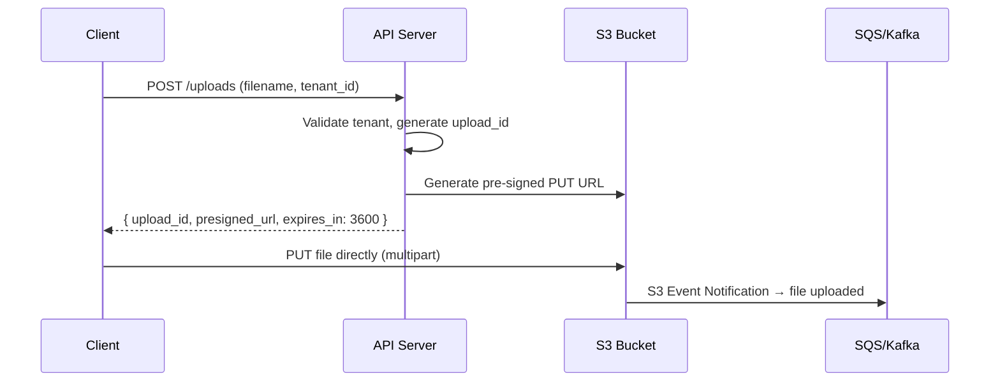
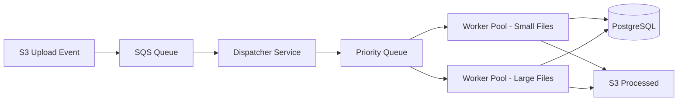
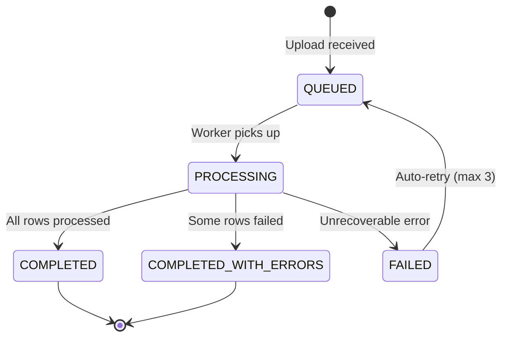
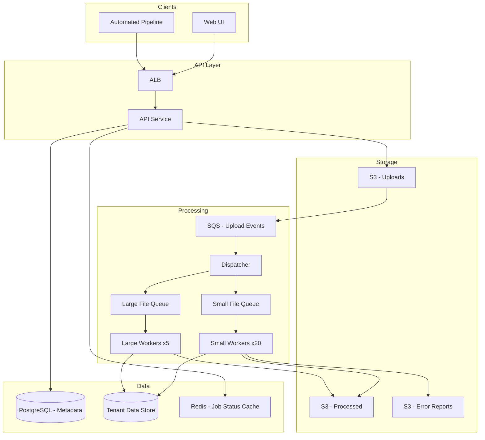

# Data Ingestion Platform

## The Problem — Real Scenario

Your company builds a SaaS analytics product. Customers (tenants) upload CSV files — some 10MB, some 5GB. Some upload manually via UI, others have automated pipelines pushing files every hour. You have 200 tenants today, growing to 2,000 next year.

**The hard parts:**
- Tenant A uploads a 4GB file. Tenant B uploads a 50KB file at the same time. Tenant B shouldn't wait 20 minutes.
- 15 tenants trigger automated uploads at midnight. All 15 hit your system simultaneously.
- One tenant's malformed CSV shouldn't crash processing for everyone.
- You need to track: who uploaded what, when, processing status, row-level errors.

---

## Step 1 — Upload Path

### Why NOT direct upload to your API server?

```
❌ Client → API Server → Write to disk → Process
```

If a 4GB file hits your API server, it holds a thread/connection for minutes. 10 concurrent uploads = your API is unresponsive.

### The right approach: Pre-signed URL upload to S3

```
Client → API Server (get pre-signed URL) → Client uploads directly to S3
```



<div class="callout-tip">

**Applying this** — Pre-signed URLs mean your API server never touches the file bytes. S3 handles multipart upload, resumability, and bandwidth. Your API stays lightweight — it just issues tokens and tracks metadata.

</div>

### Decision: S3 Multipart Upload

For files > 100MB, use S3 multipart upload:
- File is split into 5MB–5GB parts
- Parts upload in parallel
- If one part fails, retry just that part
- Client can resume after network failure

```java
// API generates pre-signed URL with conditions
PutObjectPresignRequest presignRequest = PutObjectPresignRequest.builder()
    .signatureDuration(Duration.ofHours(1))
    .putObjectRequest(b -> b
        .bucket("tenant-uploads")
        .key(tenantId + "/" + uploadId + "/" + filename)
        .contentLengthRange(1, 5_368_709_120L) // max 5GB
    )
    .build();
```

### Tenant Isolation in Storage

```
s3://data-ingestion-uploads/
  ├── tenant-001/
  │   ├── upload-abc123/
  │   │   └── transactions-2024.csv
  │   └── upload-def456/
  │       └── customers.csv
  ├── tenant-002/
  │   └── ...
```

Each tenant gets a prefix. S3 bucket policies restrict access per tenant. No tenant can see another's files.

---

## Step 2 — Processing Pipeline

### The Event-Driven Architecture

When S3 receives a file, it fires an event. This triggers the processing pipeline.



### Why separate worker pools?

| Pool | File Size | Workers | Timeout | Memory |
|------|-----------|---------|---------|--------|
| Small | < 100MB | 20 | 5 min | 512MB |
| Large | > 100MB | 5 | 60 min | 4GB |

<div class="callout-scenario">

**Scenario**: Without separation, a 4GB file occupies a worker for 30 minutes. If you have 10 workers and 3 large files arrive, 30% of your capacity is locked. Small files queue up behind them. With separate pools, small files always have dedicated workers.

</div>

### The Dispatcher Logic

```java
@Service
public class UploadDispatcher {

    @SqsListener("file-upload-events")
    public void handleUploadEvent(S3EventNotification event) {
        String key = event.getRecords().get(0).getS3().getObject().getKey();
        long size = event.getRecords().get(0).getS3().getObject().getSizeBytes();
        String tenantId = extractTenantId(key);

        // Check tenant's concurrent processing limit
        int activeJobs = jobRepository.countActiveByTenant(tenantId);
        if (activeJobs >= tenantConcurrencyLimit(tenantId)) {
            // Re-queue with delay — tenant is at capacity
            sqsClient.sendMessage(b -> b
                .queueUrl(QUEUE_URL)
                .messageBody(event.toJson())
                .delaySeconds(30)
            );
            return;
        }

        ProcessingJob job = ProcessingJob.builder()
            .tenantId(tenantId)
            .s3Key(key)
            .fileSize(size)
            .status(JobStatus.QUEUED)
            .build();

        jobRepository.save(job);

        // Route to appropriate worker pool
        String targetQueue = size > 100_000_000 ? "large-file-queue" : "small-file-queue";
        sqsClient.sendMessage(b -> b.queueUrl(targetQueue).messageBody(job.getId()));
    }
}
```

---

## Step 3 — Processing the CSV

### Streaming, Not Loading

```
❌ Read entire 4GB CSV into memory → Parse → Write to DB
✅ Stream line by line → Batch inserts → Checkpoint progress
```

```java
@Service
public class CsvProcessor {

    private static final int BATCH_SIZE = 5000;

    public ProcessingResult process(ProcessingJob job) {
        S3Object s3Object = s3Client.getObject(b -> b.bucket(BUCKET).key(job.getS3Key()));

        long totalRows = 0, errorRows = 0;
        List<ParsedRow> batch = new ArrayList<>(BATCH_SIZE);
        List<RowError> errors = new ArrayList<>();

        try (BufferedReader reader = new BufferedReader(
                new InputStreamReader(s3Object, StandardCharsets.UTF_8))) {

            String[] headers = parseCsvLine(reader.readLine());
            String line;

            while ((line = reader.readLine()) != null) {
                totalRows++;
                try {
                    ParsedRow row = parseAndValidate(headers, line, totalRows);
                    batch.add(row);

                    if (batch.size() >= BATCH_SIZE) {
                        writeBatch(job.getTenantId(), batch);
                        batch.clear();
                        updateProgress(job, totalRows);
                    }
                } catch (ValidationException e) {
                    errorRows++;
                    errors.add(new RowError(totalRows, e.getMessage()));
                }
            }

            // Flush remaining
            if (!batch.isEmpty()) {
                writeBatch(job.getTenantId(), batch);
            }
        }

        return new ProcessingResult(totalRows, errorRows, errors);
    }
}
```

### Why batch inserts of 5,000?

| Batch Size | Insert Time (100K rows) | DB Connections |
|-----------|------------------------|----------------|
| 1 (row by row) | 180 seconds | 1 held entire time |
| 100 | 12 seconds | 1 held entire time |
| 5,000 | 3.2 seconds | 1, released between batches |
| 50,000 | 2.8 seconds | High memory, risk of timeout |

5,000 is the sweet spot — fast enough, low memory, and you can checkpoint progress between batches.

---

## Step 4 — Multi-Tenant Fairness

### The Problem

Tenant A has a paid "Enterprise" plan. Tenant B is on "Free". Both upload at the same time. How do you ensure:
- Enterprise gets priority?
- Free tier doesn't starve?
- No single tenant monopolizes the system?

### Weighted Fair Queue

```java
public class TenantPriorityCalculator {

    public int calculatePriority(String tenantId, long fileSize) {
        TenantPlan plan = tenantService.getPlan(tenantId);
        int activeJobs = jobRepository.countActiveByTenant(tenantId);

        int basePriority = switch (plan) {
            case ENTERPRISE -> 1;   // highest
            case PROFESSIONAL -> 3;
            case FREE -> 5;         // lowest
        };

        // Penalize tenants with many active jobs (fairness)
        int concurrencyPenalty = activeJobs * 2;

        // Bonus for small files (they finish fast, don't block)
        int sizeBonus = fileSize < 10_000_000 ? -1 : 0;

        return basePriority + concurrencyPenalty + sizeBonus;
    }
}
```

### Concurrency Limits Per Tenant

| Plan | Max Concurrent Jobs | Max File Size | Rate Limit |
|------|-------------------|---------------|------------|
| Free | 2 | 500MB | 10 uploads/hour |
| Professional | 10 | 2GB | 100 uploads/hour |
| Enterprise | 50 | 5GB | Unlimited |

<div class="callout-tip">

**Applying this** — Concurrency limits prevent a single tenant from consuming all workers. The weighted queue ensures Enterprise tenants get faster processing without completely starving Free tenants. Small files get a priority bonus because they free up workers quickly.

</div>

---

## Step 5 — Error Handling & Observability

### Row-Level Error Tracking

Not every row in a CSV will be valid. You need to:
- Continue processing despite errors
- Report exactly which rows failed and why
- Let the tenant download an error report

```json
{
  "upload_id": "abc-123",
  "status": "COMPLETED_WITH_ERRORS",
  "total_rows": 1500000,
  "processed_rows": 1499847,
  "error_rows": 153,
  "error_report_url": "s3://reports/tenant-001/abc-123/errors.csv",
  "errors_sample": [
    { "row": 4521, "field": "email", "error": "Invalid email format" },
    { "row": 8903, "field": "amount", "error": "Negative value not allowed" }
  ]
}
```

### Job Status State Machine



---

## Step 6 — The Complete Architecture



### Why these technology choices?

| Component | Choice | Why |
|-----------|--------|-----|
| Upload storage | S3 | Unlimited scale, multipart upload, event notifications, cheap |
| Event queue | SQS | Managed, dead-letter queues, delay support, no ops overhead |
| Worker compute | ECS Fargate | Auto-scaling per queue depth, no server management |
| Metadata DB | PostgreSQL | ACID for job tracking, tenant metadata, relational queries |
| Tenant data | PostgreSQL (schema-per-tenant) | Isolation, familiar tooling, can migrate to dedicated DB later |
| Job status cache | Redis | Sub-ms reads for status polling, TTL for auto-cleanup |

<div class="callout-interview">

**Q: "How would you handle a tenant uploading a 5GB file while 50 other tenants are uploading small files?"**

Pre-signed URL to S3 (API never touches bytes), separate worker pools for large/small files, per-tenant concurrency limits, weighted priority queue. The key insight: decouple upload from processing, and never let one tenant's workload affect another's experience.

</div>

---

## Scaling Decisions

### When to scale what?

| Signal | Action |
|--------|--------|
| SQS queue depth > 100 for 5 min | Add more workers (ECS auto-scaling) |
| Average processing time > 2x baseline | Check for hot tenant, add workers |
| S3 PUT latency > 500ms | Check region, enable transfer acceleration |
| PostgreSQL connections > 80% | Add read replicas, or switch to connection pooling (PgBouncer) |
| Single tenant > 40% of all jobs | Throttle tenant, notify account team |

### Cost Optimization

- **Spot instances** for large file workers (they're fault-tolerant — jobs retry on failure)
- **S3 Intelligent-Tiering** for processed files (most are accessed once then rarely)
- **Reserved capacity** for small file workers (always running, predictable load)
- **SQS long polling** to reduce empty receives (cost per request)

<div class="callout-tip">

**Applying this** — The entire design follows one principle: **isolate the blast radius**. Tenant isolation in storage, separate worker pools by file size, per-tenant concurrency limits, and independent scaling per queue. Any single failure affects only one tenant's one upload — never the system.

</div>

---

<!-- practice-pack -->

## 🏢 More Real-World Scenarios

<div class="callout-scenario">

**Scenario**: A customer uploads a 2 GB CSV where row 1,800,000 has a malformed date. The original pipeline processed rows in one transaction, failed at the end, rolled everything back, and retried from scratch three times — 4 hours of work with nothing to show, and the customer got a generic "processing failed" email. **Decision**: Validate and load in **chunks** with checkpoints (e.g., 50K rows per batch, progress stored per job), route bad rows to an error file with row numbers and reasons instead of failing the job, apply a configurable error threshold (fail only if > 1% of rows are bad), and give the customer a downloadable error report. Retries resume from the last committed checkpoint.

</div>

## 🏋️ Practice Assignments

### 🟢 Low — Build the reflexes

**L1.** Why upload via pre-signed URLs straight to S3 instead of streaming through the API servers?

<details>
<summary>Show answer</summary>

API servers stay small and stateless (no multi-GB request bodies holding threads and memory), uploads scale with S3's capacity, large files can use multipart upload with parallel and resumable parts, and the API only handles small metadata calls (create upload, complete upload). The pre-signed URL limits what the client can do: one object key, one method, short expiry.

</details>

**L2.** What should trigger processing after an upload completes, and why not the client calling "process now"?

<details>
<summary>Show answer</summary>

An S3 event notification (`ObjectCreated` → SQS/EventBridge) or the server-side "complete upload" call that verifies the object exists. Relying on the client is fragile: it may close the browser, retry and trigger duplicates, or lie. Server-side triggers plus an idempotent job record (keyed by upload ID) give exactly one processing job per file.

</details>

**L3.** What's a dead-letter queue (DLQ), and what do you do with messages in it?

<details>
<summary>Show answer</summary>

A queue receiving messages that failed processing after N attempts, so poison messages don't block or loop forever. Alert on DLQ depth, inspect messages with their failure reason, fix the bug or data, and **redrive** them back to the main queue. The DLQ is an operational to-do list, not a trash can.

</details>

### 🟡 Medium — Apply it

**M1.** Make CSV row processing idempotent so a retried chunk doesn't duplicate data.

<details>
<summary>Show answer</summary>

Give every row a deterministic identity — the file's business key column (e.g., `employee_id`) or `(upload_id, row_number)` — and write with upserts (`INSERT ... ON CONFLICT (tenant_id, external_id) DO UPDATE`). Record chunk completion (`job_id, chunk_no, status`) in the same transaction as the chunk's rows, so a retry skips completed chunks and re-applies partial ones safely.

</details>

**M2.** One tenant uploads 300 files at once and everyone else's jobs wait. Design fairness.

<details>
<summary>Show answer</summary>

Per-tenant concurrency limits (e.g., max 5 running jobs per tenant, tracked in Redis or the job table), and a scheduler that picks the next job round-robin across tenants instead of FIFO across all jobs (or weighted fair queuing by plan). Large tenants can have dedicated capacity on enterprise plans. Show queued jobs and estimated start time in the UI so users understand the wait.

</details>

**M3.** Detect schema problems early: a customer's file has columns in a different order and a renamed header.

<details>
<summary>Show answer</summary>

Map by header name, not position. Before full processing, read the first rows (a "preflight" step), match headers to the tenant's expected schema with alias support (`emp_id` → `employee_id`), validate types on a sample, and fail fast with a precise message ("missing required column `email`; unknown column `e-mail` — did you mean `email`?"). Let tenants save column mappings so the next upload is automatic.

</details>

### 🔴 High — Think like a senior

**H1.** Customers now want near-real-time ingestion via API (100 records/second each) in addition to files. How does the architecture change?

<details>
<summary>Show answer</summary>

Add a streaming ingestion path: `POST /records` (batched, authenticated, rate-limited per tenant) writes to Kafka/Kinesis partitioned by tenant; the same validation and transformation code (shared library) runs in stream consumers; writes are idempotent by record ID. Files become one more producer into the same pipeline (chunked into the stream) or stay batch for very large loads. Unified observability: per-tenant lag, error rates, and throughput regardless of source.

</details>

**H2.** A bug in the transformation code corrupted 3 days of data for 40 tenants. How do you recover, and how should the system make this easier?

<details>
<summary>Show answer</summary>

Recovery: fix and deploy the bug, identify affected jobs by code version and time range, then re-process from the **raw files** kept in S3 (immutable, versioned) with the fixed code into the target tables (idempotent upserts make re-runs safe), and notify affected tenants. Design for it: keep raw inputs for a retention period, store the processing code version on every job and row batch, support "reprocess job X" as a first-class operation, and run data-quality checks (row counts, null rates, value distributions) after each job to catch corruption on day 1 instead of day 3.

</details>

## 🛠️ Mini Project — Multi-Tenant CSV Ingestion Service

**Goal**: Build the reliable core of this design. 1 week of evenings.

**Build**

1. Spring Boot + PostgreSQL + LocalStack (S3, SQS) or MinIO + RabbitMQ: `POST /uploads` returns a pre-signed URL; an S3 event creates a job.
2. Worker: streams the CSV (never loads it whole), validates per row, upserts in 10K-row chunks with checkpoints, writes an error CSV for bad rows.
3. Fairness: per-tenant concurrency limit and round-robin job selection.
4. DLQ with a redrive admin endpoint; job status API with progress percentage.
5. Test with a generated 1M-row file containing 0.5% bad rows; kill the worker mid-job and show it resumes from the checkpoint without duplicates.

**Acceptance criteria**: zero duplicate rows after a crash-and-resume test; a tenant uploading 50 files doesn't delay another tenant's single file by more than one job slot; README with throughput (rows/second).

---

## 🎯 Interview Corner

<div class="callout-interview">

**Q: "How would you design a system where customers upload large CSV files that must be processed reliably?"**

I'd separate upload from processing. The client uploads directly to object storage with a pre-signed multipart URL, and an S3 event creates a job record and a queue message. Workers stream the file in chunks, validate each row, and upsert in batches, recording a checkpoint per chunk in the same transaction, so a crashed worker resumes instead of restarting. Bad rows go to an error report rather than failing the whole job, with a threshold for "too many errors". Fairness comes from per-tenant concurrency limits. I'd also keep the raw file so I can reprocess after a bug fix.

**Follow-up trap**: "Why not process the file in one transaction?" → A multi-hour transaction holds locks and bloats the database's undo or WAL. One bad row then rolls back everything. Chunked, idempotent commits are both faster and safer.

</div>

<div class="callout-interview">

**Q: "How do you stop one large tenant from starving everyone else in a shared processing pipeline?"**

Don't schedule globally FIFO. Track running jobs per tenant and cap them, for example 5 concurrent jobs per tenant. Pick the next job round-robin across tenants that have work waiting, optionally weighted by plan. Split worker pools by job size so a 5 GB file doesn't sit in front of a 10 KB file. For big customers, sell dedicated capacity. Then measure fairness: per-tenant queue wait time is the metric that shows whether it works.

</div>

<div class="callout-interview">

**Q: "A processing job failed halfway. How does your design make the retry safe?"**

Three things work together. First, chunk checkpoints: the job knows which chunks committed. Second, idempotent writes: every row has a deterministic key, either a business ID or upload ID plus row number, and writes are upserts, so re-applying a partially processed chunk can't create duplicates. Third, at-least-once messaging with a dead-letter queue: after N failed attempts the message parks for investigation instead of looping forever. A retry then resumes from the last checkpoint, and redoing work is harmless.

</div>

---

<!-- journey-link:start -->

<div class="callout-journey">

🛒 **ShopNorth Journey** — Extra case study — asynchronous pipelines with retries and dead-letter queues, as in ShopNorth's event consumers.

**Continue the story:** [Chapter 6 · Microservices & Events](/tutorials/journey-06-microservices) · **New here?** [Start the journey](/tutorials/journey-start)

</div>

<!-- journey-link:end -->
