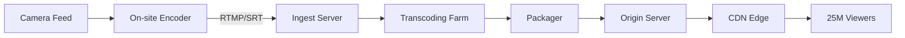
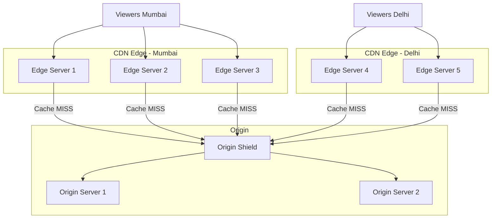
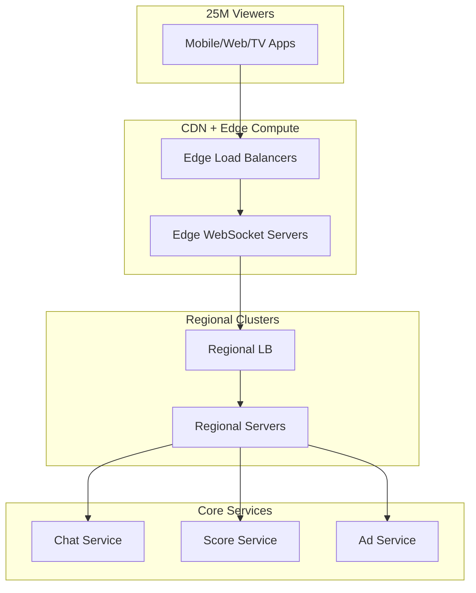
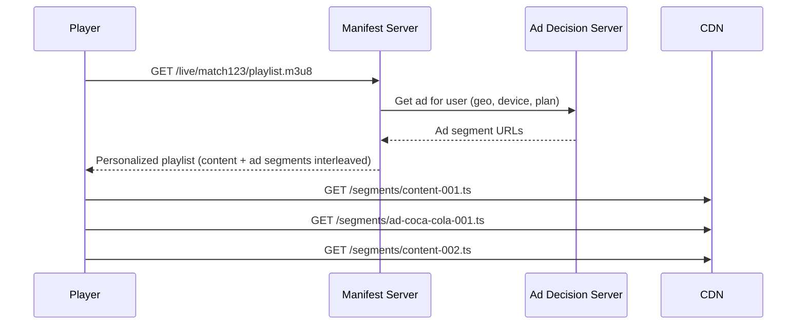
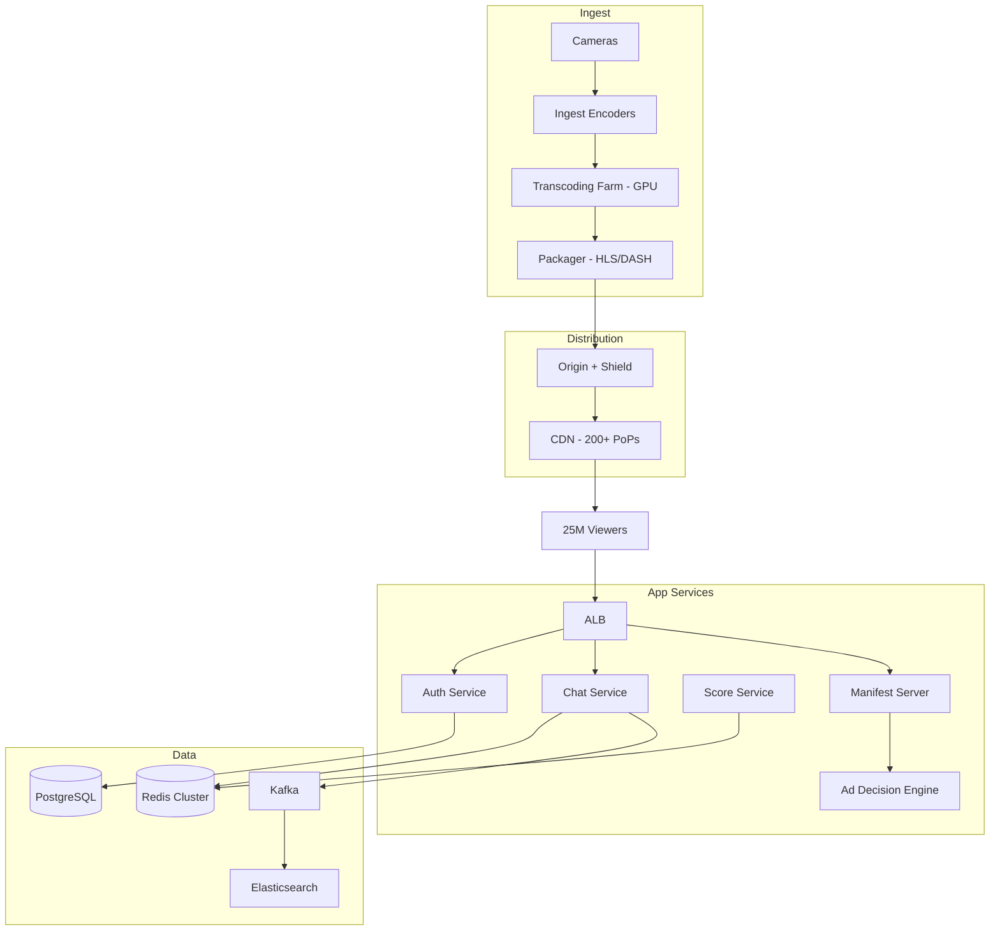

# Live Streaming Platform — HotStar Scale

## The Problem

IPL final. 25 million concurrent viewers. Each viewer's device requests a new video segment every 2-4 seconds. That's **~10 million requests per second** just for video. Add live chat, real-time scores, ads, and authentication — you're looking at 30-50 million RPS.

Your system cannot buffer. Cannot lag. Cannot crash. If it goes down for 30 seconds during a wicket, it's national news.

---

## The Numbers That Drive Every Decision

| Metric | Value | Impact |
|--------|-------|--------|
| Concurrent viewers | 25 million | Connection handling, state management |
| Video segment requests | ~10M RPS | CDN capacity, origin shielding |
| Segment duration | 2-4 seconds | Latency budget, cache TTL |
| Bitrate variants | 6 (240p to 4K) | Storage multiplier, transcoding cost |
| Live chat messages | ~500K/sec | WebSocket connections, fan-out |
| Glass-to-glass latency target | < 30 seconds | Encoding pipeline speed |

---

## Step 1 — Video Ingest & Transcoding

### From Camera to Segments



### Why HLS over DASH?

| Protocol | Apple Devices | Android | Browser | Latency |
|----------|--------------|---------|---------|---------|
| HLS | ✅ Native | ✅ ExoPlayer | ✅ hls.js | 6-30s |
| DASH | ❌ No | ✅ Native | ✅ dash.js | 6-30s |
| LL-HLS | ✅ Native | ✅ | ✅ | 2-5s |

HLS wins because of Apple device support (40%+ of premium users). Low-Latency HLS (LL-HLS) gets you close to real-time.

### Adaptive Bitrate Ladder

```
4K    — 16 Mbps  — For smart TVs on fiber
1080p — 8 Mbps   — Desktop, good WiFi
720p  — 4 Mbps   — Mobile on WiFi
480p  — 2 Mbps   — Mobile on 4G
360p  — 1 Mbps   — Slow connections
240p  — 500 Kbps — Edge cases, 3G
```

The player automatically switches between these based on available bandwidth. No buffering — just lower quality.

<div class="callout-tip">

**Applying this** — You don't choose one quality. You encode ALL of them simultaneously. The player decides. This is why transcoding is the most expensive part of the pipeline — every second of live video becomes 6 parallel encoding jobs.

</div>

---

## Step 2 — CDN Architecture

### Why CDN is 95% of the Solution

Without CDN: 10M RPS hitting your origin servers. You'd need thousands of servers.

With CDN: 10M RPS hitting 200+ edge locations worldwide. Your origin handles maybe 50K RPS (0.5%).



### Origin Shield — The Critical Layer

Without origin shield: Every edge location independently requests segments from origin. 200 edge locations × cache miss = 200 requests to origin for the same segment.

With origin shield: One intermediate cache layer. Edge → Shield → Origin. Shield caches the segment, serves all edges. Origin sees 1 request instead of 200.

### Cache TTL Strategy for Live Content

```
Video segments (past)     → Cache 24 hours (they never change)
Video segments (current)  → Cache 2 seconds (matches segment duration)
Manifest/playlist file    → Cache 1 second (must update frequently)
Static assets (logos, UI) → Cache 30 days
```

<div class="callout-scenario">

**Scenario**: During IPL final, a wicket falls. 25M viewers are watching the same 2-second segment. CDN serves it from edge cache. Your origin server doesn't even know 25M people just watched that wicket — it served the segment once to the CDN.

</div>

---

## Step 3 — Handling 25 Million Connections

### Connection Architecture

You can't maintain 25M persistent connections to one server. You need a tiered approach.



### Per-Server Connection Limits

| Component | Connections per instance | Instances | Total capacity |
|-----------|------------------------|-----------|----------------|
| Edge WebSocket | 100K | 300 | 30M |
| Regional server | 10K | 100 | 1M (aggregated) |
| Core service | 1K | 50 | 50K |

The key: **fan-out at the edge, aggregate toward the core**. 25M viewers → 300 edge servers → 100 regional servers → 50 core servers.

---

## Step 4 — Live Chat at Scale

500K messages per second. Every message needs to reach relevant viewers within 1 second.

### Why NOT broadcast every message to every viewer?

25M viewers × 500K messages/sec = 12.5 trillion deliveries per second. Impossible.

### The Solution: Chat Rooms + Sampling

```
Match: IND vs AUS
├── Room: Hindi-General (500K viewers, show 1 in 50 messages)
├── Room: English-General (300K viewers, show 1 in 30 messages)
├── Room: Hindi-Mumbai (50K viewers, show 1 in 5 messages)
├── Room: Premium-All (10K viewers, show all messages)
└── ... 200+ rooms
```

Each viewer sees ~10-20 messages/second (curated). The system processes 500K/sec but delivers a sampled, relevant subset.

```java
public class ChatRouter {

    public void routeMessage(ChatMessage msg) {
        String roomId = msg.getRoomId();
        List<String> subscriberShards = roomRegistry.getShards(roomId);

        // Publish to Redis Pub/Sub per shard
        for (String shard : subscriberShards) {
            redisTemplate.convertAndSend("chat:" + shard, msg);
        }
    }
}
```

<div class="callout-tip">

**Applying this** — You never solve "deliver every message to every user." You solve "deliver the right messages to the right users." Chat rooms, sampling, and relevance filtering reduce the fan-out by 100-1000x.

</div>

---

## Step 5 — Ad Insertion

### Server-Side Ad Insertion (SSAI)

Why server-side? Client-side ad insertion gets blocked by ad blockers. SSAI stitches ads directly into the video stream — the player can't tell the difference between content and ads.



Each viewer gets a **personalized manifest** — same match, different ads. This is how you monetize 25M viewers with targeted advertising.

---

## Step 6 — Complete Architecture



### Technology Choices & Why

| Component | Choice | Why NOT alternatives |
|-----------|--------|---------------------|
| Video delivery | CloudFront + custom origin | Global PoPs, origin shield, Lambda@Edge for manifest |
| Transcoding | EC2 GPU instances (g4dn) | MediaConvert too slow for live, need sub-second encoding |
| Chat pub/sub | Redis Cluster | Kafka too high latency for real-time chat, Redis < 1ms |
| Chat persistence | Kafka → Elasticsearch | Kafka for durability, ES for search/replay |
| Ad decisions | Custom service + Redis | Sub-10ms decision needed, pre-computed targeting in Redis |
| Auth | Cognito + JWT | Stateless verification at edge, no DB call per request |
| Score updates | Redis Pub/Sub | Push-based, sub-second propagation to all edge servers |

<div class="callout-interview">

**Q: "How would you handle 25M concurrent viewers?"**

The answer is NOT "add more servers." It's: (1) CDN serves 99.5% of video requests — origin barely touched, (2) Origin shield prevents thundering herd, (3) Edge compute handles WebSocket connections — fan-out at edge, aggregate at core, (4) Chat uses rooms + sampling — never broadcast everything to everyone, (5) Personalized ad manifests per viewer — SSAI, not client-side.

</div>

---

## Failure Scenarios & Mitigations

| Failure | Impact | Mitigation |
|---------|--------|------------|
| Origin server down | CDN serves stale segments for 2-4 sec | Multi-AZ origin, health checks, auto-failover |
| CDN edge down | Viewers in that region buffer | Multi-CDN strategy (CloudFront + Akamai) |
| Transcoder crash | Stream freezes | Hot standby transcoders, auto-restart < 3 sec |
| Chat service overload | Messages delayed | Shed load — increase sampling ratio, drop non-premium |
| Database down | New signups fail | Auth is JWT-based, existing viewers unaffected |

<div class="callout-tip">

**Applying this** — At this scale, you design for failure, not against it. Every component has a degraded mode. Video continues even if chat dies. Chat continues even if ads fail. The match never stops because a supporting service crashed.

</div>

---

<!-- practice-pack -->

## 🏢 More Real-World Scenarios

<div class="callout-scenario">

**Scenario**: In the final over of a cricket match, a wicket falls and 8 million viewers simultaneously open the app's "watch highlights" link and refresh the score widget. The video CDN holds up, but the score API's origin collapses under synchronized cache misses — every edge requested the new score at the same second. **Decision**: Treat "everyone does the same thing at the same moment" as the normal case for live events. Push score updates over existing connections (WebSocket/SSE fan-out) instead of letting clients poll; for polled endpoints, use request collapsing at the shield, short TTLs with `stale-while-revalidate`, and client-side jitter on refresh. Pre-warm caches for predictable moments (innings break, end of match).

</div>

## 🏋️ Practice Assignments

### 🟢 Low — Build the reflexes

**L1.** Why is live streaming latency usually 10-30 seconds behind real time, and how can it be reduced?

<details>
<summary>Show answer</summary>

Latency accumulates from encoding, segmenting (segments of 4-6 s must be complete before they're published), CDN propagation, and player buffers (often 3 segments). Reduce it with shorter segments (2 s), **Low-Latency HLS / LL-DASH** with partial segments (CMAF chunks), smaller player buffers, and tuned encoders — reaching ~2-5 seconds, at the cost of more requests and less resilience to network hiccups.

</details>

**L2.** 25M viewers at an average 3 Mbps — what's the egress, and why does it require a CDN?

<details>
<summary>Show answer</summary>

25M × 3 Mbps = **75 Tbps**. No single origin or data center can serve that; it must be distributed across many CDN edge locations (often multiple CDNs plus ISP-embedded caches), with the origin only serving each segment once per shield/edge region.

</details>

**L3.** Why insert ads server-side (SSAI) instead of in the player?

<details>
<summary>Show answer</summary>

Server-side ad insertion stitches ad segments into the stream manifest, so ads play seamlessly in the same video stream (no buffering when switching), work on all devices, are harder for ad blockers to remove, and can be personalized per viewer via per-user manifests. Trade-off: generating personalized manifests for millions of viewers at the same ad break is a serious scaling challenge.

</details>

### 🟡 Medium — Apply it

**M1.** At an ad break, 25M viewers need personalized manifests within a few seconds. Design it.

<details>
<summary>Show answer</summary>

Don't personalize per viewer: personalize per **segment of audience** (e.g., a few thousand cohorts by region, language, device, and targeting profile). Pre-fetch ad decisions for each cohort before the break (ad breaks are signalled ahead via SCTE-35 markers), pre-transcode ads into the stream's bitrate ladder, and generate cohort manifests that are cacheable at the CDN. Viewers map to a cohort via a token. This turns 25M unique requests into a few thousand cacheable ones.

</details>

**M2.** Design live chat for 5M concurrent viewers of one match.

<details>
<summary>Show answer</summary>

Nobody can read 50,000 messages/second. Partition viewers into **rooms** (shards of ~10-50K users), fan out within a room, and show a sampled cross-room stream of highlighted messages (verified accounts, high engagement). Messages go to Kafka partitioned by room; WebSocket gateway nodes subscribe to the rooms of their connected users. Moderation runs inline (filters) and asynchronously (ML, reports). Under overload, increase sampling and slow-mode (one message per user per N seconds) rather than dropping connections.

</details>

**M3.** How do you handle the "thundering herd" when the match starts and millions join in 2 minutes?

<details>
<summary>Show answer</summary>

Pre-scale everything for the known start time (API, auth, WebSocket gateways, origin), pre-warm CDN caches with the first segments and manifests, use stateless JWT validation (no auth DB lookup per viewer), add jittered backoff to client retries, apply admission control with a friendly waiting screen for non-critical features, and degrade gracefully (disable personalized rows on the home page before touching playback).

</details>

### 🔴 High — Think like a senior

**H1.** The primary transcoder for the live feed fails mid-match. Design for continuity.

<details>
<summary>Show answer</summary>

Run redundant ingest paths: two contribution feeds from the venue (different networks) into two independent encoder/packager pipelines in different availability zones, producing identical segment timelines (synchronized timestamps, deterministic segment numbering). The origin or packager fails over between pipelines (or the CDN uses a primary/backup origin). Players see at most a brief stall; with redundant manifests (multiple base URLs), players can switch themselves. Rehearse failover before major events.

</details>

**H2.** How would you load test a platform for a 25M-viewer event that has never happened before?

<details>
<summary>Show answer</summary>

Test layers separately and then together: CDN capacity agreements and their own load tests (you can't generate 75 Tbps yourself), origin and shield under realistic miss rates, control-plane APIs (auth, entitlements, manifests, chat) with distributed load generators simulating the arrival curve (millions of logins in minutes), and game-day drills with chaos (kill a region, a transcoder, a CDN). Use previous events' telemetry to model behavior (refresh patterns, chat rates), set SLOs and kill switches for non-critical features, and have a war room with real-time dashboards during the event.

</details>

## 🛠️ Mini Project — Live Stream with Chat

**Goal**: A working live pipeline you can load test on a laptop. 1 week of evenings.

**Build**

1. Ingest: OBS (or FFmpeg from a file in a loop) → RTMP to an NGINX-RTMP or MediaMTX server → HLS output with 2-second segments and a 3-rendition ladder.
2. Serve HLS via NGINX caching proxy; play with `hls.js` and measure glass-to-glass latency (burn a clock into the video).
3. Chat: Spring Boot WebSocket gateway + Redis pub/sub with rooms; a load generator with 10,000 simulated clients; implement slow-mode and sampling when messages exceed 200/second.
4. Score widget via SSE push instead of polling.
5. Failure drill: kill the chat service and show video continues; restart it and show clients reconnect with backoff.

**Acceptance criteria**: latency measured for 6-second vs 2-second segments; chat sustains 10K clients; README with what degrades first under load.

---

## 🎯 Interview Corner

<div class="callout-interview">

**Q: "How would you stream a live cricket match to 25 million concurrent viewers?"**

The video path is mostly a CDN problem. The venue feed is encoded into an adaptive bitrate ladder with redundant encoders, packaged into short HLS/DASH segments, and served through multiple CDNs and ISP caches with an origin shield, so the origin sees each segment only a handful of times. The harder parts are the control plane and the synchronized spikes: authentication and entitlements must be stateless and pre-scaled; ad breaks need cohort-based server-side insertion; chat needs rooms and sampling. Every non-video feature degrades before playback does. I'd also mention the numbers: 25M × 3 Mbps is about 75 Tbps of egress.

**Follow-up trap**: "What if the CDN fails?" → Multi-CDN with traffic steering, plus players that can switch base URLs. Rehearse it before the event.

</div>

<div class="callout-interview">

**Q: "How do you reduce live streaming latency, and what does it cost?"**

The main levers are segment size and buffering. Moving from 6-second to 2-second segments, or to LL-HLS/LL-DASH with partial CMAF chunks, plus smaller player buffers, brings latency from around 30 seconds down to a few. The costs: many more requests per viewer to the CDN and origin, less buffer to absorb network jitter (more rebuffering on weak mobile networks), and tighter encoder tuning. For sports, where viewers hear neighbors cheer first, low latency is worth it. For a lecture, a stable stream with higher latency is the better trade.

</div>

<div class="callout-interview">

**Q: "Millions of viewers join in the two minutes before the match starts. How do you survive the spike?"**

I'd treat it as planned load, not a surprise. Pre-scale API, auth, gateways, and origin based on forecasts from past events. Pre-warm the CDN with manifests and the first segments. Make auth stateless with JWTs, so a viewer joining doesn't mean a database lookup. Add jitter and exponential backoff to client retries so failures don't synchronize. Prepare kill switches for non-essential features like personalized recommendations and live reactions. If needed, put up an admission queue with a friendly waiting screen. Playback start is the protected path; everything else can degrade.

</div>

---

<!-- journey-link:start -->

<div class="callout-journey">

🛒 **ShopNorth Journey** — Extra case study — a thundering herd at a known start time, exactly ShopNorth's 8 PM Diwali sale problem.

**Continue the story:** [Chapter 14 · Launch Day & Incidents](/tutorials/journey-14-launch-day) · **New here?** [Start the journey](/tutorials/journey-start)

</div>

<!-- journey-link:end -->
