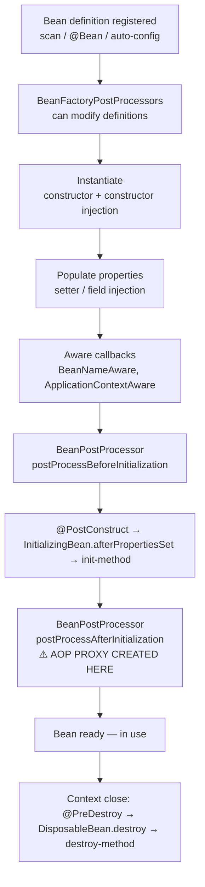
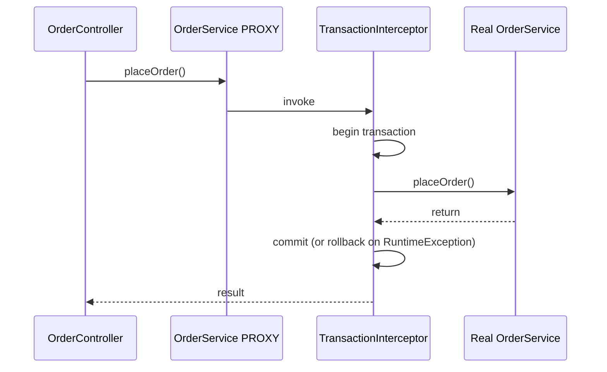

# Beans & Dependency Injection — The Spring Container From the Inside

<!-- sdlc-stage:start -->
<div class="sdlc-stage">

📍 **SDLC stage: Development** · ShopNorth uses this in [Chapter 5 · Building with Spring Boot](/tutorials/journey-05-spring-boot)

</div>
<!-- sdlc-stage:end -->

> Every Spring question ultimately comes back to "what does the container do with your objects?". This page answers that end to end.

---

## Table of Contents

1. The Staffing Agency Analogy
2. IoC and DI — What Problem They Solve
3. Declaring Beans — Stereotypes vs `@Bean`
4. Injection Styles — Constructor vs Setter vs Field
5. Resolving Ambiguity — `@Primary`, `@Qualifier`, Collections
6. Bean Scopes — Singleton, Prototype, Request, Session
7. The Bean Lifecycle — Step by Step
8. Proxies & AOP — Why Your Bean Isn't Your Bean
9. Circular Dependencies — Why Boot Now Forbids Them
10. Practice Assignments (Low / Medium / High)
11. Mini Project — Plugin-Based Notification Engine
12. Interview Corner
13. Quick Reference

---

## 1. The Staffing Agency Analogy

Without Spring, every class **hires its own staff**: `OrderService` does `new PaymentClient()`, `new EmailSender()`, `new OrderRepository(new DataSource(...))`. Each class must know how to build its dependencies, and so do their dependencies.

With Spring, a **staffing agency** (the IoC container) does the hiring:

- Classes just list **what roles they need** in their constructor: "I need a `PaymentGateway` and an `OrderRepository`".
- The agency keeps a **roster** (bean definitions) of who can fill which role.
- It hires each worker **once** by default and shares them (singleton scope), or a fresh one each time if asked (prototype).
- Sometimes the agency sends a **representative** instead of the actual worker — someone who takes notes (transactions, security, metrics) before passing the request on. That's a **proxy**.

**Inversion of Control**: the classes don't control creating their collaborators; the container does.

---

## 2. IoC and DI — What Problem They Solve

❌ Without DI:

```java
public class OrderService {
    private final PaymentGateway gateway = new StripeGateway("sk_live_...");   // hard-wired
    private final OrderRepository repo = new JdbcOrderRepository(DataSources.prod());

    public void place(Order o) { ... }
}
```

- Can't test without calling Stripe and the prod DB.
- Can't switch to Razorpay without editing this class.
- Configuration (keys, URLs) is buried in business code.

✅ With DI:

```java
@Service
public class OrderService {
    private final PaymentGateway gateway;
    private final OrderRepository repo;

    public OrderService(PaymentGateway gateway, OrderRepository repo) {   // "I need these"
        this.gateway = gateway;
        this.repo = repo;
    }
}

// Test: no Spring needed at all
var service = new OrderService(new FakeGateway(), new InMemoryOrderRepository());
```

| Term | Meaning |
|------|---------|
| **IoC** (Inversion of Control) | The *principle*: a framework controls object creation and the flow, not your code |
| **DI** (Dependency Injection) | The *technique*: dependencies are passed in (constructor/setter) instead of created inside |
| **IoC container** | `BeanFactory` (basic) / `ApplicationContext` (full: events, i18n, AOP integration, environment) |
| **Bean** | Any object whose lifecycle the container manages |

---

## 3. Declaring Beans — Stereotypes vs `@Bean`

### Stereotype annotations (component scanning)

| Annotation | Meaning | Extra behavior |
|-----------|---------|----------------|
| `@Component` | Generic Spring-managed class | — |
| `@Service` | Business logic layer | None (semantic only) |
| `@Repository` | Data access layer | **Exception translation** to `DataAccessException` |
| `@Controller` / `@RestController` | Web layer | Handler mapping; `@RestController` = `@Controller` + `@ResponseBody` |
| `@Configuration` | Holds `@Bean` methods | CGLIB-proxied so `@Bean` methods return singletons ("full" mode) |

### `@Bean` methods — for classes you don't own or need to configure

```java
@Configuration
public class HttpClientConfig {

    @Bean
    public RestClient inventoryClient(RestClient.Builder builder, InventoryProperties props) {
        return builder
            .baseUrl(props.baseUrl())
            .requestFactory(new JdkClientHttpRequestFactory())   // configure timeouts here as needed
            .build();
    }
}
```

| Use a stereotype when... | Use `@Bean` when... |
|--------------------------|---------------------|
| It's your own class | Third-party class (`RestClient`, `ObjectMapper`, `Clock`) |
| One obvious way to construct it | Construction needs logic or configuration |
| — | You want several differently configured instances of one type |

<div class="callout-info">

**`@Configuration` vs `@Component` holding `@Bean` methods ("lite mode")**: In a `@Configuration` class, calling another `@Bean` method (`paymentGateway()` inside `orderService()`) returns the **same singleton**, because CGLIB intercepts the call. In lite mode (`@Component`, or `@Configuration(proxyBeanMethods = false)`), it's a plain Java call that creates a **new instance**. Boot's own auto-configs use `proxyBeanMethods = false` for faster startup and pass dependencies as method parameters instead.

</div>

---

## 4. Injection Styles — Constructor vs Setter vs Field

```java
// ✅ Constructor injection (recommended)
@Service
public class InvoiceService {
    private final TaxCalculator tax;
    private final PdfRenderer pdf;

    public InvoiceService(TaxCalculator tax, PdfRenderer pdf) {  // single constructor: @Autowired optional
        this.tax = tax;
        this.pdf = pdf;
    }
}

// ⚠️ Setter injection — for truly optional dependencies
@Autowired(required = false)
public void setMetrics(MeterRegistry metrics) { this.metrics = metrics; }

// ❌ Field injection
@Autowired private TaxCalculator tax;
```

| | Constructor | Setter | Field |
|--|-------------|--------|-------|
| Immutability (`final`) | ✅ | ❌ | ❌ |
| Mandatory deps obvious | ✅ Compiler enforces | ❌ | ❌ |
| Unit test without Spring | ✅ `new X(fakeA, fakeB)` | ⚠️ Must remember setters | ❌ Needs reflection / Spring |
| Reveals too many deps | ✅ A 9-arg constructor *screams* SRP violation | ❌ Hidden | ❌ Hidden |
| Circular deps | Fails fast (good!) | Allowed (hides design issues) | Allowed |
| Optional deps | Use `ObjectProvider<T>` / `Optional<T>` | ✅ Natural | ⚠️ |

<div class="callout-interview">

**Q: "Why is constructor injection preferred?"**

Dependencies can be `final`, so the object is fully initialized and effectively immutable. Required dependencies are explicit and enforced by the compiler. The class is unit-testable with plain `new` and fakes. Circular dependencies fail fast at startup instead of hiding. And a long constructor is an honest signal the class does too much. Field injection hides all of that and ties the class to the container.

</div>

### Optional and lazy dependencies

```java
public ReportService(ObjectProvider<PdfRenderer> pdf) {           // resolved lazily, may be absent
    this.pdf = pdf;
}
void export() {
    pdf.ifAvailable(r -> r.render(...));
}
```

---

## 5. Resolving Ambiguity — `@Primary`, `@Qualifier`, Collections

Spring resolves by **type** first. With two `PaymentGateway` beans, injection fails:

```text
NoUniqueBeanDefinitionException: expected single matching bean but found 2: stripeGateway, razorpayGateway
```

| Strategy | Code | When |
|----------|------|------|
| `@Primary` | `@Primary @Component class StripeGateway` | One sensible default, others used occasionally |
| `@Qualifier` | `public X(@Qualifier("razorpayGateway") PaymentGateway g)` | Specific injection points need a specific bean |
| Custom qualifier annotation | `@Qualifier @Retention(RUNTIME) @interface Domestic {}` | Type-safe instead of magic strings |
| Parameter name matching | `PaymentGateway razorpayGateway` | Works as a fallback (needs the `-parameters` compiler flag, on by default in Boot) — fragile, avoid relying on it |
| **Inject all** | `List<PaymentGateway>` / `Map<String, PaymentGateway>` | Strategy / plugin patterns |

```java
@Service
public class PaymentRouter {
    private final Map<String, PaymentGateway> gatewaysByBeanName;   // key = bean name

    public PaymentRouter(Map<String, PaymentGateway> gateways) {
        this.gatewaysByBeanName = gateways;
    }
    public PaymentGateway forCountry(String country) {
        return gatewaysByBeanName.get(country.equals("IN") ? "razorpayGateway" : "stripeGateway");
    }
}
```

`List<T>` injection respects `@Order` / `Ordered` — useful for filter chains and validators.

<div class="callout-tip">

**Applying this** — Injecting `List<SomeStrategy>` is the idiomatic Spring way to get Open/Closed behavior: adding a new `@Component` implementation extends the system without touching the router. It's exactly how Spring itself collects `HandlerInterceptor`s, `HealthIndicator`s, and `WebMvcConfigurer`s.

</div>

---

## 6. Bean Scopes — Singleton, Prototype, Request, Session

| Scope | Instances | Destroy callbacks? | Typical use |
|-------|-----------|--------------------|-------------|
| `singleton` (default) | **One per container** | ✅ | Stateless services, repositories, clients |
| `prototype` | New one on **every lookup/injection** | ❌ Container forgets it after creation | Stateful, short-lived helpers (builders, per-task state) |
| `request` | One per HTTP request | ✅ | Request-scoped context (tenant, correlation data) |
| `session` | One per HTTP session | ✅ | Shopping cart in a server-side session app |
| `application` | One per `ServletContext` | ✅ | Rare |
| `websocket` | One per WebSocket session | ✅ | Rare |

<div class="callout-warn">

**Singletons are shared by every request thread.** Never keep per-request state in a singleton field: `private Order currentOrder;` in a `@Service` is a race condition. Two users' orders will get mixed up under load. Keep singletons **stateless**, or use thread-safe structures for deliberately shared state.

</div>

### The scoped-bean-in-singleton trap

```java
@Component @Scope("prototype")
class PriceCalculationContext { final List<String> appliedRules = new ArrayList<>(); }

@Service
class PricingService {
    private final PriceCalculationContext ctx;   // ❌ injected ONCE → the same "prototype" forever
    PricingService(PriceCalculationContext ctx) { this.ctx = ctx; }
}
```

The singleton is created once, so its dependency is injected once. Fixes:

```java
// ✅ 1. ObjectProvider — ask for a new one each time
private final ObjectProvider<PriceCalculationContext> ctxProvider;
void price() { var ctx = ctxProvider.getObject(); ... }

// ✅ 2. Scoped proxy — inject a proxy that delegates to the current instance (typical for request scope)
@Component
@RequestScope                      // = @Scope(value="request", proxyMode=ScopedProxyMode.TARGET_CLASS)
class TenantContext { String tenantId; }

// ✅ 3. @Lookup method injection (less common)
```

---

## 7. The Bean Lifecycle — Step by Step



```java
@Component
public class ExchangeRateCache {

    private final RateClient client;
    private volatile Map<String, BigDecimal> rates = Map.of();

    public ExchangeRateCache(RateClient client) { this.client = client; }   // 1. construct + inject

    @PostConstruct                                                           // 2. dependencies ready
    void validate() {
        Objects.requireNonNull(client, "RateClient required");
    }

    @EventListener(ApplicationReadyEvent.class)                             // 3. whole app ready
    void warmUp() { rates = client.fetchAll(); }

    @PreDestroy                                                              // 4. graceful shutdown
    void shutdown() { client.close(); }
}
```

### BeanPostProcessor vs BeanFactoryPostProcessor

| | `BeanFactoryPostProcessor` | `BeanPostProcessor` |
|--|---------------------------|---------------------|
| Works on | Bean **definitions** (metadata), before any bean is created | Bean **instances**, around initialization |
| Example | `PropertySourcesPlaceholderConfigurer` resolves `${...}` | `AutowiredAnnotationBeanPostProcessor`, AOP auto-proxy creator, `@Async` / `@Validated` processors |

<div class="callout-interview">

**Q: "Walk me through the Spring bean lifecycle."**

Definitions are registered and can be modified by `BeanFactoryPostProcessor`s. Then each bean is instantiated through its constructor, with constructor injection; setter and field injection follow, then the Aware callbacks. `BeanPostProcessor`s run before initialization, then the init callbacks: `@PostConstruct`, `afterPropertiesSet`, custom init-method. After-initialization post-processors run next, and that's where AOP proxies are created, so what gets injected elsewhere may be a proxy. On shutdown, `@PreDestroy` and the destroy callbacks run, but not for prototype beans.

</div>

---

## 8. Proxies & AOP — Why Your Bean Isn't Your Bean

When a bean uses `@Transactional`, `@Async`, `@Cacheable`, `@Retryable`, `@PreAuthorize`, or custom aspects, the container wraps it in a **proxy**. Other beans receive the proxy; the proxy runs the extra behavior, then calls your real object.



| Proxy type | Mechanism | Used when |
|-----------|-----------|-----------|
| JDK dynamic proxy | Implements the bean's **interfaces** | Bean implements an interface and `proxyTargetClass=false` |
| CGLIB | **Subclasses** the bean class | Default in Spring Boot (`spring.aop.proxy-target-class=true`) |

Consequences of CGLIB subclassing: `final` classes and `final` methods can't be proxied (their advice silently doesn't apply), and `private` methods are never intercepted.

### The self-invocation trap

```java
@Service
public class ReportService {
    public void generateAll() {
        for (var id : ids) generateOne(id);      // ❌ this.generateOne() — bypasses the proxy
    }

    @Transactional(propagation = Propagation.REQUIRES_NEW)
    public void generateOne(long id) { ... }     // no new transaction is started!
}
```

`this` is the real object, not the proxy, so **no** advice runs. Fixes: move `generateOne` into a separate bean (best), inject a lazy self-reference (`@Lazy ReportService self`), or use `TransactionTemplate` programmatically. Full details in `spring-transactional`.

---

## 9. Circular Dependencies — Why Boot Now Forbids Them

```java
@Service class OrderService   { OrderService(PaymentService p) {...} }
@Service class PaymentService { PaymentService(OrderService o) {...} }
```

```text
The dependencies of some of the beans in the application context form a cycle:
┌─────┐
|  orderService
↑     ↓
|  paymentService
└─────┘
```

- With **constructor injection**, the cycle is impossible to satisfy → startup fails.
- With field/setter injection, Spring *used to* resolve it via "early singleton references" (a three-level cache). **Spring Boot 2.6+ forbids circular references by default** (`spring.main.allow-circular-references=false`).

### Fixing it properly

A cycle almost always means **mixed responsibilities**:

1. **Extract** the shared logic into a third bean both depend on.
2. **Events**: `PaymentService` publishes `PaymentCompletedEvent`; `OrderService` listens (`@EventListener` / `@TransactionalEventListener`). The dependency now points one way.
3. **Invert through an interface** owned by the lower layer.
4. `@Lazy` on one constructor parameter works (injects a lazy proxy) but only hides the design problem.

<div class="callout-scenario">

**Scenario**: After upgrading to Boot 2.6+, a legacy app fails to start with 12 circular-reference cycles. The team proposes setting `spring.main.allow-circular-references=true`. **Decision**: OK as a *temporary* unblocker to finish the upgrade, but track each cycle as tech debt and break them one at a time — usually with events or an extracted service. Cycles make initialization order fragile and are a strong signal of tangled domain boundaries.

</div>

---

## 10. 🏋️ Practice Assignments

### 🟢 Low — Build the reflexes

**L1.** What's printed?

```java
@Component @Scope("prototype") class Counter { int n; }

@Service class A { final Counter c; A(Counter c) { this.c = c; } }
@Service class B { final Counter c; B(Counter c) { this.c = c; } }

// in a test with the context loaded:
System.out.println(ctx.getBean(A.class).c == ctx.getBean(B.class).c);
System.out.println(ctx.getBean(A.class).c == ctx.getBean(A.class).c);
```

<details>
<summary>Show answer</summary>

`false` then `true`. Each injection of a prototype creates a new `Counter`, so A and B hold different instances. But `A` is a singleton: `getBean(A.class)` returns the same `A` both times, which holds the same `Counter`.

</details>

**L2.** Convert to constructor injection and explain one concrete benefit you get in tests:

```java
@Service
public class ShipmentService {
    @Autowired private CarrierClient carrier;
    @Autowired private ShipmentRepository repo;
}
```

<details>
<summary>Show answer</summary>

```java
@Service
public class ShipmentService {
    private final CarrierClient carrier;
    private final ShipmentRepository repo;

    public ShipmentService(CarrierClient carrier, ShipmentRepository repo) {
        this.carrier = carrier;
        this.repo = repo;
    }
}
```

Tests: `new ShipmentService(mock(CarrierClient.class), new InMemoryShipmentRepository())` — no Spring context, no reflection, millisecond tests, and the compiler tells you when a new dependency is added. (Lombok's `@RequiredArgsConstructor` generates the same constructor.)

</details>

**L3.** Which annotation adds exception translation, and what does it translate?

<details>
<summary>Show answer</summary>

`@Repository`. With `PersistenceExceptionTranslationPostProcessor` (auto-configured in Boot), exceptions thrown from `@Repository` beans — JDBC `SQLException`, JPA/Hibernate exceptions — are translated into Spring's unchecked `DataAccessException` hierarchy (`DuplicateKeyException`, `DataIntegrityViolationException`, ...), so services don't depend on vendor-specific exceptions.

</details>

### 🟡 Medium — Apply it

**M1.** You have `EmailSender`, `SmsSender`, and `PushSender` implementing `NotificationSender`. Build a `NotificationService.send(Channel channel, Message m)` that picks the right sender with no `if/else` and fails at **startup** if two senders claim the same channel.

<details>
<summary>Show answer</summary>

```java
public interface NotificationSender {
    Channel channel();
    void send(Message m);
}

@Service
public class NotificationService {
    private final Map<Channel, NotificationSender> senders;

    public NotificationService(List<NotificationSender> all) {
        this.senders = all.stream().collect(Collectors.toMap(
            NotificationSender::channel, s -> s,
            (a, b) -> { throw new IllegalStateException("Duplicate sender for " + a.channel()); },
            () -> new EnumMap<>(Channel.class)));
    }

    public void send(Channel channel, Message m) {
        var sender = senders.get(channel);
        if (sender == null) throw new UnsupportedChannelException(channel);
        sender.send(m);
    }
}
```

The merge function throws during constructor execution, so the context fails to start — config bugs surface at deploy, not at the first message.

</details>

**M2.** A request-scoped `TenantContext` must be available inside a singleton `ReportService`. Show the configuration and explain what actually gets injected.

<details>
<summary>Show answer</summary>

```java
@Component
@RequestScope                                // proxyMode = TARGET_CLASS by default
public class TenantContext {
    private String tenantId;
    // get/set, populated by a filter from the JWT
}

@Service
public class ReportService {
    private final TenantContext tenant;      // a CGLIB proxy, injected once
    public ReportService(TenantContext tenant) { this.tenant = tenant; }
    public Report build() { return repo.findByTenant(tenant.getTenantId()); }  // delegates to the current request's instance
}
```

The singleton receives a **scoped proxy**. Each method call looks up the real `TenantContext` bound to the current request (via `RequestContextHolder`). Calling it outside a request thread (e.g., in an `@Async` method or scheduler) throws `ScopeNotActiveException` — pass the tenant explicitly or propagate the context.

</details>

**M3.** `@Transactional` on a method has no effect. List four possible causes.

<details>
<summary>Show answer</summary>

1. **Self-invocation** — called from another method in the same class, bypassing the proxy.
2. The method is `private` (never proxied), or `final`/in a `final` class (CGLIB can't override it). Spring 6 does support `protected` and package-private methods with class-based proxies.
3. The class isn't a Spring bean (created with `new`), so there's no proxy at all.
4. The exception was **checked** (default rollback is for unchecked only), or it was caught inside the method — the transaction exists but commits.

Bonus: the wrong `@Transactional` import (`jakarta.transaction.Transactional` works, but with different attributes), or multiple transaction managers with the wrong one chosen.

</details>

### 🔴 High — Think like a senior

**H1.** `OrderService` calls `InventoryService.reserve()`, and `InventoryService` calls `OrderService.markBackordered()` when stock is low. Startup fails with a cycle. Propose two designs, with trade-offs.

<details>
<summary>Show answer</summary>

**Design 1 — Domain events (decoupled):** `InventoryService` publishes `StockShortageEvent(orderId, sku)` via `ApplicationEventPublisher`; `OrderService` has `@TransactionalEventListener(phase = AFTER_COMMIT)` (or a plain `@EventListener` for in-transaction handling) that marks the order backordered. The dependency is now one-way (Order → Inventory). Trade-offs: flow is less explicit (harder to trace), and the listener's transactional semantics must be chosen deliberately. It evolves naturally into Kafka events if the services split.

**Design 2 — Return a result instead of calling back:** `reserve()` returns `ReservationResult` (`Reserved | PartiallyReserved | OutOfStock`), and `OrderService` decides to mark the order backordered itself. Simplest; keeps order-state rules inside the order domain. Trade-off: if many modules need to react to a shortage, you'll add events later anyway.

Reject `@Lazy`/`allow-circular-references` as permanent fixes: they keep a bidirectional coupling that makes the modules impossible to separate.

</details>

**H2.** Explain why an `@Async` method declared `final` silently runs synchronously, and design a check that catches this class of bug in CI.

<details>
<summary>Show answer</summary>

Spring Boot proxies with CGLIB, which works by **subclassing** the bean and overriding its methods. A `final` method can't be overridden, so the proxy can't intercept it: the call runs directly on the target, on the caller's thread. Spring only logs this at a low level, so the "async" work quietly becomes synchronous. A `final` **class** fails louder: startup errors with "Cannot subclass final class". (Kotlin classes and methods are `final` by default, which is why the `kotlin-spring` all-open plugin exists.)

CI check: an **ArchUnit** test — "classes with methods annotated `@Async`, `@Transactional`, `@Cacheable`, or `@Retryable` must not be final, and those methods must not be private or final", plus a rule that these methods aren't called from within the same class (harder; SonarQube and some IDE inspections detect self-invocation). Add an integration test asserting that the `@Async` method runs on a thread whose name starts with the executor's prefix.

</details>

---

## 11. 🛠️ Mini Project — Plugin-Based Notification Engine

**Goal**: A Spring Boot app that uses every DI concept on this page in a realistic way. 2 evenings.

**Requirements**

1. `NotificationSender` interface, with `EmailSender`, `SmsSender`, `SlackSender` as `@Component`s. `SlackSender` is only created when `notify.slack.webhook-url` is set (`@ConditionalOnProperty`).
2. `NotificationService` receives `List<NotificationSender>`, builds an `EnumMap<Channel, NotificationSender>`, and fails at startup on duplicates (M1 above).
3. A request-scoped `CorrelationContext` (populated by a `OncePerRequestFilter` from the `X-Correlation-Id` header) injected into the singleton `NotificationService` and included in every log line.
4. A prototype-scoped `NotificationBatch` (collects messages, then flushes), obtained through `ObjectProvider` for each API call.
5. `@Async` sending on a custom `ThreadPoolTaskExecutor` bean (bounded queue, named threads `notify-`), with the correlation id propagated using a `TaskDecorator`.
6. A `@PostConstruct` that logs the registered channels, and a `@PreDestroy` that drains the executor gracefully.
7. Introduce a circular dependency on purpose (`NotificationService` ↔ `TemplateService`), watch Boot fail, then fix it with an event.

**Acceptance criteria**

- Unit tests construct `NotificationService` with fakes (no Spring).
- `@SpringBootTest` verifies Slack is absent without the property and present with it.
- A test proves the `@Async` method runs on a `notify-` thread and the log line contains the correlation id.
- A `README` explaining each scope choice.

**Stretch**: expose `/actuator/beans` and write a short note on how many beans your app has and where they come from (your code vs auto-configuration).

---

## 🎯 Interview Corner

<div class="callout-interview">

**Q: "What is dependency injection, and why does Spring use it?"**

Dependency injection means an object receives its collaborators from outside, usually through its constructor, instead of creating them itself. Spring's IoC container reads bean definitions, builds the object graph in the right order, and manages lifecycles and scopes. The payoff is loose coupling: code depends on interfaces, so implementations can be swapped by configuration. Classes are unit-testable with plain `new` and fakes. And cross-cutting concerns like transactions, security, and metrics can be added through proxies without touching business code. In practice, constructor injection with final fields is the standard.

**Follow-up trap**: "Isn't DI just a factory pattern?" → Related, but with DI the class doesn't even call a factory. It declares its needs and the container assembles everything, which also enables lifecycle management, scoping, and AOP proxying.

</div>

<div class="callout-interview">

**Q: "Singleton bean scope in Spring vs the Singleton design pattern — same thing?"**

No. The GoF Singleton guarantees one instance per classloader, enforced by the class itself with a private constructor and a static accessor. A Spring singleton is one instance **per container, per bean definition**: you can define two beans of the same class with different names and get two instances, and different application contexts each have their own. Spring singletons are ordinary classes the container chooses to share, which keeps them testable. The GoF pattern creates hidden global state that's hard to mock.

</div>

<div class="callout-interview">

**Q: "How would you inject a prototype bean into a singleton so you get a new instance each time?"**

Direct injection doesn't work: the singleton is built once, so it receives one prototype instance and keeps it forever. The options are `ObjectProvider<T>` and calling `getObject()` each time, which is my default; a scoped proxy (`proxyMode = TARGET_CLASS`), which is typical for request or session scope where the proxy resolves the current instance on each call; `@Lookup` method injection; or `javax.inject.Provider`. I'd also ask whether it really needs to be a bean — often a plain `new` or a small factory method is simpler.

</div>

<div class="callout-interview">

**Q: "Your startup fails with a circular dependency after a Spring Boot upgrade. What do you do?"**

Since Boot 2.6, circular references are prohibited by default, and with constructor injection they were never resolvable. I read the cycle in the startup report and treat it as a design problem: usually two services each own part of one responsibility. I break it by extracting the shared logic into a third bean, by replacing the back-call with a domain event (`ApplicationEventPublisher` plus a listener), or by returning a result object so the caller makes the decision. `allow-circular-references=true` or `@Lazy` can unblock an upgrade temporarily, but I'd track them as debt.

</div>

---

## Quick Reference

| Concept | One-Liner |
|---------|-----------|
| IoC / DI | Container creates and wires objects; classes declare needs |
| Stereotypes | `@Component` / `@Service` / `@Repository` (+ exception translation) / `@Controller` |
| `@Bean` | Third-party or custom-built objects in `@Configuration` |
| Injection | Constructor + `final` fields; `ObjectProvider` for optional/lazy |
| Ambiguity | `@Primary` default, `@Qualifier` specific, `List`/`Map` for strategies |
| Singleton | One per container; must be stateless or thread-safe |
| Prototype in singleton | Injected once — use `ObjectProvider` or a scoped proxy |
| Lifecycle | construct → inject → Aware → BPP before → `@PostConstruct` → BPP after (proxy) → `@PreDestroy` |
| Proxies | CGLIB by default; no `final`/`private`; self-invocation bypasses them |
| Circular deps | Forbidden since Boot 2.6; fix with extraction or events |

---

## Related Topics

- `spring-boot-fundamentals` — how auto-configuration registers beans for you
- `spring-transactional` — proxies in action (and the self-invocation trap)
- `java-oop` — composition and DIP, the principles behind DI

> **Spring doesn't make your design good; it makes your design visible. A constructor with nine parameters, a cycle at startup — those are the container telling you the truth.**

---

<!-- journey-link:start -->

<div class="callout-journey">

🛒 **ShopNorth Journey** — ShopNorth puts its @Transactional write in a separate bean on purpose — the proxy only works when calls go through it.

**Continue the story:** [Chapter 5 · Building with Spring Boot](/tutorials/journey-05-spring-boot) · **New here?** [Start the journey](/tutorials/journey-start)

</div>

<!-- journey-link:end -->
