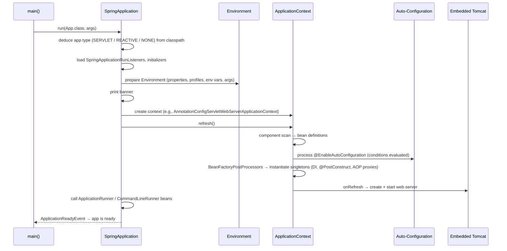

# Spring Boot Fundamentals — How Boot Bootstraps Itself (and How to Explain It)

<!-- sdlc-stage:start -->
<div class="sdlc-stage">

📍 **SDLC stage: Development** · ShopNorth uses this in [Chapter 5 · Building with Spring Boot](/tutorials/journey-05-spring-boot)

</div>
<!-- sdlc-stage:end -->

> You've shipped Boot apps for years; this page is about the *mechanism*, which is what senior interviews probe.

---

## Table of Contents

1. The Furnished Apartment Analogy
2. Spring vs Spring Boot — What Boot Actually Adds
3. `@SpringBootApplication` Unpacked
4. The Startup Sequence — What Happens in `SpringApplication.run()`
5. Auto-Configuration — The Magic, Demystified
6. Starters — Curated Dependencies
7. Externalized Configuration & Property Precedence
8. Profiles — Environment-Specific Behavior
9. Actuator — Production Readiness
10. Embedded Server, Packaging & Startup Performance
11. Practice Assignments (Low / Medium / High)
12. Mini Project — Build Your Own Starter
13. Interview Corner
14. Quick Reference

---

## 1. The Furnished Apartment Analogy

**Plain Spring** is an empty apartment: you choose and assemble every piece of furniture (DataSource, transaction manager, DispatcherServlet, Jackson ObjectMapper, Tomcat) and wire it all together with XML or `@Configuration` classes.

**Spring Boot** is a **furnished apartment with sensible defaults**:

- Move in with a suitcase (`spring-boot-starter-web`) and there's already a bed (Tomcat), a kitchen (Jackson), and lights (logging).
- Bring your **own sofa** (define your own `ObjectMapper` bean) and the landlord's sofa **quietly leaves** — that's `@ConditionalOnMissingBean`.
- The **house rules sheet** on the fridge (`application.yml`) lets you change things without replacing furniture.
- A **building manager** checks the plumbing and electricity on request (Actuator `/health`).

Boot doesn't replace Spring; it's an opinionated way to assemble it.

---

## 2. Spring vs Spring Boot — What Boot Actually Adds

| Concern | Spring Framework | Spring Boot adds |
|---------|------------------|------------------|
| Dependency management | You pick compatible versions | **Starters** + a managed BOM (`spring-boot-dependencies`) |
| Bean configuration | Manual `@Bean`s / XML | **Auto-configuration** with conditional beans |
| Server | Deploy a WAR to an external Tomcat | **Embedded** Tomcat/Jetty/Undertow; `java -jar` |
| Configuration | `@PropertySource` | Rich externalized config, relaxed binding, `@ConfigurationProperties`, profiles |
| Operations | DIY | **Actuator**: health, metrics (Micrometer), info, env |
| Packaging | WAR | Executable fat JAR (nested jars + custom launcher), layered jars, OCI images (`bootBuildImage`) |
| Testing | Spring TestContext | Test slices (`@WebMvcTest`, `@DataJpaTest`), `@SpringBootTest`, Testcontainers integration |

<div class="callout-interview">

**Q: "What's the difference between Spring and Spring Boot?"**

Spring is the framework: the IoC container, DI, AOP, MVC, transactions. Spring Boot sits on top and removes the assembly work. Starters give you curated, version-aligned dependencies; auto-configuration creates sensible default beans based on the classpath and properties, and backs off when you define your own; there's an embedded server so the app runs as a plain `java -jar`; and Actuator provides production endpoints. Boot is convention over configuration for Spring, not a different framework.

</div>

---

## 3. `@SpringBootApplication` Unpacked

```java
@SpringBootApplication
public class OrderServiceApplication {
    public static void main(String[] args) {
        SpringApplication.run(OrderServiceApplication.class, args);
    }
}
```

It's a meta-annotation for three annotations:

| Annotation | What it does |
|-----------|--------------|
| `@SpringBootConfiguration` | A specialized `@Configuration` — this class can declare `@Bean`s; marks the app's primary configuration (tests find it automatically) |
| `@EnableAutoConfiguration` | Imports auto-configuration classes listed in `META-INF/spring/org.springframework.boot.autoconfigure.AutoConfiguration.imports` |
| `@ComponentScan` | Scans the **package of this class and all sub-packages** for `@Component`, `@Service`, `@Repository`, `@Controller`, `@Configuration` |

<div class="callout-warn">

**Package placement matters.** Put the main class in the **root** package (`com.shop.orders`). If it's in `com.shop.orders.app` and your services are in `com.shop.orders.service`, they are **not scanned** — you get `NoSuchBeanDefinitionException` at startup. Same for `@EntityScan` / `@EnableJpaRepositories`, which default to the main class's package.

</div>

---

## 4. The Startup Sequence — What Happens in `SpringApplication.run()`



Hooks you can plug into, in order:

| Hook | When | Typical use |
|------|------|-------------|
| `EnvironmentPostProcessor` | Before the context exists | Load secrets from Vault / a custom config source |
| `ApplicationContextInitializer` | Before refresh | Register property sources programmatically |
| `@PostConstruct` / `InitializingBean` | After a bean's dependencies are injected | Validate the bean's own config |
| `CommandLineRunner` / `ApplicationRunner` | After the context starts | One-time startup tasks (warm a cache, seed dev data) |
| `@EventListener(ApplicationReadyEvent.class)` | App fully ready | Register with a service registry, start consumers |

<div class="callout-tip">

**Applying this** — Don't start Kafka consumers or schedulers doing heavy work in `@PostConstruct`: other beans may not be ready, and a failure there aborts startup with a confusing stack trace. Use `ApplicationReadyEvent` or `SmartLifecycle` (which also gives you ordered, graceful **shutdown**).

</div>

---

## 5. Auto-Configuration — The Magic, Demystified

Auto-configuration is **just `@Configuration` classes with conditions**. Here's a simplified version of what Boot ships for `DataSource`:

```java
@AutoConfiguration(before = SqlInitializationAutoConfiguration.class)
@ConditionalOnClass({ DataSource.class, EmbeddedDatabaseType.class })   // only if JDBC is on the classpath
@EnableConfigurationProperties(DataSourceProperties.class)               // binds spring.datasource.*
public class DataSourceAutoConfiguration {

    @Bean
    @ConditionalOnMissingBean(DataSource.class)                          // back off if you defined one
    @ConditionalOnProperty(prefix = "spring.datasource", name = "url")
    public HikariDataSource dataSource(DataSourceProperties props) {
        return props.initializeDataSourceBuilder().type(HikariDataSource.class).build();
    }
}
```

### The condition annotations you should know

| Condition | Activates when |
|-----------|----------------|
| `@ConditionalOnClass` / `@ConditionalOnMissingClass` | A class is (or isn't) on the classpath |
| `@ConditionalOnBean` / `@ConditionalOnMissingBean` | A bean of a type exists (or doesn't) |
| `@ConditionalOnProperty` | A property has a value (`havingValue`, `matchIfMissing`) |
| `@ConditionalOnWebApplication` | Servlet or reactive web app |
| `@ConditionalOnResource` | A file exists on the classpath |
| `@ConditionalOnExpression` | A SpEL expression is true |

### How are auto-configurations discovered?

- **Boot 2.7+/3.x**: each JAR lists its classes in `META-INF/spring/org.springframework.boot.autoconfigure.AutoConfiguration.imports`.
- **Boot ≤ 2.6**: `META-INF/spring.factories` under the `EnableAutoConfiguration` key (removed for auto-config in Boot 3).
- User-defined beans are processed **before** auto-configurations, which is why `@ConditionalOnMissingBean` sees your beans and backs off.

### Debugging: "why did (or didn't) this bean get created?"

```bash
java -jar app.jar --debug                           # prints the CONDITIONS EVALUATION REPORT
# or with Actuator:
curl localhost:8080/actuator/conditions
```

The report lists **Positive matches** (applied, and why) and **Negative matches** (skipped, and which condition failed).

```java
// Excluding an auto-configuration you don't want
@SpringBootApplication(exclude = { DataSourceAutoConfiguration.class })
// or: spring.autoconfigure.exclude=org.springframework.boot.autoconfigure.jdbc.DataSourceAutoConfiguration
```

<div class="callout-scenario">

**Scenario**: You add `spring-boot-starter-data-jpa` to a service that only reads from Kafka, and startup fails with `Failed to configure a DataSource: 'url' attribute is not specified`. **Answer**: Adding the starter put JDBC/Hibernate on the classpath, so `DataSourceAutoConfiguration` activated and found no URL. Either remove the dependency (best — you didn't need it), configure `spring.datasource.url`, or exclude the auto-configuration. The lesson: **in Boot, the classpath is configuration**.

</div>

---

## 6. Starters — Curated Dependencies

A starter is an (almost) empty JAR whose POM pulls in a tested set of dependencies.

| Starter | Brings in |
|---------|-----------|
| `spring-boot-starter-web` | Spring MVC, embedded Tomcat, Jackson, validation hooks |
| `spring-boot-starter-webflux` | WebFlux, Reactor Netty |
| `spring-boot-starter-data-jpa` | Hibernate, Spring Data JPA, HikariCP, `spring-jdbc` |
| `spring-boot-starter-security` | Spring Security (and **secures every endpoint by default**!) |
| `spring-boot-starter-actuator` | Actuator + Micrometer |
| `spring-boot-starter-test` | JUnit 5, Mockito, AssertJ, Spring Test, JSONassert |
| `spring-boot-starter-validation` | Hibernate Validator (Bean Validation) |

The parent POM / BOM pins compatible versions, so you don't write `<version>` for managed dependencies. Override one with a property (`<jackson-bom.version>`) only when you must (e.g., a CVE fix), and test it.

<div class="callout-info">

Naming convention: official starters are `spring-boot-starter-*`; third-party ones should be `*-spring-boot-starter` (e.g., `mybatis-spring-boot-starter`). Swap the server by excluding `spring-boot-starter-tomcat` and adding `spring-boot-starter-jetty`.

</div>

---

## 7. Externalized Configuration & Property Precedence

The same JAR runs in dev, QA, and prod — configuration comes from outside. Simplified precedence, **highest first**:

| # | Source |
|---|--------|
| 1 | Devtools global settings (dev only) |
| 2 | `@TestPropertySource` / `@SpringBootTest(properties=...)` in tests |
| 3 | **Command-line args** `--server.port=9090` |
| 4 | `SPRING_APPLICATION_JSON` |
| 5 | Servlet init params / JNDI |
| 6 | Java system properties `-Dserver.port=9090` |
| 7 | **OS environment variables** `SERVER_PORT=9090` |
| 8 | Profile-specific files **outside** the jar (`./config/application-prod.yml`) |
| 9 | `application.yml` outside the jar |
| 10 | Profile-specific files **inside** the jar (`application-prod.yml`) |
| 11 | `application.yml` inside the jar |
| 12 | `@PropertySource` on `@Configuration` classes |
| 13 | Defaults (`SpringApplication.setDefaultProperties`) |

The rule of thumb: **more specific and closer to deployment wins**. That's why Kubernetes env vars override what's baked into the jar.

### Relaxed binding

`spring.datasource.hikari.maximum-pool-size` can be set as `SPRING_DATASOURCE_HIKARI_MAXIMUMPOOLSIZE` (env var), `--spring.datasource.hikari.maximum-pool-size=20`, or camelCase in YAML.

### Type-safe configuration — prefer this over `@Value`

```java
@ConfigurationProperties(prefix = "payment.gateway")
@Validated
public record PaymentGatewayProperties(
        @NotBlank String baseUrl,
        @NotNull Duration connectTimeout,         // "2s", "500ms" parsed automatically
        @Min(1) @Max(10) int maxRetries,
        Map<String, String> merchantIds) {}

@SpringBootApplication
@ConfigurationPropertiesScan
public class App { ... }
```

```yaml
payment:
  gateway:
    base-url: https://api.gateway.example
    connect-timeout: 2s
    max-retries: 3
    merchant-ids:
      IN: m_123
      US: m_456
```

| | `@Value("${x}")` | `@ConfigurationProperties` |
|--|------------------|---------------------------|
| Grouping | One property at a time | Whole hierarchy as one object |
| Validation | ❌ | ✅ `@Validated` fails startup on bad config |
| Relaxed binding | Limited | Full |
| IDE metadata / autocomplete | ❌ | ✅ with `spring-boot-configuration-processor` |
| SpEL | ✅ | ❌ |

<div class="callout-tip">

**Applying this** — Fail fast on bad config. A `@Validated` properties record that rejects a missing `baseUrl` at startup beats discovering it on the first payment at 2 AM. And never commit secrets to `application.yml` — use env vars injected from a secret store, or Spring Cloud Vault / AWS Secrets Manager via `spring.config.import`.

</div>

---

## 8. Profiles — Environment-Specific Behavior

```yaml
# application.yml — shared defaults
spring:
  application:
    name: order-service
server:
  port: 8080
---
spring:
  config:
    activate:
      on-profile: dev
  datasource:
    url: jdbc:postgresql://localhost:5432/orders
logging:
  level:
    com.shop: DEBUG
---
spring:
  config:
    activate:
      on-profile: prod
  datasource:
    url: ${DB_URL}          # injected by the platform
```

Activate with `SPRING_PROFILES_ACTIVE=prod` or `--spring.profiles.active=prod`.

```java
@Configuration
@Profile("!prod")                  // everything except prod
class DevDataSeeder {
    @Bean CommandLineRunner seed(OrderRepository repo) { return args -> repo.saveAll(sampleOrders()); }
}
```

<div class="callout-warn">

**Profiles are for environment *configuration*, not for business logic.** `if (env.acceptsProfiles("prod"))` sprinkled in services is a smell — the code that runs in QA is no longer the code that runs in prod. Put behavior differences behind properties or feature flags (`payment.mode=sandbox`) that you can test in every environment.

</div>

Profile groups (Boot 2.4+) bundle profiles: `spring.profiles.group.prod=prod-db,prod-mq`.

---

## 9. Actuator — Production Readiness

```yaml
management:
  endpoints:
    web:
      exposure:
        include: health,info,metrics,prometheus
  endpoint:
    health:
      probes:
        enabled: true            # /actuator/health/liveness and /readiness for Kubernetes
      show-details: when-authorized
  server:
    port: 9091                   # separate management port, not exposed publicly
```

| Endpoint | Use |
|----------|-----|
| `/actuator/health` (+ `/liveness`, `/readiness`) | Load balancer and Kubernetes probes |
| `/actuator/metrics`, `/actuator/prometheus` | Micrometer metrics (JVM, HTTP latency, Hikari pool, custom) |
| `/actuator/info` | Build version, git commit |
| `/actuator/env`, `/configprops` | Resolved configuration (values are sanitized) |
| `/actuator/loggers` | Change log levels at runtime, without a restart |
| `/actuator/conditions` | Auto-configuration report |
| `/actuator/threaddump`, `/heapdump` | Diagnostics — **dangerous if exposed** |

### A custom health indicator

```java
@Component
class PaymentGatewayHealthIndicator implements HealthIndicator {
    private final PaymentGatewayClient client;
    PaymentGatewayHealthIndicator(PaymentGatewayClient client) { this.client = client; }

    @Override public Health health() {
        return client.ping()
            ? Health.up().withDetail("latencyMs", client.lastLatencyMs()).build()
            : Health.down().withDetail("reason", "ping failed").build();
    }
}
```

<div class="callout-scenario">

**Scenario**: The payment gateway has a 5-minute outage. Your readiness probe includes the gateway health check, so Kubernetes marks **all** pods not-ready and the whole service returns 503 — even the order-history endpoints that don't touch payments. **Decision**: Liveness should check only "is this process healthy" (no external dependencies). Readiness should include only dependencies without which the pod is *useless* (usually its own database). Degrade gracefully for optional dependencies and monitor them via metrics and alerts instead of probes.

</div>

<div class="callout-warn">

Exposing `heapdump`, `env`, or `threaddump` publicly has caused real data breaches (heap dumps contain tokens and passwords). Expose only `health`/`info`/`prometheus`, put the management port on an internal network, and secure the rest with Spring Security.

</div>

---

## 10. Embedded Server, Packaging & Startup Performance

### The executable JAR

```text
order-service.jar
 ├─ META-INF/MANIFEST.MF    Main-Class: org.springframework.boot.loader.launch.JarLauncher
 │                          Start-Class: com.shop.orders.OrderServiceApplication
 ├─ BOOT-INF/classes/       your code + application.yml
 ├─ BOOT-INF/lib/           dependency jars (nested)
 └─ org/springframework/boot/loader/   the launcher that can read nested jars
```

The standard JDK classloader can't load classes from jars nested inside a jar; Boot's `JarLauncher` can. **Layered jars** (`java -Djarmode=tools -jar app.jar extract --layers`, or `layertools` on older versions) split dependencies from app code so Docker caches the big dependency layer — see `docker-spring-boot`.

### Startup-time levers

| Lever | Effect |
|-------|--------|
| Fewer starters / exclude unused auto-configs | Less classpath scanning and fewer beans |
| `spring.main.lazy-initialization=true` | Faster start, but errors show up on first request instead of at boot |
| Class Data Sharing (CDS), Boot 3.3+ | 20-40% faster JVM startup |
| GraalVM native image (`spring-boot-starter-parent` + `native` profile) | ~50-100 ms startup, low memory; slower builds; reflection needs hints |
| Virtual threads, Boot 3.2+ (`spring.threads.virtual.enabled=true`, Java 21) | Not faster startup, but high concurrency for blocking I/O without large thread pools |

---

## 11. 🏋️ Practice Assignments

### 🟢 Low — Build the reflexes

**L1.** Your main class is `com.acme.app.Application` and your controller is `com.acme.web.OrderController`. The endpoint returns 404. Why? Give two fixes.

<details>
<summary>Show answer</summary>

`@ComponentScan` scans only `com.acme.app` and its sub-packages; `com.acme.web` is a sibling, so the controller is never registered. Fix 1 (preferred): move `Application` to `com.acme`. Fix 2: `@SpringBootApplication(scanBasePackages = "com.acme")`.

</details>

**L2.** `server.port` is set to 8080 in `application.yml`, the env var `SERVER_PORT=9000`, and the app is started with `--server.port=7000`. Which port wins?

<details>
<summary>Show answer</summary>

**7000** — command-line arguments beat OS environment variables, which beat `application.yml` inside the jar.

</details>

**L3.** Name the three annotations inside `@SpringBootApplication` and one job of each.

<details>
<summary>Show answer</summary>

`@SpringBootConfiguration` (a `@Configuration`: declares beans and marks the primary config for tests), `@EnableAutoConfiguration` (imports conditional auto-config classes from the `AutoConfiguration.imports` files), `@ComponentScan` (registers stereotype-annotated classes in the main class's package tree).

</details>

### 🟡 Medium — Apply it

**M1.** Replace these scattered `@Value`s with a validated, type-safe configuration and make the app fail at startup if `apiKey` is missing:

```java
@Value("${sms.provider.url}") String url;
@Value("${sms.provider.api-key}") String apiKey;
@Value("${sms.provider.timeout-ms:3000}") int timeoutMs;
```

<details>
<summary>Show answer</summary>

```java
@ConfigurationProperties(prefix = "sms.provider")
@Validated
public record SmsProviderProperties(
        @NotBlank @URL String url,
        @NotBlank String apiKey,
        @DefaultValue("3s") Duration timeout) {}
```

Register it with `@ConfigurationPropertiesScan` (or `@EnableConfigurationProperties(SmsProviderProperties.class)`), and add `spring-boot-starter-validation`. A missing `api-key` produces a clear `BindValidationException` at startup. Rename the property to `timeout: 3s` — `Duration` binding is clearer than `-ms` suffixes. (`@URL` is Hibernate Validator's.)

</details>

**M2.** You define your own `ObjectMapper` bean with `@Bean ObjectMapper objectMapper()`, and suddenly dates serialize as timestamps and `spring.jackson.*` properties stop working. Why, and what's the better approach?

<details>
<summary>Show answer</summary>

`JacksonAutoConfiguration`'s `ObjectMapper` is `@ConditionalOnMissingBean`, so yours **replaced** it completely, including Boot's customizations (JavaTimeModule settings, `spring.jackson.*` binding). Better: customize instead of replace, using a `Jackson2ObjectMapperBuilderCustomizer` bean (Boot 3.x) or `spring.jackson.*` properties. This is the general Boot principle: prefer **customizers** over replacing auto-configured beans.

</details>

**M3.** Write a custom `HealthIndicator` for a downstream "fraud-scoring" service, and decide whether it belongs in liveness, readiness, or neither.

<details>
<summary>Show answer</summary>

```java
@Component("fraudScoring")
class FraudScoringHealthIndicator implements HealthIndicator {
    private final FraudClient client;
    FraudScoringHealthIndicator(FraudClient client) { this.client = client; }
    public Health health() {
        try {
            client.ping(Duration.ofMillis(300));   // short timeout: probes must be fast
            return Health.up().build();
        } catch (Exception e) {
            return Health.down(e).build();
        }
    }
}
```

**Neither** probe group, if orders can proceed with a fallback (e.g., queue them for manual review). Keep it in the overall `/health` for dashboards, but configure `management.endpoint.health.group.readiness.include=readinessState,db` so a fraud-service outage doesn't take every pod out of rotation.

</details>

### 🔴 High — Think like a senior

**H1.** Your company has 40 Boot microservices, and each copies the same config for logging format, tracing, a security filter, a standard error handler, and an HTTP client with retries. How do you standardize this?

<details>
<summary>Show answer</summary>

Build an internal **starter** (`acme-platform-spring-boot-starter`) = an autoconfigure module + a starter POM:

- `@AutoConfiguration` classes for the error handler (`@RestControllerAdvice` → ProblemDetail), the tracing/MDC filter, a pre-configured `RestClient.Builder` with timeouts and a Resilience4j retry, and the JSON logging config.
- Every bean guarded with `@ConditionalOnMissingBean` (teams can override) and a feature switch `@ConditionalOnProperty(prefix="acme.platform.x", name="enabled", matchIfMissing=true)`.
- `@ConfigurationProperties` with metadata so teams get IDE autocomplete.
- Register the classes in `META-INF/spring/...AutoConfiguration.imports`.
- A platform BOM (importing `spring-boot-dependencies`) to pin versions fleet-wide.
- Test with `ApplicationContextRunner` (fast, no server) for each condition.
- Version it, publish release notes, and roll out via Renovate/Dependabot.

Trade-off: a central dependency is a coupling point. Keep it small and backwards-compatible, and never put business logic in it.

</details>

**H2.** A Boot 3 service takes 45 seconds to start in Kubernetes, and pods get killed during rollouts. Walk through diagnosis and fixes.

<details>
<summary>Show answer</summary>

**Immediate**: configure a `startupProbe` (e.g., `failureThreshold × periodSeconds` > the worst-case startup) so liveness doesn't kill slow-starting pods, and check the CPU **request** — throttled CPU during startup is the #1 cause (the JIT and class loading are CPU-heavy).

**Diagnose**: enable `BufferingApplicationStartup` and read `/actuator/startup` to see which beans take the time; check `--debug` for surprising auto-configs; look for blocking work in `@PostConstruct` (cache warmups, remote calls, Flyway migrations on a big schema).

**Fix**: move heavy warmup off the critical path (`ApplicationReadyEvent`, async), run migrations as a separate job, exclude unused auto-configurations and starters, and enable CDS (Boot 3.3+). Consider a GraalVM native image for scale-to-zero workloads (with its own trade-offs: build time, reflection config, and peak throughput sometimes lower than a JIT-warmed JVM).

</details>

---

## 12. 🛠️ Mini Project — Build Your Own Starter

**Goal**: Understand auto-configuration by *writing* one. You'll build `audit-log-spring-boot-starter`, which automatically logs every `@Auditable` method call. 2 evenings.

**Modules**

```text
audit-starter/
 ├─ audit-autoconfigure/     @AutoConfiguration, properties, aspect
 ├─ audit-spring-boot-starter/   POM only: depends on autoconfigure + spring-boot-starter-aop
 └─ demo-app/                uses the starter, has @Auditable methods
```

**Requirements**

1. `@Auditable(action = "ORDER_CANCELLED")` annotation for methods.
2. An `AuditAspect` (`@Around`) records action, user (from `SecurityContextHolder` if present, else "system"), args (masked by a configurable list of field names), duration, and outcome.
3. `AuditSink` interface with a default `LoggingAuditSink`; `@ConditionalOnMissingBean(AuditSink.class)` so apps can provide a `KafkaAuditSink`.
4. `AuditProperties`: `audit.enabled` (default true), `audit.masked-fields` (default `password,cardNumber`).
5. The whole auto-configuration is `@ConditionalOnProperty(prefix = "audit", name = "enabled", matchIfMissing = true)` and `@ConditionalOnClass(Aspect.class)`.
6. Register it in `META-INF/spring/org.springframework.boot.autoconfigure.AutoConfiguration.imports`.

**Acceptance criteria**

- `ApplicationContextRunner` tests: the sink is created by default; a user-defined sink replaces it; `audit.enabled=false` creates nothing.
- The demo app shows audit lines on `POST /orders/{id}/cancel` with the card number masked.
- `--debug` output shows your auto-configuration in *Positive matches*.

**Stretch**: add a custom Actuator endpoint `/actuator/audit` (`@Endpoint(id = "audit")`) returning the last 50 audit events from an in-memory ring buffer.

---

## 🎯 Interview Corner

<div class="callout-interview">

**Q: "How does Spring Boot auto-configuration work internally?"**

`@SpringBootApplication` includes `@EnableAutoConfiguration`, which uses an import selector to load every class listed in the `META-INF/spring/org.springframework.boot.autoconfigure.AutoConfiguration.imports` files on the classpath — that's the Boot 3 mechanism, replacing `spring.factories`. Each is an ordinary `@Configuration` class guarded by conditions: `@ConditionalOnClass` to check a library is present, `@ConditionalOnMissingBean` to back off if the user defined their own bean, and `@ConditionalOnProperty` for toggles. User configuration is processed first, so user beans always win. When something unexpected happens, I run with `--debug` or check `/actuator/conditions` to see exactly which conditions matched.

**Follow-up trap**: "What if two auto-configurations depend on each other's beans?" → Ordering is controlled with `@AutoConfiguration(before/after = ...)`, which is why `@ConditionalOnBean` is only reliable in auto-configurations ordered after the one that defines the bean.

</div>

<div class="callout-interview">

**Q: "How do you manage configuration across dev, QA, and prod for the same artifact?"**

I build one immutable artifact and inject environment differences from outside. Shared defaults live in `application.yml`; environment specifics come from profile-specific files or, better in Kubernetes, from environment variables and ConfigMaps, which have higher precedence. Secrets come from a secret manager, never from the repo. I bind configuration into validated `@ConfigurationProperties` records so a bad value fails at startup rather than at runtime. And I keep profiles for configuration only: behavioral differences go behind explicit properties or feature flags, so the code path tested in QA is the one that runs in prod.

</div>

<div class="callout-interview">

**Q: "What does Actuator give you, and how do you secure it?"**

Health endpoints (including Kubernetes liveness and readiness groups), Micrometer metrics exported to Prometheus, info with build and git details, runtime log-level changes, and diagnostics like thread dumps and the conditions report. For security, I expose only what's needed over HTTP — typically health, info, and prometheus — run the management endpoints on a separate port that isn't routed publicly, and put anything sensitive behind Spring Security with an ops role. I never expose `heapdump` or `env` publicly, since heap dumps contain credentials and tokens.

**Follow-up trap**: "Should the DB be in the liveness probe?" → No. If the DB is down, restarting the pod doesn't help and causes restart storms. The DB belongs in readiness at most; liveness only checks the process itself.

</div>

<div class="callout-interview">

**Q: "Your Spring Boot app fails at startup with 'No qualifying bean'. How do you troubleshoot?"**

First I read which type and injection point failed. Then I check the usual causes: the class is outside the component-scan base package, it's missing a stereotype annotation, it's guarded by a `@Profile` or `@Conditional` that isn't active, there are two candidates without a `@Primary` or `@Qualifier`, or an auto-configuration backed off because I defined a similar bean. `--debug` shows the auto-configuration conditions, and `/actuator/beans` in a running app lists what actually exists. In tests, a slice like `@WebMvcTest` deliberately loads only web beans, so services must be mocked with `@MockitoBean`.

</div>

---

## Quick Reference

| Concept | One-Liner |
|---------|-----------|
| Boot vs Spring | Boot = starters + auto-config + embedded server + Actuator on top of Spring |
| `@SpringBootApplication` | `@SpringBootConfiguration` + `@EnableAutoConfiguration` + `@ComponentScan` |
| Scan base | Main class's package and below |
| Auto-config | Conditional `@Configuration` classes listed in `AutoConfiguration.imports` |
| Back-off | `@ConditionalOnMissingBean` — your bean wins |
| Debug | `--debug` or `/actuator/conditions` |
| Precedence | CLI args > env vars > external files > files in the jar |
| Type-safe config | `@ConfigurationProperties` + `@Validated` records |
| Profiles | Config per environment, not business logic |
| Probes | Liveness = process only; readiness = critical dependencies |
| Actuator security | Expose health/info/prometheus only; separate management port |
| Fat jar | Nested jars + `JarLauncher`; layered for Docker |

---

## Related Topics

- `spring-beans-di` — the container underneath Boot
- `spring-transactional` — how Boot's auto-configured transaction manager is used
- `docker-spring-boot` — packaging the jar into containers

> **Spring Boot isn't magic — it's conditional configuration driven by your classpath. Once you can read the conditions report, there's nothing left to be surprised by.**

---

<!-- journey-link:start -->

<div class="callout-journey">

🛒 **ShopNorth Journey** — ShopNorth's order service is a Spring Boot app: profiles, configuration properties, Actuator health probes, and graceful shutdown.

**Continue the story:** [Chapter 5 · Building with Spring Boot](/tutorials/journey-05-spring-boot) · **New here?** [Start the journey](/tutorials/journey-start)

</div>

<!-- journey-link:end -->
