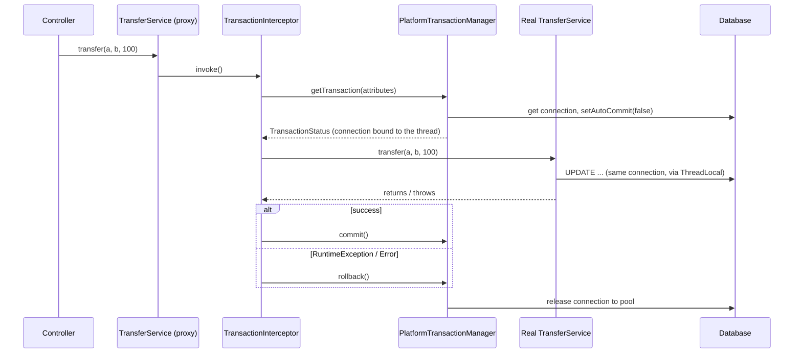
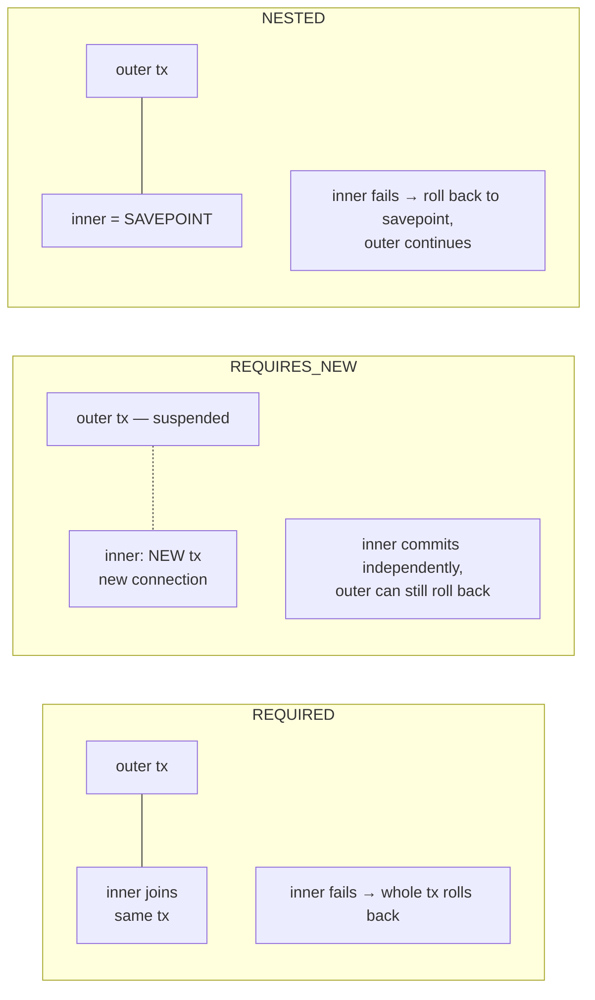

# @Transactional — Propagation, Isolation, and the Traps That Lose Money

> If you're asked one "senior" Spring question, it's likely this one. The traps here cause real production incidents: double charges, lost updates, and phantom data.

---

## Table of Contents

1. The Bank Teller Analogy
2. ACID in 90 Seconds
3. How `@Transactional` Works — The Proxy
4. Rollback Rules
5. Propagation — All 7, and the 3 You'll Actually Use
6. Isolation Levels & Concurrency Anomalies
7. `readOnly`, Timeouts, and Connection Pools
8. The Classic Traps (Self-Invocation & Friends)
9. Transactions + Events + External Calls
10. Optimistic vs Pessimistic Locking
11. Practice Assignments (Low / Medium / High)
12. Mini Project — Wallet Transfer Service
13. Interview Corner
14. Quick Reference

---

## 1. The Bank Teller Analogy

You ask a teller to move ₹10,000 from savings to checking. The teller:

1. Opens a **ledger page** (begin transaction).
2. Writes "savings −10,000".
3. Writes "checking +10,000".
4. **Signs** the page (commit).

If the power fails after step 2, the unsigned page is **torn out** (rollback). You never end up with money deducted but not deposited.

Now add complexity:

- **Propagation** — the teller calls a colleague to stamp a fee receipt. Does the colleague write on the **same ledger page** (REQUIRED), or start **their own page** that's signed separately even if yours is torn out (REQUIRES_NEW)?
- **Isolation** — while you're writing, can another teller **read your unsigned entries**? Can they see the balance change halfway through their own work?

---

## 2. ACID in 90 Seconds

| Property | Guarantee | Who provides it |
|----------|-----------|-----------------|
| **Atomicity** | All or nothing | Database (undo log / WAL) |
| **Consistency** | Constraints hold before and after (FKs, uniqueness, checks) | Database + your code |
| **Isolation** | Concurrent transactions don't see each other's partial work (to a configurable degree) | Database (locks / MVCC) |
| **Durability** | Committed = survives a crash | Database (WAL flushed to disk) |

`@Transactional` doesn't implement any of this. It **demarcates** a transaction boundary: it tells Spring *when* to call `begin`, `commit`, and `rollback` on the underlying resource (JDBC connection, JPA `EntityManager`).

---

## 3. How `@Transactional` Works — The Proxy



Key facts:

- The transaction is bound to the **current thread** (`TransactionSynchronizationManager` uses `ThreadLocal`s). Work started on **another thread** (`@Async`, `CompletableFuture.supplyAsync`, parallel streams) is **not** in your transaction.
- Spring Boot auto-configures `JpaTransactionManager` (with JPA) or `DataSourceTransactionManager` (plain JDBC).
- Spring Data repository methods are themselves transactional (`SimpleJpaRepository` is annotated `@Transactional(readOnly = true)`, with write methods overriding that).

---

## 4. Rollback Rules

| Thrown from the method | Default behavior |
|------------------------|------------------|
| `RuntimeException` (unchecked) | **Rollback** |
| `Error` | **Rollback** |
| Checked `Exception` | **COMMIT** ⚠️ |
| Exception caught inside the method | Nothing — the proxy never sees it → **commit** |

```java
@Transactional(rollbackFor = Exception.class)                    // roll back on checked too
@Transactional(noRollbackFor = NotificationFailedException.class) // commit despite this one
```

<div class="callout-warn">

**The checked-exception commit is the #1 surprise.** A method that debits an account, then throws a checked `InsufficientFundsException`, **commits the debit**. The rule was inherited from EJB conventions (checked = "business outcome", unchecked = "system failure"). Make domain exceptions unchecked, or set `rollbackFor` explicitly.

</div>

### "Transaction silently rolled back because it has been marked as rollback-only"

```java
@Transactional
public void placeOrder(Order o) {
    orderRepo.save(o);
    try {
        loyaltyService.addPoints(o);   // @Transactional (REQUIRED) → joins OUR transaction
    } catch (RuntimeException e) {     // loyalty failed → the SHARED transaction is marked rollback-only
        log.warn("Loyalty failed, continuing");
    }
}   // commit attempted → UnexpectedRollbackException 💥 — and the order is NOT saved
```

When an inner `REQUIRED` method throws past its proxy, it marks the **whole** physical transaction rollback-only; catching the exception outside can't undo that. If loyalty really is optional, run it in `REQUIRES_NEW` (its own transaction), or after commit (section 9).

---

## 5. Propagation — All 7, and the 3 You'll Actually Use

Propagation answers: *"A transactional method is called — what if a transaction already exists?"*

| Propagation | Existing transaction | No transaction | Use case |
|-------------|---------------------|----------------|----------|
| **REQUIRED** (default) | Join it | Create a new one | 95% of methods |
| **REQUIRES_NEW** | **Suspend** it, start an independent one | Create a new one | Audit logs, outbox writes, retry counters that must persist even if the caller rolls back |
| **MANDATORY** | Join it | ❌ Throw | Methods that must never run standalone (repository helpers that assume a caller's transaction) |
| SUPPORTS | Join it | Run without | Read methods that don't care |
| NOT_SUPPORTED | Suspend it, run without | Run without | Long read-only/reporting calls that shouldn't hold a transaction |
| NEVER | ❌ Throw | Run without | Guard: "must not be called inside a transaction" |
| **NESTED** | **Savepoint** inside the existing one | Create a new one | Partial rollback within one physical transaction (JDBC `DataSourceTransactionManager`; JPA doesn't support savepoints this way) |

### REQUIRED vs REQUIRES_NEW vs NESTED — visualized



### REQUIRES_NEW for an audit trail

```java
@Service
public class AuditService {
    @Transactional(propagation = Propagation.REQUIRES_NEW)
    public void record(String action, String entityId, String outcome) {
        auditRepo.save(new AuditEntry(action, entityId, outcome, Instant.now()));
    }
}

@Service
public class RefundService {
    private final AuditService audit;     // a DIFFERENT bean → the call goes through the proxy

    @Transactional
    public void refund(String orderId) {
        audit.record("REFUND_ATTEMPT", orderId, "STARTED");   // committed immediately, independently
        paymentGateway.refund(orderId);                        // throws → refund rolls back...
    }                                                           // ...but the audit row survives
}
```

<div class="callout-warn">

**REQUIRES_NEW uses a second connection** while the first is suspended (still held). Under load, if every request holds 2 connections and the pool has 10, 10 concurrent requests can **deadlock the pool**: each holds one connection and waits for a second. Size pools with this in mind, and use REQUIRES_NEW sparingly.

</div>

<div class="callout-interview">

**Q: "REQUIRED vs REQUIRES_NEW?"**

REQUIRED joins the caller's transaction, so everything commits or rolls back together, and an inner failure dooms the whole thing. REQUIRES_NEW suspends the caller's transaction and runs in a brand-new one on a separate connection, committing independently. It's what you want for audit or outbox records that must persist even if the business operation fails. The costs are a second pooled connection per call, and that the inner transaction can't see the outer one's uncommitted changes.

</div>

---

## 6. Isolation Levels & Concurrency Anomalies

### The anomalies

| Anomaly | What happens | Example |
|---------|--------------|---------|
| **Dirty read** | Read another transaction's **uncommitted** data | T2 reads balance 0 that T1 wrote but later rolled back |
| **Non-repeatable read** | Same row read twice gives **different values** | T1 reads price ₹500, T2 updates and commits ₹600, T1 reads ₹600 |
| **Phantom read** | Same query returns **different rows** | `COUNT(*) WHERE status='PENDING'` changes because T2 inserted a row |
| **Lost update** | Two read-modify-write cycles; one overwrites the other | Both read stock=10, both write 9 → one sale lost |
| **Write skew** | Two transactions read overlapping data, write disjoint rows, jointly violate a rule | Two on-call doctors both go off-call because each saw the other still on call |

### The levels

| Isolation | Dirty read | Non-repeatable | Phantom | Notes |
|-----------|:---:|:---:|:---:|-------|
| READ_UNCOMMITTED | ⚠️ possible | ⚠️ | ⚠️ | PostgreSQL treats it as READ COMMITTED |
| **READ_COMMITTED** | ✅ prevented | ⚠️ | ⚠️ | **Default: PostgreSQL, Oracle, SQL Server** |
| **REPEATABLE_READ** | ✅ | ✅ | ⚠️ standard / ✅ in PG & InnoDB (mostly) | **Default: MySQL InnoDB** |
| SERIALIZABLE | ✅ | ✅ | ✅ | PG uses SSI: aborts conflicting transactions with a serialization error → **you must retry** |

```java
@Transactional(isolation = Isolation.SERIALIZABLE)
public void assignOnCallDoctor(...) { ... }   // + a retry on serialization failure
```

<div class="callout-scenario">

**Scenario**: A flash sale oversells: 100 units in stock, 104 orders confirmed. The code does `stock = repo.find(sku); if (stock.qty > 0) { stock.qty--; repo.save(stock); }` inside `@Transactional` at READ COMMITTED. **Answer**: A classic **lost update**: concurrent transactions read the same qty, and both decrement from it. Raising isolation isn't the usual fix. Use an **atomic conditional update** (`UPDATE stock SET qty = qty - 1 WHERE sku = ? AND qty > 0`, check that the updated row count is 1), or optimistic locking with `@Version` plus a retry, or `SELECT ... FOR UPDATE` for heavily contended rows.

</div>

---

## 7. `readOnly`, Timeouts, and Connection Pools

### readOnly = true

```java
@Transactional(readOnly = true)
public List<OrderSummary> history(long customerId) { ... }
```

What it actually does:

- **Hibernate**: sets the session flush mode to `MANUAL` → no dirty checking at flush → less CPU and memory for large reads. Since Spring 5.1, it can also skip keeping loaded-state snapshots.
- **JDBC**: calls `Connection.setReadOnly(true)` — a hint; some drivers and DBs optimize, and some routing setups send read-only transactions to **replicas** (via `AbstractRoutingDataSource` / `LazyConnectionDataSourceProxy`).
- It does **not** guarantee writes fail — with some drivers, a write still succeeds. Don't rely on it for security.

<div class="callout-tip">

**Applying this** — A common pattern: annotate the service class `@Transactional(readOnly = true)` and override write methods with `@Transactional`. Reads get the optimization by default, writes are explicit, and forgetting the annotation on a new write method fails loudly on routed-replica setups (writes to a read-only replica error out) instead of silently doing something odd.

</div>

### Keep transactions short

A transaction holds a **pooled connection** and (for writes) **row locks** until commit.

```java
// ❌ HTTP call inside the transaction: holds a DB connection + row locks for seconds
@Transactional
public void checkout(Cart cart) {
    Order o = orderRepo.save(Order.from(cart));
    PaymentResult r = paymentGateway.charge(cart.total());   // 2-30 seconds under load
    o.markPaid(r.txnId());
}
```

With a pool of 10 connections and a slow gateway, 10 concurrent checkouts **exhaust the pool**, and every other endpoint (even reads) starts timing out: `HikariPool - Connection is not available, request timed out after 30000ms`.

✅ Split it: a short transaction to create the order as `PENDING_PAYMENT`, the external call **outside** any transaction, then a second short transaction to mark it paid (idempotently). This is where sagas and the outbox pattern begin (see `distributed-transactions`).

`@Transactional(timeout = 5)` (seconds) makes the transaction fail if it runs too long — a useful safety net.

---

## 8. The Classic Traps (Self-Invocation & Friends)

| # | Trap | Why | Fix |
|---|------|-----|-----|
| 1 | **Self-invocation**: `this.saveAudit()` inside the same class | Call bypasses the proxy → annotation ignored | Move the method to another bean; or inject a `@Lazy` self; or `TransactionTemplate` |
| 2 | `private` / `final` method | CGLIB can't intercept | Make it public (Spring 6 also supports protected/package-private with class proxies), non-final |
| 3 | Checked exception | Default = commit | `rollbackFor` or unchecked exceptions |
| 4 | Catching the exception inside | Proxy never sees it | Rethrow, or `TransactionAspectSupport.currentTransactionStatus().setRollbackOnly()` |
| 5 | Catching an inner REQUIRED failure | Shared tx marked rollback-only → `UnexpectedRollbackException` | REQUIRES_NEW for the optional part, or restructure |
| 6 | `@Async` / new thread inside a tx | Transaction is thread-bound | Do the async work after commit; pass IDs, not entities |
| 7 | Object created with `new` | Not a bean → no proxy | Let Spring create it |
| 8 | Multiple transaction managers | The wrong one is picked | `@Transactional(transactionManager = "ordersTm")` |
| 9 | `@Transactional` on a controller calling several services | Long transactions spanning HTTP concerns; open-session-in-view hides lazy loading | Transactions at the **service** layer; `spring.jpa.open-in-view=false` |

### Self-invocation, fixed programmatically

```java
@Service
public class ImportService {
    private final TransactionTemplate requiresNew;

    public ImportService(PlatformTransactionManager tm) {
        this.requiresNew = new TransactionTemplate(tm);
        this.requiresNew.setPropagationBehavior(TransactionDefinition.PROPAGATION_REQUIRES_NEW);
    }

    public ImportReport importAll(List<Row> rows) {
        var report = new ImportReport();
        for (Row row : rows) {
            try {
                requiresNew.executeWithoutResult(status -> importOne(row));  // each row: own tx
                report.ok(row);
            } catch (RuntimeException e) {
                report.failed(row, e);          // one bad row doesn't roll back the others
            }
        }
        return report;
    }
}
```

<div class="callout-interview">

**Q: "Why doesn't @Transactional work when I call the method from the same class?"**

Spring applies transactions through a proxy wrapped around the bean. External callers hold the proxy, so their calls pass through the transaction interceptor. A call from inside the class uses `this`, the raw object, so it skips the proxy and the annotation is ignored. The fixes are moving the method into another bean, which is usually the cleanest design, using `TransactionTemplate`, or injecting the bean's own proxy lazily. AspectJ load-time weaving avoids proxies entirely but is rarely worth the complexity.

</div>

---

## 9. Transactions + Events + External Calls

### Don't send the email before the commit

```java
@Transactional
public void placeOrder(Order o) {
    orderRepo.save(o);
    emailService.sendConfirmation(o);   // ❌ email sent... then commit fails → customer has an email for a non-existent order
}
```

✅ Publish an event and react **after commit**:

```java
@Transactional
public void placeOrder(Order o) {
    orderRepo.save(o);
    events.publishEvent(new OrderPlacedEvent(o.getId()));
}

@Component
class OrderEmailListener {
    @TransactionalEventListener(phase = TransactionPhase.AFTER_COMMIT)
    @Async                                    // don't slow down the request
    public void on(OrderPlacedEvent e) { emailService.sendConfirmation(e.orderId()); }
}
```

<div class="callout-warn">

**AFTER_COMMIT is not guaranteed delivery.** If the JVM crashes between the commit and the listener running, the email is never sent. For must-deliver side effects (publishing to Kafka, charging, notifying another service), use the **transactional outbox**: write the event to an `outbox` table **in the same transaction** as the business data, and have a relay (a poller or Debezium CDC) publish it. See `distributed-transactions`.

</div>

### DB + Kafka in one transaction?

There's no simple atomic commit across a database and Kafka. `ChainedKafkaTransactionManager` is deprecated and was only "best effort" (one can commit and the other fail). The industry answer is the **outbox pattern** plus idempotent consumers.

---

## 10. Optimistic vs Pessimistic Locking

| | Optimistic (`@Version`) | Pessimistic (`SELECT ... FOR UPDATE`) |
|--|------------------------|--------------------------------------|
| Mechanism | Version column checked on `UPDATE ... WHERE version = ?` | Row lock held until commit |
| Conflict detected | At write → `ObjectOptimisticLockingFailureException` | Prevented; others **wait** |
| Best for | Low contention (most CRUD, user edits) | High contention on hot rows (inventory for a flash sale, seat booking) |
| Cost | Retries on conflict | Blocking, deadlock risk, held connections |
| Scales across services? | ✅ Version travels in DTOs/ETags | ❌ Only within one DB transaction |

```java
@Entity
public class Account {
    @Id private Long id;
    private BigDecimal balance;
    @Version private long version;        // Hibernate adds "AND version = ?" and increments it
}

// Pessimistic, in Spring Data
public interface SeatRepository extends JpaRepository<Seat, Long> {
    @Lock(LockModeType.PESSIMISTIC_WRITE)
    @QueryHints(@QueryHint(name = "jakarta.persistence.lock.timeout", value = "3000"))
    @Query("select s from Seat s where s.id = :id")
    Optional<Seat> findForUpdate(@Param("id") Long id);
}
```

Retry on optimistic failure — **outside** the transaction, so each attempt gets a fresh one:

```java
@Retryable(retryFor = ObjectOptimisticLockingFailureException.class, maxAttempts = 3,
           backoff = @Backoff(delay = 50, multiplier = 2))
@Transactional
public void debit(long accountId, BigDecimal amt) { ... }
```

(Spring Retry's `@Retryable` proxy wraps the transactional proxy by default because its advisor runs at a higher precedence, so each retry is a new transaction. Verify the ordering in your setup.)

---

## 11. 🏋️ Practice Assignments

### 🟢 Low — Build the reflexes

**L1.** For each, does the transaction commit or roll back? (a) throws `IllegalStateException` (b) throws `IOException` (c) catches `DataIntegrityViolationException` internally and returns normally (d) throws `OutOfMemoryError`.

<details>
<summary>Show answer</summary>

(a) Rollback — unchecked. (b) **Commit** — checked, unless `rollbackFor` is set. (c) Commit is attempted — the proxy never saw an exception. But if the violation happened during a flush inside a JPA transaction, Hibernate may already have marked the transaction rollback-only → `UnexpectedRollbackException`, and the session is unusable after a failed flush anyway. (d) Rollback — `Error`.

</details>

**L2.** Which propagation should each use? (a) a standard service write method, (b) writing an audit row that must survive failures, (c) a helper that must only ever run inside a caller's transaction.

<details>
<summary>Show answer</summary>

(a) `REQUIRED` (the default). (b) `REQUIRES_NEW`. (c) `MANDATORY` — it throws `IllegalTransactionStateException` if called without an active transaction, which catches wiring mistakes early.

</details>

**L3.** Name the isolation-level anomaly: "I ran `SELECT SUM(amount) FROM payments WHERE day = today` twice in one transaction and got different totals because someone inserted a payment in between."

<details>
<summary>Show answer</summary>

**Phantom read** — new rows appeared that match the predicate. (A *non-repeatable read* is about an existing row's value changing.) PostgreSQL's REPEATABLE READ prevents it through snapshot isolation; the SQL standard only guarantees prevention at SERIALIZABLE.

</details>

### 🟡 Medium — Find the bug

**M1.** Why is no transaction ever created for `processOne`, and how do you fix it without changing behavior?

```java
@Service
public class PayoutService {
    public void processAll(List<Long> ids) { ids.forEach(this::processOne); }

    @Transactional(propagation = Propagation.REQUIRES_NEW)
    public void processOne(Long id) { ... }
}
```

<details>
<summary>Show answer</summary>

Self-invocation: `this::processOne` calls the raw object, not the proxy. Fix by moving `processOne` into a separate `PayoutProcessor` bean injected into `PayoutService` (cleanest), or by wrapping each iteration in a `TransactionTemplate` configured with `PROPAGATION_REQUIRES_NEW`. Also consider catching the exception per id so one failed payout doesn't abort the loop.

</details>

**M2.** Under load, all endpoints start timing out with `Connection is not available, request timed out after 30000ms`. The only recent change: a `@Transactional` checkout method now calls a fraud-check HTTP API. Explain and fix.

<details>
<summary>Show answer</summary>

The fraud call runs **inside** the transaction, so each checkout holds a pooled DB connection (and possibly row locks) for the full HTTP round-trip. When the fraud API slows down, checkouts pile up holding connections until the pool (Hikari's default is 10) is exhausted, and every other request, including reads, waits then times out.

Fix: do the fraud check **before** opening the transaction (it doesn't need the DB), or split into short transactions around the external call. Add an HTTP timeout and a circuit breaker on the fraud client, `@Transactional(timeout=...)` as a backstop, and alert on Hikari's `hikaricp.connections.pending` metric.

</details>

**M3.** Two admins edit the same product price simultaneously; the second save silently overwrites the first. Add protection end to end (entity, API, client).

<details>
<summary>Show answer</summary>

- Entity: `@Version private long version;`.
- API: return the version in the DTO (or as an `ETag` header). The client sends it back on update (`If-Match` header or a `version` field).
- Service: load the entity, compare versions (or set the version from the DTO onto the managed entity and let Hibernate check), save. A mismatch throws `ObjectOptimisticLockingFailureException`.
- `@ControllerAdvice` maps it to **409 Conflict** (or **412 Precondition Failed** with `If-Match`), and the UI shows "this product was changed by someone else — reload?".

Don't auto-retry here: a human made a decision based on stale data, so they should decide again.

</details>

### 🔴 High — Think like a senior

**H1.** Design a money transfer between two accounts in the same database that is correct under high concurrency and never deadlocks. Write the core method.

<details>
<summary>Show answer</summary>

```java
@Transactional
public void transfer(long fromId, long toId, BigDecimal amount) {
    if (fromId == toId) throw new IllegalArgumentException("Same account");
    // Lock in a CONSISTENT ORDER to prevent deadlocks (A→B and B→A both lock the lower id first)
    long first = Math.min(fromId, toId), second = Math.max(fromId, toId);
    Account a = accountRepo.findForUpdate(first).orElseThrow();
    Account b = accountRepo.findForUpdate(second).orElseThrow();

    Account from = a.getId() == fromId ? a : b;
    Account to   = a.getId() == fromId ? b : a;

    from.withdraw(amount);          // domain rule: throws unchecked InsufficientFundsException → rollback
    to.deposit(amount);
    ledgerRepo.save(LedgerEntry.transfer(fromId, toId, amount));   // double-entry record
}
```

Key points: pessimistic locks because transfers on hot accounts are contended; **ordered locking** to avoid deadlocks; the domain exception is unchecked so it rolls back; an append-only ledger for auditability; an **idempotency key** at the API layer so a client retry doesn't transfer twice. Alternative for extreme scale: a single atomic `UPDATE accounts SET balance = balance - ? WHERE id = ? AND balance >= ?` per side plus checking row counts, which avoids read-then-write entirely.

</details>

**H2.** A nightly job imports 2M rows. Today it's one `@Transactional` method: it takes 3 hours, and on failure at row 1.9M everything rolls back. The DB team also complains about huge undo/WAL and replication lag. Redesign it.

<details>
<summary>Show answer</summary>

- **Chunked transactions**: commit every 1,000-5,000 rows (Spring Batch chunk-oriented step, or a `TransactionTemplate` per chunk). This bounds undo/WAL per transaction, shortens lock durations, and lets replicas keep up.
- **Restartability**: persist a checkpoint (the last committed chunk / file offset) so a failure resumes at 1.9M, not 0. Spring Batch's `JobRepository` does this.
- **Row-level fault tolerance**: skip and record bad rows in a dead-letter table with a skip limit; retry transient DB errors.
- **Throughput**: JDBC batching (`hibernate.jdbc.batch_size=500`, `order_inserts=true`, and avoid `IDENTITY` generation because it disables insert batching — use a `SEQUENCE` with a pooled optimizer), `entityManager.clear()` after each chunk to avoid first-level-cache growth, or plain `JdbcTemplate.batchUpdate` / PostgreSQL `COPY` for pure loads.
- **Consistency trade-off**: readers can see a partially imported dataset mid-run. If that matters, load into a staging table and swap or merge in one short final transaction.

</details>

---

## 12. 🛠️ Mini Project — Wallet Transfer Service

**Goal**: Prove every concept on this page with tests you can show in an interview. Spring Boot + PostgreSQL (Testcontainers). 2-3 evenings.

**Build**

1. Entities: `Wallet(id, owner, balance, @Version version)`, `LedgerEntry`, `AuditEntry`, `OutboxEvent`.
2. `POST /transfers` with an `Idempotency-Key` header. A repeated key returns the original result without transferring again (store keys in a table with a unique constraint).
3. `TransferService.transfer()` with ordered pessimistic locking (H1).
4. `AuditService.record()` with `REQUIRES_NEW` — audit rows persist even when the transfer fails.
5. An outbox row `TransferCompleted` written in the same transaction; a `@Scheduled` relay "publishes" it (logging is fine) and marks it sent.
6. `GET /wallets/{id}/statement` with `@Transactional(readOnly = true)` and a DTO projection.

**Tests that must pass**

- **Concurrency**: 50 threads × 20 random transfers among 5 wallets (use an `ExecutorService` + `CountDownLatch`) → the total money across wallets is unchanged, no negative balances, no deadlock exceptions.
- **Rollback**: a transfer with insufficient funds leaves balances unchanged, but its audit row exists.
- **Self-invocation demo**: a test showing a `REQUIRES_NEW` method called internally does *not* create a new transaction (assert with `TransactionSynchronizationManager.isActualTransactionActive()` / the current transaction name), then the fixed version.
- **Checked exception**: a method throwing a checked exception commits — then fix with `rollbackFor`.
- **Idempotency**: the same key twice → one transfer.

**Stretch**: add optimistic locking to wallet *profile* updates with an ETag / `If-Match` flow returning 412, and add a Micrometer timer + Hikari pool metrics to a Grafana dashboard.

---

## 🎯 Interview Corner

<div class="callout-interview">

**Q: "How does @Transactional work under the hood?"**

Spring wraps the bean in a proxy, CGLIB by default in Boot. When a caller invokes an annotated method, the proxy's `TransactionInterceptor` reads the attributes — propagation, isolation, timeout, readOnly, rollback rules — and asks the `PlatformTransactionManager` to begin or join a transaction. The manager binds the connection or `EntityManager` to the current thread through `ThreadLocal`s, which is how repositories deeper in the call stack pick up the same connection. When the method returns, the interceptor commits; if it throws a runtime exception or an Error, it rolls back. So proxy-bypassing calls like self-invocation, and work on other threads, aren't covered.

**Follow-up trap**: "So if I call a @Transactional method from an @Async method?" → The async method runs on another thread, which has no transaction, so the call through the proxy starts a brand-new one. Nothing is shared with the caller's transaction.

</div>

<div class="callout-interview">

**Q: "Explain propagation REQUIRED vs REQUIRES_NEW vs NESTED with a real example."**

REQUIRED joins the existing transaction: placing an order and reserving stock succeed or fail together, and an inner failure marks the whole transaction rollback-only. REQUIRES_NEW suspends the outer transaction and runs a separate one on another connection. I use it for audit and outbox records that must be kept even if the order fails, knowing it costs an extra pooled connection and can starve a small pool. NESTED uses a savepoint inside the same physical transaction, so a failed inner step rolls back to the savepoint while the outer continues. It works with JDBC's `DataSourceTransactionManager`, but not with JPA's transaction manager in the usual setup.

</div>

<div class="callout-interview">

**Q: "What isolation level do you use, and how do you prevent lost updates?"**

I usually keep the database default — READ COMMITTED on PostgreSQL — because higher levels cost throughput, and SERIALIZABLE on PostgreSQL requires retrying serialization failures. For lost updates in read-modify-write flows, the tool depends on contention. With low contention I use optimistic locking with `@Version` and a retry or a 409 to the user. With hot rows like flash-sale inventory, I use an atomic conditional `UPDATE ... SET qty = qty - 1 WHERE qty > 0` and check the affected row count, or `SELECT FOR UPDATE` with a lock timeout. For invariants spanning multiple rows, like write skew, I'd use SERIALIZABLE with retries, or a constraint or lock on a parent row.

**Follow-up trap**: "Why not just make everything SERIALIZABLE?" → Throughput drops, retries become mandatory everywhere, and the retry logic itself becomes a source of bugs. Isolation should match each invariant, not be maximized by default.

</div>

<div class="callout-interview">

**Q: "A customer got an order confirmation email, but the order doesn't exist in the database. What happened and how do you fix it?"**

The email was sent inside the transaction, before the commit, and then the commit failed — a constraint violation at flush time, a deadlock, or a timeout — so the side effect escaped while the data rolled back. First fix: move side effects after the commit with `@TransactionalEventListener(phase = AFTER_COMMIT)`. That still loses the email if the process crashes right after the commit, so for anything that must be delivered I use a transactional outbox: the event row is written atomically with the order, and a relay or Debezium publishes it at least once, with idempotent consumers downstream. The general rule is to never perform non-transactional side effects inside a database transaction.

</div>

---

## Quick Reference

| Concept | One-Liner |
|---------|-----------|
| Mechanism | Proxy + `TransactionInterceptor` + thread-bound resources |
| Default rollback | `RuntimeException` + `Error` only; checked → commit |
| REQUIRED | Join or create (default) |
| REQUIRES_NEW | Suspend + independent tx; costs a second connection |
| NESTED | Savepoint (JDBC) |
| MANDATORY | Must already be in a tx |
| READ COMMITTED | PG/Oracle/SQL Server default; prevents dirty reads |
| REPEATABLE READ | MySQL default; snapshot in PG |
| SERIALIZABLE | Strongest; retry on serialization failure |
| readOnly | Hibernate skips dirty checking; replica-routing hint |
| Self-invocation | Bypasses the proxy → no transaction |
| Keep short | No HTTP calls inside transactions |
| Side effects | `AFTER_COMMIT` listener; outbox for guaranteed delivery |
| Locking | `@Version` for low contention; `FOR UPDATE` (ordered) for hot rows |

---

## Related Topics

- `spring-beans-di` — proxies and why self-invocation bypasses them
- `distributed-transactions` — sagas and the outbox, when one DB transaction isn't enough
- `sql-indexing` — lock duration depends on how fast your queries are
- `java-exceptions` — why checked exceptions commit

> **A transaction is a promise with a clock running. Keep it short, keep side effects outside it, and never assume the annotation worked — prove it with a test.**

---

<!-- journey-link:start -->

<div class="callout-journey">

🛒 **ShopNorth Journey** — ShopNorth keeps transactions short and local, with no network calls inside — the lesson behind its biggest sale-day risk.

**Continue the story:** [Chapter 5 · Building with Spring Boot](/tutorials/journey-05-spring-boot) · **New here?** [Start the journey](/tutorials/journey-start)

</div>

<!-- journey-link:end -->
