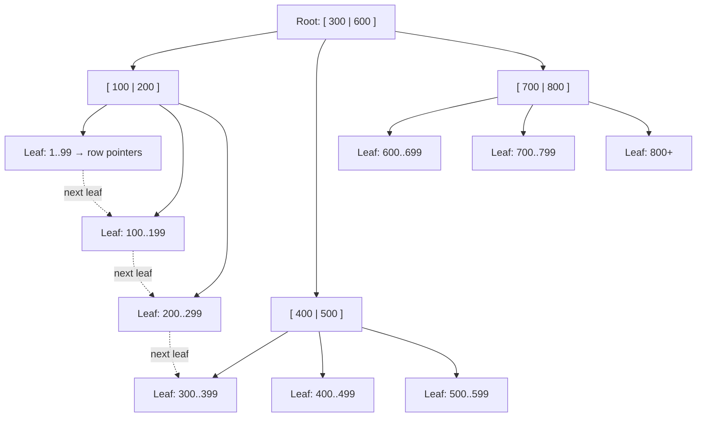
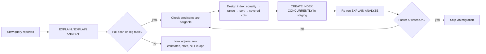

# Indexing & Query Optimization — Make Slow Queries Fast Without Guessing

> Every query below runs in the **SQL Playground** above (SQLite in your browser). Use `EXPLAIN QUERY PLAN` to watch the database change its mind.

---

## Table of Contents

1. The Library Analogy
2. What an Index Actually Is — The B-Tree
3. Reading a Query Plan (EXPLAIN)
4. Single-Column Indexes — The Basics
5. Composite Indexes — Column Order Is Everything
6. Covering Indexes — Never Touch the Table
7. Clustered vs Non-Clustered
8. When Indexes Are Ignored (Sargability)
9. The Cost of Indexes — Writes, Storage, Locks
10. A Real Optimization Walkthrough
11. Practice Assignments (Low / Medium / High)
12. Mini Project — Slow Query Detective
13. Interview Corner
14. Quick Reference

---

## 1. The Library Analogy

Imagine a library with 2 million books piled on the floor in the order they arrived. Someone asks for "every book by Agatha Christie". You have exactly one option: walk past **every single book**. That's a **full table scan**.

Now the librarian builds a **card catalogue**: small cards sorted alphabetically by author, each card saying "shelf 41, position 7". You flip to "C", find "Christie", read 80 cards, and walk to 80 shelves. That card catalogue is an **index**.

Three things fall out of this analogy that most developers miss:

- The catalogue **costs space** and **must be updated** every time a book arrives — indexes slow down writes.
- A catalogue sorted by author is **useless** for "all books published in 1934" — an index only helps queries that match how it's sorted.
- If the card itself says the book's title and year, you don't need to walk to the shelf at all — that's a **covering index**.

---

## 2. What an Index Actually Is — The B-Tree

Almost every relational database (PostgreSQL, MySQL InnoDB, SQL Server, Oracle, SQLite) uses a **B-tree** (strictly a B+tree) as its default index.



Key properties you should be able to say out loud:

| Property | Why it matters |
|----------|----------------|
| **Balanced** — every leaf is the same depth | Lookup cost is predictable: `O(log n)` |
| **High fan-out** — each node holds hundreds of keys | 100M rows ≈ only 3-4 levels deep → 3-4 disk reads |
| **Leaves are sorted and linked** | Range queries (`BETWEEN`, `>`, `ORDER BY`) walk leaves sideways — no re-searching |
| **Leaves hold key + row pointer** (or the whole row, if clustered) | Decides whether a second lookup ("heap fetch") is needed |

<div class="callout-info">

**Why not a hash index everywhere?** Hash indexes give `O(1)` equality lookups but **cannot** do ranges, sorting, or prefix matching. PostgreSQL has them (`USING HASH`), but B-tree wins by default because it handles `=`, `<`, `>`, `BETWEEN`, `ORDER BY`, and `LIKE 'abc%'`.

</div>

---

## 3. Reading a Query Plan (EXPLAIN)

**Never guess about performance. Ask the database.**

| Database | Command | What you look for |
|----------|---------|-------------------|
| SQLite (playground) | `EXPLAIN QUERY PLAN SELECT ...` | `SCAN` (bad on big tables) vs `SEARCH ... USING INDEX` (good) |
| PostgreSQL | `EXPLAIN ANALYZE SELECT ...` | `Seq Scan` vs `Index Scan` / `Index Only Scan` / `Bitmap Heap Scan`, actual time, rows |
| MySQL | `EXPLAIN SELECT ...` | `type: ALL` (full scan) vs `ref` / `range` / `const`, `key`, `Extra: Using index` |

Try this in the playground **right now**:

```sql
EXPLAIN QUERY PLAN
SELECT * FROM bookings WHERE passenger_id = 7;
```

You'll see something like `SCAN bookings` — SQLite reads every booking row. (Older SQLite versions print `SCAN TABLE bookings`.)

Now create an index and ask again:

```sql
CREATE INDEX idx_bookings_passenger ON bookings(passenger_id);

EXPLAIN QUERY PLAN
SELECT * FROM bookings WHERE passenger_id = 7;
```

Now: `SEARCH bookings USING INDEX idx_bookings_passenger (passenger_id=?)`. Same query, completely different access path.

<div class="callout-tip">

**Applying this** — In PostgreSQL, always use `EXPLAIN (ANALYZE, BUFFERS)` in a staging database with production-like data. Plans on a 100-row dev database lie — the planner will happily seq-scan a tiny table even when an index exists, because that's genuinely faster for 100 rows.

</div>

### PostgreSQL plan cheat sheet

```text
Seq Scan on bookings  (cost=0.00..18334.00 rows=5 width=64) (actual time=0.02..95.1 rows=5 loops=1)
  Filter: (passenger_id = 7)
  Rows Removed by Filter: 999995        <-- the smoking gun
```

`Rows Removed by Filter` in the hundreds of thousands while returning 5 rows = missing index.

---

## 4. Single-Column Indexes — The Basics

### Scenario: "Show me a passenger's booking history" is slow

The booking history page runs:

```sql
SELECT booking_id, flight_id, fare, status
FROM bookings
WHERE passenger_id = ?
ORDER BY booking_date DESC;
```

❌ **Wrong instinct**: "Add more RAM to the DB server." The query reads the whole table no matter how much RAM you have.

✅ **Right fix**: index the column in the `WHERE` clause.

```sql
CREATE INDEX idx_bookings_passenger ON bookings(passenger_id);
```

### Which columns deserve an index?

| Put an index on... | Why |
|--------------------|-----|
| Foreign keys used in joins (`bookings.passenger_id`, `bookings.flight_id`) | PostgreSQL and SQLite do **not** auto-index foreign keys. MySQL InnoDB does. |
| Columns in frequent `WHERE` equality filters | Classic lookup |
| Columns in `ORDER BY` of paginated queries | Avoids sorting the whole result set |
| Columns with **high selectivity** (many distinct values: email, order_id) | The index narrows results a lot |

| Think twice about... | Why |
|----------------------|-----|
| Low-cardinality columns alone (`status` with 4 values, `is_active`) | Index returns 25-50% of the table — a seq scan is usually cheaper |
| Tiny tables (< a few thousand rows) | Whole table fits in a few pages |
| Write-heavy tables with rarely-read columns | You pay on every insert for nothing |

<div class="callout-scenario">

**Scenario**: Your `bookings` table has a `status` column: 92% `confirmed`, 5% `cancelled`, 3% `pending`. Ops queries `WHERE status = 'pending'` every minute. **Decision**: A normal index on `status` is mostly wasted, but a **partial index** is perfect: `CREATE INDEX idx_pending ON bookings(booking_date) WHERE status = 'pending';` — tiny, only 3% of rows, and exactly matches the hot query. Supported in PostgreSQL and SQLite (not MySQL).

</div>

---

## 5. Composite Indexes — Column Order Is Everything

A composite index on `(a, b, c)` is sorted like a phone book: by `a`, then by `b` within each `a`, then `c` within each `b`.

### The Leftmost Prefix Rule

An index on `(passenger_id, status, booking_date)` can serve:

| Query filter | Uses index? | Why |
|--------------|-------------|-----|
| `passenger_id = 7` | ✅ Yes | Leftmost column |
| `passenger_id = 7 AND status = 'confirmed'` | ✅ Yes | Leftmost two |
| `passenger_id = 7 AND status = 'confirmed' AND booking_date > '2026-01-01'` | ✅ Fully | All three, range on last |
| `status = 'confirmed'` | ❌ No (mostly) | Skips the first column — like finding a first name in a phone book sorted by surname |
| `passenger_id = 7 AND booking_date > '2026-01-01'` | ⚠️ Partially | Uses `passenger_id`, then filters dates within that slice |

### The Golden Rule of Column Order

> **Equality columns first, then range columns, then sort columns.**

```sql
-- Query: a passenger's confirmed bookings, newest first
SELECT booking_id, fare
FROM bookings
WHERE passenger_id = ? AND status = 'confirmed'
ORDER BY booking_date DESC;

-- ❌ Range/sort column first: can't use passenger_id efficiently
CREATE INDEX idx_bad ON bookings(booking_date, passenger_id, status);

-- ✅ Equalities first, sort column last: seek + pre-sorted result, no sort step
CREATE INDEX idx_good ON bookings(passenger_id, status, booking_date);
```

Try it in the playground:

```sql
CREATE INDEX idx_good ON bookings(passenger_id, status, booking_date);

EXPLAIN QUERY PLAN
SELECT booking_id, fare FROM bookings
WHERE passenger_id = 3 AND status = 'confirmed'
ORDER BY booking_date DESC;
```

Notice there's **no** `USE TEMP B-TREE FOR ORDER BY` line — the index already delivers rows in order.

<div class="callout-interview">

**Q: "Does column order matter in a composite index?"**

Yes, completely. The index is sorted by the first column, then the second within it, and so on, so it can only be used for a leftmost prefix of its columns. I order columns as equality filters first, then the range filter, then the sort column — a range condition stops the index from being used for any columns after it.

</div>

<div class="callout-warn">

**Don't build one index per column** hoping the DB combines them. PostgreSQL can combine them with a Bitmap AND, but it's usually slower than one well-ordered composite index, and you pay write cost for every one of them.

</div>

---

## 6. Covering Indexes — Never Touch the Table

A normal index lookup is two steps: (1) find the key in the index, (2) follow the pointer to the table row to get the other columns. Step 2 is random I/O — often the most expensive part.

If **every column the query needs** is in the index, step 2 disappears. That's a **covering index**.

```sql
-- Query only needs passenger_id, booking_date, fare
SELECT booking_date, fare FROM bookings WHERE passenger_id = 3;

CREATE INDEX idx_cover ON bookings(passenger_id, booking_date, fare);

EXPLAIN QUERY PLAN
SELECT booking_date, fare FROM bookings WHERE passenger_id = 3;
-- → SEARCH bookings USING COVERING INDEX idx_cover (passenger_id=?)
```

| Database | How it shows up | Syntax to add non-key columns |
|----------|-----------------|------------------------------|
| PostgreSQL | `Index Only Scan` | `CREATE INDEX ... ON t(a) INCLUDE (b, c);` |
| SQL Server | no Key Lookup in plan | `INCLUDE (b, c)` |
| MySQL | `Extra: Using index` | just add the columns to the key |
| SQLite | `USING COVERING INDEX` | just add the columns to the key |

<div class="callout-tip">

**Applying this** — Covering indexes are the #1 trick for hot read endpoints (dashboards, "my orders" pages). But `SELECT *` kills them instantly — the index can't cover every column. Selecting only the columns you need isn't just style; it unlocks index-only scans.

</div>

---

## 7. Clustered vs Non-Clustered

| | Clustered index | Non-clustered (secondary) index |
|--|----------------|------------------------------|
| What's in the leaf | **The actual row data** | Key + pointer to the row |
| How many per table | **One** (data can only be physically sorted one way) | Many |
| MySQL InnoDB | The primary key **is** the clustered index | Leaf stores the **primary key value**, so a lookup = secondary index → PK index |
| SQL Server | Chosen explicitly (defaults to PK) | Leaf stores clustering key or RID |
| PostgreSQL | **No true clustered index.** Table is a heap; `CLUSTER` command sorts once but isn't maintained | All indexes point to heap tuple locations (ctid) |
| SQLite | `INTEGER PRIMARY KEY` = the rowid B-tree (clustered-like) | Point to rowid |

<div class="callout-scenario">

**Scenario**: A MySQL team uses random UUIDv4 as the primary key on a 500M-row `orders` table, and insert throughput keeps degrading. **Answer**: In InnoDB the PK is the clustered index, so random UUIDs insert into random pages → page splits, fragmentation, and a cold buffer pool. Also every secondary index stores the 16-byte PK. Fix: use a time-ordered ID (auto-increment `BIGINT`, UUIDv7, or ULID) so inserts append to the right edge of the B-tree.

</div>

---

## 8. When Indexes Are Ignored (Sargability)

A predicate is **sargable** ("Search ARGument ABLE") if the database can use an index seek for it. The usual rule: **don't wrap the indexed column in anything**.

| ❌ Non-sargable | ✅ Sargable rewrite |
|----------------|--------------------|
| `WHERE LOWER(email) = 'a@b.com'` | Store normalized, or create an expression index: `CREATE INDEX ON passengers(LOWER(email))` |
| `WHERE YEAR(booking_date) = 2026` | `WHERE booking_date >= '2026-01-01' AND booking_date < '2027-01-01'` |
| `WHERE fare * 1.18 > 5000` | `WHERE fare > 5000 / 1.18` |
| `WHERE name LIKE '%sharma'` | Leading wildcard can't seek — use full-text / trigram (`pg_trgm`) index |
| `WHERE CAST(flight_id AS TEXT) = '12'` | Compare with the correct type: `WHERE flight_id = 12` |
| `WHERE a = 1 OR b = 2` (separate indexes) | Often fine in PG (BitmapOr); otherwise `UNION ALL` of two indexed queries |

<div class="callout-warn">

**The silent type-mismatch trap (Java + JPA)**: an indexed `VARCHAR` column compared against a numeric bind parameter, or a MySQL column with a different collation than the parameter, forces an implicit cast on the **column** side → full scan. It looks identical in the code review. Always check `EXPLAIN` of the actual SQL Hibernate generates (`spring.jpa.show-sql=true` or p6spy).

</div>

Other reasons the planner skips an index:

- **Low selectivity**: the filter matches a large fraction of the table; seq scan is cheaper.
- **Stale statistics**: planner thinks the table is small. Run `ANALYZE` (PostgreSQL) / `ANALYZE TABLE` (MySQL).
- **Leftmost prefix not satisfied** in a composite index.

---

## 9. The Cost of Indexes — Writes, Storage, Locks

Every index is a separate B-tree the database must update on `INSERT`, on `DELETE`, and on `UPDATE` of an indexed column.

| Cost | Impact |
|------|--------|
| Write amplification | 1 insert into a table with 6 indexes = 7 B-tree writes + WAL for each |
| Storage & memory | Indexes compete with table data for buffer cache |
| Lock / build time | Plain `CREATE INDEX` in PostgreSQL blocks writes for the duration |
| Planner confusion | Many similar indexes = more plans to evaluate, occasionally wrong picks |

<div class="callout-tip">

**Applying this** — In production PostgreSQL, always create indexes with `CREATE INDEX CONCURRENTLY` (doesn't block writes; can't run inside a transaction, so in Flyway put it in its own migration with transactions disabled). In MySQL 8, `ALTER TABLE ... ADD INDEX ..., ALGORITHM=INPLACE, LOCK=NONE`. And periodically find unused indexes: PostgreSQL `pg_stat_user_indexes WHERE idx_scan = 0`.

</div>

---

## 10. A Real Optimization Walkthrough

**Symptom**: The "Top routes this month" admin report takes 9 seconds.

```sql
SELECT r.route_id, COUNT(*) AS bookings, SUM(b.fare) AS revenue
FROM bookings b
JOIN flights f ON f.flight_id = b.flight_id
JOIN routes  r ON r.route_id  = f.route_id
WHERE b.status = 'confirmed'
  AND substr(b.booking_date, 1, 7) = '2026-03'
GROUP BY r.route_id
ORDER BY revenue DESC
LIMIT 10;
```

**Step 1 — Measure.** `EXPLAIN QUERY PLAN` shows `SCAN b` — the whole bookings table.

**Step 2 — Find the non-sargable predicate.** `substr(b.booking_date, 1, 7)` wraps the column. Rewrite as a range:

```sql
WHERE b.status = 'confirmed'
  AND b.booking_date >= '2026-03-01' AND b.booking_date < '2026-04-01'
```

**Step 3 — Index for equality + range, covering the join and aggregate columns:**

```sql
CREATE INDEX idx_bookings_report
  ON bookings(status, booking_date, flight_id, fare);
```

**Step 4 — Make the join side cheap.** `flights.flight_id` is the `INTEGER PRIMARY KEY` (already the rowid B-tree). Good.

**Step 5 — Re-measure.** Plan now shows `SEARCH b USING COVERING INDEX idx_bookings_report (status=? AND booking_date>? AND booking_date<?)`.



<div class="callout-interview">

**Q: "A query was fast yesterday and slow today, nothing deployed. What do you check?"**

Plan changes first: stale statistics after a big data load (run `ANALYZE`), a parameter value with very different selectivity (plan caching / parameter sniffing), table bloat after mass deletes, or a lock held by a long-running transaction. I compare `EXPLAIN ANALYZE` now vs the known-good plan and check `pg_stat_activity` for blockers.

</div>

---

## 11. 🏋️ Practice Assignments

All of these run in the SQL Playground at the top of this page. Try each one before opening the answer.

### 🟢 Low — Build the reflexes

**L1.** Run `EXPLAIN QUERY PLAN SELECT * FROM flights WHERE flight_number = 'AI101';`. What access method do you see? Now add an index and re-run.

<details>
<summary>Show answer</summary>

Before: `SCAN flights` (full scan). Then:

```sql
CREATE INDEX idx_flights_number ON flights(flight_number);
EXPLAIN QUERY PLAN SELECT * FROM flights WHERE flight_number = 'AI101';
```

After: `SEARCH flights USING INDEX idx_flights_number (flight_number=?)`. If flight numbers are unique per day in your model, a `UNIQUE` index on `(flight_number, departure_time)` would be even better — it enforces a business rule too.

</details>

**L2.** Which of these can use an index on `passengers(email)`? (a) `email = 'x@y.com'` (b) `email LIKE 'ravi%'` (c) `email LIKE '%gmail.com'` (d) `LOWER(email) = 'x@y.com'`

<details>
<summary>Show answer</summary>

(a) ✅ equality. (b) ✅ prefix match can seek in a B-tree (in SQLite, only when the column's collation matches `LIKE`'s case rules, or use `GLOB 'ravi*'`; in PostgreSQL with non-C collation you need a `text_pattern_ops` index). (c) ❌ leading wildcard. (d) ❌ function on column — needs an expression index on `LOWER(email)`.

</details>

**L3.** Why doesn't `passengers.passenger_id` need an index to be created manually?

<details>
<summary>Show answer</summary>

It's declared `INTEGER PRIMARY KEY`, which in SQLite is the rowid — the table itself is a B-tree keyed on it. In every major database, primary keys (and `UNIQUE` constraints) get an index automatically. Foreign keys do **not** (except MySQL InnoDB).

</details>

### 🟡 Medium — Design decisions

**M1.** The app runs this constantly. Design **one** index that makes it seek *and* avoid a sort step:

```sql
SELECT booking_id, seat FROM bookings
WHERE flight_id = 5 AND class = 'business'
ORDER BY seat;
```

<details>
<summary>Show answer</summary>

Equality columns first, then the sort column, then extra selected columns to cover:

```sql
CREATE INDEX idx_flight_class_seat ON bookings(flight_id, class, seat, booking_id);
EXPLAIN QUERY PLAN
SELECT booking_id, seat FROM bookings
WHERE flight_id = 5 AND class = 'business' ORDER BY seat;
```

Expected: `SEARCH bookings USING COVERING INDEX idx_flight_class_seat (flight_id=? AND class=?)` and **no** `USE TEMP B-TREE FOR ORDER BY`. (In SQLite `booking_id` is the rowid and already present in every index, so it's covered even without listing it.)

</details>

**M2.** Rewrite this to be sargable and add a suitable index:

```sql
SELECT * FROM flights WHERE substr(departure_time, 1, 10) = '2026-03-15';
```

<details>
<summary>Show answer</summary>

```sql
CREATE INDEX idx_flights_departure ON flights(departure_time);

SELECT * FROM flights
WHERE departure_time >= '2026-03-15' AND departure_time < '2026-03-16';
```

The range compares the raw column, so the B-tree can seek to the first matching key and walk the linked leaves. This works because ISO-8601 strings sort chronologically.

</details>

**M3.** You have indexes `(passenger_id)` and `(passenger_id, booking_date)`. Is one redundant?

<details>
<summary>Show answer</summary>

Yes — `(passenger_id)` is a leftmost prefix of `(passenger_id, booking_date)`, so the composite serves every query the single-column one does (slightly larger to scan, but negligible). Drop `(passenger_id)` to save write cost. Exception: if the single-column index is `UNIQUE` it enforces a constraint and must stay.

</details>

### 🔴 High — Think like a senior

**H1.** A `bookings` table (400M rows, PostgreSQL) needs a new index on `(flight_id, status)`. Traffic is 3K inserts/sec, 24x7. Write the migration plan.

<details>
<summary>Show answer</summary>

1. Verify the need with `EXPLAIN (ANALYZE, BUFFERS)` against a production-sized replica.
2. Migration using `CREATE INDEX CONCURRENTLY IF NOT EXISTS idx_bookings_flight_status ON bookings(flight_id, status);` in its own Flyway migration with transactions disabled (`executeInTransaction=false` in the migration's `.conf`).
3. Run off-peak; watch replication lag, IO, and `pg_stat_progress_create_index`.
4. If it fails midway it leaves an `INVALID` index — detect via `pg_index.indisvalid = false`, `DROP INDEX CONCURRENTLY`, retry.
5. After deploy: confirm usage via `pg_stat_user_indexes.idx_scan` and p99 latency; remove any index it makes redundant.

</details>

**H2.** A `LIKE '%term%'` search on `passengers.last_name` over 50M rows must return in < 100 ms. B-trees can't help. What are your options and trade-offs?

<details>
<summary>Show answer</summary>

- **PostgreSQL `pg_trgm` + GIN index** (`CREATE INDEX ... USING GIN (last_name gin_trgm_ops)`): supports `LIKE '%x%'` and `ILIKE`, stays in the DB, transactional. Cost: large index, slower writes. Good first choice.
- **Full-text search** (`tsvector` + GIN): word-based, not substrings; good for stemming/ranking prose, not surnames.
- **Elasticsearch/OpenSearch**: best relevance, fuzziness, typo tolerance; cost is another system to run and eventual consistency (sync via CDC/Kafka).
- **Product change**: prefix search only (`LIKE 'term%'`) works with a normal B-tree — often the cheapest "optimization" is asking whether infix search is truly needed.

</details>

---

## 12. 🛠️ Mini Project — Slow Query Detective

**Goal**: Take a deliberately slow Spring Boot + PostgreSQL endpoint, prove *why* it's slow, fix it with indexes, and show before/after numbers. Doable in 2-3 evenings; great story for "tell me about a performance issue you fixed".

**Setup (Docker)**

```bash
docker run -d --name pg-idx -e POSTGRES_PASSWORD=pass -p 5432:5432 postgres:16
```

```sql
CREATE TABLE orders (
  id          BIGSERIAL PRIMARY KEY,
  customer_id BIGINT NOT NULL,
  status      VARCHAR(20) NOT NULL,
  created_at  TIMESTAMP NOT NULL,
  amount      NUMERIC(10,2) NOT NULL
);

INSERT INTO orders (customer_id, status, created_at, amount)
SELECT (random() * 100000)::bigint,
       (ARRAY['NEW','PAID','SHIPPED','CANCELLED'])[1 + (random()*3)::int],
       now() - (random() * interval '365 days'),
       round((random() * 5000)::numeric, 2)
FROM generate_series(1, 5000000);
ANALYZE orders;
```

**Tasks**

1. Build `GET /customers/{id}/orders?status=PAID&page=0` with Spring Data JPA, sorted by `created_at DESC`, page size 20.
2. Measure: `EXPLAIN (ANALYZE, BUFFERS)` of the generated SQL, and p50/p95 latency with a simple load test (`hey` or `k6`, 200 requests).
3. Add the right composite index (`customer_id, status, created_at DESC`), re-measure. Then try making it covering with `INCLUDE (amount)` and a DTO projection instead of the entity.
4. Add a second endpoint: `GET /reports/daily-revenue?from=&to=`. Write it first with `DATE(created_at) = ...` style filtering, then fix sargability.
5. Write a `README` table: query, plan before/after, latency before/after, index size (`pg_relation_size`), insert throughput impact.

**Acceptance criteria**

- Page endpoint < 10 ms p95 on 5M rows.
- You can explain every line in the final `EXPLAIN ANALYZE` output.
- Index creation is in a Flyway migration using `CONCURRENTLY`.

**Stretch**: add `pg_stat_statements`, find the top 3 queries by `total_exec_time`, and write a one-paragraph "tuning report" as you would for your team.

---

## 🎯 Interview Corner

<div class="callout-interview">

**Q: "How does a database index work, and why doesn't every column have one?"**

Most relational databases use a B+tree: a balanced, high fan-out tree whose sorted leaves hold the indexed key plus a pointer to the row, so lookups cost `O(log n)` — three or four page reads even for hundreds of millions of rows — and range scans walk the linked leaves. Indexes aren't free: every insert, delete, and update of an indexed column must also update every index, they consume disk and buffer cache, and building them can lock the table. On a write-heavy table like an event log, six indexes can cut insert throughput dramatically. So I index for the queries that actually run, verified with `EXPLAIN`, and remove indexes with zero scans in `pg_stat_user_indexes`.

**Follow-up trap**: "So should I index a boolean column?" → Usually not on its own — the selectivity is too low and the planner will prefer a seq scan. If the query targets the rare value, use a partial index like `WHERE is_active = false`.

</div>

<div class="callout-interview">

**Q: "Composite index on (a, b) vs two separate indexes on a and b — which is better?"**

For a query filtering on both `a = ? AND b = ?`, the composite index wins: one seek straight to the matching entries. Two separate indexes force the database to either pick one and filter the rest, or build bitmaps from both and intersect them (PostgreSQL's BitmapAnd), which is more work. Separate indexes are more flexible if queries filter on `b` alone, since the composite only helps queries that include its leftmost column. My rule is to design indexes around the hottest query shapes: equality columns first, range next, sort column last.

**Follow-up trap**: "Which column goes first, the more selective one?" → Selectivity matters less than query shape. The column that is *always* filtered with equality goes first; a column used with a range must come after the equality columns, or the columns after it can't be used for seeking.

</div>

<div class="callout-interview">

**Q: "Your API endpoint got slow after the table crossed 20 million rows. Walk me through debugging it."**

First I confirm it's the database, using APM traces or Hibernate SQL logging, and rule out N+1 queries in the application layer. Then I take the exact SQL with real bind values and run `EXPLAIN (ANALYZE, BUFFERS)` on a replica. I look for sequential scans with a huge "Rows Removed by Filter", sorts spilling to disk, nested loops with bad row estimates, and non-sargable predicates like functions on columns. I fix it with the right composite or covering index, created `CONCURRENTLY`, or with a query rewrite, and re-measure. If it's pagination with a big `OFFSET`, I switch to keyset pagination (`WHERE created_at < :lastSeen ORDER BY created_at DESC LIMIT 20`).

</div>

<div class="callout-interview">

**Q: "What's a covering index and when would you use one?"**

A covering index contains every column a query needs — filter, sort, and selected columns — so the database answers from the index alone without visiting the table: an Index Only Scan in PostgreSQL or "Using index" in MySQL. That removes the random I/O of fetching rows, which is often the dominant cost. I use them for hot, narrow read paths like "last 20 orders for a customer" with a DTO projection. PostgreSQL's `INCLUDE` clause adds payload columns without making them part of the sort key. The trade-off is a wider index and more write cost, and `SELECT *` defeats it entirely.

**Follow-up trap**: "Index Only Scan but it's still reading the heap — why?" → PostgreSQL must check the visibility map; pages changed since the last `VACUUM` still need a heap visit. Vacuum health affects index-only scans.

</div>

---

## Quick Reference

| Concept | One-Liner |
|---------|-----------|
| B+tree | Balanced, sorted, linked leaves → `O(log n)` seeks + cheap ranges |
| EXPLAIN | Always measure; `Seq Scan` + huge rows-removed = missing index |
| Leftmost prefix | `(a,b,c)` serves `a`, `a,b`, `a,b,c` — not `b` alone |
| Column order | Equality → range → sort → covered |
| Covering index | All needed columns in index → no table visit |
| Clustered | Table rows stored in index order; one per table; InnoDB PK |
| Sargable | Never wrap the indexed column in a function or cast |
| Partial index | Index only the rows you query (`WHERE status='pending'`) |
| Cost | Every index slows writes; drop unused ones |
| Prod DDL | `CREATE INDEX CONCURRENTLY` (PG), `LOCK=NONE` (MySQL) |

---

## Related Topics

- `sql-joins` — join algorithms depend on indexes on join keys
- `sql-window-functions` — `PARTITION BY` / `ORDER BY` can use indexes too
- `database-decisions` — when relational indexing isn't enough

> **An index is a promise about how you'll read the data. Make that promise only for queries you've measured — every promise has a price on every write.**

---

<!-- journey-link:start -->

<div class="callout-journey">

🛒 **ShopNorth Journey** — Every index in ShopNorth's order and inventory databases exists for a named query — including partial indexes for pending orders and expiring holds.

**Continue the story:** [Chapter 4 · Data Model & SQL](/tutorials/journey-04-data-sql) · **New here?** [Start the journey](/tutorials/journey-start)

</div>

<!-- journey-link:end -->
