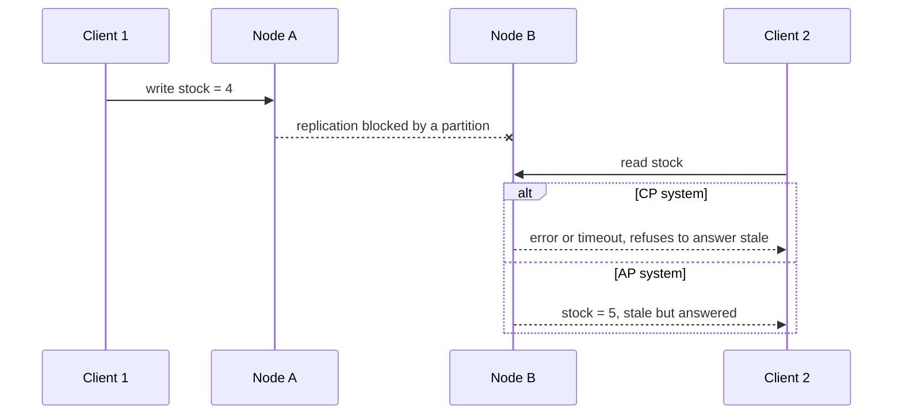

# CAP Theorem & Consistency Models — The Two Bank Branches Analogy

<!-- sdlc-stage:start -->
<div class="sdlc-stage">

📍 **SDLC stage: Design — architecture** · ShopNorth uses this in [Chapter 2 · System Design (HLD)](/tutorials/journey-02-system-design)

</div>
<!-- sdlc-stage:end -->

## The Two Bank Branches Analogy

A small bank has two branches in different towns. Both keep a copy of every customer's balance and phone each other after every transaction to stay in sync.

One morning a storm cuts the phone line between the branches. Ravi walks into branch A and wants to withdraw ₹40,000. His balance is ₹50,000 — but branch A can't check whether he withdrew money at branch B ten minutes ago.

Branch A has exactly two choices:

1. **Refuse the withdrawal** until the line is back: "Sorry, we can't confirm your balance right now." Correct, but the customer is turned away. The bank chose **consistency**.
2. **Pay out** and reconcile when the line comes back, accepting that Ravi might overdraw. The customer is served, but the two branches may disagree for a while. The bank chose **availability**.

There is no third option that is both correct and always open while the line is down. That's the CAP theorem. And notice: when the phone line works, the bank doesn't have to choose at all.

## 1. CAP, Precisely

In 2000 Eric Brewer conjectured, and in 2002 Seth Gilbert and Nancy Lynch proved, that a distributed data system can't guarantee all three of these at once:

| Letter | Means | In plain words |
|--------|-------|----------------|
| **C** — Consistency | *Linearizability*: every read sees the most recent completed write, as if there were one copy | Nobody ever sees stale data |
| **A** — Availability | Every request to a node that hasn't crashed gets a non-error response | Every healthy node always answers |
| **P** — Partition tolerance | The system keeps working when the network drops or delays messages between nodes | The phone line may be cut |

The famous summary "pick 2 out of 3" is misleading. In any system that runs on more than one machine, network partitions *will* happen — switches fail, cables get cut, a garbage-collection pause makes a node unreachable for 10 seconds. So P isn't optional. The real statement is:

> **When a network partition happens, a system must choose between consistency and availability. When there's no partition, it can have both.**

<div class="callout-warn">

**CAP's "C" is not ACID's "C".** In ACID, consistency means a transaction leaves the database valid according to its rules (constraints, invariants). In CAP, consistency means linearizability — all copies behave like one. A single PostgreSQL instance is ACID-consistent, but CAP says nothing about it until you add replicas.

</div>

## 2. CP or AP — What Happens During a Partition



| | CP — consistent under partition | AP — available under partition |
|---|---|---|
| Behavior | Nodes that can't reach a majority (or the leader) refuse requests | Every node answers with what it has |
| Cost | Errors and timeouts for some clients | Stale reads, and conflicting writes to merge later |
| Examples | etcd and ZooKeeper (majority quorums), a single-leader database whose standby refuses writes | DNS, CDN caches, Cassandra and DynamoDB in their default modes, shopping carts in Amazon's Dynamo paper |
| Good for | Money, stock, uniqueness, locks, leader election | Carts, likes, view counts, catalogs, recommendations |

Many modern databases are **tunable**: Cassandra lets you pick a consistency level per query, and DynamoDB offers strongly consistent reads as an option. So the decision is made **per operation**, not once per company.

## 3. PACELC — The Part CAP Forgets

Partitions are rare. What you pay for consistency *every day* is **latency**. Daniel Abadi's PACELC states it:

> **If there is a Partition (P), choose Availability (A) or Consistency (C); Else (E), choose Latency (L) or Consistency (C).**

| System | During a partition | Normally |
|--------|-------------------|----------|
| Cassandra, DynamoDB (default settings) | PA — keep answering | EL — answer fast from the nearest replica |
| etcd, ZooKeeper, Spanner | PC — the minority side stops | EC — pay a round trip to a quorum |
| PostgreSQL primary with async read replicas | Writes stop if the primary is unreachable (PC) | Reads from replicas are fast but can be stale (EL); reads from the primary are consistent (EC) |

That last row is ShopNorth's everyday reality: **reading from a replica is a latency-for-consistency trade, even when nothing is broken.**

## 4. The Consistency Ladder

Between "always perfectly up to date" and "eventually, somehow" there are useful levels. From strongest to weakest:

| Model | Guarantee | ShopNorth example of what goes wrong without it |
|-------|-----------|-----------------------------------------------|
| **Linearizable (strong)** | Reads see the latest write, everywhere, immediately | Two customers both buy the last pair of headphones |
| **Sequential** | Everyone sees operations in the same order (maybe delayed) | Admins see price changes applied in different orders |
| **Causal** | Effects come after their causes | A "your order shipped" event processed before "order paid" |
| **Read-your-writes** | You always see your own updates | A customer changes her address, reloads, and sees the old one |
| **Monotonic reads** | You never see data go *backwards* in time | Order status shows `SHIPPED`, then `PAID` on the next refresh |
| **Eventual** | If writes stop, replicas converge eventually | A new product appears in search 2 seconds after it's created — fine |

The middle levels — read-your-writes and monotonic reads, sometimes called **session guarantees** — fix most user-visible weirdness at a fraction of the cost of full strong consistency.

## 5. ShopNorth's Decisions, Data Type by Data Type

Priya's design rule: **strong where money and stock move; eventual where people browse.**

| Data | Choice | How it's done | Worst case accepted |
|------|--------|---------------|--------------------|
| **Stock reservation** | CP | One conditional `UPDATE` on the inventory primary | If the database is unreachable, checkout fails with "try again" — never oversell |
| **Payments** | CP + idempotent | Idempotency keys; provider webhooks verified and deduplicated | A delayed confirmation, never a double charge |
| **Order creation and status** | Strong on the primary | Unique `(customer_id, idempotency_key)`; `@Version` optimistic locking | A retry gets the original order back |
| **"My orders" right after checkout** | Read-your-writes | Read from the primary for the customer's own recent orders | Slightly more load on the primary |
| **Cart** | AP | Redis with a replica; add-to-cart always accepted | A rare lost cart update during a failover |
| **Catalog and browsing prices** | Eventual | CDN + Redis with a 60 s TTL (15 s for deal SKUs) | A price up to a minute old *on the product page* |
| **Price at checkout** | Strong | Re-read inside the order transaction | none — the customer pays the current price |
| **Search index** | Eventual | Kafka events update OpenSearch within seconds | New products appear after a short delay |
| **Notifications, analytics** | Eventual, at-least-once | Events with idempotent consumers | A duplicate email is filtered; a delay is fine |

The "never oversell" rule is enforced by the database, not by Java:

```sql
-- Chapter 4: check and change in one statement on the inventory primary
UPDATE stock
SET    reserved = reserved + :qty
WHERE  sku = :sku
AND    on_hand - reserved >= :qty;
-- 1 row updated → reserved.  0 rows updated → not enough stock.
```

<div class="callout-info">

**What about the flash deal's Redis counter?** For deal SKUs, Chapter 14 puts an atomic Redis counter in front of the database to shed load: if the counter says "sold out", the request never reaches PostgreSQL. Redis replicates asynchronously, so after a failover the counter might be slightly wrong. That's acceptable because the counter is only a *fast filter* — the conditional `UPDATE` above is still the final, consistent check. The cheap AP layer protects the expensive CP layer; it never replaces it.

</div>

## 6. Techniques for "Strong Where It Matters"

| Technique | What it guarantees | Where ShopNorth uses it |
|-----------|-------------------|-------------------------|
| **Single leader for a piece of data** | One place decides the order of writes | Each service's PostgreSQL primary |
| **Conditional (compare-and-set) writes** | Check-and-change is atomic | Stock reservation, order state transitions |
| **Optimistic locking** | Lost updates are detected | `@Version` on the `Order` entity |
| **Unique constraints / idempotency keys** | The same request can't create two results | `(customer_id, idempotency_key)` |
| **Quorums** (R + W > N) | A read overlaps the latest write | Kafka with `acks=all`, `min.insync.replicas=2` |
| **Read routing** | Read-your-writes on replicas | Customer's own data from the primary |
| **Sagas with compensation** | Business consistency across services, without a global lock | Checkout: reserve → order → pay, undo on failure |

Optimistic locking in JPA is one annotation:

```java
@Entity
class OrderEntity {
    @Id private UUID id;
    @Version private Long version;          // UPDATE ... WHERE id = ? AND version = ?
    @Enumerated(EnumType.STRING) private OrderStatus status;
    // ...
}
// Two concurrent updates of the same order: the second gets an OptimisticLockException
// and must re-read and re-apply its change, instead of silently overwriting the first.
```

And read-your-writes with replicas can be as simple as routing a customer's own reads to the primary for a short window after they write:

```java
// After a successful checkout, the controller sets a short-lived cookie: "recent-write=true" for 10 s.
DataSource pick(HttpServletRequest request, boolean isCustomersOwnData) {
    boolean recentlyWrote = WebUtils.getCookie(request, "recent-write") != null;
    return (isCustomersOwnData && recentlyWrote) ? primary : replica;   // replica lag is usually < 1 s
}
```

Across services there is no global transaction; ShopNorth uses a saga and accepts that the system is briefly *in between* states (see [Distributed Transactions](/tutorials/distributed-transactions)).

## 7. Common Misconceptions

| Myth | Reality |
|------|---------|
| "Our system is CA." | Only a single machine is "CA". Once data lives on two machines, partitions are possible and you must decide what happens during them. |
| "Eventual consistency means data loss." | It means replicas *converge*. Data loss comes from other choices, like last-write-wins on conflicting writes or async replication with failover. |
| "We picked AP, so we can't have correct data." | You choose per operation. ShopNorth's cart is AP; its stock is CP. |
| "Strong consistency is always slower, so avoid it." | It costs latency on the operations that need it — a few milliseconds on a reservation is cheap insurance against overselling. |
| "CAP is the main trade-off in system design." | Day to day, latency vs consistency (PACELC) and simpler concerns — idempotency, ordering, staleness budgets — matter more. |

## 🏢 Real-World Scenarios

<div class="callout-scenario">

**Scenario**: A ticketing site read seat availability from read replicas to reduce load on the primary. During a popular concert sale, replication lag grew to 8 seconds. Thousands of customers selected seats that were already sold, filled in their details, and failed at payment. **Decision**: Availability *displays* may come from replicas or caches, but the *claim* — holding a seat — is a conditional write on the primary. The UI shows "seats may be taken by the time you continue", and the hold is the source of truth.

</div>

<div class="callout-scenario">

**Scenario**: A team used last-write-wins replication across two data centers for a customer profile service. During a network glitch, a customer changed her phone number in one data center while a support agent changed her address in the other; when the link healed, one whole record overwrote the other, and the phone change was lost. **Decision**: Merge at field level (or route each customer's writes to one home data center), and use version vectors or a single leader for data where silent loss isn't acceptable.

</div>

## 🏋️ Practice Assignments

### 🟢 Low — Build the reflexes

**L1.** Explain why "pick two of C, A, and P" is misleading, in two sentences.

<details>
<summary>Show answer</summary>

Network partitions happen in any system running on more than one machine, so partition tolerance isn't something you can give up. The real choice is what the system does *during* a partition — refuse some requests to stay consistent, or answer everyone and risk stale or conflicting data — and when there's no partition you can have both.

</details>

**L2.** Classify each ShopNorth operation as needing strong or eventual consistency: (a) reserving stock, (b) showing "123 people viewed this today", (c) charging a payment, (d) updating the search index after a product edit, (e) showing a customer her order right after she placed it.

<details>
<summary>Show answer</summary>

(a) Strong — overselling is unacceptable. (b) Eventual — a slightly wrong counter harms no one. (c) Strong plus idempotent — never charge twice. (d) Eventual — a few seconds of delay is fine. (e) Read-your-writes — the customer must see her own order, but other people's views can lag.

</details>

### 🟡 Medium — Apply it

**M1.** ShopNorth adds a read replica for the Order database. Which queries move to it, which must stay on the primary, and what new bug could appear?

<details>
<summary>Show answer</summary>

**Move:** admin reports, analytics, order history older than a few minutes, exports. **Stay on the primary:** every write, the checkout flow, payment webhooks, state transitions, and the customer's own orders right after checkout. **New bug:** read-your-writes violations — the customer places an order, the confirmation page reads from the replica, and the order "doesn't exist" yet; or status going backwards across refreshes (monotonic reads). Fix with read routing after writes, sticky replica selection per session, or waiting for the replica to reach the write's log position.

</details>

**M2.** During a network partition between the app and Redis, should ShopNorth's add-to-cart fail or succeed? Justify it, and describe how you'd reconcile.

<details>
<summary>Show answer</summary>

Succeed if possible (AP): a cart is a list of intentions, and refusing to add items costs sales, while a slightly stale cart costs almost nothing because checkout re-validates price and stock. If Redis is completely unreachable, keep the cart client-side (local storage) and sync it later. Reconcile by **merging** (union of items, keep the higher quantity, honor explicit deletes with timestamps) rather than overwriting — essentially what Amazon's Dynamo paper did for carts.

</details>

### 🔴 High — Think like a senior

**H1.** ShopNorth expands to a second region for Middle-East customers. Design how stock works across two regions without overselling, and state the trade-offs.

<details>
<summary>Show answer</summary>

Options: (1) **Single home for stock** — keep the inventory primary in Mumbai and route reservations there (CP, cross-region latency of ~30-60 ms on checkout; if Mumbai is unreachable, the second region can't sell — acceptable or not is a business call). (2) **Partition the stock** — allocate units per region (e.g., warehouse-based: Dubai sells from the Dubai warehouse), each region strongly consistent locally, with periodic rebalancing; no cross-region coordination on the hot path, at the cost of "sold out here, available there". (3) **Escrow/quotas** — each region gets a share of a SKU's units it can sell without asking; when it runs low, it requests more from the home region. Avoid multi-master stock with last-write-wins: it oversells by design. A senior answer picks per SKU category (shared global stock for rare items via option 1, quotas for high-volume items) and states the latency and availability costs.

</details>

**H2.** An interviewer says: "MongoDB/Cassandra is AP, so you can't use it for an order system." Respond.

<details>
<summary>Show answer</summary>

The label is too coarse. Cassandra can do strongly consistent reads and writes for a key with QUORUM reads and writes (R + W > N), and lightweight transactions for compare-and-set — at a latency cost. MongoDB with majority write and read concerns gives strong guarantees per document, and multi-document transactions exist. The real questions: which operations need linearizability (reservations, uniqueness), can they be expressed as single-key or single-document operations, and what happens to them during partitions. Choosing a database is about its data model, operational maturity, and these per-operation guarantees — not a CAP sticker.

</details>

## 🛠️ Mini Project — See Replication Lag Break Read-Your-Writes

**Goal**: Experience a consistency anomaly, then fix it. 1 weekend.

**Build**

1. Run PostgreSQL with a streaming replica in Docker Compose: the official `postgres` image as the primary, and a second container initialized with `pg_basebackup -R` from it (the `-R` flag writes the replica settings for you).
2. In your mini ShopNorth, add a second `DataSource` for the replica and send `GET /orders/{id}` to it.
3. Write a test that creates an order and immediately reads it back 100 times in a loop; count how often it's missing. Add artificial lag (`recovery_min_apply_delay = '2s'` on the replica) to make it obvious.
4. Fix it in two ways and compare: (a) route reads to the primary for 10 s after a write, and (b) read-your-writes by waiting until the replica's `pg_last_wal_replay_lsn()` reaches the LSN returned after the write.
5. Add the stock reservation `UPDATE` and prove with 100 parallel requests that it never oversells, even while reads are on the replica.

**Acceptance criteria**: a before/after count of missing reads, both fixes working, and a short note on when you'd choose each one.

## 🎯 Interview Corner

<div class="callout-interview">

**Q: "Explain the CAP theorem and how it affects your designs."**

CAP says that during a network partition, a distributed system must choose between consistency, meaning every read sees the latest write, and availability, meaning every healthy node still answers. Partitions are unavoidable once data lives on more than one machine, so it's really a choice about behavior during failures, and I make it per operation, not per system. In an e-commerce design, stock reservations and payments are consistent: if the primary is unreachable, the operation fails rather than overselling or double charging. Carts, catalogs, and search are available and eventually consistent, served from caches and replicas. I'd also mention PACELC: even without partitions, reading from replicas or caches trades consistency for latency, and that's the trade-off we make every day.

</div>

<div class="callout-interview">

**Q: "What is eventual consistency, and how do you handle it in a user interface?"**

Eventual consistency means that if writes stop, all replicas converge to the same value, but a read may return older data in the meantime. In the UI, I hide it where it would confuse people. A user always sees their own writes, by routing their reads to the primary or applying the change optimistically on the client. I avoid showing data going backwards with monotonic reads, for example by sticking a session to one replica. Where staleness is visible, I'm honest about it, like "stock updates every few seconds". And anything involving money or stock is re-validated at the point of commitment.

</div>

<div class="callout-interview">

**Q: "How do you prevent two users from buying the last item at the same time?"**

I make the check and the change one atomic operation on a single authoritative copy: a conditional update on the stock row, which reserves only if enough remains, and returns zero rows if not. The database serializes concurrent updates on that row, so only one succeeds. I wouldn't read stock, check it in application code, and then write, because that's a race. And I wouldn't use replicas or caches for this decision. Caches can act as a fast filter during flash sales, but the final decision stays with the conditional write, and the reservation expires if payment doesn't complete.

</div>

<div class="callout-interview">

**Q: "What's the difference between CAP consistency and ACID consistency?"**

ACID consistency means a transaction moves the database from one valid state to another according to its rules, like constraints, foreign keys, and invariants. CAP consistency is linearizability: all replicas behave like a single copy, so every read sees the latest completed write. A single-node database can be fully ACID with no CAP question at all, and a replicated system can offer linearizable reads on single keys without multi-row transactions. Mixing the two up is a common interview trap.

</div>

## Quick Reference

| Term | One-liner |
|------|-----------|
| CAP | During a partition: consistency or availability |
| PACELC | …and otherwise: latency or consistency |
| Linearizable | Behaves like one copy, latest write always visible |
| Read-your-writes | You always see your own updates |
| Monotonic reads | Data never goes backwards for you |
| Eventual | Replicas converge when writes stop |
| CP use cases | Money, stock, uniqueness, locks, leader election |
| AP use cases | Carts, catalogs, counters, feeds, search |
| Rule of thumb | Strong where money and stock move; eventual where people browse |

> **Golden rule: don't pick consistency for the whole system — pick it per operation, by asking what a stale or conflicting value would cost.**

<!-- journey-link:start -->

<div class="callout-journey">

🛒 **ShopNorth Journey** — ShopNorth keeps stock reservations and payments strongly consistent on a single primary, while carts, catalogs, and search are eventually consistent through Redis, the CDN, and Kafka. Chapter 2 makes these choices; Chapter 4 enforces "never oversell" in SQL.

**Continue the story:** [Chapter 2 · System Design (HLD)](/tutorials/journey-02-system-design) · **New here?** [Start the journey](/tutorials/journey-start)

</div>

<!-- journey-link:end -->
