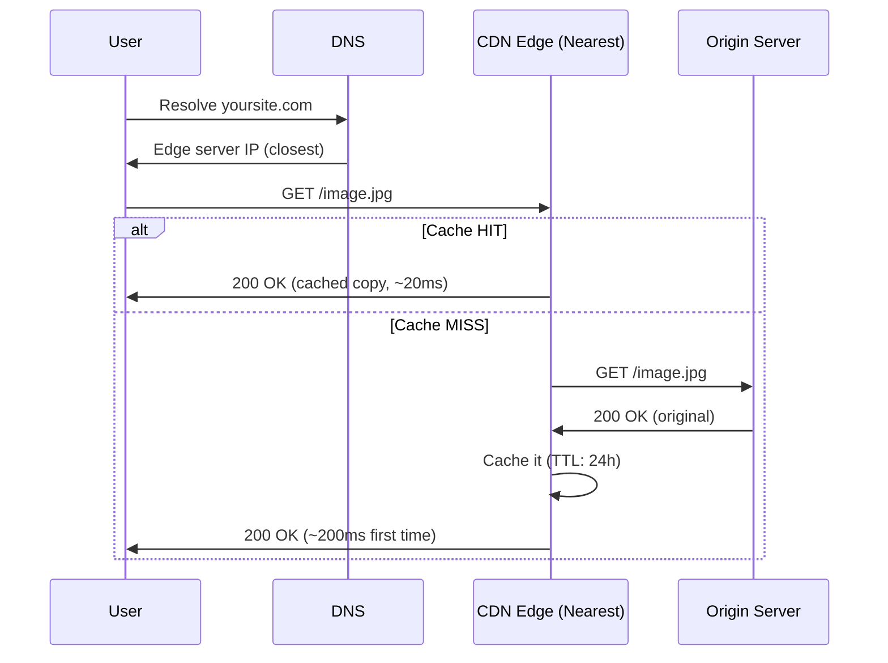
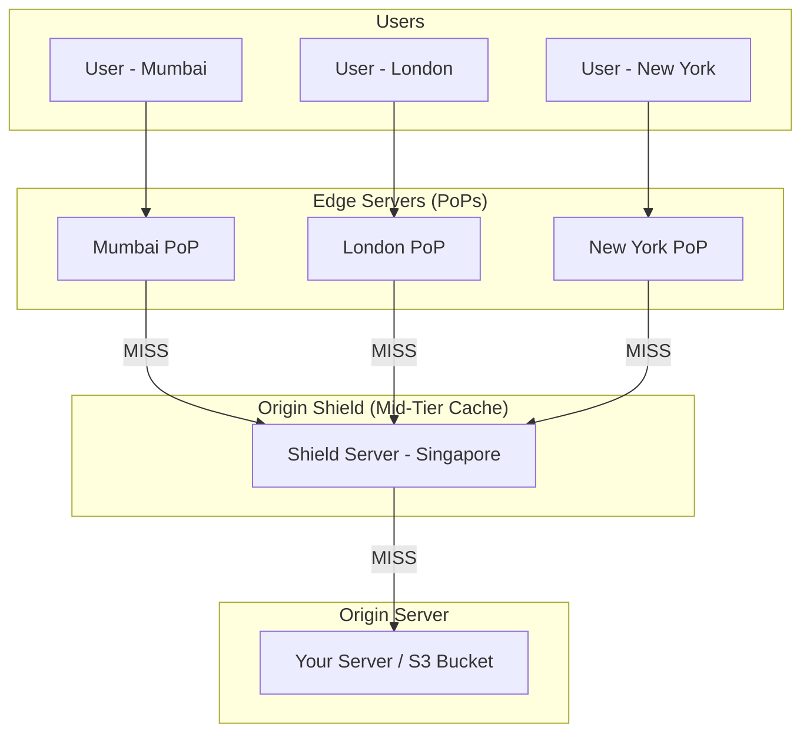
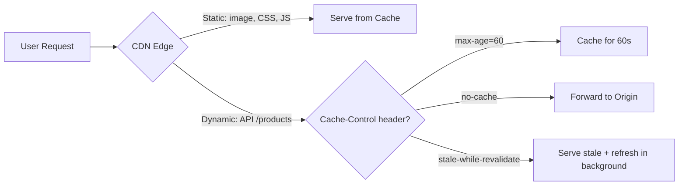
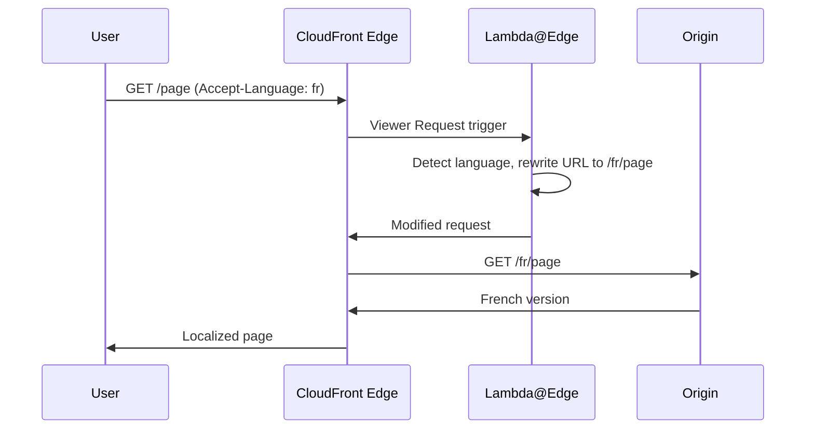
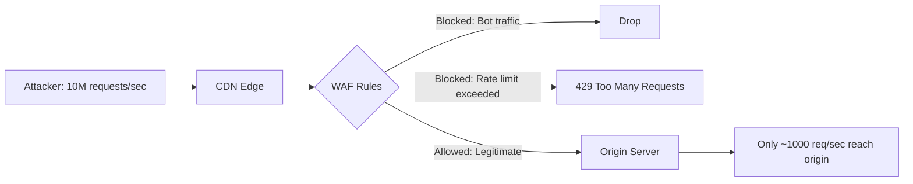

# CDN — Content Delivery Networks — The Global Pizza Chain Analogy

<!-- sdlc-stage:start -->
<div class="sdlc-stage">

📍 **SDLC stage: Design — architecture** · ShopNorth uses this in [Chapter 2 · System Design (HLD)](/tutorials/journey-02-system-design)

</div>
<!-- sdlc-stage:end -->

## The Pizza Chain Analogy

Imagine you own a pizza restaurant in Mumbai. A customer in New York orders a pizza. You could ship it from Mumbai — but it would take forever and arrive cold. Instead, you open franchise kitchens in every major city. Each kitchen keeps the most popular pizzas ready. When someone in New York orders, the nearest kitchen serves it instantly.

**That's exactly what a CDN does** — it caches your content (images, videos, CSS, JS, APIs) at servers distributed globally, so users get served from the nearest location instead of your origin server thousands of miles away.

---

## 1. How CDN Works — The Request Flow

When a user requests `https://yoursite.com/image.jpg`, here's what happens:



<div class="callout-info">

**Key insight**: The first user in a region gets a cache MISS (slower). Every subsequent user in that region gets a cache HIT (blazing fast). This is called **cache warming**.

</div>

---

## 2. CDN Architecture — Edge, Shield, Origin

A modern CDN has three layers:



| Layer | What it does | Example |
|-------|-------------|---------|
| **Edge (PoP)** | Closest to user, serves cached content | CloudFront has 450+ PoPs globally |
| **Origin Shield** | Mid-tier cache, reduces load on origin | Only ONE request goes to origin even if 50 edges miss |
| **Origin** | Your actual server or S3 bucket | Where the real content lives |

<div class="callout-scenario">

**Scenario**: Your e-commerce site launches a flash sale. 10 million users hit the product page simultaneously. Without origin shield, all 450 edge servers would bombard your origin. **With origin shield**, only 1 request reaches origin — the shield caches it and serves all edges.

**Decision**: Always enable origin shield for high-traffic events.

</div>

---

## 3. Cache Invalidation — The Hardest Problem

> "There are only two hard things in Computer Science: cache invalidation and naming things." — Phil Karlton

### Three Strategies

| Strategy | How it works | When to use |
|----------|-------------|-------------|
| **TTL (Time-To-Live)** | Content expires after X seconds | Static assets (images, CSS, JS) |
| **Cache Busting** | Change filename: `app.v2.js` or `app.abc123.js` | Deploy new versions |
| **Purge/Invalidate** | Explicitly tell CDN to drop cached content | Emergency content updates |

```java
// ❌ Bad — same filename, CDN serves stale version
<script src="/app.js"></script>

// ✅ Good — hash in filename, CDN treats as new file
<script src="/app.8f3a2b.js"></script>
```

<div class="callout-warn">

**Warning**: CDN purge/invalidation is NOT instant. CloudFront takes up to 60 seconds. Akamai can take 5-10 seconds. Never rely on purge for time-critical updates — use cache busting instead.

</div>

---

## 4. CDN for Dynamic Content — Not Just Static Files

Modern CDNs can cache API responses too:



<div class="callout-tip">

**Applying this** — For product listing APIs that change every few minutes, use `Cache-Control: public, max-age=30, stale-while-revalidate=60`. Users get instant responses while CDN refreshes in the background.

</div>

---

## 5. CDN Providers — When to Use What

| Provider | Best for | Pricing model | Unique feature |
|----------|---------|---------------|----------------|
| **CloudFront** | AWS-native apps | Pay per request + data transfer | Deep S3/ALB integration, Lambda@Edge |
| **Cloudflare** | Any website, DDoS protection | Free tier available | Built-in WAF, Workers (serverless at edge) |
| **Akamai** | Enterprise, media streaming | Contract-based | Largest network, 4000+ PoPs |
| **Fastly** | Real-time purge needs | Pay per request | Instant purge (<150ms), VCL config |

<div class="callout-scenario">

**Scenario**: You're building a news site where articles update frequently and stale content is unacceptable. **Decision**: Use Fastly — its instant purge (<150ms) means you can invalidate articles the moment they're updated, unlike CloudFront's 60-second delay.

</div>

---

## 6. Lambda@Edge and Edge Computing

CDNs aren't just caches anymore — they run code at the edge:



**Real use cases for edge computing:**
- A/B testing (route 10% of users to new version)
- Geo-based redirects (India users → `.in` domain)
- Authentication at edge (reject unauthorized before hitting origin)
- Image resizing on-the-fly (serve WebP to Chrome, JPEG to Safari)

<div class="callout-interview">

**Q: "How would you serve different image formats to different browsers?"**

Use Lambda@Edge or Cloudflare Workers to inspect the `Accept` header. If it contains `image/webp`, rewrite the request to fetch the WebP version. This saves 30-50% bandwidth without any client-side changes.

</div>

---

## 7. CDN Security — DDoS Protection

CDNs are your first line of defense:



| Protection | What it does |
|-----------|-------------|
| **Rate Limiting** | Block IPs exceeding threshold |
| **WAF (Web Application Firewall)** | Block SQL injection, XSS at edge |
| **Geo-blocking** | Block traffic from specific countries |
| **Bot Detection** | Fingerprint and block automated traffic |
| **DDoS Absorption** | CDN's massive network absorbs volumetric attacks |

<div class="callout-tip">

**Applying this** — Always put your origin behind a CDN, even for APIs. Configure the origin to ONLY accept traffic from CDN IPs. This way, attackers can't bypass the CDN and hit your origin directly.

</div>

---

<!-- practice-pack -->

## 🏢 Real-World Scenarios

<div class="callout-scenario">

**Scenario**: After a release, some users see the new HTML but old JavaScript, and the app crashes with "function not defined" errors until they hard-refresh. **Decision**: HTML and assets were cached with the same long TTL and unversioned file names (`app.js`). Use **content-hashed file names** for static assets (`app.3f9c1a.js`, cached for a year as `immutable`), and serve `index.html` with a short TTL or `no-cache` (revalidated every time). Each deploy then references new asset URLs, so old and new files never mix and no CDN purge is needed.

</div>

<div class="callout-scenario">

**Scenario**: A logged-in user's account page — including their address — is served to a different user, because the CDN cached the response of `/api/me`. **Decision**: Personalized responses must never be cached by shared caches: send `Cache-Control: private, no-store` on authenticated endpoints, configure the CDN to bypass caching when an `Authorization` header or session cookie is present, and include only intended headers in the cache key. Add an automated test that requests `/api/me` as two users through the CDN path and asserts different bodies.

</div>

## 🏋️ Practice Assignments

### 🟢 Low — Build the reflexes

**L1.** Write the `Cache-Control` headers for: (a) `app.3f9c1a.js`, (b) `index.html`, (c) `GET /api/products/881` (public, changes a few times a day), (d) `GET /api/orders` (user-specific).

<details>
<summary>Show answer</summary>

(a) `public, max-age=31536000, immutable`. (b) `no-cache` (store, but revalidate with the origin each time via `ETag`) — or a very short `max-age`. (c) `public, max-age=60, s-maxage=300, stale-while-revalidate=60` (browsers 1 min, CDN 5 min, serve stale briefly while refreshing). (d) `private, no-store`.

</details>

**L2.** What's the difference between a cache hit at the edge, a hit at the origin shield, and a miss?

<details>
<summary>Show answer</summary>

Edge hit: served from the CDN location nearest the user — fastest. Shield hit: the edge missed but a regional mid-tier cache (shield) had it — avoids going to the origin and collapses requests from many edges. Miss: the shield fetched from the origin — slowest, and it's what the origin must be sized for.

</details>

**L3.** Why prefer versioned URLs over CDN purges for static assets?

<details>
<summary>Show answer</summary>

Purges take time to propagate across hundreds of edge locations, can be rate-limited or fail partially, and don't clear browser caches. Versioned (content-hashed) URLs are new cache keys — instantly "fresh" everywhere, with old versions still available for users mid-session. Purges remain useful for content that must keep the same URL (e.g., a product image replaced for legal reasons).

</details>

### 🟡 Medium — Apply it

**M1.** A product catalog API (public) gets 50K requests/second with a 90% CDN hit ratio. The origin struggles at peak. List ways to raise the hit ratio.

<details>
<summary>Show answer</summary>

Normalize the cache key (ignore tracking query parameters like `utm_*`, sort query parameters, lowercase where safe); remove unnecessary `Vary` headers (e.g., `Vary: User-Agent` fragments the cache); enable an **origin shield** so all edges share one regional cache; use `stale-while-revalidate` and `stale-if-error`; increase TTLs where business allows and use event-driven purges for changes; move personalization out of the cacheable response (fetch prices/user state separately). Each point of hit ratio at 50K RPS is 500 fewer origin requests per second.

</details>

**M2.** Design image delivery for an e-commerce site serving phones and desktops with many sizes and formats.

<details>
<summary>Show answer</summary>

Store one high-resolution original in object storage; use an **image transformation service** at or behind the CDN (resize, crop, format conversion to WebP/AVIF, quality settings) driven by URL parameters (`/img/881.jpg?w=400&fmt=webp`) or responsive `srcset` in HTML. Cache each variant at the CDN with long TTLs (content-addressed URLs per image version). Limit allowed sizes to a fixed set to prevent cache-busting attacks with arbitrary dimensions. Use lazy loading on the page.

</details>

**M3.** How can a CDN help with a DDoS attack, and what must still be protected?

<details>
<summary>Show answer</summary>

The CDN's large distributed network absorbs volumetric attacks (L3/L4 floods) and serves cached content even under load; WAF rules and rate limiting at the edge filter L7 attacks (bot detection, request rate per IP, challenges). Still protect: the **origin's IP** (only accept traffic from CDN IP ranges or via authenticated origin pulls/private connectivity — otherwise attackers bypass the CDN), uncacheable endpoints (login, search, checkout) with stricter rate limits, and application-level abuse.

</details>

### 🔴 High — Think like a senior

**H1.** Design CDN caching for a news site's homepage that changes every minute, has a logged-in "Hi, Priya" header, and gets 200K requests/second during breaking news.

<details>
<summary>Show answer</summary>

Split the page: the shared homepage HTML is cacheable (`s-maxage=30, stale-while-revalidate=30`) with a placeholder for the personalized header; the header loads via a small uncached API call (`private`) or edge-side composition (ESI / edge functions) that injects the user's name from a signed cookie without hitting the origin. Use request collapsing at the shield so one origin fetch serves all simultaneous misses. On breaking news, publish triggers a purge of the homepage key (or the short TTL handles it). The origin then sees roughly one homepage request per 30 seconds per shield instead of 200K/s.

</details>

**H2.** Multi-CDN: when is it worth it, and how do you implement it?

<details>
<summary>Show answer</summary>

Worth it for very high traffic or availability requirements (a single CDN outage would be a major incident), geographic coverage gaps, or price negotiation. Implement with DNS-based traffic steering (weighted/latency-based, with health checks, or a traffic-steering service) across two CDNs configured identically (same cache keys, headers, TLS certificates, WAF rules — managed as code), a shared origin shield or origin capacity for double misses, and real-user monitoring per CDN to steer by performance. Costs: duplicated configuration, inconsistent features between vendors, and cache-hit dilution (each CDN warms its own cache).

</details>

## 🛠️ Mini Project — Put a CDN in Front of Your App

**Goal**: Measure what correct caching headers do. 1-2 evenings.

**Build**

1. Deploy a small Spring Boot (or static + API) app behind a free-tier CDN (e.g., Cloudflare) on a test domain — or simulate locally with NGINX as a caching reverse proxy.
2. Serve a React build with hashed asset names and correct headers; API endpoints: `/api/products/{id}` (public, cacheable) and `/api/me` (private).
3. Verify with `curl -I` the `Cache-Control`, `Age`, and the CDN's cache-status header across repeated requests.
4. Load test the public endpoint through the CDN vs directly at the origin; record origin requests per second and p95 latency.
5. Deliberately misconfigure `/api/me` as public, prove the leak with two users, then fix it and add an automated test.
6. Add `stale-if-error`, stop the origin, and show cached pages still served.

**Acceptance criteria**: a README table of headers per route with hit ratios and origin load before/after, plus the leak test.

---

## 🎯 Interview Corner

<div class="callout-interview">

**Q: "How does a CDN decide which edge server to route a user to?"**

DNS-based routing. When a user resolves your domain, the CDN's authoritative DNS server uses **anycast** or **geolocation-based DNS** to return the IP of the nearest edge server. Some CDNs also use **latency-based routing** — they measure actual round-trip times from the user's DNS resolver to each PoP and pick the fastest, not just the geographically closest. CloudFront uses a combination of both.

**Follow-up trap**: "What if the nearest edge is overloaded?" → CDNs implement **load-aware routing**. If an edge PoP is at capacity, DNS returns the next-closest healthy PoP. This is transparent to the user.

</div>

<div class="callout-interview">

**Q: "Your origin is getting hammered despite having a CDN. What's going wrong?"**

Several possibilities: (1) **Low cache hit ratio** — check if `Cache-Control` headers are set correctly. If origin sends `no-cache` or `private`, CDN won't cache. (2) **Cache key too specific** — if query strings like `?timestamp=123` vary per request, each is treated as a unique cache key. (3) **No origin shield** — without it, every edge PoP independently fetches from origin on a miss. (4) **POST/PUT requests** — these bypass cache by default. Fix: set proper `Cache-Control`, normalize cache keys, enable origin shield, and consider caching POST responses where safe.

**Follow-up trap**: "How do you debug cache hit ratio?" → Check CDN response headers: `X-Cache: Hit from cloudfront` vs `Miss from cloudfront`. CloudFront also provides real-time metrics in CloudWatch.

</div>

<div class="callout-interview">

**Q: "How would you design a CDN from scratch?"**

I'd start with three components: (1) **DNS routing layer** — anycast DNS to route users to nearest PoP. (2) **Edge cache layer** — reverse proxy (like Nginx/Varnish) at each PoP with LRU eviction, respecting `Cache-Control` headers. (3) **Origin shield** — a mid-tier cache that collapses duplicate origin requests. For cache invalidation, I'd use a pub/sub system — when origin publishes an invalidation event, all edges subscribe and purge. For consistency, I'd use TTL-based expiry as the primary mechanism and explicit purge as secondary. The key trade-off is consistency vs latency — shorter TTLs mean fresher content but more origin load.

</div>

<div class="callout-interview">

**Q: "CDN vs reverse proxy vs load balancer — what's the difference?"**

A **reverse proxy** (Nginx) sits in front of your server, handles SSL termination, compression, and can cache — but it's in ONE location. A **load balancer** distributes traffic across multiple backend servers — it doesn't cache. A **CDN** is essentially a globally distributed network of reverse proxies with intelligent DNS routing. In practice, you use all three: CDN at the edge → load balancer in your region → reverse proxy in front of your app servers. They're complementary, not competing.

</div>

---

## Quick Reference

| Concept | One-Liner |
|---------|-----------|
| PoP | Point of Presence — a CDN edge location |
| Cache HIT | Content served from edge, no origin call |
| Cache MISS | Edge doesn't have it, fetches from origin |
| TTL | How long content stays cached before expiry |
| Origin Shield | Mid-tier cache that protects origin from thundering herd |
| Cache Busting | Changing filename to force CDN to fetch new version |
| Anycast | Same IP advertised from multiple locations, routed to nearest |
| Lambda@Edge | Run code at CDN edge (auth, redirects, A/B testing) |
| WAF | Web Application Firewall — blocks attacks at edge |
| Stale-while-revalidate | Serve cached version while refreshing in background |

---

> **A CDN doesn't just make your site faster — it makes your origin server's life easier. The best request is the one that never reaches your server.**

---

<!-- journey-link:start -->

<div class="callout-journey">

🛒 **ShopNorth Journey** — ShopNorth serves 90 GB of product images and cacheable pages from a CDN, so most sale-night traffic never reaches its servers.

**Continue the story:** [Chapter 2 · System Design (HLD)](/tutorials/journey-02-system-design) · **New here?** [Start the journey](/tutorials/journey-start)

</div>

<!-- journey-link:end -->
