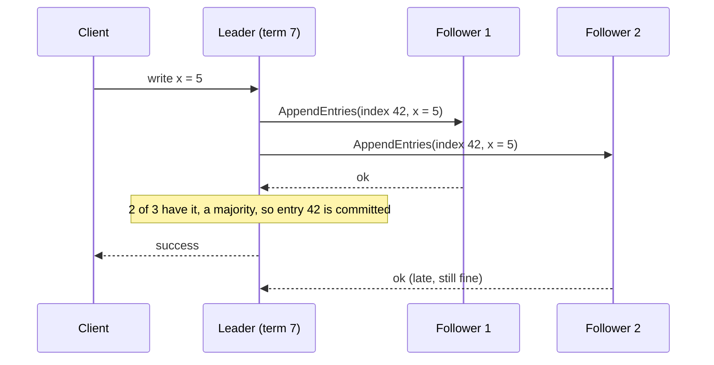
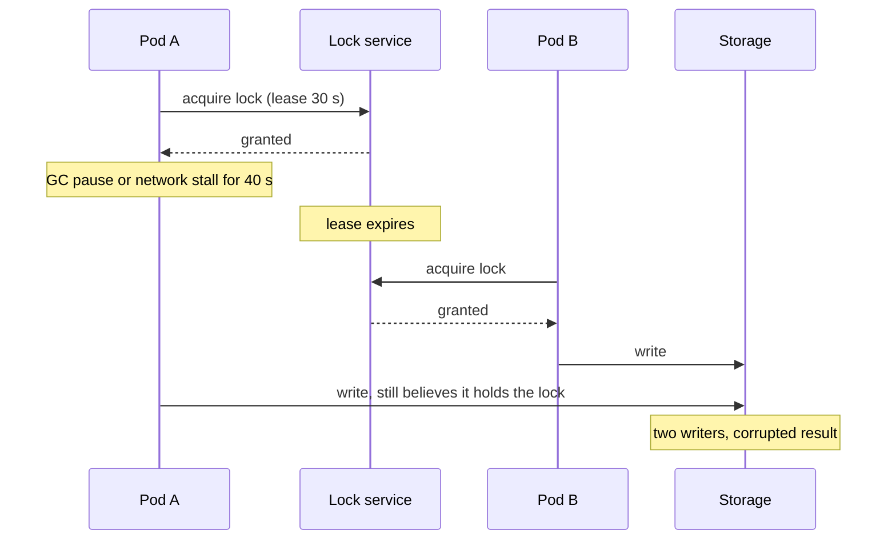

# Consensus, Leader Election & Distributed Locks — The Committee Vote Analogy

<!-- sdlc-stage:start -->
<div class="sdlc-stage">

📍 **SDLC stage: Development — services & events** · ShopNorth uses this in [Chapter 6 · Microservices & Events](/tutorials/journey-06-microservices)

</div>
<!-- sdlc-stage:end -->

## The Committee Vote Analogy

A housing society has a five-member committee. Members travel, phones die, and two of them sometimes get stuck in traffic. Yet the society must make decisions that everyone later agrees were made — "we approved the new security contract on Monday".

Their rules:

- **A decision needs a majority: 3 of 5.** Any two majorities share at least one member, so two conflicting decisions can never both pass. That's a **quorum**.
- **One member chairs the meeting** and proposes decisions. If the chair disappears, the others elect a new one — but only someone who knows every decision already passed may become chair. That's **leader election**.
- **Every decision gets a number** in the minutes book, and the book is copied to every member. That's a **replicated log**.
- **The society's single generator key** is lent out with a ticket number. The guard only accepts the key with the *highest ticket number seen so far*, so someone returning late with an old ticket can't start the generator. That's a **fencing token**.

Distributed systems use exactly these ideas to agree on things — who the leader is, which writes are committed, who holds a lock — while machines crash and networks misbehave.

## 1. Why Services Need Coordination

| Need | Wrong outcome without coordination | ShopNorth example |
|------|-----------------------------------|-------------------|
| Exactly one active instance | Duplicate work, out-of-order events | The outbox relay that publishes order events |
| Split work without overlap | Two pods process the same rows | `CancelExpiredOrdersJob` on every pod |
| Agree on cluster membership and config | Split brain: two "primaries" | Kubernetes control plane (etcd), Kafka controllers |
| One owner per partition | Two consumers handle the same messages | Kafka partition leaders and consumer group assignments |
| Protect an invariant | Overselling, double charging | Stock reservations, payment webhooks |

The good news: you rarely implement consensus yourself. You *use* systems that implement it — etcd, ZooKeeper, Kafka's KRaft controllers, your database — and you need to understand what they guarantee and where the sharp edges are.

## 2. Consensus in Five Minutes: Raft

**Consensus** means several nodes agree on a sequence of values (a log) even if some crash or messages are delayed. Raft, designed to be understandable, is used by etcd (and therefore Kubernetes), Consul, and Kafka's KRaft mode.



The key ideas:

| Idea | How Raft does it |
|------|-----------------|
| **Terms** | Time is divided into numbered terms; each term has at most one leader |
| **Leader election** | A follower that hears nothing from a leader for a random timeout (e.g., 150-300 ms) becomes a candidate and asks for votes; a majority makes it leader |
| **Only up-to-date nodes win** | Nodes refuse to vote for a candidate whose log is behind theirs, so a new leader always has every committed entry |
| **Commit on majority** | An entry is committed once a majority stores it; it can never be lost after that |
| **Old leaders step down** | A leader that sees a higher term immediately becomes a follower |

### Why 3 or 5 nodes, never 4

A cluster of **2f + 1** nodes tolerates **f** failures, because a majority still remains:

| Nodes | Majority | Failures tolerated |
|-------|---------|-------------------|
| 3 | 2 | 1 |
| 4 | 3 | 1 — no better than 3, and one more machine to fail |
| 5 | 3 | 2 |

That's why etcd clusters, ZooKeeper ensembles, and Kafka controller quorums use 3 or 5 members, spread across 3 availability zones.

<div class="callout-info">

**Safety always, progress usually.** A famous result (the FLP impossibility) says no deterministic algorithm can guarantee agreement *and* progress in a fully asynchronous network where even one node may crash. Raft and its relatives never violate safety — two different values are never both committed — and they rely on timeouts to make progress in practice. During a partition, the minority side simply stops accepting writes: consensus systems are **CP** (see [CAP Theorem & Consistency](/tutorials/cap-theorem)).

</div>

## 3. Where You Meet Consensus at ShopNorth

| System | What's agreed | What it means for the team |
|--------|---------------|----------------------------|
| **EKS control plane (etcd)** | All Kubernetes objects | AWS runs etcd across 3 zones; the API server needs a quorum |
| **Kafka on MSK** | Partition leaders, in-sync replicas, topic config | `acks=all` + `min.insync.replicas=2` means a write survives a broker loss |
| **RDS Multi-AZ** | Which instance is the primary | A failover promotes the standby; clients reconnect via DNS |
| **Kubernetes controllers** (Argo CD, Karpenter, External Secrets) | Which replica is active | They run 2+ replicas with leader election through a Kubernetes `Lease` |

## 4. Coordinating Your Own Services — Pick the Simplest Tool

Before reaching for a lock, ask which of these three patterns your problem needs:

### Pattern A: split the work — no leader needed

`CancelExpiredOrdersJob` (Chapter 5) runs on **every** pod. Each run grabs a batch with `FOR UPDATE SKIP LOCKED`, so concurrent pods take *different* rows:

```sql
SELECT id FROM orders
WHERE  status = 'PENDING_PAYMENT' AND created_at < :cutoff
ORDER  BY created_at
LIMIT  100
FOR UPDATE SKIP LOCKED;     -- rows locked by another pod are skipped, not waited on
```

More pods = more throughput, and no single point of failure. Use this whenever work items are independent.

### Pattern B: one active instance — a lease

The outbox relay (Chapter 6) must run on **one** pod at a time so events for an order are published in order. ShedLock stores a lease in a database table:

```java
@Configuration
@EnableScheduling
@EnableSchedulerLock(defaultLockAtMostFor = "PT30S")
class SchedulingConfig {
    @Bean
    LockProvider lockProvider(DataSource dataSource) {
        return new JdbcTemplateLockProvider(JdbcTemplateLockProvider.Configuration.builder()
            .withJdbcTemplate(new JdbcTemplate(dataSource))
            .usingDbTime()                       // use the database clock, not each pod's clock
            .build());
    }
}

@Scheduled(fixedDelayString = "PT0.5S")
@SchedulerLock(name = "outbox-relay", lockAtMostFor = "PT30S", lockAtLeastFor = "PT0.2S")
public void publishBatch() { ... }
```

```sql
CREATE TABLE shedlock (
    name       VARCHAR(64)  PRIMARY KEY,
    lock_until TIMESTAMP    NOT NULL,      -- the lease expires here, even if the holder crashed
    locked_at  TIMESTAMP    NOT NULL,
    locked_by  VARCHAR(255) NOT NULL
);
```

`lockAtMostFor` is the safety valve: if the pod holding the lease dies, another pod takes over after at most 30 seconds.

### Pattern C: protect an invariant — let the database decide

For "never oversell" or "never process the same payment webhook twice", don't use a lock at all. Use the database's own atomic guarantees:

| Invariant | Mechanism |
|-----------|-----------|
| Never oversell | Conditional `UPDATE stock … WHERE on_hand - reserved >= :qty` |
| One order per checkout attempt | Unique constraint on `(customer_id, idempotency_key)` |
| Process each webhook once | Unique constraint on the provider's event ID |
| No lost updates on an order | `@Version` optimistic locking |

## 5. The Danger Zone: Distributed Locks

A lock held by a process on another machine can't be "released" when that process freezes. Consider:



No lease length fixes this: any pause longer than the lease creates two holders. The fix is a **fencing token**: the lock service returns an increasing number with each grant, and the storage rejects writes carrying a token lower than one it has already seen.

```sql
-- Storage-side fencing: the write succeeds only with the newest token
UPDATE report_jobs
SET    result = :result, fence = :token
WHERE  id = :jobId AND fence < :token;
-- 0 rows updated → a newer lock holder has already written; abandon this work
```

| Lock implementation | Good for | Watch out for |
|--------------------|----------|---------------|
| **Database row or lease** (ShedLock, `SELECT … FOR UPDATE`) | Most app needs; you already run the database | Load on the database; lease expiry semantics |
| **Redis `SET key value NX PX 30000`** | Efficiency locks — avoiding duplicate work | Async replication: a failover can grant the lock twice; release only your own lock (compare value in a Lua script) |
| **ZooKeeper / etcd** | Correctness-critical coordination, leader election | Another system to run; still needs fencing for external storage |

<div class="callout-warn">

**Ask what the lock is for.** If a double holder only causes *duplicate work* (sending a report twice), a simple lease is fine. If it causes *wrong data* (two writers, oversold stock, double charges), the lock alone is not enough: make the protected operation itself safe with conditional writes, unique constraints, or fencing tokens. This was the core of the well-known debate between Martin Kleppmann and Redis's author about the Redlock algorithm.

</div>

## 6. Duplicates Are Normal: Idempotency Beats "Exactly Once"

Coordination reduces duplicates; it doesn't eliminate them. A relay can crash after Kafka acknowledges a message but before marking the row as published, so the message is sent again. ShopNorth treats **at-least-once delivery plus idempotent consumers** as the default:

- Every event carries an ID; consumers record processed IDs (or use natural keys) inside the same transaction as their change.
- State transitions are guarded (`CANCELLED → PAID` is rejected and handled explicitly).
- Kafka's idempotent producer and transactions help *inside* Kafka, but side effects outside Kafka (emails, payment calls, database writes) still need idempotency. See [Apache Kafka Deep Dive](/tutorials/kafka-deep-dive).

## 7. Clocks Lie: Ordering Without Wall Time

Each machine's clock drifts and gets corrected by NTP, sometimes *backwards*. Two servers' timestamps can disagree by tens of milliseconds — more during incidents. So:

- Don't decide "which write happened last" across machines with wall-clock timestamps (that's how last-write-wins loses data).
- Use the **database's clock** for leases (ShedLock's `usingDbTime()`), not each pod's clock.
- Use **sequence numbers or versions** from a single authority (a Kafka offset, a database sequence, a `@Version` column) to order events for the same entity.
- **Logical clocks** (Lamport timestamps, version vectors) order events by cause and effect without trusting wall time.

## 8. Split Brain and How It's Prevented

**Split brain** is when two nodes both believe they're the leader and both accept writes. Defenses, usually combined:

| Defense | How |
|---------|-----|
| Majority quorum | A leader needs votes from a majority; the minority side can't elect one |
| Leader leases with step-down | A leader that can't reach a majority stops serving writes before its lease ends |
| Fencing | Storage rejects the old leader's writes (fencing tokens, terms, epochs) |
| STONITH | The cluster forcibly powers off the old leader ("shoot the other node in the head") |
| Odd-sized clusters in 3 zones | A single zone failure never removes the majority |

## 🏢 Real-World Scenarios

<div class="callout-scenario">

**Scenario**: A team ran a nightly settlement job behind a Redis lock with a 60-second expiry. One night the job hit a slow database query and took 3 minutes; the lock expired, a second pod started the same job, and both wrote settlement records — partners were paid twice. **Decision**: The settlement write itself became idempotent (a unique constraint on `(partner_id, settlement_date)`), the job renews its lease while working and checks a fencing token before committing, and payouts are reconciled against the bank file before money moves.

</div>

<div class="callout-scenario">

**Scenario**: An operations team ran a 2-node ZooKeeper "cluster" to save money. When one node failed, the remaining node couldn't form a majority (1 of 2), and every service depending on it stopped — the second node made availability *worse* than having one. **Decision**: Consensus clusters use 3 or 5 nodes across 3 availability zones. If that's too expensive, use a managed service or the coordination your database already provides.

</div>

## 🏋️ Practice Assignments

### 🟢 Low — Build the reflexes

**L1.** How many node failures can clusters of 3, 4, 5, and 6 nodes tolerate while keeping a majority? Why are even sizes discouraged?

<details>
<summary>Show answer</summary>

3 → 1, 4 → 1, 5 → 2, 6 → 2. A majority of N is floor(N/2) + 1, so adding a node to an odd-sized cluster raises the majority without raising the tolerated failures. Even sizes cost more machines (more chances of failure) for no extra fault tolerance, and a 50/50 network split leaves neither side with a majority.

</details>

**L2.** For each ShopNorth task, choose split-the-work, single-active-lease, or database invariant: (a) cancelling expired unpaid orders, (b) publishing outbox events in order, (c) reserving stock, (d) sending a daily sales report email.

<details>
<summary>Show answer</summary>

(a) Split the work — `FOR UPDATE SKIP LOCKED` lets every pod help. (b) Single-active lease — ordering requires one publisher (ShedLock). (c) Database invariant — a conditional `UPDATE`, never a lock. (d) Single-active lease is enough, plus an idempotency guard (record "report for date X sent") so a rare double run doesn't email twice.

</details>

### 🟡 Medium — Apply it

**M1.** A Redis lock protects a job with `SET job-lock <random> NX PX 30000`. The job sometimes takes 45 seconds. List the problems and fix them.

<details>
<summary>Show answer</summary>

(1) The lease expires mid-job, so a second instance can start: renew the lease periodically while working (a watchdog), or size the lease above the worst case with margin. (2) Releasing with a plain `DEL` can delete *another* holder's lock after expiry: release with a Lua script that deletes only if the value matches your random token. (3) Redis replicates asynchronously, so a failover can lose the lock and grant it again; if double execution causes wrong data, make the job's writes idempotent or fenced. (4) GC pauses can still exceed any lease, so the protected writes must check a fencing token or be naturally idempotent.

</details>

**M2.** Why does ShedLock offer `usingDbTime()`, and what goes wrong without it?

<details>
<summary>Show answer</summary>

The lease is a timestamp (`lock_until`) compared against "now". If each pod uses its own clock, a pod whose clock runs 40 seconds ahead may think a lease already expired and take it while the holder is still working, or a pod whose clock runs behind may keep a lease longer than intended. Using the database's clock gives every pod the same reference time, so lease expiry is decided consistently.

</details>

### 🔴 High — Think like a senior

**H1.** Design leader election for a new ShopNorth "price sync" worker that pulls supplier price files every 5 minutes and updates the catalog. It runs 3 replicas on EKS. Explain the failure modes you handle.

<details>
<summary>Show answer</summary>

Use a **Kubernetes Lease** (coordination.k8s.io) through a leader-election library (or ShedLock on the catalog database): one replica leads; others stand by and take over when the lease isn't renewed. Failure modes: **leader crash** → lease expires (e.g., 15 s), a standby takes over; **leader paused (GC, network)** → it may still write after losing the lease, so each price update carries the leader's **fencing token** (the lease's resource version or a database sequence) and the catalog update uses `WHERE fence < :token`, or the updates are idempotent by `(supplier_file_id, sku)`; **partial run** → process files in chunks and record progress, so a new leader resumes rather than restarts; **two leaders after a partition** → fencing makes the old leader's writes no-ops. Also alert when no leader has renewed for 2 minutes, and when a file hasn't been processed within 15 minutes.

</details>

**H2.** A colleague proposes Redlock across 5 Redis nodes to protect stock reservations during the flash sale. Respond.

<details>
<summary>Show answer</summary>

Stock is a correctness invariant, and the database already enforces it atomically with a conditional `UPDATE` — a distributed lock adds latency and failure modes without adding safety. Redlock's guarantees depend on timing assumptions (bounded pauses, clock drift), and without fencing, a paused client can still act after its lock expires. For the flash sale's *load* problem, use a fast pre-filter (an atomic Redis counter, a waiting room, or a single queue per hot SKU); for *correctness*, keep the database's atomic check as the final authority. Locks are for coordinating work, not for replacing transactional guarantees.

</details>

## 🛠️ Mini Project — Break and Fix a Leader

**Goal**: Watch leader election and lock expiry go wrong, then make them safe. 1 weekend.

**Build**

1. Run 3 instances of your mini ShopNorth with a `@Scheduled` job every second that appends `(instance_id, run_at)` to a `job_runs` table.
2. Without coordination, count duplicate runs per second. Add ShedLock with `usingDbTime()` and confirm only one instance runs at a time.
3. Kill the active instance (`docker kill`) and measure how long until another takes over. Adjust `lockAtMostFor` and observe the trade-off.
4. Simulate a pause: add a `Thread.sleep` longer than `lockAtMostFor` inside the job and show two instances writing at once.
5. Add a fencing token (a database sequence value taken when the lock is acquired) and make the job's final write conditional on it; prove the paused instance's write is rejected.
6. Optional: run a 3-node etcd cluster in Docker, use `etcdctl elect` to elect a leader, stop the leader's container, and watch a new one win.

**Acceptance criteria**: logs showing duplicates before ShedLock, single execution after, a measured takeover time, and a fencing token rejecting a stale writer.

## 🎯 Interview Corner

<div class="callout-interview">

**Q: "What is consensus, and where is it used in systems you work with?"**

Consensus is how a group of nodes agrees on a value or an ordered log despite crashes and network problems. Raft, for example, elects a leader by majority vote, replicates log entries to followers, and commits an entry once a majority has it, so committed data survives the loss of a minority. It's used wherever a system needs one source of truth: etcd underneath Kubernetes, ZooKeeper, Kafka's KRaft controllers, and the failover logic of managed databases. As an application developer, I mostly rely on these systems rather than implementing consensus myself. What I need to know is that they need an odd number of nodes, usually 3 or 5 across zones, and that the minority side stops accepting writes during a partition.

</div>

<div class="callout-interview">

**Q: "How do you make sure a scheduled job runs on only one instance?"**

First, I ask whether it really needs a single instance. If the work items are independent, every instance can run the job and claim different rows with SELECT FOR UPDATE SKIP LOCKED, which scales and has no single point of failure. If it truly needs one active instance, for example to preserve event ordering, I use a lease: ShedLock with a database table and the database clock, or a Kubernetes Lease with a leader-election library. The lease has a maximum duration, so a crashed holder doesn't block forever. Because a paused holder can outlive its lease, the job's writes are idempotent or fenced, so a rare double run can't corrupt data.

</div>

<div class="callout-interview">

**Q: "What are the risks of distributed locks, and what is a fencing token?"**

A lock holder can pause, from garbage collection, a slow disk, or a network stall, for longer than its lease. The lock expires, someone else acquires it, and now two processes believe they hold it. Clock drift and asynchronous replication in the lock store, as with Redis, add more ways to grant a lock twice. A fencing token is an increasing number issued with each lock grant. The protected resource remembers the highest token it has seen and rejects writes with older tokens, so a stale holder's writes are ignored. When correctness matters, I prefer the resource's own atomic operations, like conditional updates and unique constraints, over locks.

</div>

<div class="callout-interview">

**Q: "What is split brain, and how do systems prevent it?"**

Split brain is when a network partition leaves two nodes each believing they're the leader, both accepting writes, so the data diverges. Prevention combines majority quorums, where only the side with a majority can elect a leader; leaders that step down when they lose contact with the majority; fencing, using terms, epochs, or tokens, so storage rejects an old leader's writes; and sometimes forcibly shutting down the old leader. Deployment matters too: odd-sized clusters spread across three availability zones, so losing one zone never removes the majority.

</div>

## Quick Reference

| Concept | One-liner |
|---------|-----------|
| Quorum | A majority; any two majorities overlap |
| 2f + 1 | Nodes needed to tolerate f failures (3 → 1, 5 → 2) |
| Raft | Elect a leader by majority, commit log entries on majority |
| Lease | A lock that expires on its own |
| Fencing token | Increasing number; storage rejects older ones |
| SKIP LOCKED | Split work across instances without a leader |
| ShedLock | One active scheduled job via a database lease |
| Rule for invariants | Let the database enforce them, not a lock |
| Clocks | Never order cross-machine events by wall time |

> **Golden rule: avoid coordination when you can, delegate it to a proven system when you must, and make every protected write safe even if two "leaders" show up.**

<!-- journey-link:start -->

<div class="callout-journey">

🛒 **ShopNorth Journey** — ShopNorth splits background work with `SKIP LOCKED`, keeps one outbox relay active with ShedLock, and never uses a lock for stock — the database's conditional update is the final word. Chapter 6 builds the relay.

**Continue the story:** [Chapter 6 · Microservices & Events](/tutorials/journey-06-microservices) · **New here?** [Start the journey](/tutorials/journey-start)

</div>

<!-- journey-link:end -->
