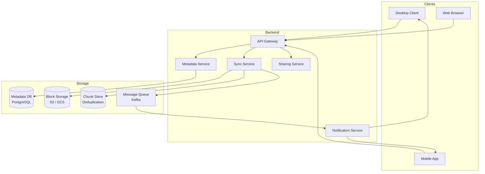
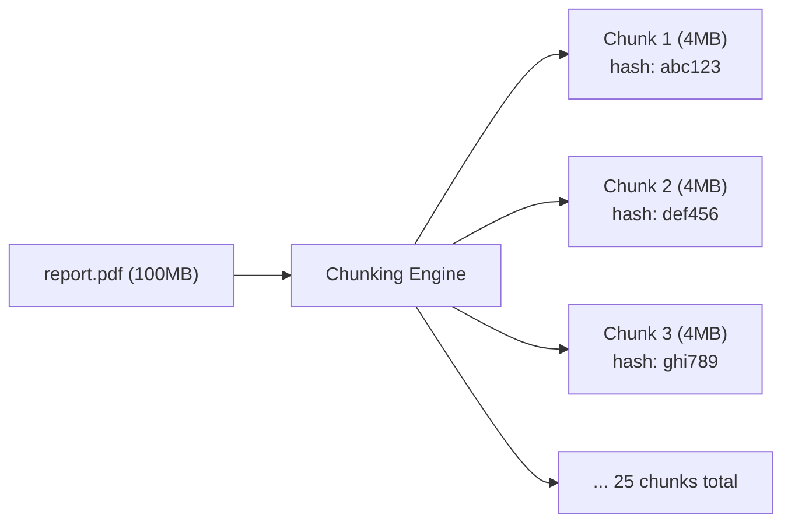
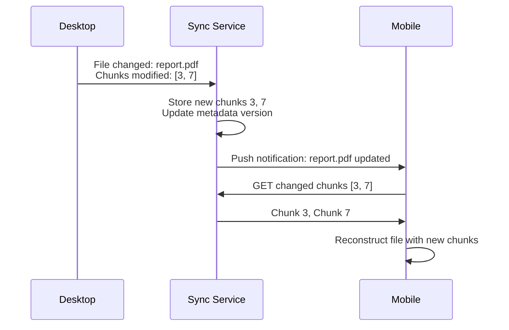
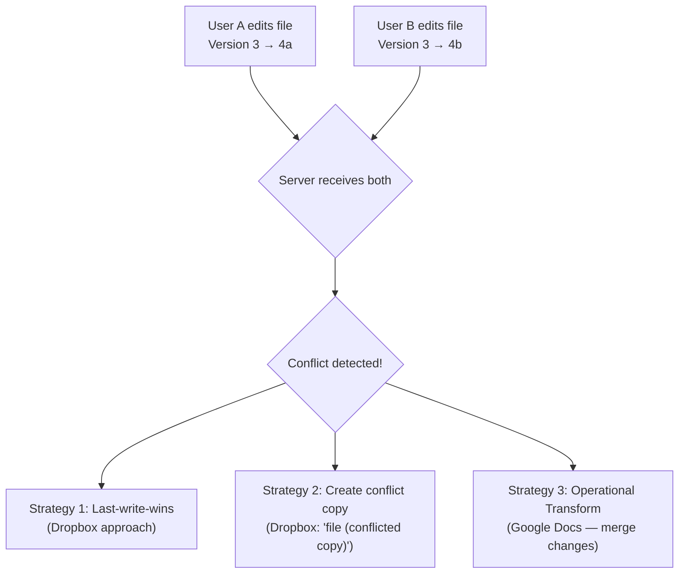
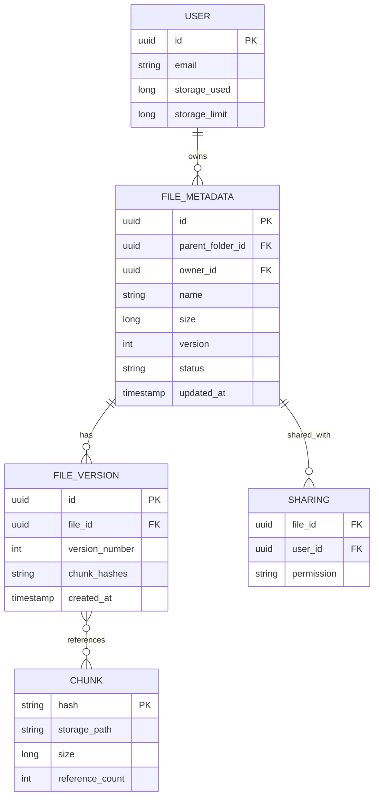

# Design Google Drive / Dropbox — The Shared Locker System

<!-- sdlc-stage:start -->
<div class="sdlc-stage">

📍 **SDLC stage: Design — architecture** · Extra case study for [Chapter 2 · System Design (HLD)](/tutorials/journey-02-system-design)

</div>
<!-- sdlc-stage:end -->

## The Shared Locker Analogy

Imagine a locker system where you put a document in your locker, and instantly your friend across the city sees the same document in their locker. If you both edit it at the same time, the system merges your changes without losing either. If the locker building burns down, your documents are safe because copies exist in three other buildings. That's cloud file storage.

---

## 1. Requirements

### Functional
- Upload, download, delete files (any size, any type)
- Sync files across multiple devices automatically
- Share files/folders with other users (view/edit permissions)
- File versioning — restore previous versions
- Offline editing — sync when back online

### Non-Functional
- **Reliability**: Never lose a file (99.999999999% durability — 11 nines)
- **Consistency**: All devices see the same file state eventually
- **Scale**: Billions of files, petabytes of storage
- **Bandwidth**: Minimize data transfer (don't re-upload entire file for small changes)

---

## 2. High-Level Architecture



---

## 3. Chunking — The Key Innovation

Instead of uploading entire files, split them into chunks (4MB each):



**Why chunking?**

| Benefit | Explanation |
|---------|------------|
| **Delta sync** | Edit page 5 of a 100MB PDF → only re-upload 1 chunk (4MB), not 100MB |
| **Deduplication** | If two users upload the same file, chunks are identical → store once |
| **Parallel upload** | Upload 25 chunks simultaneously instead of 1 large file |
| **Resume** | Upload interrupted? Resume from the last successful chunk |

```java
// Client-side chunking
public List<Chunk> chunkFile(File file) {
    List<Chunk> chunks = new ArrayList<>();
    byte[] buffer = new byte[4 * 1024 * 1024]; // 4MB
    try (InputStream is = new FileInputStream(file)) {
        int bytesRead;
        int index = 0;
        while ((bytesRead = is.read(buffer)) != -1) {
            byte[] data = Arrays.copyOf(buffer, bytesRead);
            String hash = sha256(data);
            chunks.add(new Chunk(index++, hash, data));
        }
    }
    return chunks;
}
```

<div class="callout-info">

**Key insight**: Before uploading a chunk, the client sends its hash to the server. If the server already has a chunk with that hash (from any user), it skips the upload. This is **content-addressable storage** — Dropbox reported 75% of uploads are deduplicated this way.

</div>

---

## 4. Sync Protocol — How Devices Stay in Sync



<div class="callout-scenario">

**Scenario**: User edits a 500MB video file on their laptop. Only the first 10 seconds changed (one 4MB chunk). **Decision**: The client detects which chunks changed by comparing hashes. Only the modified chunk (4MB) is uploaded instead of the entire 500MB file. The mobile device downloads only that 4MB chunk. This saves 99.2% bandwidth.

</div>

---

## 5. Conflict Resolution — The Hard Problem

What happens when two people edit the same file simultaneously?



| Strategy | When to use | Trade-off |
|----------|------------|-----------|
| **Last-write-wins** | Simple files, low collaboration | May lose changes |
| **Conflict copy** | Binary files (images, PDFs) | User must manually merge |
| **Operational Transform** | Text documents, real-time collab | Complex to implement |

<div class="callout-tip">

**Applying this** — For a Dropbox-like system, use conflict copies for binary files and OT/CRDT for text files. Always preserve both versions — never silently discard a user's changes. Notify the user about conflicts immediately.

</div>

---

## 6. Metadata Database Schema



---

<!-- practice-pack -->

## 🏢 More Real-World Scenarios

<div class="callout-scenario">

**Scenario**: A designer edits a 2 GB Photoshop file on a laptop that was offline on a flight, while a colleague edits the same shared file at the office. When the laptop reconnects, the sync client silently uploads its version and the colleague's 5 hours of work disappear. **Decision**: Use version-based optimistic concurrency: each upload states the version it was based on; if the server's current version differs, the server rejects it as a conflict instead of overwriting. The client then saves its copy as `design (Ankit's conflicted copy).psd` next to the server version — no data loss, and the users resolve it. Keep version history so even mistakes are recoverable.

</div>

## 🏋️ Practice Assignments

### 🟢 Low — Build the reflexes

**L1.** Why split files into chunks (e.g., 4 MB) instead of uploading them whole?

<details>
<summary>Show answer</summary>

Resumable uploads (retry only the failed chunk), parallel transfer, **delta sync** (editing one part of a big file re-uploads only changed chunks), and **deduplication** (identical chunks — even across users and files — are stored once, keyed by their content hash).

</details>

**L2.** What lives in the metadata database vs the block store?

<details>
<summary>Show answer</summary>

Metadata DB: users, files and folders (tree), versions, the ordered list of chunk hashes per version, sharing permissions, and devices' sync cursors — small, relational, transactional. Block store (object storage like S3): the chunk bytes keyed by content hash — huge, immutable, cheap.

</details>

**L3.** How does a client learn that a file changed on another device?

<details>
<summary>Show answer</summary>

The client keeps a sync cursor (the last change journal position it processed). A notification channel (long poll, WebSocket, or push) tells it "something changed"; the client then asks the metadata service for all changes since its cursor, downloads new chunks it doesn't have, and advances the cursor.

</details>

### 🟡 Medium — Apply it

**M1.** Fixed-size chunks break dedup when one byte is inserted at the start of a file. Why, and what's the fix?

<details>
<summary>Show answer</summary>

Inserting a byte shifts every subsequent fixed-size boundary, so every chunk hash changes and the whole file is re-uploaded. **Content-defined chunking** (rolling hash such as Rabin fingerprinting or FastCDC) places boundaries where the content matches a pattern, so after an insertion boundaries realign after the edited region and only one or two chunks change.

</details>

**M2.** Design the upload API for a 10 GB file over a flaky connection.

<details>
<summary>Show answer</summary>

1) Client chunks and hashes the file. 2) `POST /uploads` with the list of chunk hashes → server returns which hashes it already has (dedup) and an upload session ID. 3) Client uploads missing chunks directly to object storage via presigned URLs, in parallel, retrying individual chunks. 4) `POST /uploads/{session}/commit` with the ordered hash list and the base version → server verifies all chunks exist and creates the new file version atomically. Sessions expire after a few days; orphaned chunks are garbage-collected.

</details>

**M3.** How do you implement "share a folder with edit access" efficiently for nested folders?

<details>
<summary>Show answer</summary>

Store permissions on the shared folder (ACL entry: folder ID, grantee, role), not on every file inside. Permission check for a file walks up its ancestor path until it finds an applicable ACL (cache ancestor paths, or store a materialized path / closure table for fast lookups). Shared folders appear in the recipient's tree as a mount point referencing the original folder. Changes then automatically apply to all contents, and revoking access is one row.

</details>

### 🔴 High — Think like a senior

**H1.** Global dedup saves storage, but it can leak information. Explain and decide.

<details>
<summary>Show answer</summary>

If uploads skip chunks the server already has, a user can learn whether *someone else* stored a specific file (upload a known document and watch whether it uploads instantly) — a side channel that can confirm possession of sensitive files. Mitigations: dedup only within a user/tenant (cross-user dedup off), always upload the full data but dedup server-side (no bandwidth savings visible to the client), or use convergent encryption with per-tenant keys. Most enterprise products dedup within a tenant only; the savings from cross-tenant dedup rarely outweigh the privacy risk.

</details>

**H2.** How do you delete data safely when chunks are shared across files and versions?

<details>
<summary>Show answer</summary>

Track references: each chunk has a reference count (or is found by mark-and-sweep over all live versions). Deleting a file version decrements counts; chunks with zero references become candidates for deletion after a grace period (protects against races with in-flight uploads that just discovered the chunk exists). Run garbage collection as a background job with careful concurrency (mark chunks "pending delete", re-check references before removing). Version retention policies (e.g., 30 days of history) and legal holds must be applied before GC.

</details>

## 🛠️ Mini Project — Personal Dropbox Clone

**Goal**: Chunked, deduplicated sync between two folders. 1 week of evenings.

**Build**

1. Spring Boot metadata service (PostgreSQL: files, versions, version_chunks, change_journal) + MinIO for chunks.
2. A Java sync client that watches a folder (`WatchService`), chunks files with FastCDC or fixed 4 MB chunks, uploads missing chunks via presigned URLs, and commits versions with the base version.
3. A second client instance on another folder that pulls changes via long polling and the change journal.
4. Conflict handling: simultaneous edits produce a "conflicted copy" instead of overwriting.
5. Measure: edit 1 KB in the middle of a 100 MB file — how many bytes were re-uploaded with fixed vs content-defined chunking?

**Acceptance criteria**: offline edits sync on reconnect; no lost writes in a conflict test; README with dedup and delta-sync measurements.

---

## 🎯 Interview Corner

<div class="callout-interview">

**Q: "How would you handle a user uploading a 10GB file?"**

Chunking + parallel upload + resumability. Split the 10GB file into 2,500 chunks of 4MB each. Upload chunks in parallel (8-16 concurrent uploads). Before each chunk upload, send the hash — if the server has it (deduplication), skip it. If the upload is interrupted, the client resumes from the last successful chunk (server tracks which chunks are received). Use multipart upload to S3 — each chunk is a part. After all chunks are uploaded, the server assembles the file metadata (ordered list of chunk hashes). The actual chunks stay in S3 as individual objects. For download, the client fetches chunks in parallel and reassembles locally.

**Follow-up trap**: "What about the 11 nines durability?" → S3 provides this natively by replicating data across 3+ AZs. Each chunk is stored with S3's built-in redundancy. We don't need to implement replication ourselves.

</div>

<div class="callout-interview">

**Q: "How does sync work when the user is offline?"**

The desktop client maintains a local database (SQLite) tracking file states. When offline, all changes are recorded locally with timestamps. When the connection restores, the client sends a "diff" to the server — list of files changed, with their chunk hashes. The server compares with its state and identifies: (1) files only changed locally → upload, (2) files only changed remotely → download, (3) files changed both locally and remotely → conflict resolution. The sync protocol uses vector clocks or version numbers to determine ordering. Dropbox uses a "cursor" — a server-side pointer to the last sync state for each device.

</div>

<div class="callout-interview">

**Q: "How do you implement file sharing with permissions?"**

A sharing table maps (file_id, user_id, permission). Permissions: VIEWER (read-only), EDITOR (read-write), OWNER (full control). When User A shares a file with User B, an entry is created in the sharing table. When User B accesses the file, the API checks the sharing table. For shared folders, permissions cascade to all files within. For link sharing ("anyone with the link"), generate a unique token and store it with the file — no user_id needed, just validate the token. Revocation is instant — delete the sharing entry or invalidate the token.

</div>

---

## Quick Reference

| Concept | One-Liner |
|---------|-----------|
| Chunking | Split files into fixed-size blocks for efficient sync |
| Content-addressable | Store chunks by their hash — identical content stored once |
| Delta Sync | Only transfer changed chunks, not entire files |
| Conflict Copy | Create duplicate when two users edit simultaneously |
| Vector Clock | Track causality of changes across distributed devices |
| Multipart Upload | Upload large files as parallel parts to S3 |

---

> **The magic of cloud storage isn't storing files — it's making millions of devices believe they're all looking at the same folder, even when they're not.**

---

<!-- journey-link:start -->

<div class="callout-journey">

🛒 **ShopNorth Journey** — Extra case study — ShopNorth stores product images in object storage behind a CDN: the same building blocks at a smaller scale.

**Continue the story:** [Chapter 2 · System Design (HLD)](/tutorials/journey-02-system-design) · **New here?** [Start the journey](/tutorials/journey-start)

</div>

<!-- journey-link:end -->
