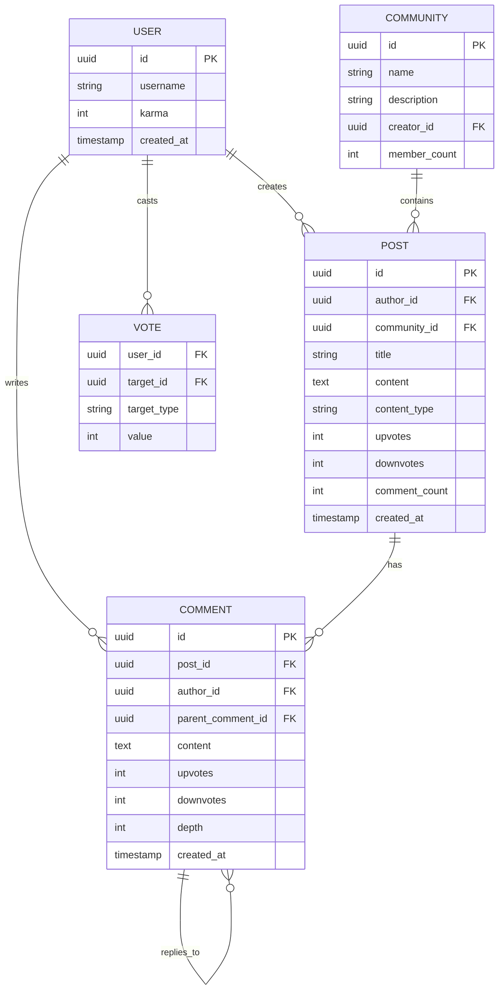
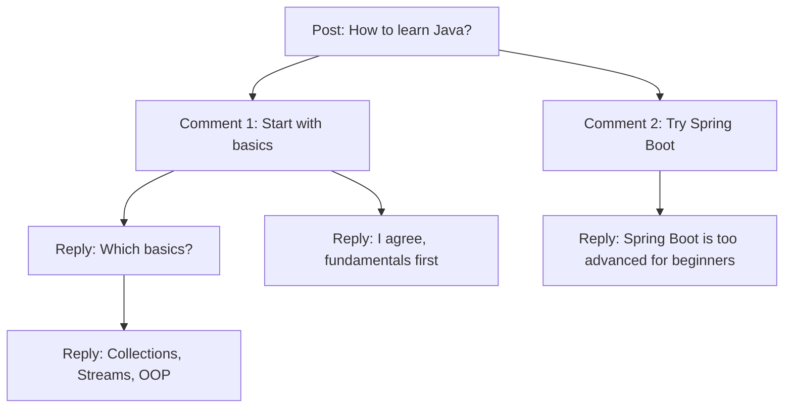
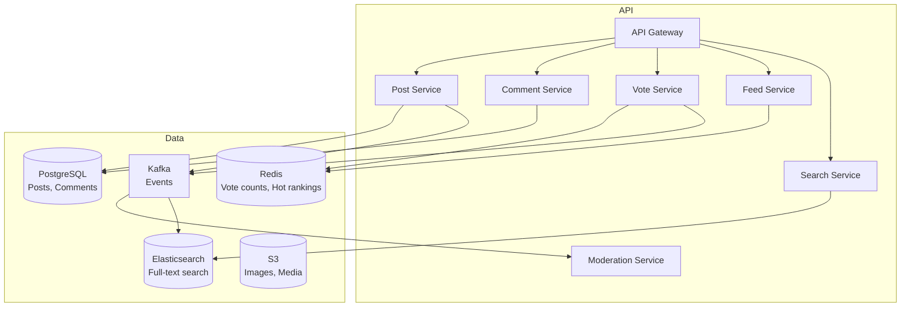

# Design Reddit / Quora / HackerNews — The Town Hall Analogy

## The Town Hall Analogy

Imagine a town hall where anyone can stand up and ask a question or share a story. Others vote on whether it's interesting (upvote) or not (downvote). The most popular topics rise to the top of the bulletin board. People can comment, reply to comments, and the whole thing is organized by topics (subreddits/tags). That's a forum system.

---

## 1. Requirements

### Functional
- Create posts with text, images, links
- Tag/categorize posts (subreddits, topics)
- Upvote/downvote posts and comments
- Nested comments (threaded discussions)
- Newsfeed based on followed tags/communities
- Search posts by content, tags, author
- Moderation (remove posts, ban users)

### Non-Functional
- **Scale**: Millions of posts, billions of votes
- **Real-time**: Comments appear instantly
- **Ranking**: Hot, Top, New, Controversial sorting
- **Search**: Full-text search across all posts

---

## 2. Data Model



---

## 3. Ranking Algorithms

### Reddit's Hot Ranking

```java
public double hotScore(int ups, int downs, long createdAtEpoch) {
    int score = ups - downs;
    double order = Math.log10(Math.max(Math.abs(score), 1));
    int sign = score > 0 ? 1 : (score < 0 ? -1 : 0);
    long seconds = createdAtEpoch - 1134028003; // Reddit epoch
    return sign * order + seconds / 45000.0;
}
```

**Key insight**: The time component (`seconds / 45000`) means newer posts get a boost. A post needs exponentially more votes to stay on top as it ages. A 1-day-old post with 1000 upvotes ranks similarly to a 1-hour-old post with 100 upvotes.

### HackerNews Ranking

```
Score = (votes - 1) / (age_in_hours + 2) ^ gravity

gravity = 1.8 (higher = faster decay)
```

| Sort | Algorithm | Use case |
|------|-----------|----------|
| **Hot** | Score + time decay | Default homepage |
| **Top** | Pure vote count (in time window) | "Best of all time" |
| **New** | Chronological | Discover fresh content |
| **Controversial** | High votes AND high downvotes | Divisive topics |

<div class="callout-scenario">

**Scenario**: A post gets 10,000 upvotes in 1 hour. Another gets 10,000 upvotes over 1 week. **Decision**: Hot ranking puts the 1-hour post much higher — velocity matters more than total count. This prevents old viral posts from permanently dominating the front page.

</div>

---

## 4. Nested Comments — Tree Structure



**Storage approaches:**

| Approach | Query | Write | Best for |
|----------|-------|-------|----------|
| **Adjacency List** (parent_id) | Recursive queries (slow) | Fast | Small threads |
| **Materialized Path** ("/1/3/7/") | LIKE query on path | Update all children on move | Medium threads |
| **Nested Set** (left/right numbers) | Single range query | Expensive writes | Read-heavy, rarely modified |
| **Closure Table** | Fast subtree queries | Extra table, more writes | Large threads, frequent reads |

<div class="callout-tip">

**Applying this** — For Reddit-scale comments, use adjacency list (parent_comment_id) with a `depth` column. Fetch comments in batches: first load top-level comments (depth=0), then load replies on-demand when user clicks "show replies." This avoids loading entire 10,000-comment threads at once. Cache hot threads in Redis as pre-built trees.

</div>

---

## 5. Architecture



---

## 6. Vote Handling at Scale

Votes are the most write-heavy operation. Reddit gets millions of votes per minute.

```java
// Don't update post table on every vote — use Redis + async sync
public void vote(String userId, String postId, int value) {
    // 1. Check if user already voted (prevent double-voting)
    String voteKey = "vote:" + userId + ":" + postId;
    Integer existing = redis.get(voteKey);

    if (existing != null && existing == value) return; // already voted same way

    // 2. Update vote in Redis
    redis.set(voteKey, value);

    // 3. Update post score atomically
    int delta = value - (existing != null ? existing : 0);
    redis.hincrby("post:" + postId, "score", delta);

    // 4. Async: persist to database
    kafka.send("votes", new VoteEvent(userId, postId, value));
}
```

<div class="callout-info">

**Key insight**: Vote counts in Redis are the source of truth for display. The database is updated asynchronously via Kafka. If Redis goes down, the database has the last-synced counts. This handles millions of votes/minute without database bottleneck.

</div>

---

<!-- practice-pack -->

## 🏢 More Real-World Scenarios

<div class="callout-scenario">

**Scenario**: A post about a celebrity goes viral on a discussion forum: 50,000 votes per minute land on one row, and the database row lock on `posts.score` makes every vote request queue behind the others. Vote latency hits 8 seconds and the vote button appears broken. **Decision**: Don't update one counter row synchronously per vote. Record each vote idempotently (one row per user per post, so duplicates and changes are handled), and aggregate counts asynchronously: a stream processor sums vote deltas per post every few seconds and updates the score. Or use sharded counters (N counter rows per hot post, summed on read) and cache the displayed score. Users see their own vote immediately, optimistically in the UI.

</div>

## 🏋️ Practice Assignments

### 🟢 Low — Build the reflexes

**L1.** Why do "hot" ranking formulas include time, and what happens without it?

<details>
<summary>Show answer</summary>

Without time decay, old posts with many accumulated votes stay at the top forever and new content never surfaces. Formulas like Hacker News's `(votes − 1) / (age_hours + 2)^1.8`, or Reddit's log-scaled score plus a time term, let new posts with fast early votes outrank older posts, so the front page keeps changing.

</details>

**L2.** How do you store a vote so a user can't vote twice, but can change their vote?

<details>
<summary>Show answer</summary>

A `votes` table keyed by `(user_id, post_id)` with a value of +1 / −1 (unique constraint). Upsert on vote: the score changes by `new − old` (e.g., switching from +1 to −1 is −2). Removing a vote deletes the row and subtracts the old value. The unique key enforces one vote per user and makes retries idempotent.

</details>

**L3.** Name two ways to store nested comment trees.

<details>
<summary>Show answer</summary>

**Adjacency list** (`parent_id` column; simple writes, recursive queries for reads), **materialized path** (`path = '0001.0005.0012'`; fetch a whole thread with a prefix query and sort by path), plus closure tables (an ancestor-descendant table, fast subtree queries, more writes) and nested sets (fast reads, expensive inserts — poor for active threads).

</details>

### 🟡 Medium — Apply it

**M1.** Load a thread with 5,000 comments quickly, showing the best comments first.

<details>
<summary>Show answer</summary>

Don't render all 5,000. Load top-level comments sorted by score (e.g., the top 50), each with its top 3 replies, to a limited depth; show "load more replies" links that fetch subtrees on demand by parent ID or path prefix. Precompute a per-thread cache (in Redis) of the first page of the tree, invalidated or refreshed asynchronously as votes and new comments arrive. Sorting by "best" uses a confidence score (e.g., Wilson score lower bound) rather than raw net votes.

</details>

**M2.** Design the front page for 10M users across thousands of communities.

<details>
<summary>Show answer</summary>

Precompute ranked post lists per community (refreshed every minute or so from scores and age) in Redis sorted sets. A user's home feed merges the top N of each community they joined (k-way merge by hot score), with caching per user for a short time. For users in hundreds of communities, sample or cap per-community contributions. A global "popular" list is computed once and shared by all logged-out users (and cached at the CDN).

</details>

**M3.** How do you implement moderation tools (remove posts, ban users, automod rules)?

<details>
<summary>Show answer</summary>

Soft-delete content (status: removed by moderator, with reason and actor), so it disappears from listings but is kept for audit and appeals. Moderator actions go into a moderation log per community. Bans are records (user, community, until, reason) checked on write. Automod: per-community rules (keyword patterns, account age, karma thresholds) evaluated asynchronously on new content — or synchronously for fast decisions — plus a report queue that ranks reported content by report count and severity.

</details>

### 🔴 High — Think like a senior

**H1.** A community of 1M members gets brigaded: another group mass-downvotes all its posts. Detect and respond.

<details>
<summary>Show answer</summary>

Signals: a sudden spike in votes from accounts that are not members/regular participants, arriving via links from a specific external thread (referrer data), coordinated timing, and new or low-activity accounts. Response: weight votes by account reputation and community participation (votes still recorded but counted less), freeze scoring for affected posts, rate-limit voting for accounts arriving via the external link, and notify moderators. Keep the vote-weighting logic opaque so it can't be easily gamed, and audit for false positives.

</details>

**H2.** Your score aggregation pipeline is down for 20 minutes. What does the user see, and how does the system recover?

<details>
<summary>Show answer</summary>

Votes are still recorded durably (the votes table or the event log), so no data is lost — the displayed scores are just stale, and the user sees their own vote via optimistic UI. Rankings freeze briefly (acceptable). On recovery, the stream processor replays from its last committed offset and catches up; because counts are derived from idempotent vote records, you can also recompute any post's score from scratch (`SUM(value)` over its votes) to fix drift. Monitor consumer lag and alert well before users notice.

</details>

## 🛠️ Mini Project — Mini Hacker News

**Goal**: Ranking, voting at scale, and comment trees. 1 week of evenings.

**Build**

1. Spring Boot + PostgreSQL: users, posts, votes (`UNIQUE(user_id, post_id)`), comments with materialized paths.
2. Ranking: hot score computed by a scheduled job every 30 s into a Redis sorted set; endpoints for top, new, and best.
3. Voting: idempotent upsert + Kafka event; a consumer aggregates score deltas per post every 2 s.
4. Comment threads: top-level pagination plus "load more replies".
5. Load test: 5,000 votes/second on one post — compare synchronous `UPDATE posts SET score = score + 1` vs async aggregation (latency and lock waits).

**Acceptance criteria**: no double votes under concurrent retries; vote endpoint p99 < 50 ms under the hot-post test with async aggregation; README with both measurements.

---

## 🎯 Interview Corner

<div class="callout-interview">

**Q: "How would you design the feed for a user who follows 500 communities?"**

Pre-compute a personalized feed per user. When a post is created in a community, fanout to all members' feed caches (similar to Facebook newsfeed). For large communities (1M+ members), use fanout-on-read — fetch top posts from each community at read time. The feed service merges posts from all 500 communities, applies the hot ranking algorithm, and returns the top 50. Cache the computed feed in Redis with a 5-minute TTL. For real-time updates, use long polling — client asks "any new posts since my last fetch?" every 30 seconds.

**Follow-up trap**: "How do you handle a user joining a new community?" → Backfill their feed with the top 10 recent posts from that community. Don't recompute the entire feed — just merge the new community's posts into the existing cached feed.

</div>

<div class="callout-interview">

**Q: "How do you prevent vote manipulation (bots, brigading)?"**

Multiple layers: (1) **Rate limiting** — max 100 votes per user per hour. (2) **Account age** — new accounts (< 7 days) have reduced vote weight. (3) **IP tracking** — multiple accounts voting from the same IP get flagged. (4) **Behavioral analysis** — ML model detects patterns (voting on the same posts as a group, voting immediately after post creation). (5) **Shadow banning** — suspicious accounts' votes are counted locally (they see their vote) but not globally. (6) **Vote fuzzing** — Reddit shows approximate vote counts, not exact, to make it harder for manipulators to verify their impact.

</div>

<div class="callout-interview">

**Q: "How would you store and serve a comment thread that can be 10 levels deep with thousands of replies?"**

I'd use a materialized path or a `root_post_id` + `parent_id` model, indexed so that one query fetches a thread's comments ordered for display. Rendering everything at once doesn't scale, so the API returns a pruned tree: top-level comments sorted by a confidence score (Wilson lower bound, not raw votes), each with a few top replies down to a depth limit, and "continue this thread" links that load subtrees on demand. The first page of popular threads is cached and refreshed asynchronously as votes arrive. Deep-link to a single comment by loading its ancestors by path plus its own subtree.

**Follow-up trap**: "Why not a graph database?" → The access pattern is a simple tree under one root, read far more than written. A relational table with path or parent indexes handles it well. A graph database adds operational cost without solving a real problem here.

</div>

---

## Quick Reference

| Concept | One-Liner |
|---------|-----------|
| Hot Ranking | Score + time decay — newer posts need fewer votes to rank high |
| Karma | User reputation based on accumulated upvotes |
| Nested Comments | Tree structure with parent_comment_id |
| Vote Fuzzing | Show approximate counts to prevent manipulation |
| Shadow Ban | User thinks they're active but their actions are invisible |
| Fanout | Push new posts to followers' feed caches |

---

> **A forum is democracy in action — the crowd decides what's important. Your job as the architect is to make sure the crowd's voice is heard fairly, at scale, in real-time.**

---

<!-- journey-link:start -->

<div class="callout-journey">

🛒 **ShopNorth Journey** — Extra case study — hot counters and ranking queries are cousins of ShopNorth's hot-SKU stock updates and business reports.

**Continue the story:** [Chapter 4 · Data Model & SQL](/tutorials/journey-04-data-sql) · **New here?** [Start the journey](/tutorials/journey-start)

</div>

<!-- journey-link:end -->
