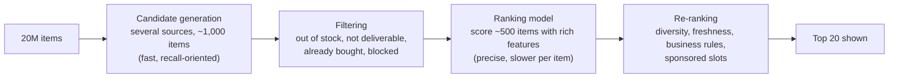
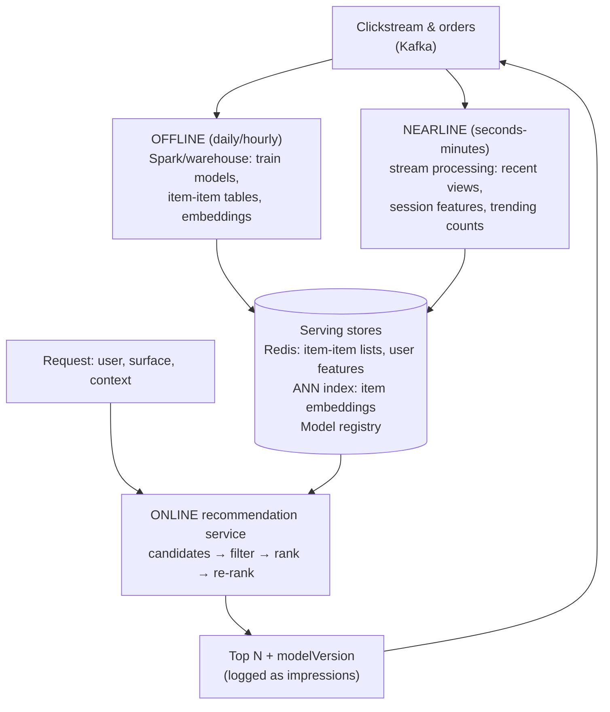

# Design a Recommendation System — Candidate Generation, Ranking, Serving, and Measuring What Works

<!-- sdlc-stage:start -->
<div class="sdlc-stage">

📍 **SDLC stage: Maintenance & evolution** · ShopNorth uses this in [Chapter 15 · Evolving with AI](/tutorials/journey-15-ai)

</div>
<!-- sdlc-stage:end -->

> **System Design · Classic Designs** — "Customers who bought this also bought…" drives a big share of revenue at Amazon, Netflix, Flipkart, and Swiggy. You don't need to be an ML researcher to design one: the architecture is a funnel of retrieval and ranking stages, and most of the hard problems are data freshness, cold start, latency, and measuring impact honestly.

---

## Table of Contents

1. The Bookshop Owner Analogy
2. Requirements and Clarifying Questions
3. Signals — What the System Learns From
4. The Recommendation Funnel: Candidates → Ranking → Re-ranking
5. Candidate Generation Techniques
6. Ranking with Features
7. Cold Start
8. Architecture: Offline, Nearline, Online
9. Serving Within a Latency Budget
10. Measuring Impact: Offline Metrics vs A/B Tests
11. Feedback Loops, Bias, and Business Rules
12. Where LLMs Fit
13. Practice Assignments (Low / Medium / High)
14. Mini Project — "Because You Watched" on MovieLens
15. Interview Corner
16. Quick Reference

---

## 1. The Bookshop Owner Analogy

A good bookshop owner recommends books in three ways:

- **"People who liked this also liked…"** — she remembers what customers bought together → **collaborative filtering**.
- **"You like thrillers by Scandinavian authors, try this one"** — she knows the books' attributes → **content-based**.
- **"This one's selling fast this week"** — **popularity/trending**, useful for a stranger who just walked in → **cold start**.

She also *narrows down* first — she doesn't consider all 50,000 books for you; she thinks of 30 candidates, then picks the best 5 for this moment (you're buying a gift, it's Diwali) → **candidate generation, then ranking**.

---

## 2. Requirements and Clarifying Questions

| Question | Why it matters |
|----------|----------------|
| Which surface? Home feed, "similar items" on a product page, "frequently bought together", email digest | Different latency and personalization needs |
| Catalog size and churn? (10K movies vs 100M products; food menus changing hourly) | Retrieval technique, freshness |
| Users? (logged-in history vs anonymous) | Cold-start strategy |
| Objective? Clicks, purchases, watch time, long-term retention, GMV | Defines the ranking target and success metric |
| Latency budget? | Often 50-150 ms for the whole recommendation call |
| Business constraints? (in stock, deliverable to pincode, age-appropriate, sponsored slots) | Filtering and re-ranking rules |

**Example target** (e-commerce home page): 50M monthly users, 20M products, p99 < 120 ms, personalized for logged-in users, trending for anonymous users, recommendations reflect a user's actions within minutes.

---

## 3. Signals — What the System Learns From

| Signal | Type | Notes |
|--------|------|-------|
| Purchases, add-to-cart | Implicit, strong | Sparse but high intent |
| Clicks, views, dwell time, watch completion | Implicit, weaker | Plentiful; noisy (clickbait, accidental taps) |
| Ratings, reviews, likes | Explicit | Rare |
| Searches | Implicit intent | Great short-term signal |
| Negative signals: "not interested", skips, returns | Implicit/explicit negative | Often ignored — shouldn't be |
| Item attributes: category, brand, price, text, images | Content | Solves item cold start |
| Context: time, device, location, season | Context | "Breakfast at 8 AM" on food apps |

<div class="callout-tip">

**Applying this** — Log **impressions** (what was shown), not just clicks. Without knowing what a user *saw and ignored*, you can't compute CTR, can't learn negatives, and can't evaluate new models fairly. An event schema with `userId, itemId, surface, position, modelVersion, timestamp, action` is the foundation of everything else.

</div>

---

## 4. The Recommendation Funnel: Candidates → Ranking → Re-ranking



Scoring 20M items with a heavy model per request is impossible within 100 ms; retrieving 1,000 good candidates cheaply and ranking those precisely is the universal pattern (YouTube, Pinterest, Amazon, Netflix all describe variants of it).

---

## 5. Candidate Generation Techniques

| Source | How | Strength |
|--------|-----|----------|
| **Item-to-item co-occurrence** | Items frequently bought/viewed together, normalized | Simple, strong, explainable ("bought together") |
| **Collaborative filtering (matrix factorization)** | Learn user and item vectors so their dot product predicts interaction | Personalization from behavior |
| **Embedding retrieval (two-tower models)** | A user tower and an item tower produce vectors; nearest neighbors via ANN index | Scales to huge catalogs; includes features |
| **Content-based** | Similar attributes/text/image embeddings | New items, niche items |
| Recent-activity based | Items similar to the last viewed/searched ones | Captures current intent |
| Popular / trending (by segment, region) | Counts over recent windows | Cold start, fallback |

### Item-to-item co-occurrence in SQL (a strong baseline)

```sql
-- "Customers who bought X also bought Y" — computed nightly over the last 90 days
WITH baskets AS (
  SELECT DISTINCT user_id, product_id
  FROM order_items WHERE ordered_at > now() - interval '90 days'
),
pairs AS (
  SELECT a.product_id AS item, b.product_id AS related, COUNT(*) AS together
  FROM baskets a JOIN baskets b ON a.user_id = b.user_id AND a.product_id <> b.product_id
  GROUP BY 1, 2
  HAVING COUNT(*) >= 5                         -- minimum support: ignore noise
),
popularity AS (SELECT product_id, COUNT(*) AS buyers FROM baskets GROUP BY 1)
SELECT p.item, p.related,
       p.together / sqrt(pa.buyers::float * pb.buyers)  AS score   -- cosine-style normalization
FROM pairs p
JOIN popularity pa ON pa.product_id = p.item
JOIN popularity pb ON pb.product_id = p.related
ORDER BY p.item, score DESC;
```

<div class="callout-warn">

**Without normalization, everything recommends the bestsellers.** Raw co-occurrence counts say "people who bought a phone case also bought… a charger, like everyone else." Normalizing by item popularity (cosine, Jaccard, lift, or PMI) surfaces *specifically related* items. Also watch the self-join cost: for power users with thousands of items, cap items per user or sample — pair counts grow quadratically.

</div>

---

## 6. Ranking with Features

The ranker predicts, for each (user, candidate, context), the probability of the objective (click, purchase, watch completion).

| Feature group | Examples |
|---------------|----------|
| User | Past categories, price range, recency/frequency, device, location |
| Item | Category, price, rating, popularity, freshness, stock |
| User × item | Similarity between user embedding and item embedding, past interactions with the brand |
| Context | Time of day, day of week, surface, position |
| Candidate source | Which generator proposed it (and its score) |

| Model | When |
|-------|------|
| **Gradient-boosted trees** (XGBoost/LightGBM) | Strong, fast, the common first production ranker |
| Deep models (DLRM-style, transformers over sequences) | Very large scale, sequence-aware |
| Multi-objective (click + purchase + return risk) | Weighted blend tuned by business goals |

<div class="callout-info">

**Feature consistency (training/serving skew)** is the most common silent failure: features computed one way in the offline training pipeline and another way in the online service. A **feature store** (Feast, Tecton, or a disciplined shared library + Redis) computes and serves the same features for both.

</div>

---

## 7. Cold Start

| Case | Strategy |
|------|----------|
| **New user** (no history) | Trending by region/segment, onboarding choices ("pick 3 genres"), context (device, location, referral source), then fast adaptation from the first clicks in the session |
| **New item** (no interactions) | Content-based similarity (text/image embeddings, attributes), exploration budget (show new items to a small share of relevant users), seller-provided metadata |
| New system (no data at all) | Popularity + editorial curation + content similarity, while collecting interaction logs |

<div class="callout-scenario">

**Scenario**: A food-delivery app launches in a new city. The recommender shows nothing useful for two weeks because it relies on collaborative filtering from local order history. **Decision**: Use a **fallback chain**: city-level popularity (from the first days), cuisine preferences transferred from the user's orders in other cities, content similarity between restaurants (cuisine, price, dishes), and explicit exploration of new restaurants — then shift weight toward collaborative signals as data accumulates.

</div>

---

## 8. Architecture: Offline, Nearline, Online



| Layer | Freshness | Examples |
|-------|-----------|----------|
| Offline | Hours-days | Model training, embeddings, co-occurrence tables |
| Nearline | Seconds-minutes | "Recently viewed", session intent, trending in last hour, inventory changes |
| Online | Per request | Assemble, filter, rank, apply rules |

---

## 9. Serving Within a Latency Budget

| Step | Budget (example, 120 ms total) |
|------|-------------------------------|
| Fetch user features + recent activity (Redis) | 10 ms |
| Candidate generation — sources in **parallel** | 25 ms |
| Filtering (stock, deliverability) | 10 ms |
| Ranking ~500 candidates (in-process model or model server) | 40 ms |
| Re-ranking + response | 10 ms |
| Headroom | 25 ms |

```java
public List<Recommendation> recommend(RecRequest req) {
    UserContext ctx = userFeatures.load(req.userId());                               // Redis
    List<CompletableFuture<List<Candidate>>> sources = candidateSources.stream()
        .map(s -> CompletableFuture.supplyAsync(() -> s.candidates(ctx, req), pool)
            .completeOnTimeout(List.of(), 25, TimeUnit.MILLISECONDS)                 // a slow source is skipped
            .exceptionally(e -> List.of()))
        .toList();
    List<Candidate> merged = dedupe(sources.stream().flatMap(f -> f.join().stream()).toList());
    List<Candidate> eligible = filters.apply(merged, ctx);                            // stock, pincode, bought
    List<Scored> ranked = ranker.score(ctx, eligible, 40);                            // falls back to source scores on timeout
    return reranker.apply(ranked, req.surface()).stream().limit(req.limit()).toList();
}
```

<div class="callout-tip">

**Applying this** — Always have a **cheap fallback** at every stage: if the ranker times out, use candidate scores; if personalization fails entirely, serve precomputed popular items for the segment. A recommendation widget that's slightly less personal is fine; a blank home page or a slow product page costs real revenue.

</div>

---

## 10. Measuring Impact: Offline Metrics vs A/B Tests

| Offline metric | Meaning |
|----------------|---------|
| Recall@K | Of items the user actually engaged with later, how many were in our top K |
| Precision@K, NDCG | Ranking quality, rewarding correct items at the top |
| Coverage, diversity, novelty | Are we recommending only bestsellers? |

| Online metric (A/B test) | Meaning |
|--------------------------|---------|
| CTR, add-to-cart rate, conversion | Direct engagement |
| Revenue / GMV per session | Business value |
| Long-term: retention, repeat purchase | Avoids optimizing short-term clicks at long-term cost |
| Guardrails: latency, returns rate, complaints | Don't win on clicks while losing elsewhere |

<div class="callout-interview">

**Q: "How do you know your new recommendation model is better?"**

Offline metrics like recall and NDCG at K on held-out, time-split data tell me whether it's worth testing. They often disagree with online results, because they're computed on logs produced by the old model. The decision comes from a controlled A/B test: randomized by user, a pre-registered primary metric such as conversion or revenue per session, guardrail metrics for latency, returns, and diversity, enough sample size and duration to cover weekly cycles, and checks on long-term effects like retention, not just clicks.

</div>

---

## 11. Feedback Loops, Bias, and Business Rules

| Problem | Why | Mitigation |
|---------|-----|------------|
| **Popularity bias / rich-get-richer** | Recommended items get more clicks, so they're recommended more | Normalization, diversity constraints, exploration |
| **Position bias** | Items at the top get clicked more regardless of relevance | Log positions; model or correct for position; randomize a small slice |
| Filter bubbles | Users see only what they already like | Diversity/novelty re-ranking, exploration |
| Clickbait optimization | CTR up, satisfaction down | Optimize deeper signals (purchase, completion, no return) |
| Business rules | Out of stock, restricted categories, sponsored placements | Filtering + re-ranking stage, clearly separated from the model |
| Fairness & compliance | Sellers/creators exposure, regulated categories | Explicit policies, audits |

---

## 12. Where LLMs Fit

| Use | How |
|-----|-----|
| Better item understanding | Generate attributes/tags and text embeddings from descriptions and reviews → improves content-based retrieval and cold start |
| Conversational recommendations | "Suggest a laptop under ₹60K for video editing" → retrieval from the catalog + LLM explanation (a RAG pattern) |
| Explanations | "Recommended because you watched X" phrased naturally |
| Not a replacement for | The high-volume, low-latency ranking of millions of candidates — classical retrieval + ranking stays the core |

---

## 13. 🏋️ Practice Assignments

### 🟢 Low — Build the reflexes

**L1.** Why not score all 20M products with the ranking model for every request?

<details>
<summary>Show answer</summary>

Latency and cost: even at 1 µs per item, 20M items take 20 seconds per request. Candidate generation narrows the pool to ~hundreds–thousands of relevant items cheaply (lookups, ANN search), so the expensive model runs only where it matters.

</details>

**L2.** Name one cold-start strategy for a new user and one for a new item.

<details>
<summary>Show answer</summary>

New user: popular/trending items for their region and segment, or onboarding preferences, then adapting to in-session clicks. New item: content-based similarity from its attributes/description/image embeddings, plus a small exploration budget to gather interactions.

</details>

**L3.** Why log impressions and not just clicks?

<details>
<summary>Show answer</summary>

To compute CTR (clicks / impressions), to learn from what users saw and ignored (negative signals), to correct for position bias, and to evaluate models fairly. Clicks alone can't distinguish "not shown" from "shown and ignored".

</details>

### 🟡 Medium — Apply it

**M1.** Design "Frequently bought together" for a product page with p99 < 30 ms.

<details>
<summary>Show answer</summary>

Offline: nightly co-purchase job (normalized co-occurrence over the last 90 days, minimum support, excluding same-product variants), producing top 50 related items per product. Store in Redis as `fbt:{productId}` → list of `(relatedId, score)`. Online: one Redis read + filter by stock and deliverability (batched lookups) + take top 3; fallback to category bestsellers if empty. Nearline: remove out-of-stock items via inventory events. Measure: attach rate and incremental revenue via an A/B test.

</details>

**M2.** Your model's offline recall@20 improved by 8%, but the A/B test shows no change in conversion. Give three possible explanations.

<details>
<summary>Show answer</summary>

(1) Offline evaluation bias: logs come from the old model's exposures, so the new model is rewarded for predicting what the old one already showed. (2) The metric mismatch: recall on clicks/views doesn't translate to purchases (maybe it recommends items people browse but don't buy). (3) Serving differences: training/serving feature skew, or the new model's latency causing more fallbacks online. Also: insufficient test power/duration, or the widget's position limits its impact.

</details>

**M3.** Make the home feed react within minutes to what the user just viewed.

<details>
<summary>Show answer</summary>

Nearline pipeline: clickstream events in Kafka → a stream processor (Flink/Kafka Streams) maintains per-user recent-activity lists (last 50 viewed/searched items, with timestamps) in Redis. Online: a "recent intent" candidate source fetches item-to-item neighbors of the last few viewed items (precomputed similar-items lists or ANN on embeddings), and the ranker gets session features (categories viewed this session). Time-decay weights so today's intent outranks last month's history.

</details>

### 🔴 High — Think like a senior

**H1.** Design the recommendation system for a video platform where the objective is long-term watch time, not clicks.

<details>
<summary>Show answer</summary>

Signals: watch completion ratio, rewatches, likes/shares, "not interested", subscriptions, satisfaction surveys. Funnel: candidates from subscriptions, co-watch neighbors, two-tower embeddings, trending, and exploration of new creators; ranker trained with a multi-objective target (expected watch time weighted by satisfaction signals, penalizing short abandoned views, i.e., clickbait). Re-ranking for diversity (topic, creator), freshness, and policy constraints. Evaluate with A/B tests on long-term metrics (7/28-day retention, total watch time per user, survey satisfaction) plus guardrails; use holdout groups over months to detect long-term effects. Address feedback loops with exploration and position-bias correction. Serving: nearline session features, a latency budget with fallbacks.

</details>

**H2.** A marketplace wants to add sponsored products into recommendations without destroying user trust. Design it.

<details>
<summary>Show answer</summary>

Separate organic ranking from ads: organic recommendations are ranked by relevance; sponsored candidates come from an ads auction (bid × predicted relevance/CTR, i.e., expected value with a quality floor) — irrelevant ads aren't shown regardless of bid. Re-ranking inserts sponsored items in fixed, clearly labeled slots (e.g., positions 3 and 8) with frequency caps. Measure both revenue and user metrics (organic CTR, conversion, complaints); run A/B tests on ad load. Comply with advertising disclosure rules. Keep models, logs, and budgets separate so ads optimization can't silently degrade organic quality, and track seller fairness.

</details>

---

## 14. 🛠️ Mini Project — "Because You Watched" on MovieLens

**Goal**: Build a real recommender end to end with public data. 1 week of evenings.

**Data**: the MovieLens dataset from GroupLens (the small or 1M version) — users, movies, ratings, timestamps.

**Build**

1. **Offline** (Java or Python + SQL): time-based split (train on earlier ratings, test on the last ones per user). Implement (a) popularity baseline, (b) item-item cosine co-occurrence on "liked" movies (rating ≥ 4), (c) optional matrix factorization (e.g., implicit ALS).
2. **Evaluate** recall@10 and NDCG@10 for each; add coverage (share of catalog ever recommended). Record results in a table.
3. **Serve**: load item-item neighbor lists into Redis; a Spring Boot endpoint `GET /users/{id}/recommendations` combining neighbors of the user's recent liked movies + popularity fallback, filtering already-watched movies, returning top 10 with a "because you watched X" explanation.
4. **Nearline**: a `POST /users/{id}/events` endpoint (rating/view) that updates the user's recent-activity list in Redis so recommendations change immediately.
5. Latency test: p99 of the endpoint under load.

**Acceptance criteria**

- The item-item model beats popularity on recall@10 (report numbers).
- The endpoint responds under 50 ms p99 locally and never returns watched movies.
- A README explaining the funnel, cold start behavior, and what you'd A/B test next.

---

## 🎯 Interview Corner

<div class="callout-interview">

**Q: "Design a recommendation system for an e-commerce home page."**

I'd build a funnel. Multiple candidate generators run in parallel — item-to-item co-purchase neighbors of recently viewed items, embedding-based retrieval from a two-tower model through an ANN index, category trends, and new-item exploration — producing about a thousand candidates. They're filtered for stock, deliverability, and already-purchased items, scored by a ranking model such as gradient-boosted trees on user, item, context, and cross features to predict purchase probability, then re-ranked for diversity and business rules. Offline pipelines train models and precompute neighbors, nearline stream processing keeps session features and trending counts fresh, and the online service assembles everything within about 100 milliseconds, with fallbacks at every stage. Impressions are logged with the model version, and improvements are validated through A/B tests.

</div>

<div class="callout-interview">

**Q: "How do you handle cold start?"**

For new users: segment-level popularity by region, device, or acquisition channel; lightweight onboarding preferences; and fast adaptation from in-session behavior, since the first few clicks are very informative. For new items: content-based similarity from attributes, text, and image embeddings, so an item can be retrieved before anyone interacts with it, plus a controlled exploration budget that shows it to a small set of likely-interested users to gather signal. As interaction data accumulates, weight shifts toward collaborative signals, and I measure cold-start performance separately so it doesn't hide inside overall averages.

</div>

<div class="callout-interview">

**Q: "What problems do recommendation feedback loops cause?"**

The system learns from interactions that it caused itself. Recommended items get more exposure and so more clicks, which makes them recommended even more: popularity bias and filter bubbles. Items at the top get clicked partly because of their position. And models trained on these logs look good offline without being better. The mitigations are logging impressions and positions and correcting for position bias, reserving a small exploration share of traffic, normalizing by popularity and adding diversity and novelty constraints in re-ranking, and relying on randomized A/B tests with long-term metrics rather than offline accuracy alone.

</div>

---

## Quick Reference

| Concept | One-Liner |
|---------|-----------|
| Funnel | Candidates (~1K) → filter → rank (~500) → re-rank → top N |
| Candidates | Item-item co-occurrence, matrix factorization, two-tower + ANN, content, recent activity, trending |
| Ranking | GBDT first; deep models at scale; multi-objective targets |
| Features | User, item, cross, context; same pipeline for training and serving |
| Cold start | Popularity/segments/onboarding (users); content + exploration (items) |
| Freshness | Offline (models) + nearline (session, trending) + online (assemble) |
| Latency | Parallel sources, timeouts, fallbacks; ~100 ms budget |
| Evaluation | Offline recall/NDCG to shortlist; A/B tests decide; long-term metrics |
| Pitfalls | Popularity & position bias, feedback loops, clickbait objectives, skew |
| LLMs | Item understanding, conversational recs, explanations — not the core ranker |

---

## Related Topics

- `rag-deep-dive` — embeddings and ANN retrieval, the same machinery
- `design-newsfeed` — ranking a personalized feed
- `kafka-deep-dive` — the event pipeline behind nearline features
- `ai-in-system-design` — where ML fits in larger architectures

> **A recommender is a search engine where the user never types the query. Narrow fast, rank carefully, fall back gracefully — and trust only what a real experiment proves.**

---

<!-- journey-link:start -->

<div class="callout-journey">

🛒 **ShopNorth Journey** — Recommendations are next on ShopNorth's roadmap after launch; Chapter 15 shows how AI and ranking features ship safely.

**Continue the story:** [Chapter 15 · Evolving with AI](/tutorials/journey-15-ai) · **New here?** [Start the journey](/tutorials/journey-start)

</div>

<!-- journey-link:end -->
