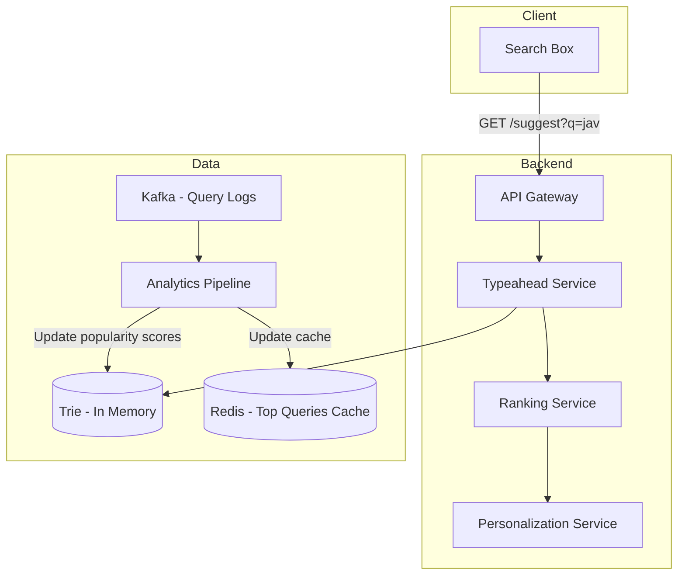
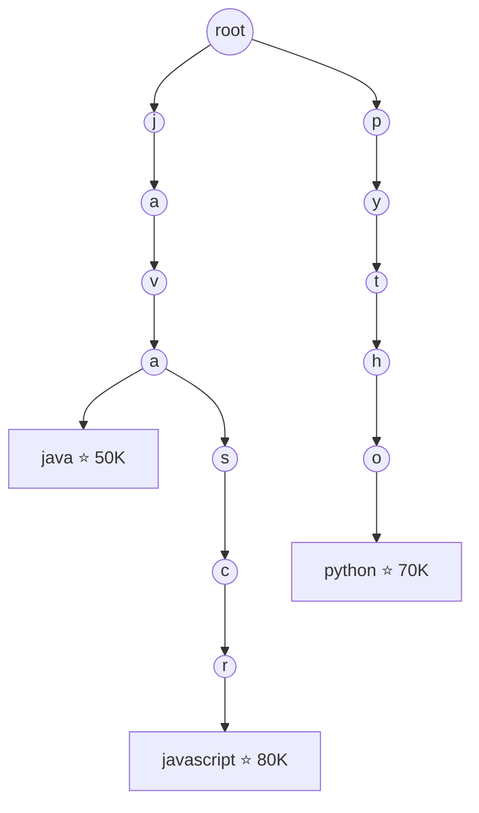
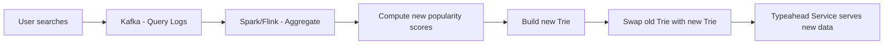

# Design Typeahead / Autocomplete — The Librarian Who Finishes Your Sentences

<!-- sdlc-stage:start -->
<div class="sdlc-stage">

📍 **SDLC stage: Design — architecture** · ShopNorth uses this in [Chapter 2 · System Design (HLD)](/tutorials/journey-02-system-design)

</div>
<!-- sdlc-stage:end -->

## The Librarian Analogy

Imagine a librarian who, the moment you say "I'm looking for a book about quant—", immediately suggests "Quantum Physics?", "Quantitative Finance?", "Quantum Computing?" — ranked by what most people search for. She does this in under 100ms, for millions of visitors simultaneously. That's typeahead search.

---

## 1. Requirements

### Functional
- Show top 5-10 suggestions as user types
- Suggestions ranked by popularity/relevance
- Update suggestions with each keystroke
- Support personalization (user's past searches)
- Handle typos and fuzzy matching

### Non-Functional
- **Latency**: < 100ms per keystroke (users type fast)
- **Scale**: 100K queries per second
- **Availability**: 99.99%
- **Freshness**: New trending queries appear within minutes

---

## 2. High-Level Architecture



---

## 3. Trie Data Structure — The Core

A Trie (prefix tree) stores all searchable phrases. Each node represents a character, and paths from root to leaves form complete phrases.



```java
class TrieNode {
    Map<Character, TrieNode> children = new HashMap<>();
    List<String> topSuggestions = new ArrayList<>(); // pre-computed top 10
    boolean isEndOfWord;
    long searchCount;
}

public List<String> getSuggestions(String prefix) {
    TrieNode node = root;
    for (char c : prefix.toCharArray()) {
        node = node.children.get(c);
        if (node == null) return Collections.emptyList();
    }
    return node.topSuggestions; // O(1) — pre-computed!
}
```

<div class="callout-info">

**Key insight**: Don't traverse the trie to find suggestions at query time. Pre-compute the top 10 suggestions at EVERY node. When user types "jav", you just return the pre-computed list at the "v" node. This makes query time O(prefix length), not O(total phrases).

</div>

---

## 4. Ranking Suggestions

Not all suggestions are equal. Rank by:

| Factor | Weight | Example |
|--------|--------|---------|
| **Global popularity** | High | "java" searched 50K times/day |
| **Recency** | Medium | "java 24 features" trending this week |
| **Personalization** | Medium | User previously searched "java streams" |
| **Freshness** | Low | New query appeared 1 hour ago |

```java
public double calculateScore(String query, UserContext user) {
    double globalPopularity = getSearchCount(query) * 0.4;
    double recencyBoost = isRecentlyTrending(query) ? 0.3 : 0.0;
    double personalScore = user.hasSearched(query) ? 0.2 : 0.0;
    double freshnessScore = isNewQuery(query) ? 0.1 : 0.0;
    return globalPopularity + recencyBoost + personalScore + freshnessScore;
}
```

<div class="callout-scenario">

**Scenario**: User types "cov" in January 2021. Global top result is "cover letter template." But "covid vaccine" is trending massively. **Decision**: Recency/trending boost pushes "covid vaccine" to #1 despite "cover letter" having higher all-time search count. The ranking model must balance historical popularity with real-time trends.

</div>

---

## 5. Handling Fast Typing — Debouncing

Users type fast. "javascript" = 10 keystrokes. You don't want 10 API calls.

```javascript
// Client-side debouncing — wait 150ms after last keystroke
let debounceTimer;
searchInput.addEventListener('input', (e) => {
    clearTimeout(debounceTimer);
    debounceTimer = setTimeout(() => {
        fetchSuggestions(e.target.value);
    }, 150);
});
```

<div class="callout-tip">

**Applying this** — Debounce on the client (150-200ms). Also, cancel in-flight requests when a new keystroke arrives. If user types "j", "ja", "jav" quickly, cancel the "j" and "ja" requests — only "jav" matters. This reduces server load by 60-70%.

</div>

---

## 6. Updating the Trie — Offline Pipeline



<div class="callout-warn">

**Warning**: Never update the Trie in real-time with every search query. Build a new Trie periodically (every 15-30 minutes) from aggregated data and swap it atomically. This avoids concurrency issues and keeps the serving path fast.

</div>

---

## 7. Scaling — Sharding the Trie

For billions of phrases, one server can't hold the entire Trie:

| Shard | Prefix Range | Server |
|-------|-------------|--------|
| Shard 1 | a-f | Server 1 |
| Shard 2 | g-m | Server 2 |
| Shard 3 | n-s | Server 3 |
| Shard 4 | t-z | Server 4 |

The API gateway routes based on the first character of the query.

---

<!-- practice-pack -->

## 🏢 More Real-World Scenarios

<div class="callout-scenario">

**Scenario**: An e-commerce site's autocomplete starts suggesting offensive phrases after a coordinated group searches them thousands of times — the popularity-based ranking learned them overnight. **Decision**: Suggestions are a curated product surface, not a raw mirror of queries. Filter candidates through blocklists and a moderation model before they enter the index, require a minimum number of *distinct users* (not just query counts) per phrase, cap the influence of new trending phrases until reviewed, and keep a fast "kill switch" that removes a phrase from all serving nodes within minutes.

</div>

## 🏋️ Practice Assignments

### 🟢 Low — Build the reflexes

**L1.** Why store the top-K suggestions at each trie node?

<details>
<summary>Show answer</summary>

Without it, answering "suggestions for `ipho`" requires walking the entire subtree under that prefix and sorting — slow for short prefixes with millions of completions. Precomputing the top K (e.g., 10) phrases per node makes each lookup O(prefix length), at the cost of memory and rebuild work when rankings change.

</details>

**L2.** What does debouncing do, and what's a typical delay?

<details>
<summary>Show answer</summary>

The client waits until the user pauses typing (typically 100-300 ms) before sending a request, so typing "iphone" sends one or two requests instead of six. Combine with cancelling in-flight requests whose prefix is outdated, and a client-side cache of recent prefix results.

</details>

**L3.** Why is typeahead often served from memory or a CDN instead of a database?

<details>
<summary>Show answer</summary>

Users expect suggestions in under ~100 ms end-to-end, at very high QPS (every keystroke). The data changes slowly (rebuilt periodically), so it's ideal for in-memory structures and caching: popular short prefixes ("a", "ip") can even be cached at the CDN or browser for minutes.

</details>

### 🟡 Medium — Apply it

**M1.** Add personalization (recent searches) without rebuilding the global trie per user.

<details>
<summary>Show answer</summary>

Serve two sources and merge: the global top-K for the prefix (shared, cached) and the user's own recent searches matching the prefix (from a small per-user store, e.g., a Redis sorted set of the last 50 queries). Merge with a scoring function (boost personal history, dedupe), and return the final list. Personal data never enters the shared index, and users can clear it.

</details>

**M2.** How do trending queries (a breaking news event) get into suggestions within minutes if the trie rebuilds daily?

<details>
<summary>Show answer</summary>

Add a **real-time layer**: stream processing over the search log computes phrases with sudden frequency spikes (relative to their baseline) per region in sliding windows. These go into a small "trending" index merged with the main trie results at query time. The daily rebuild then incorporates them permanently if they stay popular. Apply moderation before trending phrases are shown.

</details>

**M3.** The trie for 100M phrases doesn't fit on one server. How do you shard it?

<details>
<summary>Show answer</summary>

Shard by prefix range (e.g., `a-c`, `d-f`, ... balanced by query volume, not alphabet size — "s" has far more traffic than "x"), with each shard replicated for read throughput. A routing layer maps the prefix's first characters to a shard. Hot short prefixes are cached in front of the shards. Alternatively, shard by a hash of the first 2-3 characters for more even distribution, as long as a single prefix always lives in one place.

</details>

### 🔴 High — Think like a senior

**H1.** Design multi-language typeahead for a global app (English, Hindi, Japanese).

<details>
<summary>Show answer</summary>

Separate indexes per language/locale (different popularity, scripts, and tokenization). Normalize input per language: Unicode normalization, case folding, accent removal where appropriate. For Hindi, support transliteration (users type "namaste" in Latin script expecting देवनागरी suggestions) — index both scripts or a transliterated form. For Japanese, handle IME composition (kana → kanji conversion): the client should only send queries after composition ends, and the index should include kana readings. Detect locale from user settings and input script.

</details>

**H2.** Your p99 latency is 400 ms while p50 is 20 ms. Investigate.

<details>
<summary>Show answer</summary>

Look at what's different about slow requests: very short prefixes (huge candidate sets if top-K isn't precomputed), cache misses after a deploy or index swap, GC pauses on JVM serving nodes with large heaps (consider off-heap or compact arrays), personalization store latency, cross-region calls, or a slow shard (hot prefix range). Use distributed tracing to split time per hop, then fix the specific cause: precompute top-K, warm caches before swapping indexes, rebalance shards, add timeouts and serve global results without personalization if the per-user store is slow.

</details>

## 🛠️ Mini Project — Autocomplete Service with Live Trending

**Goal**: A fast, moderated typeahead you can demo. 2-3 evenings.

**Build**

1. Load a public dataset of search queries or product titles (e.g., a Wikipedia page-views title dump or an Amazon product dataset) with frequencies.
2. Java trie with top-10 per node; serve `GET /suggest?q=` from Spring Boot; build the trie offline and swap it atomically (build new, then replace the reference).
3. React client with 150 ms debounce, request cancellation, and a local prefix cache.
4. Trending layer: a Kafka topic of searches → a sliding-window counter → a small trending map merged at query time.
5. A blocklist applied at build time and at query time, plus an admin endpoint to remove a phrase instantly.
6. Load test with k6: p50/p99 latency at 2,000 requests/second.

**Acceptance criteria**: p99 < 50 ms locally; a blocked phrase disappears within one second of the admin call; README with memory usage of the trie.

---

## 🎯 Interview Corner

<div class="callout-interview">

**Q: "How would you handle typeahead for a system with 5 billion searchable phrases?"**

A single Trie can't fit in memory. I'd shard by prefix — partition phrases across multiple servers based on the first 2 characters (676 shards for a-z × a-z). Each shard holds its portion of the Trie in memory. The API gateway routes requests to the correct shard based on the query prefix. For redundancy, each shard has 3 replicas. For the ranking layer, I'd pre-compute top suggestions at each Trie node offline using a MapReduce pipeline that processes search logs. The serving path is just a Trie lookup — O(prefix length) with pre-computed results.

**Follow-up trap**: "What about multi-word queries?" → Treat the entire query as the key, not individual words. "how to learn java" is stored as a single path in the Trie. For word-level matching, combine Trie results with an inverted index.

</div>

<div class="callout-interview">

**Q: "How do you handle typos in typeahead?"**

Two approaches: (1) **Edit distance** — for each query, find Trie entries within Levenshtein distance 1-2. "javscript" matches "javascript" (1 deletion). This is expensive at query time. (2) **Phonetic matching** — use Soundex or Metaphone to match by pronunciation. "javasript" sounds like "javascript." (3) **Hybrid** — pre-compute common misspellings offline and store them as aliases in the Trie pointing to the correct entry. Google does this with "Did you mean..." which is computed from aggregate user behavior — if 80% of users who type "javscript" then search "javascript", learn that mapping.

</div>

<div class="callout-interview">

**Q: "Trie vs Elasticsearch for typeahead — when would you use each?"**

Trie is better for pure prefix matching with pre-computed rankings — it's O(prefix length) and serves from memory. Elasticsearch is better when you need fuzzy matching, multi-field search, or complex ranking. For a search engine like Google, use Trie for the fast typeahead dropdown. For an e-commerce site where you search across product names, descriptions, and categories, use Elasticsearch with its `completion` suggester. In practice, many systems use both — Trie for the instant dropdown, Elasticsearch for the full search results page.

</div>

---

## Quick Reference

| Concept | One-Liner |
|---------|-----------|
| Trie | Prefix tree — O(prefix length) lookup for suggestions |
| Pre-computed suggestions | Store top 10 results at every Trie node |
| Debouncing | Wait for user to stop typing before sending request |
| Edit Distance | Number of character changes to transform one string to another |
| Sharding | Split Trie across servers by prefix range |
| Atomic Swap | Replace old Trie with new one without downtime |

---

> **The best typeahead feels like the system is reading your mind. In reality, it's reading everyone else's searches and betting you want the same thing.**

---

<!-- journey-link:start -->

<div class="callout-journey">

🛒 **ShopNorth Journey** — ShopNorth's search suggestions come from OpenSearch; Chapter 15 later adds semantic search alongside them.

**Continue the story:** [Chapter 2 · System Design (HLD)](/tutorials/journey-02-system-design) · **New here?** [Start the journey](/tutorials/journey-start)

</div>

<!-- journey-link:end -->
