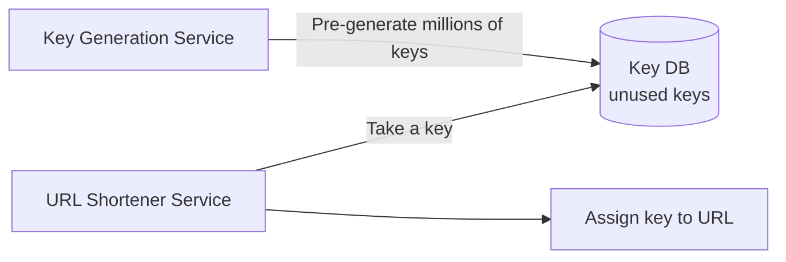
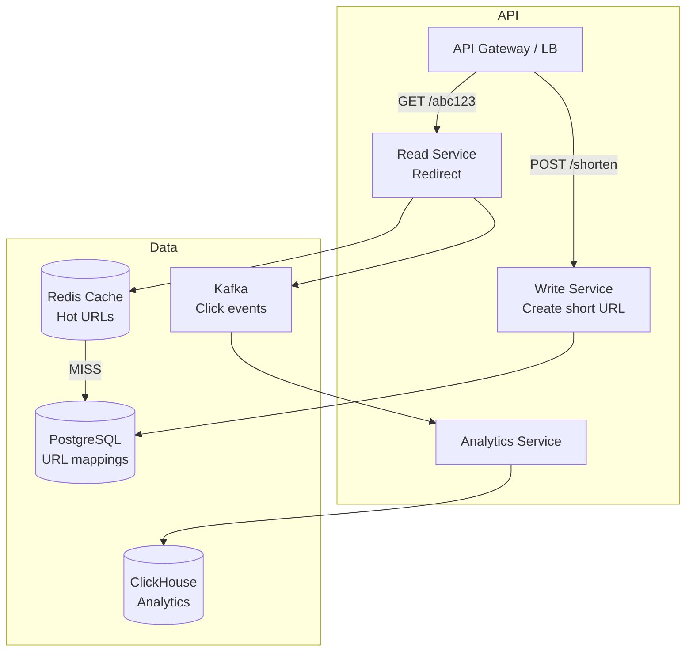
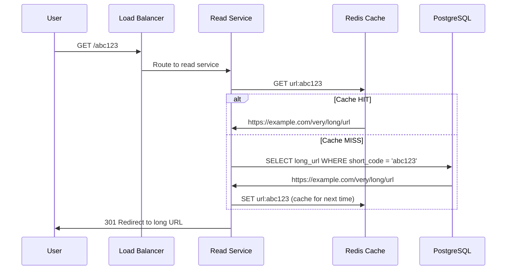
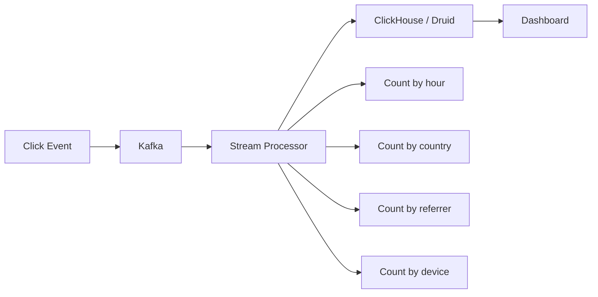

# Design URL Shortener (Interview Edition) — The Complete Walkthrough

## The Library Card Catalog Analogy

A URL shortener is like a library card catalog. Instead of remembering "Building 3, Floor 2, Aisle 7, Shelf 4, Position 12" (the long URL), you get a short code "B3-2712" that maps to the exact location. The catalog must be fast to look up, never assign the same code to two books, and handle millions of lookups per second.

---

## 1. Requirements & Estimation

### Functional
- Given a long URL, generate a short URL
- Redirect short URL to original long URL
- Custom short URLs (optional)
- Link expiration (optional)
- Analytics (click count, referrer, geography)

### Back-of-Envelope Math
- 100M new URLs/month = ~40 URLs/sec (write)
- Read:Write ratio = 100:1 → 4,000 redirects/sec (read)
- URL length: 7 characters, base62 = 62^7 = 3.5 trillion unique URLs
- Storage: 100M/month × 12 months × 5 years × 500 bytes = ~300 GB

---

## 2. Short URL Generation — Three Approaches

### Approach 1: Hash + Truncate

```java
String hash = md5(longUrl);           // "5d41402abc4b2a76b9719d911017c592"
String shortCode = hash.substring(0, 7); // "5d41402"
```

**Problem**: Collisions. Two different URLs might produce the same 7-char prefix.

### Approach 2: Base62 Counter (Recommended)

```java
// Auto-increment counter → Base62 encode
long id = database.nextId();  // 1000000001
String shortCode = base62Encode(id);  // "15FTGf"

public String base62Encode(long num) {
    String chars = "0123456789abcdefghijklmnopqrstuvwxyzABCDEFGHIJKLMNOPQRSTUVWXYZ";
    StringBuilder sb = new StringBuilder();
    while (num > 0) {
        sb.append(chars.charAt((int)(num % 62)));
        num /= 62;
    }
    return sb.reverse().toString();
}
```

**No collisions** — each counter value is unique.

### Approach 3: Pre-generated Key Service



| Approach | Pros | Cons |
|----------|------|------|
| Hash + Truncate | Simple, no coordination | Collisions, need retry logic |
| Base62 Counter | No collisions, predictable | Counter is single point of failure |
| Pre-generated Keys | No collisions, distributed | Extra service, key exhaustion risk |

<div class="callout-scenario">

**Scenario**: You're running 10 URL shortener servers. Using a single counter means all servers contend for the next ID. **Decision**: Use range-based allocation. Server 1 gets IDs 1-1M, Server 2 gets 1M-2M, etc. Each server has its own local counter within its range. No coordination needed. When a range is exhausted, request a new range from a coordinator (ZooKeeper or DB sequence).

</div>

---

## 3. Architecture



### Redirect Flow



<div class="callout-info">

**301 vs 302 redirect**: 301 (Permanent) — browser caches the redirect, subsequent visits skip your server. Good for performance, bad for analytics. 302 (Temporary) — browser always hits your server. Slower but you can track every click. **Use 302 if you need analytics, 301 if you don't.**

</div>

---

## 4. Handling Custom URLs

```java
public String createShortUrl(String longUrl, String customCode) {
    if (customCode != null) {
        // Check if custom code is available
        if (urlRepository.existsByShortCode(customCode)) {
            throw new ConflictException("Custom URL already taken");
        }
        urlRepository.save(new UrlMapping(customCode, longUrl));
        return customCode;
    }
    // Auto-generate
    String code = base62Encode(idGenerator.nextId());
    urlRepository.save(new UrlMapping(code, longUrl));
    return code;
}
```

<div class="callout-warn">

**Warning**: Custom URLs must be validated — block offensive words, reserved paths (`/api`, `/admin`, `/health`), and extremely short codes (1-2 chars). Also rate-limit custom URL creation to prevent squatting.

</div>

---

## 5. Analytics



Don't update analytics synchronously on every click — it would slow down redirects. Publish click events to Kafka and process asynchronously.

---

<!-- practice-pack -->

## 🏢 More Real-World Scenarios

<div class="callout-scenario">

**Scenario**: A public URL shortener becomes the favourite tool of phishing campaigns: its trusted domain makes malicious links look safe, email providers start flagging *all* its links as spam, and legitimate customers' campaigns stop being delivered. **Decision**: Abuse prevention is a core feature. Check destination URLs against threat-intelligence feeds (e.g., Google Safe Browsing) at creation and periodically after, rate-limit link creation per account and IP, require verified accounts for bulk creation, show an interstitial warning for suspicious links, provide a fast abuse-report and takedown flow, and monitor the domain's reputation with mailbox providers.

</div>

## 🏋️ Practice Assignments

### 🟢 Low — Build the reflexes

**L1.** How many unique codes do 7 Base62 characters give, and how long would they last at 100M new links/month?

<details>
<summary>Show answer</summary>

62⁷ ≈ **3.5 trillion** codes. At 100M/month (1.2B/year) that's roughly 2,900 years. Six characters (≈ 56.8 billion) would last ~47 years at that rate — so 7 is comfortable, 6 is workable.

</details>

**L2.** 301 or 302 for the redirect — what's the trade-off?

<details>
<summary>Show answer</summary>

**301 (permanent)** lets browsers cache the redirect, which lowers server load but loses analytics for repeat clicks and makes changing the destination hard. **302/307 (temporary)** sends every click through your servers — accurate analytics and editable destinations, at higher load. Most commercial shorteners use 302 (or 301 with short cache headers) because analytics are the product.

</details>

**L3.** Why is a sequential counter + Base62 easier to scale than random codes with collision checks?

<details>
<summary>Show answer</summary>

Counter-based IDs never collide, so no "check then insert" retry loop is needed. To avoid a single counter bottleneck, each app server reserves a range of IDs (e.g., 10,000 at a time) from a central store and allocates locally. Downside: sequential codes are guessable — scramble them with a reversible permutation or encrypt the ID with a block cipher (e.g., Feistel network) before encoding if enumeration is a concern.

</details>

### 🟡 Medium — Apply it

**M1.** Size the redirect cache: 1B total links, 20% of links get 80% of clicks, 500 bytes per cached entry.

<details>
<summary>Show answer</summary>

Caching the hottest 20% → 200M entries × 500 B ≈ **100 GB** — a small Redis cluster. In practice traffic is even more skewed (most clicks happen in the first days after a link is shared), so caching a few percent of links with an LRU policy captures most hits. Measure the actual hit ratio and size from that.

</details>

**M2.** Design click analytics without slowing down redirects.

<details>
<summary>Show answer</summary>

The redirect path does only: lookup (cache → DB) and redirect. It publishes a click event (code, timestamp, referrer, user agent, IP-derived country) asynchronously to Kafka (fire-and-forget with a local buffer). Consumers aggregate counts per link per time bucket (minute/hour/day), by country and referrer, into a columnar store (ClickHouse) or pre-aggregated tables. Deduplicate bots by user-agent rules and click rate. The dashboard reads aggregates, never raw events.

</details>

**M3.** How do you implement custom aliases (`sho.rt/diwali-sale`) safely?

<details>
<summary>Show answer</summary>

Validate (length, allowed characters, a reserved-words list such as `admin`, `api`, `login`, and offensive terms), then insert with a unique constraint on the code — the database is the referee for races between two users requesting the same alias. Keep custom aliases in the same keyspace as generated codes, but make sure the generator can't produce them (different length or a character set rule), or check uniqueness on generation too.

</details>

### 🔴 High — Think like a senior

**H1.** Make redirects work even if the primary database region is down.

<details>
<summary>Show answer</summary>

Redirects are read-only lookups on immutable mappings — ideal for replication. Replicate the mapping table to every region (asynchronous replication or a global table like DynamoDB Global Tables), cache aggressively in each region, and serve redirects locally. Link creation can depend on a primary region (or use region-specific ID ranges so each region can create links independently). Newly created links may take a second to reach other regions; have the redirect service fall back to the home region on a local miss for very new codes.

</details>

**H2.** A link gets 1M clicks per minute (shared by a celebrity). What breaks, and how do you handle it?

<details>
<summary>Show answer</summary>

A single Redis key gets ~17K requests/second — usually fine for Redis, but a cluster node can become a hotspot, and the analytics pipeline sees a burst on one partition key. Mitigations: an in-process cache (Caffeine, a few seconds' TTL) on each redirect server so the hot code rarely leaves the process; CDN edge redirects for hot links (cache the 302 response briefly at the edge, with analytics from CDN logs); and analytics events partitioned by code plus a random suffix, then merged in aggregation.

</details>

## 🛠️ Mini Project — Production-Ready URL Shortener

**Goal**: A complete small product with abuse controls and analytics. 1 week of evenings.

**Build**

1. Spring Boot + PostgreSQL + Redis: `POST /links` (with optional custom alias and expiry), `GET /{code}` (302 redirect), `GET /links/{code}/stats`.
2. ID generation via range allocation + Base62, scrambled with a reversible permutation.
3. Cache-aside for redirects with Caffeine (L1) + Redis (L2); measure hit ratios.
4. Click events to Kafka → aggregation consumer → per-day/per-country counts.
5. Abuse controls: rate limiting per IP/API key, URL validation, a blocklist check, and an admin takedown endpoint that also invalidates caches.
6. Load test: 10K redirects/second with k6; report p99 and cache hit ratios.

**Acceptance criteria**: redirect p99 < 10 ms locally with warm caches; a taken-down link stops redirecting within 1 second; README with capacity estimates for 1B links.

---

## 🎯 Interview Corner

<div class="callout-interview">

**Q: "How would you handle 10,000 redirects per second?"**

The redirect path is read-heavy and latency-sensitive. (1) **Redis cache** — cache the top 20% of URLs (Pareto principle — 20% of URLs get 80% of traffic). Cache hit rate should be 90%+. (2) **Read replicas** — PostgreSQL read replicas for cache misses. (3) **Stateless services** — read service is stateless, scale horizontally behind a load balancer. (4) **CDN** — for extremely popular short URLs, the 301 redirect can be cached at the CDN edge. At 10K RPS, a single Redis instance handles this easily (Redis does 100K+ ops/sec). The bottleneck is never the redirect — it's the analytics pipeline.

**Follow-up trap**: "What if Redis goes down?" → Fall back to database reads. PostgreSQL with proper indexing on `short_code` handles 10K reads/sec. The latency increases from 1ms (Redis) to 5ms (DB) — still acceptable. Redis is an optimization, not a dependency.

</div>

<div class="callout-interview">

**Q: "What if two users submit the same long URL — should they get the same short URL?"**

It depends on the product requirement. **Option A: Same short URL** — hash the long URL and use it as a lookup key. If it exists, return the existing short URL. Saves storage but means you can't have per-user analytics. **Option B: Different short URLs** — always generate a new short code. Each user gets their own link with separate analytics. This is what Bitly does — it allows the same long URL to have multiple short URLs with different tracking. For most systems, Option B is better because analytics per link is more valuable than saving a few bytes of storage.

</div>

<div class="callout-interview">

**Q: "How do you handle link expiration?"**

Add an `expires_at` column to the URL mapping table. On redirect, check if `expires_at < now()`. If expired, return 410 Gone. For cleanup, run a background job that deletes expired URLs from the database and invalidates them from Redis cache. Don't rely on Redis TTL alone — the database is the source of truth. For URLs without expiration, set a default (e.g., 5 years) to prevent infinite storage growth.

</div>

---

## Quick Reference

| Concept | One-Liner |
|---------|-----------|
| Base62 | Encode counter to alphanumeric string (0-9, a-z, A-Z) |
| 301 vs 302 | Permanent (cached by browser) vs Temporary (always hits server) |
| Range-based ID | Each server gets a pre-allocated ID range to avoid contention |
| Cache-aside | Check Redis first, fall back to DB on miss |
| Click Analytics | Async via Kafka, never block the redirect |

---

> **A URL shortener is the "Hello World" of system design interviews — simple enough to discuss in 30 minutes, deep enough to reveal your understanding of databases, caching, scaling, and trade-offs.**

---

<!-- journey-link:start -->

<div class="callout-journey">

🛒 **ShopNorth Journey** — Extra case study — the same interview-style walkthrough is applied to ShopNorth's catalog and checkout, where caching and idempotency matter just as much.

**Continue the story:** [Chapter 2 · System Design (HLD)](/tutorials/journey-02-system-design) · **New here?** [Start the journey](/tutorials/journey-start)

</div>

<!-- journey-link:end -->
