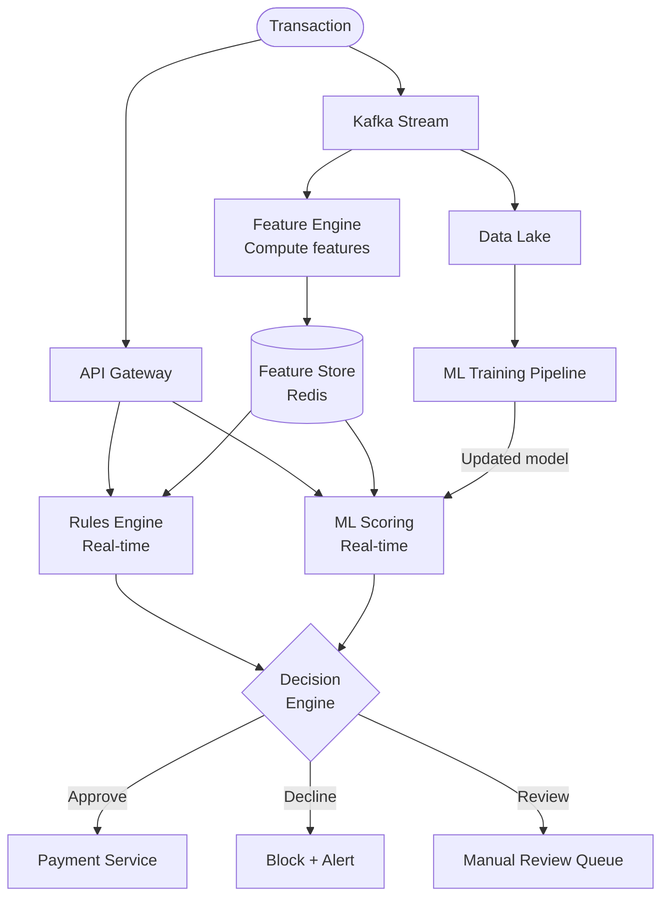
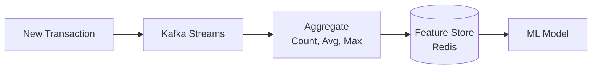
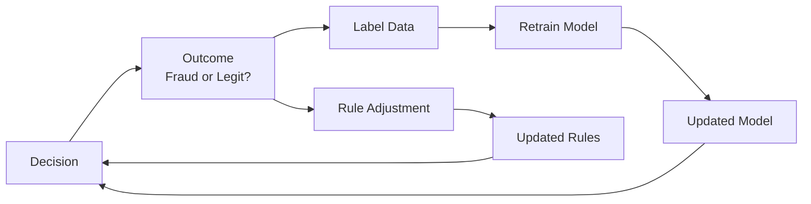

# Fraud Detection System — Complete System Design

<!-- sdlc-stage:start -->
<div class="sdlc-stage">

📍 **SDLC stage: Development — security** · Extra case study for [Chapter 7 · Security & Login](/tutorials/journey-07-security)

</div>
<!-- sdlc-stage:end -->

## 1. Problem Statement

Design a real-time fraud detection system that:
- Analyzes every financial transaction **in real-time** (< 100ms)
- Flags suspicious transactions before they're processed
- Learns from historical patterns to improve detection
- Minimizes false positives (blocking legitimate transactions is bad for business)

---

## 2. Types of Fraud

| Type | Example | Detection Signal |
|------|---------|-----------------|
| **Card-not-present** | Stolen card used online | Unusual location, device fingerprint |
| **Account takeover** | Hacker logs into your account | New device, unusual time, password change |
| **Velocity abuse** | 50 transactions in 1 minute | Rate of transactions |
| **Amount anomaly** | Usually spends $50, suddenly $5000 | Deviation from spending pattern |
| **Geographic anomaly** | Transaction in NYC, then Tokyo 1 hour later | Impossible travel |

---

## 3. High-Level Design



---

## 4. Two-Layer Detection

### Layer 1: Rules Engine (Deterministic)

Fast, explainable, catches obvious fraud:

```java
public class FraudRules {

    public RuleResult evaluate(Transaction txn, UserProfile profile) {
        // Rule 1: Velocity check
        if (profile.getTransactionsLastHour() > 10) {
            return RuleResult.flag("VELOCITY_EXCEEDED");
        }

        // Rule 2: Amount anomaly
        if (txn.getAmount() > profile.getAvgAmount() * 5) {
            return RuleResult.flag("AMOUNT_ANOMALY");
        }

        // Rule 3: Impossible travel
        if (isImpossibleTravel(txn.getLocation(), profile.getLastLocation(), profile.getLastTxnTime())) {
            return RuleResult.flag("IMPOSSIBLE_TRAVEL");
        }

        // Rule 4: High-risk country
        if (HIGH_RISK_COUNTRIES.contains(txn.getCountry())) {
            return RuleResult.addRisk(30);
        }

        return RuleResult.pass();
    }
}
```

### Layer 2: ML Model (Probabilistic)

Catches subtle patterns humans can't write rules for:

```
Input features:
- Transaction amount, time, location, merchant category
- User's historical avg amount, frequency, usual locations
- Device fingerprint, IP reputation
- Time since last transaction
- Number of failed attempts recently

Output: Fraud probability (0.0 to 1.0)

Decision:
- Score < 0.3 → Approve
- Score 0.3-0.7 → Manual review
- Score > 0.7 → Decline
```

---

## 5. Feature Store — Real-Time Features

The ML model needs **features** computed in real-time:

```java
// Features computed and stored in Redis for instant lookup
public class UserFeatures {
    int transactionsLast1Hour;
    int transactionsLast24Hours;
    double avgTransactionAmount30Days;
    double maxTransactionAmount30Days;
    String lastTransactionCountry;
    long secondsSinceLastTransaction;
    int uniqueMerchantsLast7Days;
    int failedAttemptsLast1Hour;
    double distanceFromLastTransaction;
}
```



Features are updated **incrementally** with each transaction using Kafka Streams — no batch processing delay.

---

## 6. Decision Engine

Combines rules + ML score into a final decision:

```java
public Decision evaluate(Transaction txn) {
    RuleResult ruleResult = rulesEngine.evaluate(txn, getProfile(txn.getUserId()));
    double mlScore = mlModel.score(getFeatures(txn.getUserId()), txn);

    double combinedScore = ruleResult.getRiskScore() * 0.4 + mlScore * 100 * 0.6;

    if (ruleResult.isHardBlock()) return Decision.DECLINE;
    if (combinedScore > 70) return Decision.DECLINE;
    if (combinedScore > 40) return Decision.MANUAL_REVIEW;
    return Decision.APPROVE;
}
```

---

## 7. Feedback Loop — Learning from Mistakes



- **Chargebacks** = confirmed fraud → positive label
- **No chargeback after 90 days** = legitimate → negative label
- Model is retrained periodically with new labeled data

---

## 8. Summary

| Aspect | Decision |
|--------|----------|
| Real-time processing | Kafka Streams for feature computation |
| Feature storage | Redis (sub-ms reads) |
| Rules engine | Deterministic, explainable, fast |
| ML model | Gradient boosting or neural network |
| Decision latency | < 100ms end-to-end |
| Feedback | Chargeback-based labeling, periodic retraining |

---

---

<!-- practice-pack -->

## 🏢 Real-World Scenarios

<div class="callout-scenario">

**Scenario**: A new fraud model goes live and blocks 4% of legitimate card payments on the first evening — including a wave of genuine customers buying festival gifts at unusual hours. Revenue and customer trust take a hit before anyone notices. **Decision**: Never switch a fraud model straight to blocking. Run it in **shadow mode** first (score every transaction, take no action, compare with the current system and with later chargeback labels), then a gradual rollout with guardrail metrics: false-positive rate (legitimate customers declined), approval rate by segment, manual-review queue size, and a one-click rollback.

</div>

<div class="callout-scenario">

**Scenario**: Fraudsters discover that orders under ₹2,000 skip manual review, and they split large purchases into many small orders from different accounts sharing one device. **Decision**: Static thresholds get learned and gamed. Add **velocity and graph features** (orders per device/card/IP in the last hour, accounts linked by device fingerprint, shared addresses or payment instruments), keep rules and model features updated from investigator feedback, and monitor the distribution of transaction amounts just under each threshold — a spike there is itself a signal.

</div>

## 🏋️ Practice Assignments

### 🟢 Low — Build the reflexes

**L1.** Why use both rules and an ML model instead of just one?

<details>
<summary>Show answer</summary>

**Rules** are instant, explainable, and enforce hard policies (sanctioned countries, blocked cards, velocity caps); they're easy to update when a new attack appears. **Models** catch subtle, multi-feature patterns rules miss and adapt via retraining. Together: rules for known patterns and compliance, a model for scoring risk, and a decision engine combining both into approve / challenge (OTP, 3-D Secure) / review / decline.

</details>

**L2.** What is a "velocity feature"? Give three examples.

<details>
<summary>Show answer</summary>

A count or sum over a recent time window for an entity: number of transactions on this card in the last 10 minutes; distinct cards used from this device in the last 24 hours; total amount sent from this account in the last hour. They detect bursts typical of card testing and account takeover.

</details>

**L3.** Why is accuracy a misleading metric for fraud models?

<details>
<summary>Show answer</summary>

Fraud is rare (often well under 1% of transactions). A model that approves everything is >99% "accurate" and useless. Use precision (of blocked transactions, how many were fraud), recall (of fraud, how much was caught), the false-positive rate on good customers, and business metrics (fraud losses vs lost revenue from declines).

</details>

### 🟡 Medium — Apply it

**M1.** Design the real-time feature computation for "transactions per card in the last 10 minutes" at 20K transactions/second with p99 < 50 ms scoring.

<details>
<summary>Show answer</summary>

Stream processing (Flink / Kafka Streams) keyed by card ID maintains sliding-window counts and writes them to a low-latency **online feature store** (Redis, or a managed store) — or the scoring service updates Redis directly with a sorted set of timestamps per card (`ZADD` + `ZREMRANGEBYSCORE` + `ZCARD` in one Lua script). The scoring path reads all needed features with one batched lookup (pipeline/MGET) under ~5 ms. Use the same feature definitions for offline training (feature store with point-in-time correctness) to avoid training/serving skew.

</details>

**M2.** The decision engine must respond in < 100 ms, but the ML model service sometimes takes 300 ms. What do you do?

<details>
<summary>Show answer</summary>

Set a timeout (e.g., 60 ms) on the model call and have a **fallback policy** per risk band: low-risk transactions (known device, small amount, good history by rules) approve on rules alone; higher-risk ones challenge (OTP/3-D Secure) or go to async review rather than being blocked outright. Monitor the fallback rate as an SLO; fix the latency (model optimization, warm instances, co-located serving, fewer features) rather than raising the timeout.

</details>

**M3.** How do labels (fraud / not fraud) arrive, and how does that affect training?

<details>
<summary>Show answer</summary>

Labels come from chargebacks (weeks to months later), investigator decisions, and customer reports — so they're **delayed** and incomplete (blocked transactions never get a "true" label). Training must use data old enough to have mature labels, handle the selection bias from previous model decisions (e.g., a small random holdout of approved-with-monitoring traffic), and be retrained regularly as fraud patterns drift. Monitor feature and score distribution drift between retrains.

</details>

### 🔴 High — Think like a senior

**H1.** Design a fraud ring detector that finds groups of accounts acting together.

<details>
<summary>Show answer</summary>

Build an entity graph: nodes are accounts, devices, cards, addresses, IPs, phone numbers; edges link entities seen together. Compute connected components or community detection (e.g., with a graph database or Spark GraphFrames, incrementally updated from events), plus graph features per account (component size, number of shared devices, age of linked accounts, fraud labels in the component). Feed these into the model and into investigator tooling that visualizes the cluster. Act at the cluster level (step-up verification for linked accounts when one is confirmed fraud). Watch for false links (shared public Wi-Fi IPs, family devices) by weighting edge types.

</details>

**H2.** A regulator asks why a specific customer's payment was declined. How does your system answer?

<details>
<summary>Show answer</summary>

Every decision is logged immutably with: the input features and their values, the rule hits, the model version and score, the decision policy version, and the final action and reason codes. Model explanations (e.g., SHAP values for the top contributing features) are computed and stored at decision time or reproducibly afterward. Reason codes map to human-readable explanations ("unusual location and new device"). Retention follows regulatory requirements; access is controlled because the logs contain personal data. This also supports customer support and appeals.

</details>

## 🛠️ Mini Project — Real-Time Transaction Risk Scoring

**Goal**: A working rules + model + decision pipeline with honest evaluation. 1 week of evenings.

**Build**

1. Data: a public credit card fraud dataset (e.g., the anonymized European cardholder dataset on Kaggle) or a synthetic generator that injects card-testing bursts and account takeovers.
2. Offline: train a gradient-boosted model (XGBoost/LightGBM); report precision/recall at several thresholds and the PR curve — not accuracy.
3. Online: a Spring Boot `POST /score` service with velocity features in Redis (Lua sliding windows), a rules engine (blocked BINs, amount and velocity rules), the model (exported to ONNX or a small Python model server), and a decision engine with approve/challenge/review/decline and reason codes.
4. Replay a day of transactions through Kafka at 2,000/s; measure p99 latency and the decision mix.
5. Shadow-mode comparison: run two model versions side by side and report where they disagree.

**Acceptance criteria**: p99 < 50 ms at 2,000 TPS locally; every decision logged with features, rule hits, model version, and reason codes; README with the precision/recall trade-off you chose and why.

---

## 🎯 Interview Corner

<div class="callout-interview">

**Q: "How would you design a real-time fraud detection system that processes transactions in under 100ms?"**

Two-layer approach. Layer 1: a rules engine for deterministic checks — velocity (too many transactions per hour), amount anomaly (5x above user's average), impossible travel (NYC then Tokyo in 1 hour), high-risk country. These are fast, explainable, and catch obvious fraud. Layer 2: an ML model that scores each transaction based on features like spending patterns, device fingerprint, merchant category, and time-of-day. The decision engine combines both scores: hard blocks from rules override ML, otherwise it's a weighted combination. Features are pre-computed and stored in Redis (sub-ms reads) using Kafka Streams for real-time aggregation. The entire pipeline — feature lookup, rules evaluation, ML scoring, decision — must complete in < 100ms.

</div>

<div class="callout-interview">

**Q: "Why use both rules and ML? Why not just ML?"**

Three reasons. First, rules are explainable — regulators and compliance teams need to understand why a transaction was blocked. "The ML model said 0.85" isn't acceptable; "velocity exceeded 10 transactions per hour" is. Second, rules catch known patterns instantly without training data. If a new fraud pattern emerges (e.g., gift card draining), you can deploy a rule in minutes. ML needs labeled data and retraining. Third, ML catches subtle patterns that humans can't write rules for — combinations of features that individually look normal but together indicate fraud. Rules handle the known, ML handles the unknown.

**Follow-up trap**: "How do you handle false positives?" → False positives (blocking legitimate transactions) hurt revenue and customer trust. Use a three-tier decision: approve, decline, or send to manual review. Tune thresholds per merchant category and user risk profile. Track false positive rate as a key metric and retrain the model when it drifts.

</div>

<div class="callout-interview">

**Q: "How does the feature store work and why is it critical?"**

The ML model needs real-time features: "how many transactions has this user made in the last hour?" "what's their average spend in the last 30 days?" Computing these on every request from raw data would be too slow. The feature store (Redis) holds pre-computed features per user, updated incrementally by Kafka Streams as each transaction flows through. When a new transaction arrives, the model reads the user's features from Redis (< 1ms), scores the transaction, and the feature store is updated with the new transaction's data. This separation of feature computation (streaming) from model inference (request-time) is what makes sub-100ms latency possible.

</div>

<div class="callout-tip">

**Applying this** — In a system design interview, emphasize the real-time pipeline: transaction → Kafka → feature computation (Kafka Streams) → feature store (Redis) → rules + ML scoring → decision. The key insight is that features are computed asynchronously and stored, not computed at request time. Also discuss the feedback loop: chargebacks label fraud, which retrains the model. Without feedback, the model degrades over time as fraud patterns evolve.

</div>

---

> **Key insight**: The best fraud systems combine **rules** (fast, explainable, catches known patterns) with **ML** (catches unknown patterns). Neither alone is sufficient. And always remember — blocking a legitimate customer is almost as bad as letting fraud through.

---

<!-- journey-link:start -->

<div class="callout-journey">

🛒 **ShopNorth Journey** — Extra case study — ShopNorth's security chapter covers checkout and admin abuse; a fraud model like this is the natural next step.

**Continue the story:** [Chapter 7 · Security & Login](/tutorials/journey-07-security) · **New here?** [Start the journey](/tutorials/journey-start)

</div>

<!-- journey-link:end -->
