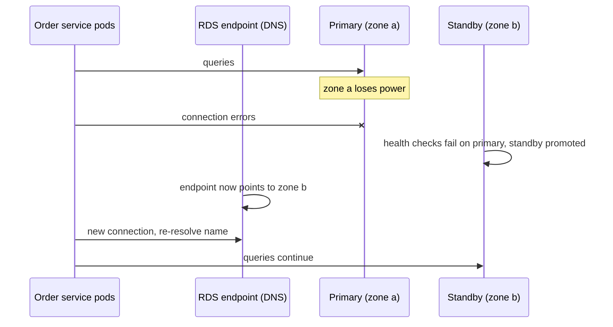
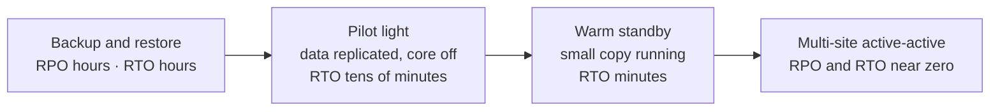

# High Availability & Disaster Recovery — The Hospital Power Analogy

<!-- sdlc-stage:start -->
<div class="sdlc-stage">

📍 **SDLC stage: Design — architecture** · ShopNorth uses this in [Chapter 2 · System Design (HLD)](/tutorials/journey-02-system-design)

</div>
<!-- sdlc-stage:end -->

## The Hospital Power Analogy

A hospital can't lose power during surgery, so it never relies on one source:

- **Two grid connections** from different substations: if one line fails, the other carries the load. That's **redundancy**.
- **Batteries (UPS)** keep the operating theatre running for the 10 seconds it takes the generator to start. That's **fast failover**.
- **Diesel generators** that are **tested every month** under real load, because a generator that has never been started is only a hope. That's **failover you've actually rehearsed**.
- **Non-essential lights switch off** automatically to save power for the ICU. That's **graceful degradation**.
- And if the building floods, there's a plan to move patients to another hospital across the city. That's **disaster recovery** — rarer, slower, and planned in advance.

High availability (HA) keeps the service running through *common* failures — a server, a disk, a data center. Disaster recovery (DR) gets you back after *rare, large* ones — a whole region, a deleted database, ransomware.

## 1. Availability in Numbers

Availability is the share of time (or, better, of requests) that succeed. Each extra "nine" cuts the allowed downtime by 10×:

| Availability | Downtime per month | Downtime per year | Typical for |
|-------------|-------------------|-------------------|-------------|
| 99% | ~7.3 hours | ~3.65 days | Internal tools |
| 99.9% | ~43.8 minutes | ~8.8 hours | Most business apps — **ShopNorth's checkout target** |
| 99.95% | ~21.9 minutes | ~4.4 hours | Important customer-facing services |
| 99.99% | ~4.4 minutes | ~53 minutes | Payments, core platforms |
| 99.999% | ~26 seconds | ~5.3 minutes | Telecom, very few web products |

ShopNorth measures availability as the share of `POST /orders` requests without a server error, against a **Service Level Objective (SLO)** of 99.9% over 30 days. The 0.1% left over is the **error budget**: about 43 minutes of failure per month that the team may "spend" on risky deploys and incidents (Chapter 13 shows the burn-rate alerts).

### Availability multiplies along a call chain

If a request needs *all* of these to work, their availabilities multiply:

```
CDN 99.99% × load balancer 99.99% × gateway 99.95% × order 99.95%
  × inventory 99.95% × order DB 99.95% × payment provider 99.9%
≈ 99.68%  → below the 99.9% target, even though every part looks great
```

And if two independent components can each do the job (redundancy), the chance that **both** fail multiplies instead:

```
two payment providers at 99.9% each, with working failover:
1 − (0.001 × 0.001) = 99.9999%
```

That's the whole game in two lines: **shorten the chain of things that must all work, and duplicate the things that must not fail.** ShopNorth confirms orders without waiting for email, SMS, or search (events), and it has a backup payment provider behind a feature flag.

## 2. Eliminate Single Points of Failure

A single point of failure (SPOF) is anything whose failure alone stops the service. Walk the request path and list them:

| Layer | SPOF risk | ShopNorth's redundancy |
|-------|-----------|------------------------|
| DNS | One DNS provider | Route 53 (a globally distributed service with a 100% SLA) |
| Edge | One CDN location | CloudFront edge network |
| Load balancer | One instance | An Application Load Balancer spread across 3 availability zones |
| App | One pod or one zone | ≥3 pods per service, spread across 3 zones; PodDisruptionBudgets |
| Cache | One Redis node | ElastiCache with a replica in another zone and automatic failover |
| Database | One instance | RDS Multi-AZ: a synchronous standby in another zone |
| Kafka | One broker | 3 brokers in 3 zones, replication factor 3, `min.insync.replicas` = 2 |
| Third parties | One payment provider | A backup provider behind a flag; async email/SMS |
| Secrets and config | Fetched at startup from one place | Cached in Kubernetes Secrets, so pods start even if the secret store blinks |
| People | One person who knows how | On-call rotation, rehearsed runbooks |

<div class="callout-info">

**Availability zones (AZs)** are separate data centers in one AWS region, with their own power and networking, a few kilometers apart and connected by fast links. They fail independently, which is why "spread across 3 AZs" is the standard HA unit on AWS. A **region** (like Mumbai, `ap-south-1`) is a group of AZs; a regional failure is much rarer. See [AWS for Developers](/tutorials/aws-start-here).

</div>

## 3. Redundancy Models

| Model | How it works | Failover time | Cost | Example |
|-------|--------------|---------------|------|---------|
| **Active-active** | All copies serve traffic all the time | Near zero: the load balancer stops using the dead one | Highest utilization, needs stateless apps or multi-writer data | ShopNorth's pods in 3 zones |
| **Active-passive (hot standby)** | A standby is kept in sync and takes over | Seconds to a few minutes | You pay for an idle copy | RDS Multi-AZ standby |
| **Warm standby** | A scaled-down copy runs elsewhere | Minutes (scale it up) | Moderate | A small DR environment in a second region |
| **Cold standby** | Rebuild from backups when needed | Hours | Cheapest | Backup and restore |

### Static stability: have the capacity *before* you need it

If ShopNorth runs 3 zones at 90% utilization and one zone fails, the other two must absorb 135% of their capacity *during* the failure, while autoscaling scrambles for new EC2 instances that everyone else in that zone is also requesting. Instead, plan so **any two zones can carry the peak**: run each zone at about 60% at peak. AWS calls this *static stability* — the system survives a failure without needing to change anything.

## 4. Detecting Failure and Failing Over

Failover time is the sum of four steps: **detect → decide → switch → reconnect**.



| Step | What decides its length | What you control |
|------|------------------------|------------------|
| Detect | Health check interval × failure threshold | Shorter intervals = faster detection, more false alarms |
| Decide | Automatic or human | Automate common failovers; humans for rare, risky ones |
| Switch | Promotion, DNS update, load balancer change | Managed services do this for you (RDS, ElastiCache) |
| Reconnect | Clients noticing and reconnecting | Connection pool timeouts, DNS caching, retries |

Typical numbers on AWS: an RDS Multi-AZ *instance* fails over in about 1-2 minutes; a Multi-AZ *DB cluster* typically in under 35 seconds; Aurora usually in under 30 seconds.

<div class="callout-warn">

**The JVM can make a 30-second failover last forever.** RDS fails over by pointing the same DNS name to the new primary. If the JVM caches DNS indefinitely (`networkaddress.cache.ttl=-1`, which some security setups enable), the app keeps connecting to the dead IP. Keep the DNS cache short — AWS recommends no more than 60 seconds — and make sure the connection pool drops broken connections (HikariCP does, with sensible `connectionTimeout` and `maxLifetime`).

</div>

**Health checks need care too.** A *shallow* check ("is my process alive?") decides restarts. A *deep* check ("can I reach the database?") may decide whether to send traffic. But if every instance shares the same dependency, a deep check failing everywhere takes *all* instances out at once. Chapter 12 shows a liveness probe that turned a 40-second database blip into an 8-minute outage.

## 5. Designing for Failure: Timeouts, Retries, and Degradation

Most outages aren't servers dying; they're dependencies becoming *slow*. The defenses:

| Defense | Rule of thumb | ShopNorth example |
|---------|--------------|-------------------|
| **Timeouts on every call** | Connect ~300 ms, read slightly above the dependency's p99 | Inventory read timeout 800 ms |
| **Retries with backoff and jitter** | Only for idempotent operations; 2-3 attempts; random delays | Inventory reservation retried with an idempotency key |
| **Retry budget** | Retries at most ~10% of requests, so a blip can't become a storm | Gateway-level retry limits |
| **Circuit breaker** | Stop calling a failing dependency; fail fast; probe later | Payment provider calls ([Microservices Patterns](/tutorials/microservices-patterns)) |
| **Bulkheads** | Separate pools per dependency, so one can't starve the others | Payment calls have their own thread pool |
| **Graceful degradation** | Turn off non-essential features under stress | Kill switches for recommendations and reviews |
| **Load shedding** | Reject early with 429/503 rather than time out late | Gateway rate limits, waiting room |

Retries without jitter synchronize: 10,000 clients all retry at 100 ms, 200 ms, 400 ms — in waves. Random jitter spreads them out:

```java
// Resilience4j: 3 attempts, exponential backoff (100 ms, 200 ms, ...) with ±50% random jitter
RetryConfig retryConfig = RetryConfig.custom()
    .maxAttempts(3)
    .intervalFunction(IntervalFunction.ofExponentialRandomBackoff(Duration.ofMillis(100), 2.0, 0.5))
    .retryExceptions(IOException.class, TimeoutException.class)   // never retry 4xx validation errors
    .build();

Retry inventoryRetry = Retry.of("inventory", retryConfig);
Supplier<Reservation> reserve = Retry.decorateSupplier(inventoryRetry,
    () -> inventoryClient.reserve(orderId, lines, idempotencyKey));   // same key on every attempt
```

<div class="callout-tip">

**Degrade, don't die.** Decide in advance what the product looks like when each dependency is down: search down → category browsing; recommendations down → hide the widget; email provider down → queue messages and send later; payment provider down → switch to the backup provider, or tell customers honestly and keep their cart. Write it as a table in the design doc and test each row.

</div>

## 6. Multi-AZ vs Multi-Region

| | Multi-AZ (one region) | Multi-region |
|---|---|---|
| Protects against | Server, rack, data center (zone) failures | Whole-region outages, large natural disasters |
| Data replication | Synchronous is practical (low latency between zones) | Usually asynchronous (tens of ms apart): some data loss possible |
| Complexity | Mostly handled by managed services | Hard: data conflicts, routing, testing |
| Cost | Moderate (cross-zone traffic, standby copies) | Roughly double, plus cross-region data transfer |
| Right for | Almost every production system | Very high targets, global users, regulation |

ShopNorth runs **multi-AZ in Mumbai** and keeps a **disaster recovery plan for Hyderabad** (`ap-south-2`) rather than running two live regions — the right trade-off for a 99.9% target and a six-person team.

## 7. Disaster Recovery: RPO and RTO

Two numbers define a DR plan:

- **RPO (Recovery Point Objective):** how much data you can afford to lose, measured in time. RPO 15 min = you may lose the last 15 minutes of writes.
- **RTO (Recovery Time Objective):** how long you can afford to be down. RTO 4 h = service back within 4 hours.

The four classic strategies, from cheapest to most expensive:



**ShopNorth's DR plan** (written as an ADR, tested twice a year):

| Asset | How it reaches Hyderabad | RPO |
|-------|-------------------------|-----|
| Order, inventory, catalog databases | RDS automated backups replicated cross-region (snapshots + transaction logs), restorable to a point in time | ~minutes |
| Product images | S3 Cross-Region Replication | ~minutes |
| Container images | ECR cross-region replication | none (rebuildable anyway) |
| Infrastructure | The same Terraform modules with a region variable | n/a |
| Kafka events in flight | Not replicated; consumers rebuild from the databases and the outbox | accepted loss of in-flight events |

Target: **RTO 4 hours, RPO 15 minutes** for a full regional outage. That's a business decision Ananya signed off, because a hot second region would have doubled the infrastructure bill.

<div class="callout-warn">

**Replication is not a backup.** If a bad migration deletes the `orders` table, the Multi-AZ standby and the read replicas delete it too, within milliseconds. Protection against *logical* failures — bugs, mistakes, ransomware — needs point-in-time recovery (RDS keeps up to 35 days), S3 versioning with Object Lock, backups in a separate account, and a tested restore procedure.

</div>

## 8. Prove It: Game Days and Chaos Experiments

HA you haven't tested is a hypothesis. ShopNorth's habits:

- **Game days** before every big sale: one person plays incident commander; the team fails over the database, kills a zone's pods, and slows the payment fake (Chapter 14).
- **Chaos experiments** in staging with **AWS Fault Injection Service**: stop instances in one AZ, add latency to RDS, throttle API calls — with stop conditions tied to alarms.
- **Restore drills** every quarter: restore a production snapshot into a scratch account and run the smoke tests against it. Time it; that's your real RTO.

## 🏢 Real-World Scenarios

<div class="callout-scenario">

**Scenario**: A retailer had Multi-AZ everything and still went down when one zone failed. Their autoscaling group was sized for 3 zones at 85% utilization; when one zone disappeared, the remaining instances overloaded before new ones could start, and the load balancer's health checks marked them unhealthy one by one — a cascading failure. **Decision**: Plan for static stability: capacity so two zones carry the peak, slower and more tolerant health checks, and load shedding so overloaded instances reject excess work instead of timing out.

</div>

<div class="callout-scenario">

**Scenario**: A company discovered during a real incident that their "nightly backups" had been failing silently for three months because a credential expired. **Decision**: Backups are monitored like production: an alarm when the latest successful backup is older than 26 hours, and a monthly automated restore test that boots the restored database and runs queries. A backup that hasn't been restored is not yet a backup.

</div>

## 🏋️ Practice Assignments

### 🟢 Low — Build the reflexes

**L1.** How much downtime per month does 99.95% allow? And what is the combined availability of three services that are each 99.9% and all required for a request?

<details>
<summary>Show answer</summary>

99.95% allows about **21.9 minutes per month** (0.05% of ~43,800 minutes). Three required services in series: 0.999³ ≈ **99.7%** — about 2.2 hours of failure per month, three times worse than any single service. Chains of required dependencies are availability killers.

</details>

**L2.** Define RPO and RTO, and give ShopNorth's values for a regional disaster.

<details>
<summary>Show answer</summary>

**RPO** is the maximum acceptable data loss, measured in time; **RTO** is the maximum acceptable time to restore service. ShopNorth's regional DR targets are RPO 15 minutes (cross-region backups and transaction logs) and RTO 4 hours (rebuild in Hyderabad from Terraform and restore the databases). For common failures, like a zone, the Multi-AZ design gives an RPO of zero and an RTO of seconds to a couple of minutes.

</details>

### 🟡 Medium — Apply it

**M1.** ShopNorth's checkout calls Order → Inventory → Payment synchronously. Payment provider availability is 99.9%. How would you raise checkout availability without a more reliable provider?

<details>
<summary>Show answer</summary>

(1) **Redundancy:** a second payment provider with automatic failover when the success rate drops (ShopNorth's postmortem action item). (2) **Shorten the synchronous path:** create the order and reserve stock first, then hand the customer to the provider's hosted checkout; confirmation arrives asynchronously via webhook, so a slow provider doesn't hold threads. (3) **Retries with idempotency keys** for transient errors. (4) **Graceful degradation:** if all providers are down, keep the order in `PENDING_PAYMENT` and let the customer retry later, instead of failing the whole checkout. (5) Measure checkout availability end to end with synthetic tests.

</details>

**M2.** Your team wants health checks that verify the database, Redis, and Kafka on every pod's readiness probe. What can go wrong, and what do you recommend?

<details>
<summary>Show answer</summary>

If a shared dependency blips, **every** pod fails readiness at once and the load balancer has nowhere to send traffic, so a partial problem becomes a total outage (and if it were liveness, Kubernetes would restart every pod). Recommendation: liveness checks only the process; readiness checks the pod's own ability to serve (startup finished, not overloaded) and, at most, critical dependencies the pod can't function without — with tolerant thresholds. Handle dependency failures with timeouts, circuit breakers, and degraded responses, and alert on the dependency directly.

</details>

### 🔴 High — Think like a senior

**H1.** The CEO asks for "99.99% availability, like the big companies". Respond with a plan and its cost.

<details>
<summary>Show answer</summary>

Translate first: 99.99% is about 4.4 minutes of failure per month — a single bad deploy or a 5-minute database failover blows it. Getting there means: every dependency on the critical path at 99.99%+ or redundant (two payment providers with automatic failover, multi-region DNS), automated canaries with rollbacks within a minute, failovers measured in seconds (Aurora or a DB cluster, RDS Proxy), probably multi-region for the checkout path (the region itself is a dependency), 24/7 on-call with very fast response, and a lot of testing. Cost: roughly 2× infrastructure, a larger platform team, slower feature delivery. Then ask what the business actually loses per minute of downtime; often 99.9% overall with 99.95% for checkout, plus great communication during incidents, is the rational choice. Document the decision with numbers.

</details>

**H2.** Design ShopNorth's response to a full Mumbai region outage on a normal Tuesday. Who does what, in what order, and how do you avoid making things worse?

<details>
<summary>Show answer</summary>

**Declare** quickly: the incident commander confirms it's regional (AWS Health Dashboard, multiple services failing), announces on the status page, and freezes deploys. **Decide** to fail over (it's a business decision against the 4-hour RTO; for a short, expected AWS recovery, waiting may be better). **Execute the runbook:** apply Terraform in `ap-south-2` (pre-tested modules); restore the databases from cross-region backups to the latest restorable time; point images at the replicated bucket; deploy services from replicated ECR images through the GitOps pipeline pointed at the DR cluster; run smoke tests; switch DNS in Route 53 (low TTLs set in advance). **Avoid making it worse:** no manual one-off fixes outside the runbook; one person changes DNS; record the restore point so you can reconcile data (orders paid during the gap, via the payment provider's reports) after Mumbai returns. **Afterwards:** fail back deliberately, reconcile, and run a postmortem on the RTO actually achieved.

</details>

## 🛠️ Mini Project — Kill Things on Purpose

**Goal**: Measure your own system's real failover behavior. 1 weekend.

**Build**

1. Run your mini ShopNorth with 3 app instances behind nginx, PostgreSQL with a streaming replica, and Redis with a replica (Docker Compose is fine).
2. Add timeouts, retries with exponential backoff and jitter, and a circuit breaker around one downstream call (Resilience4j).
3. Run a k6 test at a steady rate and, during it: (a) kill one app instance, (b) pause the downstream service for 30 s (`docker pause`), (c) promote the PostgreSQL replica and point the app at it.
4. For each experiment, record: errors seen by clients, time to recover, and what the circuit breaker did.
5. Write `docs/availability.md`: your availability math for the request path, the measured failover times, and an RPO/RTO you could honestly promise.

**Acceptance criteria**: a table of experiments with measured recovery times, at least one configuration you changed because of what you saw, and a DR section with RPO/RTO.

## 🎯 Interview Corner

<div class="callout-interview">

**Q: "How would you design a system for high availability?"**

I'd start from the target, for example 99.9% for checkout, which is about 43 minutes a month, and measure it by successful requests. Then I remove single points of failure layer by layer: DNS and the CDN, a load balancer across availability zones, stateless services spread across three zones with enough headroom that two zones can carry the peak, and managed data stores with synchronous standbys in another zone. For dependencies, I use timeouts, retries with jitter, circuit breakers, and bulkheads, and I keep non-essential work asynchronous so it isn't on the critical path. Then I plan degradation for each dependency, and I prove it all with game days and failover drills. For region-level disasters, I'd add a DR plan with an agreed RPO and RTO.

</div>

<div class="callout-interview">

**Q: "What's the difference between high availability and disaster recovery?"**

High availability keeps the service running through common, expected failures, like an instance, a disk, or an availability zone, usually automatically and within seconds to minutes, using redundancy within a region. Disaster recovery restores service after rare, large failures, like losing a whole region, data corruption, or ransomware. It's defined by RPO, how much data you can lose, and RTO, how long recovery can take. DR uses backups, cross-region replication, and runbooks, and it needs regular restore tests. Replication helps availability but isn't a backup, because it replicates mistakes too.

</div>

<div class="callout-interview">

**Q: "Why add jitter to retries?"**

Without jitter, clients that failed at the same moment retry at the same moments too, with exponential backoff included. That creates synchronized waves of traffic that can knock a recovering service over again. Random jitter spreads the retries out in time, so the dependency sees a smoother load. I combine it with a small maximum number of attempts, retries only for idempotent operations or ones with idempotency keys, and a retry budget, so a blip can't turn into a retry storm.

</div>

<div class="callout-interview">

**Q: "Your database has a Multi-AZ standby. Do you still need backups?"**

Yes. The standby protects against infrastructure failures, like an instance or a zone going down, but it replicates every write, including a bad migration, an accidental delete, or ransomware encryption. For those logical failures, I need point-in-time recovery, backups kept in a separate account with retention locks, and a regularly tested restore procedure. I'd also monitor the age of the last successful backup and time the restores, because that's the real recovery time.

</div>

## Quick Reference

| Concept | One-liner |
|---------|-----------|
| Availability | Share of successful requests; 99.9% ≈ 43.8 min/month of failure |
| Error budget | 100% − SLO: the failure you can afford to spend |
| Serial dependencies | Availabilities multiply — shorten the chain |
| Redundancy | Failure probabilities multiply — duplicate what must not fail |
| Static stability | Pre-provision so a zone loss needs no scaling |
| Failover time | Detect + decide + switch + reconnect |
| RPO / RTO | Data you may lose / time you may be down |
| DR strategies | Backup & restore → pilot light → warm standby → active-active |
| Replication ≠ backup | Logical failures need point-in-time recovery |

> **Golden rule: redundancy you haven't failed over is a guess. Test every failover path before your customers test it for you.**

<!-- journey-link:start -->

<div class="callout-journey">

🛒 **ShopNorth Journey** — ShopNorth designs for 99.9% with three availability zones, Multi-AZ databases, and degradation plans for every dependency (Chapter 2), spreads pods across zones (Chapter 12), and rehearses database and zone failover before the sale (Chapter 14).

**Continue the story:** [Chapter 2 · System Design (HLD)](/tutorials/journey-02-system-design) · **New here?** [Start the journey](/tutorials/journey-start)

</div>

<!-- journey-link:end -->
