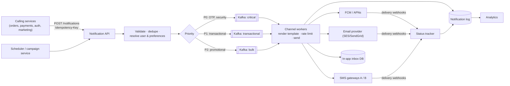
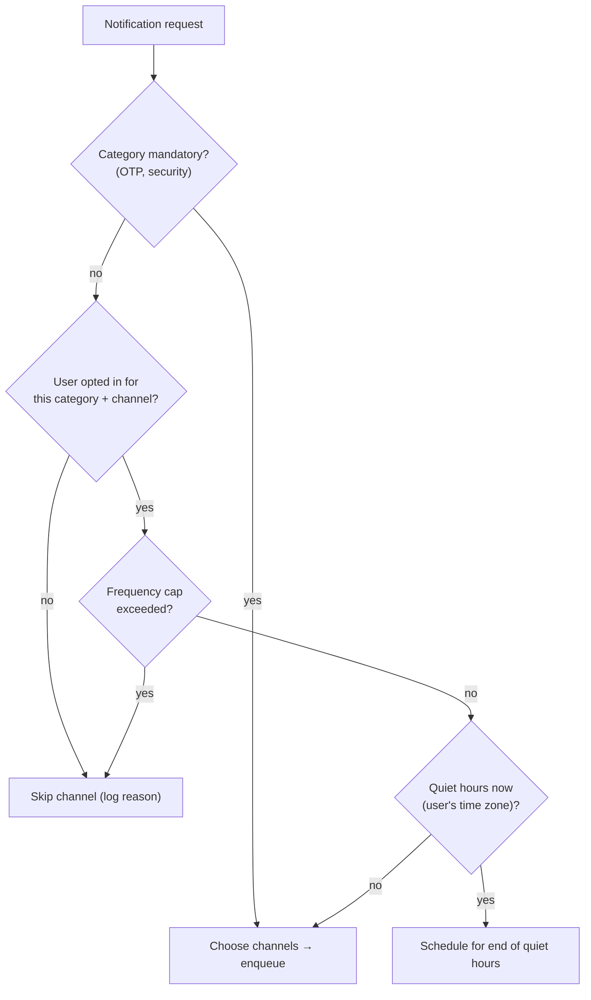
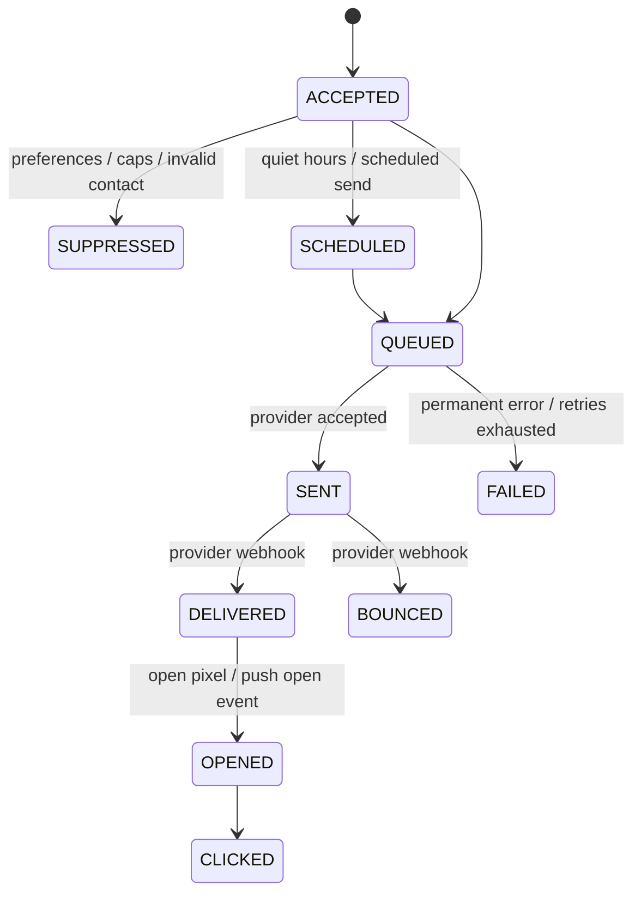

# Notification System — Multi-Channel Delivery at Scale (Push, Email, SMS, In-App)

> **System Design · Classic Designs** — "Send a notification" sounds trivial until you need to send 50 million of them for a sale, never text a user at 3 AM, never send an OTP twice or zero times, respect opt-outs and telecom regulations, and survive an SMS provider outage. This is the full design.

---

## Table of Contents

1. The Post Office Analogy
2. Requirements, Scale, and Clarifying Questions
3. High-Level Architecture
4. The Send API and Idempotency
5. Preferences, Quiet Hours, and Compliance
6. Templates and Localization
7. Queues, Priorities, and Workers
8. Channel Providers, Failover, and Rate Limits
9. Retries, Deduplication, and Delivery Guarantees
10. Delivery Tracking and Analytics
11. Broadcasts and Campaigns (Fan-Out)
12. Data Model
13. Practice Assignments (Low / Medium / High)
14. Mini Project — Notification Service with Priorities, Retries, and Preferences
15. Interview Corner
16. Quick Reference

---

## 1. The Post Office Analogy

A post office handles registered letters, parcels, and bulk flyers.

- **Registered mail** (OTPs, payment alerts) jumps the queue and is tracked until signed for.
- **Flyers** (marketing) wait for spare capacity and are never delivered to houses with a "No junk mail" sign.
- Each item goes by the **right carrier** — local courier, air mail, or rail — and if one carrier strikes, the office switches to another.
- A delivery log records every attempt so a customer asking "where's my letter?" gets an answer.

A notification system is that post office: **prioritize, respect the recipient's rules, pick the right channel and provider, retry safely, and track everything.**

---

## 2. Requirements, Scale, and Clarifying Questions

**Functional**

- Channels: mobile push (FCM/APNs), email, SMS, WhatsApp, in-app inbox.
- Types: **transactional** (OTP, order shipped, payment failed) and **promotional** (sale starts).
- Templates with variables and multiple languages.
- User preferences per category and channel; quiet hours; unsubscribe.
- Scheduled sends and bulk campaigns.
- Delivery status and analytics (sent, delivered, opened, clicked, failed).

**Non-functional (example numbers for an e-commerce company)**

| Metric | Target |
|--------|--------|
| Daily volume | ~200M notifications; campaigns spike to 50M in 30 minutes |
| OTP latency | p99 < 5 s end to end to the provider |
| Transactional | At-least-once delivery attempt, no user-visible duplicates |
| Availability | 99.95% for the transactional path |

| Clarifying question | Why |
|---------------------|-----|
| Which channels and providers? | Provider limits drive the rate-limiting design |
| Is ordering required? | Usually per user per conversation, not global |
| Who calls us — internal services only? | Auth model, quotas per calling service |
| Regional regulations? | India: TRAI DLT registration for SMS templates, DND preferences; EU: consent (GDPR); US: TCPA for SMS |

---

## 3. High-Level Architecture



Key principles:

- **Accept fast, deliver asynchronously**: the API validates and enqueues; callers never wait for providers.
- **Separate lanes by priority**: a 50M-message campaign must not delay a single OTP.
- **Channel workers are stateless** and horizontally scalable; provider limits are enforced centrally.

---

## 4. The Send API and Idempotency

```http
POST /v1/notifications
Idempotency-Key: 9f1c2e7a-order-8812-shipped
Content-Type: application/json

{
  "userId": "u_4412",
  "category": "ORDER_UPDATES",
  "template": "order_shipped",
  "data": { "orderId": "ORD-8812", "carrier": "BlueDart", "eta": "2026-10-02" },
  "channels": ["PUSH", "EMAIL"],
  "priority": "TRANSACTIONAL"
}
→ 202 Accepted { "notificationId": "n_7a1..." }
```

<div class="callout-warn">

**Duplicates come from retries everywhere**: the order service retries on a timeout, Kafka redelivers after a consumer crash, providers retry webhooks. Require an **idempotency key** at the API (stored with a unique constraint and a TTL, e.g., 24-48 h) and make workers idempotent by `(notificationId, channel)`. A user who gets "Your order has shipped" three times files a bug; a user who gets three different OTPs gets locked out.

</div>

---

## 5. Preferences, Quiet Hours, and Compliance

| Rule | Example |
|------|---------|
| Category opt-out | User disabled `PROMOTIONS` by email but allows push |
| Channel availability | No push token (app uninstalled) → fall back to email for transactional |
| **Quiet hours** | No promotional push between 22:00-08:00 in the **user's** time zone → delay until 08:00 |
| **Mandatory categories** | Security alerts, OTPs, payment failures ignore marketing opt-outs (legal/terms define this) |
| Frequency caps | Max 3 promotional pushes per user per day |
| Regulatory | India SMS: templates registered on the telecom operators' DLT platform, sender IDs, promotional SMS only in allowed hours, honor DND; unsubscribe links in marketing email (and list-unsubscribe headers) |



<div class="callout-scenario">

**Scenario**: A flash-sale push goes out at 2 AM to users in the US because the campaign was scheduled in IST, and support tickets explode. **Decision**: Store each user's time zone; evaluate quiet hours per user at send time; campaigns specify "local time" delivery windows, and the scheduler buckets users by time zone. Add a pre-send safety check that blocks promotional sends outside allowed windows regardless of how the campaign was configured.

</div>

---

## 6. Templates and Localization

```text
template: order_shipped   version: 7   category: ORDER_UPDATES
  push.title (en): "Your order is on its way 🚚"
  push.body  (en): "Order {{orderId}} ships via {{carrier}}. Arriving by {{eta | date:'d MMM'}}."
  push.body  (hi): "आपका ऑर्डर {{orderId}} {{carrier}} से भेजा गया है। {{eta | date:'d MMM'}} तक पहुँचेगा।"
  email.subject / email.html / sms.text (DLT template ID: 1107...)
```

| Practice | Why |
|----------|-----|
| Versioned templates, reviewed changes | A typo goes to millions of users |
| Required-variable validation at request time | Reject requests missing `orderId` instead of sending "Order {{orderId}}" |
| Escape variables for HTML email | Prevent injection of user-controlled content |
| Locale fallback (hi → en) | Missing translations shouldn't block sends |
| Channel limits | SMS length/segments, push title length, preview text |

---

## 7. Queues, Priorities, and Workers

| Lane | Contents | Consumers | Notes |
|------|----------|-----------|-------|
| **Critical** | OTP, security, fraud alerts | Dedicated, over-provisioned workers | Never shares capacity with bulk |
| **Transactional** | Order/payment updates | Autoscaled workers | Per-user ordering via partition key = userId |
| **Bulk** | Campaigns, digests | Throttled workers | Paced by provider quotas; can pause |
| **Retry / delay** | Scheduled and backoff retries | Delay scheduler | Separate topics per delay tier (1 min, 10 min, 1 h) or a delay queue |
| **DLQ** | Permanently failed | Ops tooling | Inspect, fix, replay |

<div class="callout-tip">

**Applying this** — Partition transactional topics by `userId` so one user's notifications are processed in order ("Payment received" shouldn't arrive after "Order shipped"). Use separate consumer groups and separate autoscaling per lane, and alert on **consumer lag per lane** — OTP lag of 30 seconds is an incident; bulk lag of 30 minutes may be fine.

</div>

---

## 8. Channel Providers, Failover, and Rate Limits

```java
public interface ChannelSender {
    Channel channel();
    SendResult send(RenderedMessage msg);          // SUCCESS(providerMessageId) | RETRYABLE(reason) | PERMANENT(reason)
}

@Component
class SmsSender implements ChannelSender {
    private final List<SmsProvider> providers;     // ordered by preference, health-checked
    private final CircuitBreakerRegistry breakers;

    public SendResult send(RenderedMessage msg) {
        for (SmsProvider p : providers) {
            CircuitBreaker cb = breakers.circuitBreaker(p.name());
            if (!cb.tryAcquirePermission()) continue;            // provider unhealthy → next one
            SendResult r = p.send(msg);
            if (r.isRetryable()) cb.onError(0, TimeUnit.MILLISECONDS, new ProviderException(r.reason()));
            else cb.onSuccess(0, TimeUnit.MILLISECONDS);
            if (!r.isRetryable()) return r;                      // success or permanent failure
        }
        return SendResult.retryable("all providers unavailable");
    }
}
```

| Concern | Design |
|---------|--------|
| Provider limits (e.g., SMS gateway 500 msg/s, email per-second quotas) | Distributed token buckets per provider (Redis) shared by all workers |
| Per-user limits | Max N OTPs per phone per hour (also an anti-abuse measure — SMS pumping fraud) |
| Failover | Multiple SMS providers with circuit breakers; route by country/operator and by price |
| Push tokens | Remove invalid tokens when FCM/APNs report them as unregistered |
| Email reputation | Bounce/complaint handling, suppression lists, warm-up for new sending domains |

<div class="callout-warn">

**SMS pumping (traffic pumping) fraud**: attackers trigger OTP sends to premium-rate numbers they profit from. Defenses: per-number and per-IP OTP rate limits, CAPTCHA/device checks on OTP endpoints, blocking unexpected country codes, and alerts on unusual SMS spend by destination.

</div>

---

## 9. Retries, Deduplication, and Delivery Guarantees

| Failure | Classification | Action |
|---------|----------------|--------|
| Provider 5xx / timeout / 429 | Retryable | Exponential backoff with jitter; failover to another provider |
| Invalid phone/email, unregistered push token | Permanent | Don't retry; mark the contact invalid; suppress |
| Template render error | Permanent (a bug) | DLQ + alert |
| OTP older than its validity (e.g., 5 min) | Expired | Drop — a late OTP is useless and confusing |

**Guarantee in practice**: *at-least-once processing* (Kafka + retries) **plus** idempotent sending keyed by `(notificationId, channel)` in the notification log → effectively-once from the user's point of view. Before calling a provider, the worker records `SENDING`; after the provider responds, `SENT` with the provider message ID. On redelivery, a `SENT` record means "skip".

<div class="callout-info">

**Truly exactly-once is impossible across a network boundary**: if the provider accepted the message but the response was lost, you can't know for sure. Use the provider's own idempotency/dedup keys where offered, keep the timeout-then-retry window small for OTPs, and accept that rare duplicates are better than losses for transactional messages (the opposite trade-off may apply to marketing).

</div>

---

## 10. Delivery Tracking and Analytics



- Provider webhooks (delivery receipts, bounces, complaints) are **verified** and **idempotent**, and update status by provider message ID.
- Events stream to an analytics store (e.g., ClickHouse/BigQuery) for delivery rates by provider/channel/template, opens and clicks, and campaign performance.
- A customer-support view answers "did we send the OTP and what happened to it?" within seconds.

---

## 11. Broadcasts and Campaigns (Fan-Out)

"Send the Diwali sale push to 50M users" should not be 50M API calls from the marketing tool.

1. The campaign service stores the campaign (audience query, template, schedule, local-time window).
2. An **audience resolver** streams user IDs in batches (e.g., 10K) from the segment store.
3. Each batch is expanded into notification messages on the **bulk** lane, applying preferences and caps per user.
4. Bulk workers send at the paced rate the providers allow; progress is tracked per batch (resumable if interrupted).
5. **Kill switch**: pausing a campaign stops batch expansion and drains/skips queued messages for that campaign ID.

<div class="callout-scenario">

**Scenario**: A campaign with a broken deep link starts sending to 50M users. **Decision**: The pipeline sends in **waves** — first to an internal seed list and 1% of the audience, with automatic checks (link validity, render errors, open rates) before ramping up — and has a one-click **pause** that stops further batches within seconds. Blast radius is limited to the first wave instead of the whole audience.

</div>

---

## 12. Data Model

```sql
CREATE TABLE notifications (
  id UUID PRIMARY KEY, idempotency_key VARCHAR(128) NOT NULL, caller VARCHAR(64) NOT NULL,
  user_id VARCHAR(64) NOT NULL, category VARCHAR(40) NOT NULL, template VARCHAR(64) NOT NULL,
  template_version INT NOT NULL, priority VARCHAR(16) NOT NULL, payload JSONB NOT NULL,
  created_at TIMESTAMPTZ NOT NULL DEFAULT now(),
  UNIQUE (caller, idempotency_key)
);
CREATE TABLE notification_deliveries (
  notification_id UUID REFERENCES notifications(id), channel VARCHAR(12) NOT NULL,
  status VARCHAR(16) NOT NULL, provider VARCHAR(32), provider_message_id VARCHAR(128),
  attempts INT NOT NULL DEFAULT 0, last_error TEXT, updated_at TIMESTAMPTZ NOT NULL,
  PRIMARY KEY (notification_id, channel)
);
CREATE TABLE user_preferences (
  user_id VARCHAR(64), category VARCHAR(40), channel VARCHAR(12), enabled BOOLEAN NOT NULL,
  PRIMARY KEY (user_id, category, channel)
);
```

At high volume, the delivery log moves to a write-optimized store (Cassandra/DynamoDB keyed by user and time, or partitioned Postgres with retention), with analytics in a columnar store.

---

## 13. 🏋️ Practice Assignments

### 🟢 Low — Build the reflexes

**L1.** Why separate queues for OTPs and marketing messages?

<details>
<summary>Show answer</summary>

To isolate latency-critical traffic from bulk traffic. A 50M-message campaign would otherwise fill the shared queue and delay OTPs by minutes (and OTPs expire). Separate lanes get separate consumers, scaling, and alerts.

</details>

**L2.** Classify as retryable or permanent: (a) SMS provider timeout, (b) "invalid mobile number", (c) FCM "UNREGISTERED" token, (d) HTTP 429 from the email provider.

<details>
<summary>Show answer</summary>

(a) Retryable (with backoff/failover — check if the provider supports idempotency to avoid duplicates). (b) Permanent — mark the number invalid. (c) Permanent — delete the token. (d) Retryable after the `Retry-After` delay (and reduce the send rate).

</details>

**L3.** A user in Singapore has quiet hours 22:00-08:00 local time. A promotional push is triggered at 23:30 SGT. What happens?

<details>
<summary>Show answer</summary>

It's scheduled for 08:00 SGT (possibly with a small random jitter to avoid a thundering herd at exactly 08:00), unless the promotion expires before then, in which case it's dropped and logged as suppressed.

</details>

### 🟡 Medium — Apply it

**M1.** Design OTP delivery with a p99 < 5 s target and a fallback when SMS fails.

<details>
<summary>Show answer</summary>

Critical lane with dedicated workers; the OTP request goes straight to the critical topic (no scheduling, no preference checks beyond valid contact). Send via the primary SMS provider with a short timeout (~2 s); on retryable failure, immediately fail over to the secondary provider (circuit breakers per provider). If the user has the app with a valid push token, optionally send the OTP in-app/push in parallel, or offer "Call me instead" (voice OTP) and WhatsApp as fallbacks after N seconds in the UI. Enforce per-number rate limits and OTP validity (drop sends older than validity). Alert on critical-lane lag and provider error rates; track time-to-provider-acceptance percentiles.

</details>

**M2.** The order service calls your API, times out, and retries. Show how you prevent a duplicate "Order shipped" email.

<details>
<summary>Show answer</summary>

The order service sends a deterministic `Idempotency-Key` (e.g., `order-8812-shipped`). The API inserts into `notifications` with a unique constraint on `(caller, idempotency_key)`; the retry hits the constraint and returns the original `notificationId` (202) without enqueueing again. Downstream, the worker uses `(notificationId, channel)` as the idempotency key in `notification_deliveries`, so Kafka redeliveries also skip already-sent channels.

</details>

**M3.** Design per-provider rate limiting shared by 40 worker pods.

<details>
<summary>Show answer</summary>

A distributed token bucket per provider in Redis (Lua script: refill based on elapsed time, take N tokens atomically), configured to the provider's contracted rate with a safety margin. Workers request tokens in small batches (e.g., 20) to reduce Redis calls. If no tokens, the worker waits/backs off rather than calling the provider. Honor 429s by temporarily reducing the bucket's rate (adaptive). Separate buckets per priority lane allocation (reserve capacity for critical traffic on shared providers).

</details>

### 🔴 High — Think like a senior

**H1.** Your main SMS provider is down for 40 minutes during peak. Walk through what your system does automatically and what the on-call engineer does.

<details>
<summary>Show answer</summary>

**Automatic**: circuit breaker for provider A opens after the error threshold; traffic routes to provider B (and C by region), with B's rate bucket enforcing its limits; critical lane keeps priority for B's capacity while transactional SMS may be delayed and bulk SMS paused automatically when capacity is constrained; OTP UI offers voice/WhatsApp fallbacks; stale OTP messages are dropped instead of sent late. **On-call**: confirm via dashboards (error rate per provider, lane lag), check provider status, adjust routing weights or temporarily raise B's contracted limit, pause promotional SMS campaigns, communicate to stakeholders; after recovery, half-open probes restore A gradually, retry queues drain at a controlled rate, and a post-incident review checks duplicates, losses, and cost.

</details>

**H2.** Build a notification platform that 30 internal teams can use safely. What governance and platform features do you add?

<details>
<summary>Show answer</summary>

Caller authentication (service identity) and per-caller quotas; a template registry with review/approval workflow (especially for SMS DLT templates and marketing), preview and test-send tools; category registry defining which categories are mandatory vs opt-out-able (reviewed by legal); global frequency caps across teams so users aren't spammed by 30 independent senders; campaign approval flows and staged rollouts with kill switches; self-service dashboards (delivery rates, costs per team, bounce rates); cost attribution per caller (SMS is expensive); SDK/client library with idempotency keys built in; data retention and PII policies for message payloads; audit logs of who sent what.

</details>

---

## 14. 🛠️ Mini Project — Notification Service with Priorities, Retries, and Preferences

**Goal**: A working, testable notification pipeline on your laptop. 1 week of evenings.

**Stack**: Spring Boot, Kafka (Docker), Postgres, Redis, MailHog (fake SMTP) and fake SMS/push providers you write (HTTP stubs that randomly fail, slow down, or return permanent errors).

**Build**

1. `POST /v1/notifications` with `Idempotency-Key`; preference resolution (category × channel), quiet hours per user time zone, mandatory categories.
2. Three Kafka topics (critical, transactional, bulk) with separate consumer groups; partition key = userId.
3. Template rendering with versioned templates and two locales.
4. SMS sender with two fake providers, circuit breakers, and a Redis token bucket per provider.
5. Retries with backoff via delay topics; DLQ; `notification_deliveries` status tracking; fake provider delivery webhooks updating status idempotently.
6. A campaign endpoint that fans out 100K fake users in batches with a pause switch.
7. Metrics: sends per channel/status, lane lag, provider error rates; a Grafana dashboard.

**Acceptance criteria**

- Kill provider A during a 10K-message test → all messages delivered via B; zero duplicates in `notification_deliveries`.
- An OTP sent during a 100K campaign reaches the fake provider within 2 seconds.
- A retried API call with the same key never creates a second notification.

---

## 🎯 Interview Corner

<div class="callout-interview">

**Q: "Design a notification system for push, email, and SMS."**

The API accepts requests with an idempotency key, validates the template and data, resolves the user's contacts and preferences — category opt-outs, quiet hours in their time zone, frequency caps, with OTP and security alerts marked mandatory — and enqueues onto priority lanes: critical, transactional, and bulk. Stateless channel workers render versioned, localized templates, apply distributed rate limits per provider and per user, and send through provider adapters with circuit breakers and failover. Delivery is at-least-once with retries and backoff plus idempotent sends keyed by notification and channel, so users don't see duplicates. Provider webhooks update a status state machine, and events flow to analytics. Campaigns fan out in batches on the bulk lane with staged rollout and a kill switch.

</div>

<div class="callout-interview">

**Q: "How do you make sure an OTP isn't delayed by a marketing blast?"**

Isolation at every layer. OTPs go to a dedicated critical topic with its own consumer group and over-provisioned workers, and reserved capacity in each SMS provider's rate budget. Bulk traffic is paced and can be paused automatically when capacity is tight. I alert on critical-lane lag in seconds and on time-to-provider acceptance, and drop OTP sends that are older than the OTP's validity instead of delivering them late. Multiple SMS providers with circuit breakers, plus voice and WhatsApp fallbacks in the UI, cover provider outages.

**Follow-up trap**: "Why not just give OTP messages a higher priority inside one queue?" → Kafka topics don't reorder by priority, and shared consumers still get saturated by bulk volume. Separate lanes give real isolation.

</div>

<div class="callout-interview">

**Q: "How do you avoid sending duplicate notifications?"**

Duplicates come from retries at every hop, so I deduplicate at each boundary. The API requires an idempotency key per caller with a unique constraint, so a caller's retry returns the original notification ID. Workers record a per-channel delivery row, SENDING then SENT with the provider message ID, and skip channels already sent when Kafka redelivers. Provider webhooks are processed idempotently by provider message ID. Where a provider supports its own dedup keys, I pass them too, because a lost response after the provider accepted a message is the one case you can't fully resolve.

</div>

---

## Quick Reference

| Concern | Design |
|---------|--------|
| Entry | Async API, idempotency key, validation, 202 Accepted |
| Rules | Preferences per category × channel, mandatory categories, quiet hours (user TZ), frequency caps, regulations (DLT/DND, unsubscribe) |
| Lanes | Critical / transactional / bulk topics, separate consumers; partition by userId |
| Templates | Versioned, localized, variable validation, channel limits |
| Providers | Adapters, circuit breakers, failover, Redis token buckets |
| Retries | Backoff + jitter, delay topics, DLQ; drop expired OTPs |
| Dedup | Per-caller idempotency keys + per-(notification, channel) delivery records |
| Tracking | Status state machine from provider webhooks → analytics |
| Campaigns | Batch fan-out, waves, kill switch, local-time windows |
| Fraud | Per-number/IP OTP limits to stop SMS pumping |

---

## Related Topics

- `kafka-deep-dive` — topics, partitions, consumer groups
- `rate-limiter` — token buckets used for provider limits
- `messaging-decisions` — Kafka vs SQS vs RabbitMQ for the lanes
- `microservices-patterns` — circuit breakers and retries

> **A notification system's job isn't to send messages — it's to send the right message, once, on the right channel, at a time the user wants it. Everything in the design exists to protect that promise.**

---

<!-- journey-link:start -->

<div class="callout-journey">

🛒 **ShopNorth Journey** — ShopNorth's notification service consumes OrderPaid events from Kafka, so a slow email or SMS provider can never slow down checkout.

**Continue the story:** [Chapter 6 · Microservices & Events](/tutorials/journey-06-microservices) · **New here?** [Start the journey](/tutorials/journey-start)

</div>

<!-- journey-link:end -->
