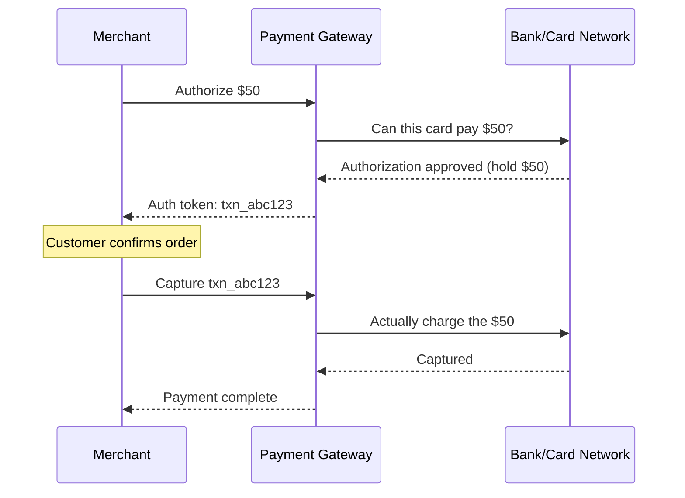
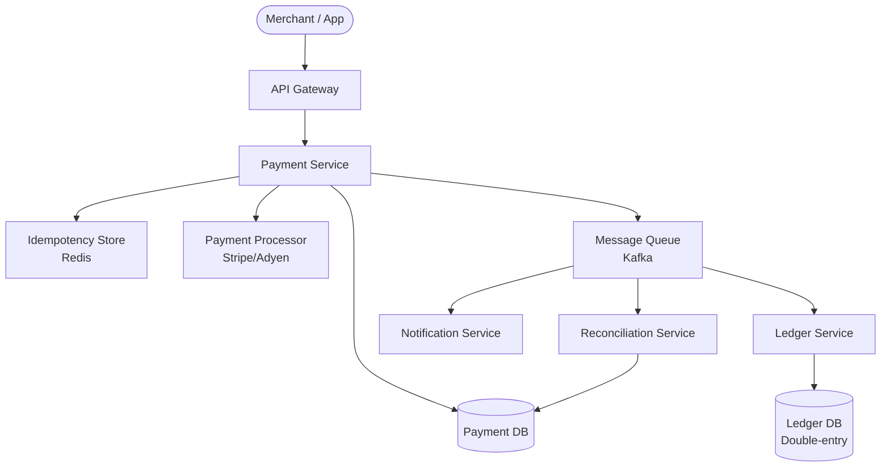
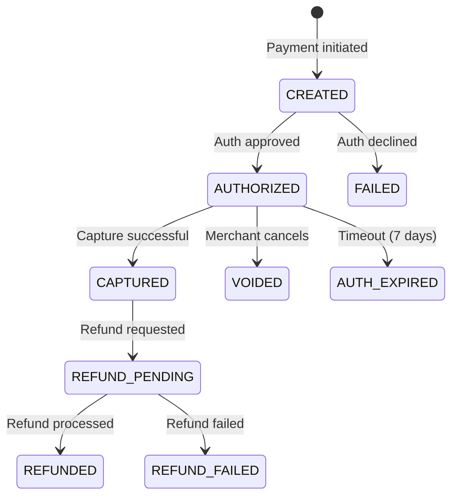
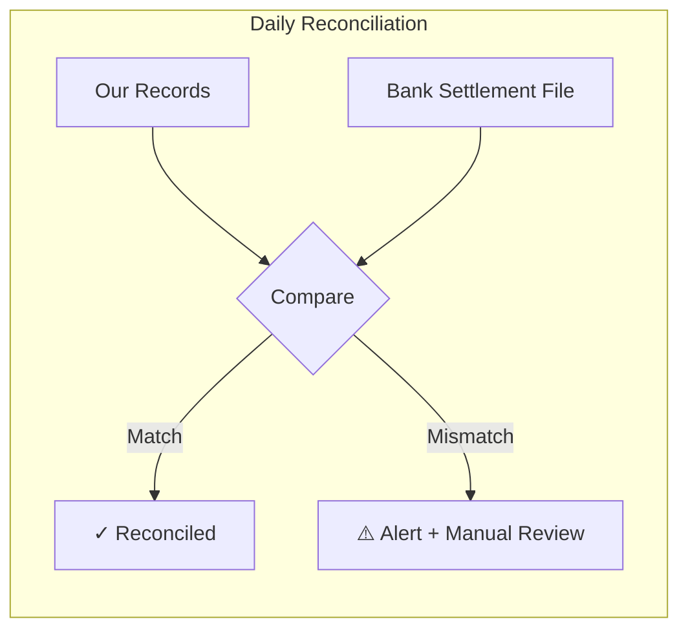

# Payment Gateway — Complete System Design

<!-- sdlc-stage:start -->
<div class="sdlc-stage">

📍 **SDLC stage: Development — services & events** · ShopNorth uses this in [Chapter 6 · Microservices & Events](/tutorials/journey-06-microservices)

</div>
<!-- sdlc-stage:end -->

## 1. Problem Statement

Design a payment processing system that:
- Accepts payments via credit card, bank transfer, and digital wallets
- Guarantees **exactly-once processing** (no double charges!)
- Handles failures gracefully with retries and reconciliation
- Processes millions of transactions per day

---

## 2. Why Payment Systems Are Hard

> Imagine you buy coffee for $5. Your card is charged, but the coffee shop's system crashes before recording it. You're charged but got nothing. Or worse — the system retries and charges you twice.

Payment systems must handle: **network failures, timeouts, duplicate requests, partial failures, and regulatory compliance** — all while moving real money.

---

## 3. Key Concepts

### Idempotency — The Most Important Concept

```
Client sends: "Charge $50, idempotency_key=abc123"
Server processes it → Success

Client retries (network timeout): "Charge $50, idempotency_key=abc123"
Server sees same key → Returns cached result (no double charge!)
```

```java
public PaymentResponse processPayment(PaymentRequest request) {
    // Check if we've seen this idempotency key before
    Optional<PaymentResponse> cached = idempotencyStore.get(request.getIdempotencyKey());
    if (cached.isPresent()) {
        return cached.get();  // return same response, don't process again
    }

    PaymentResponse response = doProcessPayment(request);
    idempotencyStore.save(request.getIdempotencyKey(), response);
    return response;
}
```

### Two-Phase Payment



- **Authorize**: "Can this card pay?" (money is held, not charged)
- **Capture**: "Actually charge it" (money moves)
- **Why two phases?** Hotels authorize at check-in, capture at checkout (final amount may differ)

---

## 4. High-Level Design



### Components

| Component | Purpose |
|-----------|---------|
| Payment Service | Core processing, orchestrates the flow |
| Idempotency Store | Prevents duplicate processing |
| Payment DB | Stores transaction state |
| PSP (Payment Service Provider) | Actual card/bank integration (Stripe, Adyen) |
| Ledger Service | Double-entry bookkeeping |
| Reconciliation Service | Matches our records with bank records |
| Notification Service | Emails, webhooks to merchants |

---

## 5. Payment State Machine



> Every payment has a clear state. No ambiguity. This is critical for debugging and reconciliation.

---

## 6. Double-Entry Ledger

Every financial transaction has **two entries** that must balance:

```
Payment of $50 from Customer to Merchant:

| Account          | Debit  | Credit |
|------------------|--------|--------|
| Customer Wallet  |        | $50    |
| Merchant Account | $50    |        |

Total Debits = Total Credits = $50 ✓
```

```java
public void recordPayment(Payment payment) {
    ledgerService.record(
        new LedgerEntry(payment.getCustomerAccount(), EntryType.CREDIT, payment.getAmount()),
        new LedgerEntry(payment.getMerchantAccount(), EntryType.DEBIT, payment.getAmount())
    );
    // These two entries are saved in a single transaction — atomic
}
```

---

## 7. Handling Failures

### Retry with Exponential Backoff

```java
public PaymentResponse processWithRetry(PaymentRequest request) {
    int maxRetries = 3;
    long delay = 1000;  // 1 second

    for (int attempt = 0; attempt < maxRetries; attempt++) {
        try {
            return psp.charge(request);
        } catch (TransientException e) {
            Thread.sleep(delay);
            delay *= 2;  // 1s → 2s → 4s
        }
    }
    throw new PaymentFailedException("Max retries exceeded");
}
```

### Reconciliation — The Safety Net



Every day, compare your records with the bank's settlement file. Mismatches = something went wrong.

---

## 8. Security

| Concern | Solution |
|---------|----------|
| Card data exposure | **PCI DSS compliance**, tokenization |
| Man-in-the-middle | TLS everywhere, certificate pinning |
| Fraud | Velocity checks, ML-based fraud scoring |
| Data at rest | Encrypt sensitive fields (AES-256) |
| API security | API keys, OAuth 2.0, rate limiting |

### Tokenization

```
Customer enters: 4111-1111-1111-1111
We store: tok_abc123xyz (token)
Actual card number stored ONLY at PCI-compliant PSP
```

---

## 9. Summary

| Aspect | Decision |
|--------|----------|
| Idempotency | Redis with TTL for idempotency keys |
| State management | Explicit state machine |
| Accounting | Double-entry ledger |
| Failure handling | Retry + reconciliation |
| Security | Tokenization + PCI DSS |
| Async processing | Kafka for notifications, ledger, reconciliation |

---

<div class="callout-tip">

**Applying this**: Payment systems are about **trust and correctness**, not speed. It's better to be slow and correct than fast and wrong. When designing any financial flow, always build in idempotency, explicit state machines, and reconciliation.

</div>

<div class="callout-interview">

🎯 **Interview Ready**: "The three pillars of payment system design are: (1) Idempotency — prevent double charges via idempotency keys, (2) State machines — every payment has explicit states with valid transitions, (3) Reconciliation — daily matching of your records against bank settlement files."

</div>

---

<!-- practice-pack -->

## 🏢 Real-World Scenarios

<div class="callout-scenario">

**Scenario**: During a UPI outage, a merchant's checkout shows "payment failed" after a 30-second timeout, customers retry, and later many are charged twice — the first attempts actually succeeded at the bank after the timeout. **Decision**: A timeout is an **unknown** outcome, not a failure. Mark the payment `PENDING`, show "we're confirming your payment", and resolve it via the provider's status API polling and webhooks; block a second payment attempt for the same order while one is pending (idempotency on the order), and auto-refund if both do succeed. Reconciliation with bank settlement files catches anything left.

</div>

<div class="callout-scenario">

**Scenario**: Finance finds that the payment system's daily totals don't match the bank's settlement report by ₹38,412, and nobody can explain why. **Decision**: Payment systems need a **double-entry ledger** (every movement recorded as balanced debit/credit entries, append-only) and an automated **reconciliation** job that matches each internal transaction with the provider's settlement file line by line: matched, missing internally, missing at the provider, and amount mismatches. Unmatched items go to an operations queue. Money bugs are found by reconciliation, not by customers.

</div>

## 🏋️ Practice Assignments

### 🟢 Low — Build the reflexes

**L1.** Authorization vs capture — what's the difference and why separate them?

<details>
<summary>Show answer</summary>

**Authorization** reserves funds on the customer's card (the issuer approves and holds the amount); **capture** actually moves the money. Separating them lets merchants capture only when goods ship or a service is confirmed, capture less than authorized (partial shipments), or **void** an authorization without the cost and delay of a refund. Authorizations expire after some days if not captured.

</details>

**L2.** Why must the payment API require an idempotency key?

<details>
<summary>Show answer</summary>

Clients retry on timeouts and network errors; without idempotency, a retry can create a second charge. With a key per payment intent, the server returns the original result for retries (and rejects the same key with different parameters), making retries safe.

</details>

**L3.** List the states of a typical card payment.

<details>
<summary>Show answer</summary>

CREATED → (AUTHORIZATION_PENDING) → AUTHORIZED → CAPTURED → (partially) REFUNDED; plus FAILED/DECLINED, VOIDED (authorization released), and PENDING/UNKNOWN when the outcome isn't yet known. Transitions are validated so, e.g., a VOIDED payment can't be captured.

</details>

### 🟡 Medium — Apply it

**M1.** Write the ledger entries for: a customer pays ₹1,000 for an order; the platform keeps a 2% fee; later the merchant is paid out; then the customer gets a full refund.

<details>
<summary>Show answer</summary>

(Amounts in ₹; every transaction's debits = credits.)

1. Payment captured: **Dr** Provider Receivable 1,000 / **Cr** Merchant Payable 980, **Cr** Platform Fee Revenue 20.
2. Provider settles to our bank: **Dr** Bank 1,000 / **Cr** Provider Receivable 1,000.
3. Payout to merchant: **Dr** Merchant Payable 980 / **Cr** Bank 980.
4. Refund to customer (policy: fee also refunded; merchant owes the platform the ₹980 already paid out): **Dr** Merchant Receivable 980, **Dr** Platform Fee Revenue 20 / **Cr** Bank 1,000 (or Provider Payable, until the refund settles).

The exact accounts depend on the business and accounting policy (whether fees are refundable, who bears the refund) — the principle is that every movement is an explicit, balanced, append-only entry, and balances are derived from entries.

</details>

**M2.** Design webhook handling from the payment provider so it's secure and idempotent.

<details>
<summary>Show answer</summary>

Verify the signature (HMAC with the shared secret or provider's public key) over the raw body, and check the timestamp tolerance to prevent replays; reject otherwise. Store the event ID with a unique constraint (dedupe); process in the same transaction as the state change; respond 2xx quickly and do heavy work asynchronously; handle out-of-order events by checking the current state (e.g., ignore "authorized" after "captured"); for critical events, re-fetch the payment from the provider's API rather than trusting the payload alone. Monitor webhook failures and have the reconciliation job as a safety net.

</details>

**M3.** A payment has been `PENDING` for 20 minutes. What should the system do?

<details>
<summary>Show answer</summary>

A background job polls the provider's status API with backoff (the webhook may have been lost). If it resolves: update state, fulfill or cancel the order accordingly, notify the customer. If the provider still reports pending (e.g., UPI collect not yet approved), keep waiting until the provider's documented timeout, then mark failed/expired and release the order hold. Throughout, the customer sees an honest "processing" status and cannot be charged twice for the same order. Alert when pending counts spike (a provider incident).

</details>

### 🔴 High — Think like a senior

**H1.** Design routing across multiple payment providers (smart routing) to maximize success rate and minimize cost.

<details>
<summary>Show answer</summary>

A routing engine chooses a provider per transaction using rules and live metrics: payment method (card network, UPI, netbanking), issuing bank/BIN, amount, provider fees, and each provider's recent **success rate and latency** for that segment (sliding windows). Circuit breakers take failing providers out; retries on a second provider happen only for failures that are known safe (e.g., declined before reaching the issuer, never after an unknown outcome) and within regulatory constraints. Tokenized cards must be available across providers (network tokens or a vault). Measure with A/B-style splits, track cost per successful payment, and keep the ledger and reconciliation provider-aware.

</details>

**H2.** What does PCI DSS scope mean for your architecture, and how do you minimize it?

<details>
<summary>Show answer</summary>

Any system that stores, processes, or transmits cardholder data (card numbers, CVV) — and systems connected to them — falls into PCI DSS scope, with strict controls (network segmentation, encryption, access control, logging, audits). Minimize scope by never letting raw card data touch your servers: use the provider's hosted fields/iframes or SDKs that send card data directly to the provider and return a **token**; store only tokens and last-4 digits; never log card data (masking filters); isolate any unavoidable card-handling components in a segmented network with tight access. Scope reduction is one of the highest-leverage security decisions in payments.

</details>

## 🛠️ Mini Project — Mini Payment Service with Ledger and Reconciliation

**Goal**: Implement the parts that make payments trustworthy. 1 week of evenings.

**Build**

1. Spring Boot + Postgres: `POST /payments` (Idempotency-Key), `POST /payments/{id}/capture`, `/void`, `/refund`, with a validated state machine.
2. A fake provider (WireMock or a stub service) that sometimes declines, times out after actually succeeding, sends duplicate or out-of-order webhooks, and produces a daily settlement CSV.
3. Signed webhook verification (HMAC + timestamp) and idempotent processing.
4. A double-entry ledger (`journal_entries`, `postings` with debit/credit, amounts in paise as `BIGINT`) with a DB check that every journal entry balances; balances derived from postings.
5. A pending-resolution job (status polling) and a reconciliation job comparing internal captures with the settlement CSV, producing a mismatch report.
6. Tests: duplicate requests, timeout-then-success, refund after capture, and the ledger always balancing (sum of debits = sum of credits).

**Acceptance criteria**: no double charges under any injected failure; reconciliation catches every mismatch you plant; money never stored as floating point.

## 🎯 Interview Corner

<div class="callout-interview">

**Q: "Design a payment system for an e-commerce platform."**

The merchant creates a payment intent with an idempotency key. Card details go directly from the customer's browser to the provider through hosted fields, so we only handle tokens, which keeps us out of most PCI scope. We call the provider to authorize, and capture when the order is confirmed. Payment state lives in a validated state machine — created, authorized, captured, refunded, failed, pending — updated by synchronous responses, signed idempotent webhooks, and a status-polling job for unknown outcomes. Every money movement is recorded in an append-only double-entry ledger, with balances derived from it. A daily reconciliation job matches our records against provider settlement files. Around that: routing across providers with circuit breakers, idempotency everywhere, and events to orders and notifications through an outbox.

</div>

<div class="callout-interview">

**Q: "A payment request timed out. What do you do?"**

A timeout means the outcome is unknown: the bank may have approved it after our client gave up. So I never mark it failed or let the customer retry blindly. The payment moves to pending, and the customer sees that we're confirming it. We resolve it by querying the provider's status API with the same idempotency reference and by listening for the webhook. While it's pending, the order can't start a second payment attempt. If both an original and a retried payment ever succeed, an automatic refund fixes it, and reconciliation catches anything that slips through. Treating timeouts as failures is the classic cause of double charges.

**Follow-up trap**: "Can't you just retry the charge with the same idempotency key?" → Yes, if the provider supports idempotency keys, a retry with the same key is safe and returns the original result. That's the preferred approach, but it still depends on the provider honoring the key, so status checks and reconciliation remain necessary.

</div>

<div class="callout-interview">

**Q: "Why use a double-entry ledger instead of a balance column?"**

A balance column records the result but not how you got there. Every update overwrites history, bugs silently corrupt totals, and there's nothing to audit or reconcile against. In a double-entry ledger, every movement is an immutable transaction whose debits equal its credits across accounts like customer, merchant payable, fees, and bank, so the books always balance by construction. Balances are derived from, or cached from, the entries. Mistakes are fixed with reversing entries rather than edits, and auditors and reconciliation can trace every rupee. It's how banks and payment companies stay correct at scale.

</div>

---

<!-- journey-link:start -->

<div class="callout-journey">

🛒 **ShopNorth Journey** — ShopNorth's checkout uses a hosted payment page, signed webhooks, and idempotency keys — and survives a provider outage in Chapter 14.

**Continue the story:** [Chapter 6 · Microservices & Events](/tutorials/journey-06-microservices) · **New here?** [Start the journey](/tutorials/journey-start)

</div>

<!-- journey-link:end -->
