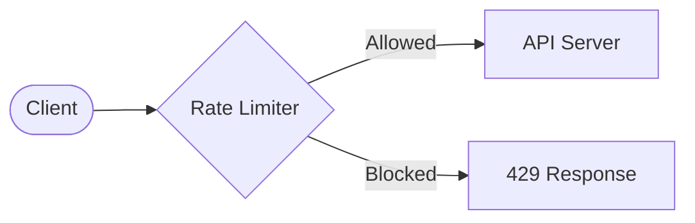
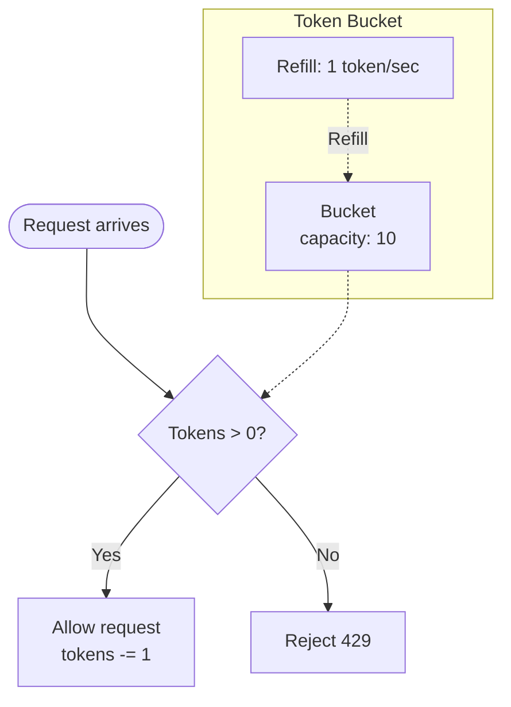
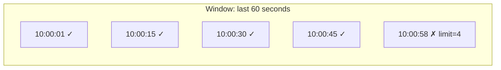
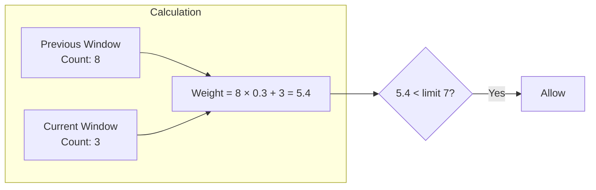
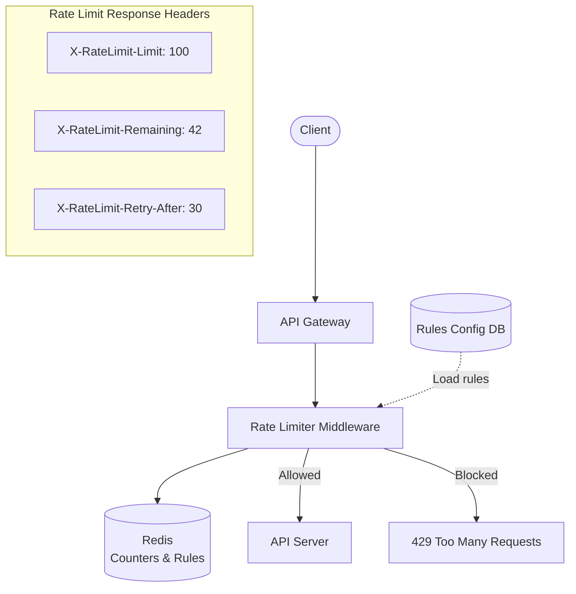
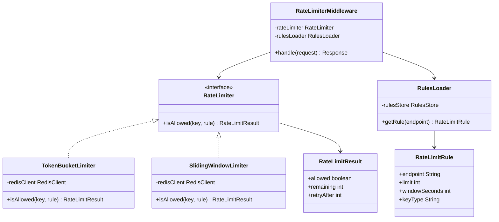
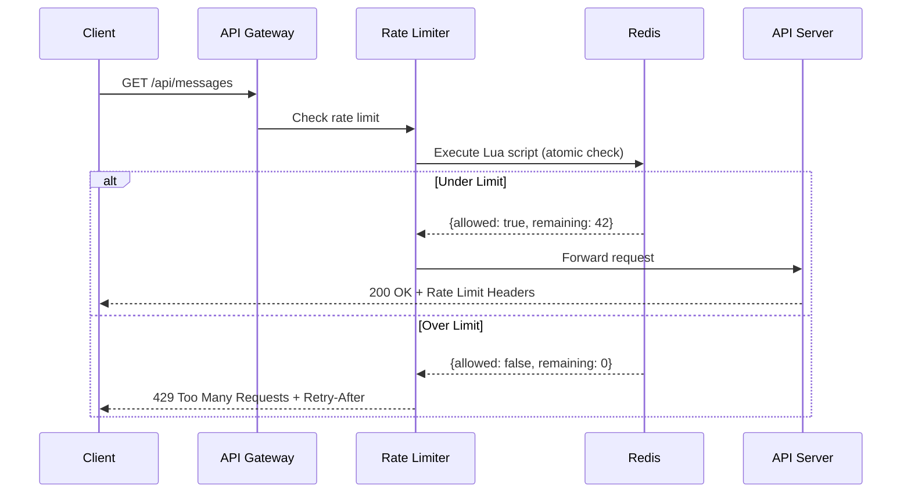
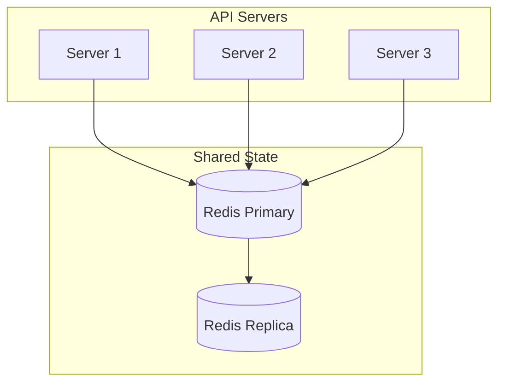

# Rate Limiter — Complete System Design

<!-- sdlc-stage:start -->
<div class="sdlc-stage">

📍 **SDLC stage: Operations — release & incidents** · ShopNorth uses this in [Chapter 14 · Launch Day & Incidents](/tutorials/journey-14-launch-day)

</div>
<!-- sdlc-stage:end -->

## 1. Problem Statement

Design a **rate limiter** that controls the rate of requests a client can send to an API. It:
- Prevents abuse and DDoS attacks
- Ensures fair usage across all clients
- Protects backend services from being overwhelmed

---

## 2. Functional Requirements

| # | Requirement |
|---|-------------|
| 1 | Limit requests per client based on configurable rules |
| 2 | Return `429 Too Many Requests` when limit is exceeded |
| 3 | Support different rate limit rules per API endpoint |
| 4 | Include rate limit headers in response (`X-RateLimit-Remaining`, etc.) |

## 3. Non-Functional Requirements

- **Low latency** — rate check must add < 1ms overhead
- **Distributed** — works across multiple API servers
- **Accurate** — no race conditions in counting
- **Fault tolerant** — if rate limiter fails, traffic should still flow

---

## 4. Where to Place the Rate Limiter?



| Option | Pros | Cons |
|--------|------|------|
| **Client-side** | Simple | Easily bypassed |
| **Server-side** | Full control | Adds load to API servers |
| **Middleware / API Gateway** | Centralized, reusable | Extra hop |

> **Best practice**: Implement at the **API Gateway** or as **middleware** before the API server.

---

## 5. Rate Limiting Algorithms

### 5.1 Token Bucket

The most commonly used algorithm. Simple and memory efficient.



**How it works:**
1. Bucket holds tokens up to a max capacity
2. Each request consumes 1 token
3. Tokens are refilled at a fixed rate
4. If bucket is empty → reject request

**Parameters:**
- `bucketSize` — max burst capacity
- `refillRate` — tokens added per second

---

### 5.2 Sliding Window Log

Tracks timestamps of each request in a sorted set.



**How it works:**
1. Store timestamp of each request
2. Remove timestamps older than the window
3. Count remaining — if count >= limit → reject

**Pros:** Very accurate
**Cons:** High memory usage (stores every timestamp)

---

### 5.3 Sliding Window Counter

Hybrid of fixed window + sliding window. Best balance of accuracy and memory.



**Formula:**
```
requests = prev_window_count × overlap_percentage + current_window_count
```

---

### Algorithm Comparison

| Algorithm | Memory | Accuracy | Burst Handling |
|-----------|--------|----------|----------------|
| Token Bucket | Low | Good | Allows bursts up to bucket size |
| Sliding Window Log | High | Exact | No burst |
| Sliding Window Counter | Low | Approximate | Smoothed |
| Fixed Window Counter | Low | Poor at edges | Allows 2x burst at boundary |
| Leaky Bucket | Low | Good | Smooths output rate |

---

## 6. High-Level Design (HLD)



### Components

1. **API Gateway** — entry point, routes to rate limiter
2. **Rate Limiter Middleware** — checks rate before forwarding
3. **Redis** — stores counters per client (fast, atomic operations)
4. **Rules Config** — defines limits per endpoint/user tier

---

## 7. Detailed Design

### Rate Limit Rules

```json
{
  "rules": [
    {
      "endpoint": "/api/v1/messages",
      "limit": 5,
      "window": 60,
      "unit": "seconds",
      "keyType": "user_id"
    },
    {
      "endpoint": "/api/v1/login",
      "limit": 3,
      "window": 300,
      "unit": "seconds",
      "keyType": "ip"
    }
  ]
}
```

### Redis Key Design

```
rate_limit:{client_id}:{endpoint}:{window_start}
```

Example: `rate_limit:user123:/api/messages:1700000000`

---

## 8. Low-Level Design (LLD)

### Class Diagram



### Token Bucket — Redis Lua Script

Using a Lua script ensures **atomicity** (no race conditions):

```lua
-- KEYS[1] = bucket key
-- ARGV[1] = bucket capacity
-- ARGV[2] = refill rate (tokens/sec)
-- ARGV[3] = current timestamp

local key = KEYS[1]
local capacity = tonumber(ARGV[1])
local refillRate = tonumber(ARGV[2])
local now = tonumber(ARGV[3])

local bucket = redis.call('HMGET', key, 'tokens', 'lastRefill')
local tokens = tonumber(bucket[1]) or capacity
local lastRefill = tonumber(bucket[2]) or now

-- Calculate tokens to add
local elapsed = now - lastRefill
local newTokens = math.min(capacity, tokens + elapsed * refillRate)

if newTokens >= 1 then
    redis.call('HMSET', key, 'tokens', newTokens - 1, 'lastRefill', now)
    redis.call('EXPIRE', key, capacity / refillRate * 2)
    return {1, math.floor(newTokens - 1)}  -- allowed, remaining
else
    return {0, 0}  -- denied
end
```

### Request Flow (Sequence Diagram)



---

## 9. Distributed Rate Limiting

When you have multiple API servers, each server must share the same counter.



### Challenges & Solutions

| Challenge | Solution |
|-----------|----------|
| Race conditions | Redis Lua scripts (atomic) |
| Redis failure | Fail-open (allow traffic) or local fallback |
| Multi-region | Sync counters via Redis Cluster or local + global limits |
| Clock skew | Use Redis server time, not client time |

---

## 10. Rate Limiting by Different Keys

| Key Type | Use Case |
|----------|----------|
| **IP Address** | Anonymous users, login endpoints |
| **User ID** | Authenticated API calls |
| **API Key** | Third-party integrations |
| **Endpoint** | Protect specific expensive operations |
| **Composite** | `user_id + endpoint` for fine-grained control |

---

## 11. Response Headers

Always include these headers so clients can self-regulate:

```
HTTP/1.1 429 Too Many Requests
X-RateLimit-Limit: 100
X-RateLimit-Remaining: 0
X-RateLimit-Reset: 1700000060
Retry-After: 30
```

---

## 12. Summary

| Aspect | Decision |
|--------|----------|
| Algorithm | Token Bucket (most common) |
| Storage | Redis (fast, atomic with Lua) |
| Placement | API Gateway / Middleware |
| Failure mode | Fail-open (allow traffic) |
| Key | User ID + Endpoint |
| Distributed | Redis Cluster with Lua scripts |

---

<div class="callout-tip">

**Applying this**: When adding rate limiting to your API, start with Token Bucket (it's what AWS API Gateway and Stripe use). Use Redis Lua scripts for atomic distributed counting. Always fail-open — if the rate limiter is down, let traffic through rather than blocking everything.

</div>

<div class="callout-interview">

🎯 **Interview Ready**: "I'd use Token Bucket for rate limiting because it handles bursts naturally. For distributed systems, Redis with Lua scripts ensures atomic counting. Key trade-offs: Token Bucket allows bursts up to bucket size, Sliding Window is more accurate but uses more memory. Always discuss the distributed case and failure mode (fail-open)."

</div>

---

<!-- practice-pack -->

## 🏢 Real-World Scenarios

<div class="callout-scenario">

**Scenario**: A login endpoint is protected by a per-IP limit of 10 requests/minute, yet credential-stuffing succeeds: attackers use 50,000 residential proxy IPs, one or two attempts each. **Decision**: Per-IP limits alone don't stop distributed attacks. Layer limits on the **target** (per username/account: e.g., 5 failed attempts per 15 minutes with exponential lockout), global anomaly detection (sudden spikes of failures across accounts), device fingerprinting, CAPTCHA challenges after failures, breached-password checks, and MFA. Rate limiting is one layer of abuse protection, not the whole solution.

</div>

<div class="callout-scenario">

**Scenario**: The Redis cluster backing the API rate limiter goes down, and the gateway starts rejecting **all** requests because every limit check errors out. **Decision**: Decide the failure mode deliberately: for most APIs, **fail open** (allow requests, alert loudly, and rely on per-instance local limits as a backstop); for security-critical endpoints (login, OTP send), **fail closed** or fall back to strict local limits. Also give the limiter its own timeout (a few milliseconds) so a slow Redis doesn't add latency to every request.

</div>

## 🏋️ Practice Assignments

### 🟢 Low — Build the reflexes

**L1.** Token bucket with capacity 10 and refill 1 token/second: a client sends 15 requests instantly, then 1 request every second. What happens?

<details>
<summary>Show answer</summary>

The first 10 succeed (the burst drains the bucket), the next 5 are rejected (429). Afterwards, one token refills per second, so one request per second succeeds. Token bucket allows bursts up to capacity while enforcing the long-term average rate.

</details>

**L2.** What's the boundary problem of the fixed-window counter?

<details>
<summary>Show answer</summary>

With "100 requests per minute" windows aligned to clock minutes, a client can send 100 requests at 12:00:59 and 100 more at 12:01:00 — 200 requests in 2 seconds, double the intended rate. Sliding window log/counter algorithms smooth this out.

</details>

**L3.** Which response and headers should a rate-limited API return?

<details>
<summary>Show answer</summary>

`429 Too Many Requests` with `Retry-After` (seconds until retry is sensible), and optionally rate-limit headers describing the limit, remaining quota, and reset time (e.g., `X-RateLimit-Limit`, `X-RateLimit-Remaining`, `X-RateLimit-Reset`, or the IETF `RateLimit` header fields).

</details>

### 🟡 Medium — Apply it

**M1.** Implement an atomic token bucket in Redis with a Lua script.

<details>
<summary>Show answer</summary>

```lua
-- KEYS[1] = bucket key; ARGV: capacity, refill_per_sec, now_ms, requested
local capacity = tonumber(ARGV[1])
local rate     = tonumber(ARGV[2])
local now      = tonumber(ARGV[3])
local req      = tonumber(ARGV[4])

local state  = redis.call('HMGET', KEYS[1], 'tokens', 'ts')
local tokens = tonumber(state[1]) or capacity
local ts     = tonumber(state[2]) or now

tokens = math.min(capacity, tokens + (now - ts) / 1000 * rate)   -- refill since last call
local allowed = tokens >= req
if allowed then tokens = tokens - req end

redis.call('HSET', KEYS[1], 'tokens', tokens, 'ts', now)
redis.call('PEXPIRE', KEYS[1], math.ceil(capacity / rate * 1000) * 2)   -- idle buckets expire
return { allowed and 1 or 0, math.floor(tokens) }
```

The script runs atomically in Redis, so concurrent requests from many gateway instances can't double-spend tokens. Pass `now` from the caller or use `redis.call('TIME')` to avoid relying on each client's clock (clock skew between gateway instances otherwise affects refill).

</details>

**M2.** Design limits for a public API with free (60 req/min), pro (1,000 req/min), and enterprise (custom) plans, plus a global protection for the backend.

<details>
<summary>Show answer</summary>

Key = API key (client ID), limit looked up from the plan (cached config), token bucket per key (burst = e.g. 2x per-second rate). Separate, stricter limits for expensive endpoints (search, exports) via per-route weights (a request costs N tokens). A global concurrency limit / load shedder in front of the backend to protect it when aggregate traffic is too high even if each client is within its plan. Monthly quotas (billing) tracked separately from per-minute rate limits. Return plan info in headers; notify customers approaching quotas.

</details>

**M3.** Your gateway has 20 instances. Compare a centralized Redis limiter with local per-instance limiters.

<details>
<summary>Show answer</summary>

**Centralized (Redis)**: accurate global limits; adds ~1 ms and a dependency (needs HA and a failure policy). **Local**: no network hop, survives Redis outages, but each instance enforces `limit / N` — inaccurate when traffic is uneven across instances (sticky clients) and when instances scale up/down. Hybrid: local token buckets that periodically sync or request token batches from Redis, or local limits as a backstop when Redis is unavailable.

</details>

### 🔴 High — Think like a senior

**H1.** Design rate limiting for OTP sending in a fintech app (cost, fraud, and user experience all matter).

<details>
<summary>Show answer</summary>

Multiple dimensions: per phone number (e.g., 1 per 30 s, 5 per hour, 10 per day), per account, per device fingerprint, per IP/subnet, and a **global spend limit** per destination country (defends against SMS pumping to premium numbers). Escalation instead of hard walls: CAPTCHA after the second request, alternative channels (voice, WhatsApp, email) offered in the UI. Fail **closed** on limiter failure for OTP (cost and fraud risk) with a local fallback limit. Monitoring: OTP requests vs successful verifications ratio per country/carrier, alerts on anomalies, and automatic blocking of suspicious number ranges.

</details>

**H2.** A multi-tenant SaaS has one tenant whose nightly batch job floods shared services, slowing everyone. Design fairness.

<details>
<summary>Show answer</summary>

Per-tenant rate limits and **concurrency limits** at the gateway and within shared services (tenant ID as the limiter key), weighted fair queuing for asynchronous work (per-tenant queues or partitions consumed round-robin), and separate lanes/quotas for batch vs interactive traffic (batch jobs use a dedicated API with lower priority and its own budget). Offer the tenant a bulk/export API designed for large jobs. Monitor per-tenant resource usage; contractual limits in plans. This is noisy-neighbor protection — the same idea as Kubernetes resource quotas, applied at the application layer.

</details>

## 🛠️ Mini Project — Distributed Rate Limiter as a Spring Boot Starter

**Goal**: A reusable, tested limiter you could drop into real services. 2-3 evenings.

**Build**

1. A library with a `RateLimiter` interface and two implementations: in-memory token bucket (Caffeine-backed buckets) and Redis Lua token bucket (M1).
2. An annotation `@RateLimited(key = "#request.userId", capacity = 20, refillPerSecond = 5)` applied via an aspect or a servlet filter; responses with 429, `Retry-After`, and remaining-quota headers.
3. Configurable failure policy per limiter: fail open / fail closed / local fallback when Redis is down.
4. Tests: concurrency test (100 threads, 3 app instances sharing Redis) proving no over-admission; clock-controlled tests for refill; Redis outage test for each failure policy.
5. Metrics: allowed/rejected counts per key type, limiter latency.

**Acceptance criteria**: admitted requests never exceed the configured rate over any window by more than the burst size; README comparing token bucket vs sliding window counter behavior with a graph from a load test.

## 🎯 Interview Corner

<div class="callout-interview">

**Q: "Design a rate limiter for an API."**

First I clarify what we're limiting — per user, API key, IP, or route — and why: fairness, cost, abuse, or backend protection. I usually choose a token bucket, which allows controlled bursts while enforcing an average rate, or a sliding window counter for smoother limits. For multiple gateway instances, state lives in Redis and is updated atomically with a Lua script, keyed by the limit dimension, with TTLs so idle keys expire. Rejected requests get a 429 with `Retry-After`. I decide the failure mode explicitly: fail open for general APIs with local limits as a backstop, fail closed for sensitive endpoints like OTP. The limiter call gets a tight timeout, and I track metrics per key type.

</div>

<div class="callout-interview">

**Q: "Token bucket vs leaky bucket vs sliding window — when would you use each?"**

The token bucket accumulates tokens at a fixed rate up to a capacity. It allows bursts up to that capacity while bounding the average, so it's the most common for APIs. The leaky bucket processes requests at a constant outflow rate through a queue, smoothing traffic completely — good for protecting a fixed-capacity downstream, but it adds queueing delay. The fixed window counter is the simplest but allows double bursts at window boundaries. The sliding window log is exact but stores every timestamp, which is memory-heavy. The sliding window counter approximates the log using two adjacent windows with weighting, which is accurate enough and cheap. For most APIs I'd use a token bucket or a sliding window counter in Redis.

</div>

<div class="callout-interview">

**Q: "How do you rate-limit in a distributed system without making Redis a single point of failure?"**

Redis runs replicated — a cluster with replicas or a managed service with failover — and each limit check has a very short timeout. On Redis errors, a deliberate policy kicks in: for normal endpoints, fall back to per-instance in-memory limits set to roughly the global limit divided by the instance count, and alert. For sensitive endpoints, fail closed. To reduce Redis load, instances can take small batches of tokens at a time. Keys are sharded by the limit dimension so no single Redis node becomes hot, and a CDN or WAF layer absorbs volumetric attacks before they reach the application limiter.

</div>

---

<!-- journey-link:start -->

<div class="callout-journey">

🛒 **ShopNorth Journey** — On sale night, a Redis-backed rate limiter at ShopNorth's gateway keeps bots and retry storms from starving real shoppers.

**Continue the story:** [Chapter 14 · Launch Day & Incidents](/tutorials/journey-14-launch-day) · **New here?** [Start the journey](/tutorials/journey-start)

</div>

<!-- journey-link:end -->
