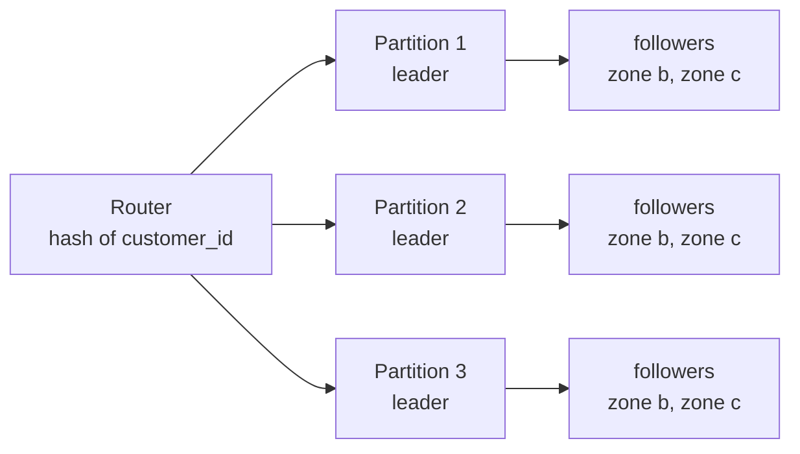

# Replication & Sharding — The City Library Analogy

<!-- sdlc-stage:start -->
<div class="sdlc-stage">

📍 **SDLC stage: Design — data model** · ShopNorth uses this in [Chapter 4 · Data Model & SQL](/tutorials/journey-04-data-sql)

</div>
<!-- sdlc-stage:end -->

## The City Library Analogy

A city library is getting crowded. It has two very different problems:

- **Too many readers want the same popular books.** The fix is to put **copies** of those books in every branch. Readers go to the nearest branch, and if one branch closes for repairs, the others still have the book. But when the author publishes a corrected edition, every copy has to be updated — and for a while some branches still lend the old one. That's **replication**.
- **The collection no longer fits in one building.** The fix is to **split** it: science in one building, history in another, fiction in a third. Each building handles only its share of new books and visitors. But a question like "all books published in 1998" now means visiting every building. That's **partitioning**, also called **sharding**.

Real systems usually do both: the collection is split across buildings, and each building's shelves are copied to a backup site.

## 1. Two Different Problems

| | Replication | Partitioning (sharding) |
|---|---|---|
| What it does | Keeps the **same data** on several machines | Splits **different data** across machines |
| Solves | Availability, read scaling, latency for distant users | Write scaling, data too big for one machine |
| Main difficulty | Keeping copies in sync (lag, conflicts, failover) | Choosing the key, cross-partition queries, rebalancing |
| Usually comes | First — almost every production database is replicated | Much later — only when one primary can't keep up |



## 2. Leader-Follower Replication

The most common setup: one **leader** (primary) accepts writes and streams its change log to **followers** (replicas), which apply the same changes. PostgreSQL ships its write-ahead log (WAL); MySQL ships its binlog.

The big decision is **when the leader says "committed"**:

| Mode | Leader confirms the commit when… | Data loss if the leader dies | Write latency | Availability |
|------|--------------------------------|------------------------------|---------------|--------------|
| **Synchronous** | The follower has the change | None | + a network round trip | Writes stall if the follower is down |
| **Asynchronous** | Its own disk has the change | The last few seconds of writes | Lowest | Writes continue regardless |
| **Semi-synchronous / quorum** | At least one of several followers has it | None, if you fail over to an up-to-date follower | Moderate | Survives one slow follower |

PostgreSQL expresses the quorum version in one line:

```properties
# postgresql.conf on the primary: wait for ANY one of the two standbys before confirming a commit
synchronous_standby_names = 'ANY 1 (standby_b, standby_c)'
synchronous_commit = on
```

### What AWS's database options actually do

| AWS option | Replication | Readable copies? | Failover |
|-----------|-------------|-----------------|----------|
| **RDS Multi-AZ instance** | Synchronous to one standby in another zone | No — the standby only waits | ~1-2 minutes |
| **RDS Multi-AZ DB cluster** (PostgreSQL, MySQL) | Semi-synchronous to two standbys in two other zones | Yes — through the reader endpoint | Typically under 35 s |
| **RDS read replicas** | Asynchronous, in-region or cross-region | Yes | Manual promotion; may lose recent writes |
| **Aurora** | Storage layer keeps 6 copies across 3 zones (writes need 4, reads need 3) | Up to 15 replicas sharing that storage | Usually under 30 s |

ShopNorth's order database is an RDS for PostgreSQL **Multi-AZ instance** — a synchronous standby for failover — plus **one read replica** that serves the admin sales reports. Why not a Multi-AZ DB cluster with readable standbys? DB clusters can't replicate their automated backups to another region, and ShopNorth's disaster recovery plan depends on exactly that (see [High Availability & DR](/tutorials/high-availability)). Checking limitations like this before choosing is part of the job; [AWS Databases](/tutorials/aws-databases) has the details.

<div class="callout-warn">

**"Multi-AZ" and "read replica" are not the same thing.** In interviews and at work, people mix them up. A Multi-AZ instance standby exists for **failover** and can't serve reads. A read replica exists for **read scaling** and replicates asynchronously, so promoting it can lose the last writes. Multi-AZ DB clusters and Aurora blur the line by making standbys readable.

</div>

## 3. Replication Lag in Practice

Asynchronous followers are usually milliseconds behind — until they aren't. Lag grows during:

- Large batch writes or migrations (the follower must replay them all).
- Long-running queries on the follower that conflict with replay (PostgreSQL may pause replay or cancel the query).
- An undersized follower that can't keep up with the leader's write rate.

On RDS, watch the `ReplicaLag` CloudWatch metric and alarm when it exceeds what the readers can tolerate (for ShopNorth's reports: 30 s). The user-facing consequences — "my order disappeared", "status went backwards" — and the fixes (read-your-writes routing, monotonic reads) are covered in [CAP Theorem & Consistency](/tutorials/cap-theorem).

## 4. Multi-Leader and Leaderless Replication

| | Multi-leader | Leaderless (Dynamo-style) |
|---|---|---|
| Who accepts writes | A leader in each region or data center | Any replica |
| Typical use | Multi-region apps, offline-first clients, collaborative editing | Cassandra, DynamoDB's internals, Riak |
| Main problem | **Write conflicts**: two leaders change the same record | Stale reads and conflicts, resolved by quorums and repair |

**Quorums** make leaderless systems predictable. With **N** copies of each record, a write waits for **W** acknowledgments and a read asks **R** replicas:

```
N = 3, W = 2, R = 2  →  R + W = 4 > N = 3
Every read overlaps at least one replica that saw the latest write.
```

Lower W or R for speed (fewer waits), at the cost of possibly stale reads. Background mechanisms — **read repair** (fix stale replicas noticed during reads), **hinted handoff** (hold writes for a down node), and **anti-entropy** (periodic comparison) — make replicas converge.

**Conflict resolution** options, from simplest to safest:

| Strategy | How | Risk |
|----------|-----|------|
| Last write wins (LWW) | Keep the write with the latest timestamp | Silently drops concurrent writes; clock skew picks the "wrong" winner |
| Version vectors | Detect concurrent writes and keep both for the app to merge | The app must merge |
| CRDTs | Data types that merge automatically (counters, sets) | Only for data that fits those types |
| Single home per record | Route each record's writes to one leader | Less availability for that record during partitions |

## 5. Partitioning Strategies

| Strategy | How a key finds its partition | Strengths | Weaknesses |
|----------|------------------------------|-----------|------------|
| **Range** | Key ranges: A-F, G-M, … or dates | Efficient range scans | Hot spots (all new orders hit the "latest" range) |
| **Hash** | `hash(key) mod N` | Even spread | Range queries hit every partition; changing N moves almost everything |
| **Consistent hashing** | Keys and nodes on a hash ring; a key goes to the next node clockwise | Adding a node moves only ~1/N of the keys | Uneven without virtual nodes |
| **Directory / lookup** | A table maps keys (or tenants) to partitions | Total flexibility, easy to move one tenant | The directory is critical infrastructure |

Why `mod N` hurts: going from 4 to 5 nodes changes the result of `hash(key) mod N` for about **80%** of keys — nearly the whole data set moves. With consistent hashing, only about **20%** (the new node's share) moves. **Virtual nodes** (each server owns many small points on the ring) keep the spread even and let a bigger server own more points. See the ring in action in [Distributed Cache](/tutorials/cache-system).

<div class="callout-tip">

**The trick most real systems use:** create many more logical partitions than machines — say 1,024 — and map partitions to machines in a small table. Rebalancing means moving whole partitions, and the key-to-partition rule never changes. Kafka topics, Elasticsearch/OpenSearch indices, and Citus all work roughly this way.

</div>

## 6. Choosing the Partition Key

A good partition key has high cardinality, spreads load evenly, and matches your most important queries so they hit **one** partition.

ShopNorth's thought experiment for the `orders` table at 50× today's size:

| Candidate key | "My orders" for a customer | Admin "orders from the last hour" | Spread | Verdict |
|--------------|---------------------------|----------------------------------|--------|---------|
| `order_id` (hash) | Every partition (scatter-gather) | Every partition | Excellent | ❌ Customer queries suffer |
| `created_at` (range) | Every partition | One partition | ❌ All writes hit the newest partition | ❌ Hot spot |
| `customer_id` (hash) | One partition | Every partition | Good — no customer dominates | ✅ The customer path matters most; admin queries go to a separate read model |

### Hot keys: when one key is the problem

Partitioning can't split a single key. When one SKU gets 20,000 reservation attempts a minute, that row is the bottleneck no matter how many shards exist. Options:

- **Filter in front:** an atomic Redis counter turns away "sold out" requests before they reach the database (ShopNorth's flash deal, Chapter 14).
- **Split the key:** divide the deal's 1,000 units into 10 sub-counters (`deal-42#0` … `deal-42#9`) and pick one at random; contention drops 10×, at the cost of "sold out" being decided per bucket.
- **Queue it:** serialize reservations for that SKU through one consumer, so they stop fighting over locks.
- **Cache reads** of hot keys aggressively; most traffic for a hot product is reads.

## 7. Secondary Indexes Across Partitions

If orders are partitioned by `customer_id`, how do you find "all orders containing SKU X"?

| Approach | How | Trade-off |
|----------|-----|-----------|
| **Local index** | Each partition indexes its own rows | Queries must ask every partition (scatter-gather) |
| **Global index** | A separate index partitioned by the indexed value | One-partition reads, but index updates are asynchronous |
| **Read model** | Events feed a purpose-built store | Most flexible, eventually consistent |

ShopNorth's product search is exactly this pattern: PostgreSQL owns the catalog, and OpenSearch is a global, eventually consistent index built from Kafka events.

## 8. Partitioning Inside One Database First

Before sharding across machines, PostgreSQL can **partition a table on one server**. ShopNorth plans this for `orders` in year two — not for speed, but so old data can be archived and dropped cheaply:

```sql
CREATE TABLE orders (
    id            UUID        NOT NULL,
    customer_id   UUID        NOT NULL,
    status        TEXT        NOT NULL,
    total_paise   BIGINT      NOT NULL,
    created_at    TIMESTAMPTZ NOT NULL,
    PRIMARY KEY (id, created_at)          -- the partition key must be part of the primary key
) PARTITION BY RANGE (created_at);

CREATE TABLE orders_2026_10 PARTITION OF orders
    FOR VALUES FROM ('2026-10-01') TO ('2026-11-01');
CREATE TABLE orders_2026_11 PARTITION OF orders
    FOR VALUES FROM ('2026-11-01') TO ('2026-12-01');

-- Queries filtered by created_at only touch matching partitions ("partition pruning").
-- Retention becomes instant: DETACH and archive a month instead of a giant DELETE.
ALTER TABLE orders DETACH PARTITION orders_2024_10;
```

Only when one primary can't handle the writes even after vertical scaling, caching, and partitioning on one server does it make sense to shard across machines — with an extension like Citus, or in the application. [Database Decisions](/tutorials/database-decisions) covers when that point arrives.

## 9. Resharding Without Downtime

When a partition must move or split, the safe sequence is the same everywhere:

1. **Copy** existing data to the new location in the background.
2. **Double-write** (or stream changes with CDC) so the copy stays current.
3. **Verify**: counts and checksums per key range.
4. **Switch reads**, then **switch writes**, one range at a time, behind a flag.
5. **Clean up** the old copy after a safety period.

It takes weeks for a busy system, which is why choosing a partition key you won't need to change matters so much.

## 🏢 Real-World Scenarios

<div class="callout-scenario">

**Scenario**: A marketplace sharded orders by `seller_id`. One seller ran a viral promotion and produced 40% of all orders for a week; their shard ran at 100% CPU while the others idled, and checkout for every customer of that seller slowed down. **Decision**: Re-key by `order_id` hash for write spread, with a global index for seller dashboards. For tenants that can grow unbounded, plan a directory that can give a big tenant its own shard.

</div>

<div class="callout-scenario">

**Scenario**: A team promoted an asynchronous read replica during an outage of the primary. They didn't check its lag: it was 90 seconds behind because of a nightly batch job. About 1,200 orders written in those 90 seconds vanished from the new primary, and customers had payment confirmations for orders that no longer existed. **Decision**: Failover targets must be synchronous or quorum-confirmed (Multi-AZ), not async replicas. If an async replica must be promoted, check its lag and plan reconciliation against payment provider records.

</div>

## 🏋️ Practice Assignments

### 🟢 Low — Build the reflexes

**L1.** For each need, pick replication, partitioning, or both: (a) survive the loss of an availability zone, (b) 10× more writes than one primary can take, (c) serve heavy reporting queries without slowing checkout, (d) 40 TB of data that keeps growing.

<details>
<summary>Show answer</summary>

(a) Replication (a synchronous standby in another zone). (b) Partitioning — replicas don't add write capacity, since every replica applies every write. (c) Replication (a read replica or a readable standby for reports). (d) Partitioning (plus replication of each partition for availability).

</details>

**L2.** With N = 5 replicas, give two (W, R) pairs that guarantee a read sees the latest write, and one that doesn't.

<details>
<summary>Show answer</summary>

Overlap requires R + W > N = 5: for example **W = 3, R = 3** (balanced), or **W = 5, R = 1** (fast reads, slow and fragile writes). **W = 2, R = 2** gives R + W = 4, which doesn't guarantee overlap — a read can hit only replicas that missed the latest write.

</details>

### 🟡 Medium — Apply it

**M1.** ShopNorth's admin dashboard runs heavy aggregation queries that sometimes slow down checkout. Design the fix using what AWS offers, and name the new risk.

<details>
<summary>Show answer</summary>

Send dashboard queries to a **read replica** sized for analytics (ShopNorth already has one for reports), so they never compete with checkout on the primary. A Multi-AZ instance's standby can't help here — it isn't readable. Long queries on a replica can conflict with replay; set statement timeouts, and consider `hot_standby_feedback` carefully (it reduces cancellations but can bloat the primary). **New risk:** replication lag — dashboards may be seconds behind; alarm on `ReplicaLag`, and show "data as of" timestamps. For heavier analytics, move to a separate warehouse fed by CDC.

</details>

**M2.** Explain why consistent hashing moves fewer keys than `hash mod N` when a node is added, and what virtual nodes add.

<details>
<summary>Show answer</summary>

With `mod N`, changing N changes the remainder for most keys, so ~(N−1)/N of the data moves (80% going from 4 to 5 nodes). On a hash ring, each key belongs to the next node clockwise; a new node takes over only the arc between itself and its predecessor, about 1/N of the keys, and all other keys stay put. With only one point per node, arcs are uneven and one node may get much more data; **virtual nodes** (many points per server) even out the distribution, spread a failed node's load across many others, and let bigger servers take more points.

</details>

### 🔴 High — Think like a senior

**H1.** ShopNorth expects 50× order volume in three years. Write the data-scaling roadmap with decision triggers.

<details>
<summary>Show answer</summary>

**Year 1 (now):** one primary per service, Multi-AZ instance, reports on a read replica, good indexes, connection budgets, PgBouncer. **Trigger to act:** writer CPU > 60% at peak or storage/IOPS limits in sight → **vertical scaling** (a bigger instance class; consider Aurora for faster failover and storage that grows on its own). **Year 2:** monthly **partitioning of `orders`** on the same server for retention and maintenance; archive orders older than 2 years to S3 (Parquet) for analytics. **Trigger:** write throughput still saturating the largest sensible instance, or vacuum/maintenance windows can't keep up → **shard by `customer_id`** (Citus or app-level with 1,024 logical shards mapped to physical nodes), with a global read model for admin and seller queries. **Throughout:** ADRs with numbers, load tests at 2× projected peak, and a resharding runbook rehearsed in staging before it's needed.

</details>

**H2.** Your team wants multi-leader replication across Mumbai and Singapore so both regions can accept orders. What do you ask before agreeing?

<details>
<summary>Show answer</summary>

What happens on **conflicts**: which records can be written in both regions at once (stock, order status, customer profiles), and how each conflict is resolved — last-write-wins would silently oversell stock and lose updates. Can we instead give each record a **home region** (customers and their orders live in one region; stock is partitioned per warehouse or quota)? What are the actual goals — latency for Singapore customers, or surviving a region loss — and would read replicas plus a DR plan meet them? What are the operational costs: conflict monitoring, schema changes in two leaders, testing partitions between regions? Agree only for data whose conflicts are rare and mergeable; keep money and stock single-homed.

</details>

## 🛠️ Mini Project — Build a Consistent Hash Ring

**Goal**: Feel the difference between `mod N` and consistent hashing, then partition a real table. 1 weekend.

**Build**

1. In Java, implement a consistent hash ring with virtual nodes using a `TreeMap<Long, String>` (`ceilingEntry` finds the next node clockwise; wrap around to `firstEntry`). Use a stable hash such as MurmurHash3 (Guava's `Hashing.murmur3_128()`).
2. Place 1,000,000 synthetic customer IDs on 4 nodes. Print the distribution per node with 1, 10, and 200 virtual nodes per server.
3. Add a 5th node. Measure the percentage of keys that moved, and compare with `hash mod N` going from 4 to 5.
4. In PostgreSQL, create the monthly-partitioned `orders` table from section 8, load 12 months of fake orders, and use `EXPLAIN` to show partition pruning for a one-month query.
5. Detach the oldest partition and export it to a CSV "archive".

**Acceptance criteria**: a table of key movement (`mod N` ≈ 80% vs ring ≈ 20%), a distribution chart showing the effect of virtual nodes, and an `EXPLAIN` output that scans one partition.

## 🎯 Interview Corner

<div class="callout-interview">

**Q: "What's the difference between replication and sharding?"**

Replication keeps copies of the same data on several machines. That gives availability when one fails, more read capacity, and lower latency for distant users, but it doesn't add write capacity, because every replica applies every write. Sharding splits different data across machines, which adds write capacity and storage, at the cost of choosing a good key, cross-shard queries, and rebalancing. Production systems usually replicate first, scale vertically, and only shard when one primary can't keep up. Then each shard is itself replicated.

</div>

<div class="callout-interview">

**Q: "Synchronous or asynchronous replication — how do you choose?"**

Synchronous replication waits for a follower before confirming a commit, so failover loses nothing. The cost is added latency, and writes stall if that follower is unavailable. Asynchronous replication is fast and decoupled, but a failover can lose the last few seconds of writes. The usual compromise is semi-synchronous or quorum commit: wait for any one of several followers. On AWS, Multi-AZ uses synchronous or quorum replication for failover, while read replicas are asynchronous for read scaling. I'd never make an asynchronous replica the automatic failover target for data like orders without a plan to reconcile lost writes.

</div>

<div class="callout-interview">

**Q: "How do you choose a shard key?"**

I look at the most important queries and the write pattern. The key should have high cardinality, spread writes evenly, keep the main query path on one shard, and not need to change later. For an order system, customer ID usually wins: a customer's history lives on one shard, and no single customer dominates. Time-based keys create a hot newest shard, and seller or tenant IDs can produce huge tenants. Queries the key doesn't serve go to secondary read models, like a search index or a warehouse. I'd also use many logical shards mapped to fewer machines, so rebalancing moves whole shards instead of changing the key rule.

</div>

<div class="callout-interview">

**Q: "What is consistent hashing, and why is it used?"**

It places both keys and nodes on a hash ring, and each key belongs to the next node clockwise. When a node joins or leaves, only the keys in its arc move, about one Nth of the data, instead of nearly everything as with hash mod N. Virtual nodes, meaning many ring positions per server, even out the distribution and spread a failed node's load. It's used in distributed caches, Cassandra and Dynamo-style stores, and load balancers that need stickiness without a central table.

</div>

## Quick Reference

| Concept | One-liner |
|---------|-----------|
| Replication | Same data, many machines — availability and read scale |
| Partitioning / sharding | Different data, many machines — write scale and size |
| Sync / async / quorum | Safety vs latency of commits |
| Multi-AZ vs read replica | Failover copy vs read-scaling copy |
| R + W > N | Quorum reads see the latest write |
| Consistent hashing | Adding a node moves ~1/N of the keys |
| Good shard key | High cardinality, even spread, serves the main query |
| Hot key | Filter, split, queue, or cache — sharding can't help |
| First step | Partition the table on one server before sharding |

> **Golden rule: replicate early for availability, shard late for necessity — and choose the shard key as if you'll never be allowed to change it.**

<!-- journey-link:start -->

<div class="callout-journey">

🛒 **ShopNorth Journey** — ShopNorth's databases are RDS Multi-AZ instances: a primary for checkout, a synchronous standby for failover, a read replica for reports, and no sharding yet, because 4 GB of orders a year fits one primary for a long time. Chapter 4 designs the schema that would be partitioned later.

**Continue the story:** [Chapter 4 · Data Model & SQL](/tutorials/journey-04-data-sql) · **New here?** [Start the journey](/tutorials/journey-start)

</div>

<!-- journey-link:end -->
