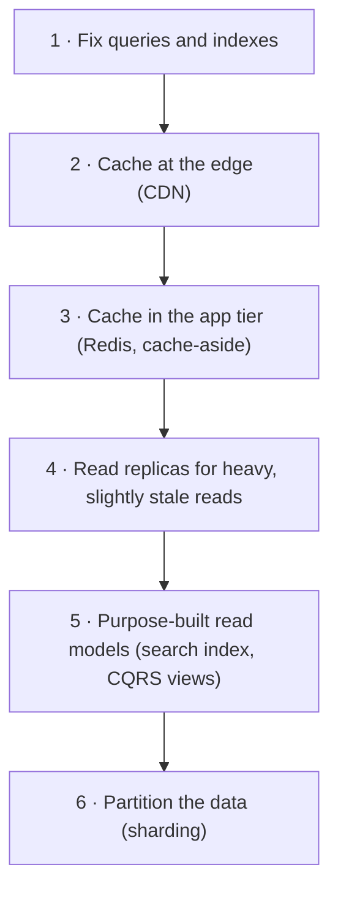

# Scalability — The Restaurant Kitchen Analogy

<!-- sdlc-stage:start -->
<div class="sdlc-stage">

📍 **SDLC stage: Design — architecture** · ShopNorth uses this in [Chapter 2 · System Design (HLD)](/tutorials/journey-02-system-design)

</div>
<!-- sdlc-stage:end -->

## The Restaurant Kitchen Analogy

A small restaurant has one chef. On a quiet Tuesday she cooks 20 meals an hour and everyone is happy. Then a festival comes to town and 200 people want dinner at 8 PM.

The owner has a few options:

- **Buy a bigger stove** so the one chef cooks faster. It helps a little, but a stove only gets so big, and if the chef gets sick, the kitchen stops. That's **vertical scaling**.
- **Hire more chefs** and give each one a station. Now ten chefs cook in parallel — as long as they don't all fight over the one fridge. That's **horizontal scaling**, and the fridge is your **database**.
- **Prep ahead**: chop vegetables and cook sauces in the afternoon, so each order needs less work at 8 PM. That's **caching**.
- **Take-away orders go on a ticket rail**: the kitchen works through them at a steady pace instead of being overwhelmed. That's **asynchronous processing with a queue**.
- **A host at the door** seats people at the rate the kitchen can serve and hands out buzzers. That's **rate limiting and a waiting room**.

Scalability is the art of combining these so the kitchen serves 10× the guests at the same quality, without 10× the chaos or 10× the cost per meal.

## 1. What Scalability Actually Means

A system is **scalable** if you can keep it within its performance targets as load grows, by adding resources in a roughly proportional way. Two words in that sentence matter:

- **Load** has to be described with numbers — "more users" isn't a load parameter.
- **Performance targets** are latency percentiles and error rates, not averages.

| Load parameter | ShopNorth normal day | ShopNorth Diwali sale |
|----------------|---------------------|------------------------|
| Visitors | ~200,000 per day | 2 million on sale day |
| Requests per second (all APIs) | ~300 on a busy evening | 3,000 planned (it actually hit 3,400) |
| Orders | a few thousand per day | 150 per second at the peak |
| Catalog size | 5,000 SKUs at launch, ~50,000 within a year | same, but the deal SKUs get most of the traffic |
| Read:write mix | browsing dominates: dozens of product, search, and cart reads per order | same shape, much bigger |

The targets come from Chapter 1's non-functional requirements: product page under 300 ms and place-order under 800 ms at p95, with 99.9% of checkout requests succeeding.

<div class="callout-info">

**Performance problem or scalability problem?** If the system is slow for *one* user, you have a performance problem: a missing index, an N+1 query, a slow algorithm. If it's fast for one user but slow at 3,000 requests per second, you have a scalability problem: something is saturated or contended. Fix performance first. A 2-second query doesn't get better on 20 servers; it just runs 20 times at once.

</div>

## 2. Measure First: Little's Law and the Bottleneck

**Little's Law** connects the three numbers you always have:

```
in-flight requests = throughput × latency
        L          =     λ      ×    W
```

At 3,000 requests/s and an average of 0.1 s per request, about **300 requests are in flight** at any moment. That number tells you how many threads, connections, and pods you need:

- Tomcat in each pod has 200 worker threads by default. 300 concurrent requests over 6 pods is 50 per pod: comfortable.
- If the database slows down so requests take 1 s, in-flight requests jump to **3,000**. Thread pools fill, queues grow, and timeouts start. Latency problems turn into capacity problems — this is why a slow dependency can take down a healthy service.

To find what's actually limiting you, use the **USE method** for every resource (CPU, memory, connections, disk, network, locks):

| Check | Question | ShopNorth example |
|-------|----------|-------------------|
| **U**tilization | How busy is it? | Order DB CPU at 85% |
| **S**aturation | Is work waiting? | 40 requests waiting for a Hikari connection |
| **E**rrors | Is it failing? | `Connection is not available, request timed out` |

The bottleneck is the first resource that saturates. Scaling anything else is wasted money.

<div class="callout-warn">

**Amdahl's law in one line:** if 20% of a request's work is serialized — one lock, one row, one single-threaded consumer — no amount of horizontal scaling makes it more than 5× faster. ShopNorth's load test found exactly this: thousands of flash-deal checkouts queued on one `stock` row lock (Chapter 14). The fix wasn't more pods; it was removing the serialization point.

</div>

## 3. Vertical vs Horizontal Scaling

| | Vertical (scale up) | Horizontal (scale out) |
|---|---|---|
| How | Bigger machine: more CPU, RAM, faster disk | More machines behind a load balancer |
| Code changes | None | The app must be stateless, or state must be partitioned |
| Limit | The biggest instance AWS sells | Usually a shared dependency (database, lock, third party) |
| Failure | One machine = one point of failure | Losing one of many is routine |
| Cost curve | Gets expensive at the top end | Roughly linear, and you can scale back down |
| Good for | Databases early on, simple workloads | Stateless web and API tiers, workers |

Vertical scaling is underrated. A modern database instance with 64 vCPUs and 512 GB of RAM handles a lot of traffic, and ShopNorth's databases scale vertically for years before sharding is worth its complexity. The application tier is the opposite: it should scale out from day one, because that's cheap if you design for it.

## 4. Make the App Tier Stateless

A service is **stateless** when any instance can handle any request because nothing about the user lives in that instance's memory or disk between requests. Then scaling out is just "add pods".

| State | Where it lives at ShopNorth | Why not in the pod |
|-------|---------------------------|--------------------|
| Who the user is | Auth0 JWT, verified on every request | Pods die, and the next request may go to another pod |
| Cart | Redis (ElastiCache) | Survives deploys and scale-down |
| Uploaded product images | S3 | Pod disks are temporary and not shared |
| Idempotency keys | PostgreSQL (unique constraint) | A retry may land on a different pod |
| Scheduled job ownership | A ShedLock row in the database | Three pods would otherwise run the job three times |

<div class="callout-tip">

**Sticky sessions are a smell, not a strategy.** If a load balancer must send a user back to the same instance, that instance holds state. It breaks when the instance is replaced, it spreads load unevenly, and it makes autoscaling slower to help. Move the state out instead.

</div>

Once the service is stateless, a load balancer spreads traffic across instances and health checks remove broken ones (see [Load Balancing](/tutorials/load-balancing)).

## 5. Scaling Reads — The Read Ladder

Most systems read far more than they write. Climb this ladder from the top, and stop as soon as the targets are met:



| Rung | ShopNorth uses it for | Cost of the rung |
|------|----------------------|------------------|
| Indexes | `orders(customer_id, created_at)` for "my orders" | Slower writes, more storage |
| CDN | Product images, the React app, sale landing pages | Staleness until the TTL expires or an invalidation |
| Redis cache-aside | Product details and prices for browsing (60 s TTL) | Invalidation logic; a cold cache after a restart |
| Read replica | Admin sales reports | Replication lag: reads can be seconds old |
| Search index | OpenSearch for search and filters, fed by Kafka events | Eventual consistency, a second system to run |
| Sharding | Not needed yet | Cross-shard queries, resharding, operational load |

A cache-aside read in Spring is small:

```java
@Cacheable(cacheNames = "product", key = "#sku")       // Redis, TTL 60 s configured per cache
public ProductView getProduct(String sku) {
    return productRepository.findViewBySku(sku)
        .orElseThrow(() -> new ProductNotFoundException(sku));
}

@CacheEvict(cacheNames = "product", key = "#sku")      // on admin updates; the TTL is the safety net
public void updatePrice(String sku, Money newPrice) { ... }
```

<div class="callout-warn">

**Strong where it touches money.** Browsing prices come from the cache and may be up to 60 seconds old. The checkout re-reads the price and stock from the database inside the order transaction, so a stale cached price is never charged. Every caching decision needs this question: *what's the worst thing a stale value can do here?* (More in [CAP Theorem & Consistency](/tutorials/cap-theorem).)

</div>

## 6. Scaling Writes

Writes are harder because they must land in one authoritative place. The tools, in the order to try them:

1. **Do less work per write.** Batch inserts, drop unneeded indexes, keep transactions short (no HTTP calls inside them).
2. **Absorb bursts with a queue.** Accept the request, put the work on Kafka or SQS, and process it at the rate the database can sustain. This is called **load leveling**. ShopNorth confirms the order synchronously, but emails, SMS, analytics, and search updates all happen from events.
3. **Remove hot spots.** One heavily updated row (the flash-deal SKU) serializes everyone. ShopNorth moved the deal counter into Redis with an atomic decrement, then wrote the result to PostgreSQL.
4. **Split the write load by owner.** Each microservice has its own database, so order writes don't compete with catalog writes.
5. **Partition (shard)** when one primary can't keep up even after all of the above. See [Replication & Sharding](/tutorials/replication-partitioning).

## 7. Asynchrony and Back-Pressure

A system without back-pressure accepts work faster than it can finish it, until memory or queues explode. Healthy systems say "not now" early:

| Mechanism | Where | What the client sees |
|-----------|-------|----------------------|
| Rate limiting per customer | API gateway | `429 Too Many Requests` with `Retry-After` |
| Bounded thread pools and queues | Each service | Fast failure instead of slow death |
| Consumer lag as a scaling signal | Kafka consumers | Nothing — workers scale on lag |
| Waiting room | In front of the flash deal | "You're number 4,210 in line" |
| Load shedding | Gateway, under overload | Low-priority requests (recommendations) fail first |

<div class="callout-scenario">

**Scenario**: On sale night, ShopNorth's waiting room held 41,000 people for the flash deal and admitted them at 120 per second — the rate the load test showed checkout could handle. Without it, all 41,000 would have hit checkout within a minute, timeouts would have triggered retries, and the retries would have multiplied the load. **Decision**: Admission control at the edge, sized from load-test numbers. It's not an admission of failure; it's the reason everyone who got in could actually buy.

</div>

## 8. Autoscaling and Capacity Planning

Autoscaling adds capacity when a metric crosses a target: the Kubernetes HPA adds pods on CPU, and Karpenter or an AWS Auto Scaling group adds machines. It's essential and also **slow**: metrics, scheduling, a new EC2 node, and JVM warm-up take minutes. ShopNorth's traffic went from 400 to 2,900 requests/s in 70 seconds.

So capacity planning uses three layers:

| Layer | Handles | ShopNorth |
|-------|---------|-----------|
| **Baseline** | Normal daily traffic | 3 pods per service minimum, spread across 3 availability zones |
| **Scheduled / pre-scaling** | Known events | A GitOps change at 6 PM raises minimums before the 8 PM sale |
| **Reactive autoscaling** | Surprises | HPA on CPU, scale-up fast, scale-down after 5 minutes |

And always ask what scales **with** the pods: database connections (12 pods × 10 = 120), Redis connections, third-party rate limits. Scaling pods beyond what the database can serve just moves the bottleneck — and can make the outage worse (Chapter 12's real-world scenario).

<div class="callout-tip">

**Load test at 2× the forecast.** ShopNorth forecast 3,000 requests/s, then passed a load test at 6,000 requests/s and 300 orders/s, plus a spike from 0 to 3,000 in 60 seconds. The real peak was 3,400 — inside the tested range. Forecasts are always wrong; the question is by how much.

</div>

## 9. Scalability Anti-Patterns

| Anti-pattern | Why it hurts at scale | Fix |
|-------------|----------------------|-----|
| Chatty calls (N+1 over HTTP) | Latency multiplies, and so does load on the callee | Batch endpoints, data duplication via events |
| Long synchronous chains | Each hop adds latency and failure probability | Async for anything the user doesn't need now |
| Unbounded queries (`SELECT *` without `LIMIT`) | Memory and time grow with data | Pagination with keyset cursors |
| Global locks or single-threaded hotspots | Serializes everyone (Amdahl) | Partition the lock, use atomic counters |
| Shared database across services | Every service's load hits one box | Database per service |
| Retrying without backoff | A blip becomes a retry storm | Exponential backoff with jitter, retry budgets |
| Scaling on CPU only | I/O-bound services never trigger | Scale on request rate, queue lag, or latency |

## 🏢 Real-World Scenarios

<div class="callout-scenario">

**Scenario**: A team added 4 more application servers to fix slow checkouts before a sale. Latency got *worse*. Each server opened its own connection pool, the database hit its connection limit, and queries queued inside the database. **Decision**: Measure the bottleneck before scaling. They added PgBouncer, cut pool sizes, moved two slow report queries to a read replica, and added the missing index the slow query log revealed. Then 6 servers were faster than 10 had been.

</div>

<div class="callout-scenario">

**Scenario**: A catalog page cached for 10 minutes showed a price that had just been lowered for a flash deal, and customers complained that the deal "wasn't real". **Decision**: Different freshness for different data. Prices and stock badges on deal pages use a 15-second TTL plus an explicit cache eviction on price change. Descriptions and images keep long TTLs. The checkout always re-reads price and stock from the database.

</div>

## 🏋️ Practice Assignments

### 🟢 Low — Build the reflexes

**L1.** Using Little's Law: a service handles 800 requests/s with an average latency of 250 ms. How many requests are in flight? What happens if a dependency slows the latency to 2 s?

<details>
<summary>Show answer</summary>

800 × 0.25 = **200 in-flight requests**. At 2 s latency, 800 × 2 = **1,600 in flight** — eight times more threads, connections, and memory for the same traffic. Thread pools fill, requests queue, timeouts and retries add even more load. This is why timeouts on dependencies are a scalability tool, not only a resilience tool.

</details>

**L2.** List three things that make a Spring Boot service stateful, and where each should live instead.

<details>
<summary>Show answer</summary>

(1) HTTP sessions in memory → stateless JWTs, or Spring Session in Redis. (2) Files written to local disk (uploads, generated PDFs) → S3. (3) In-memory caches used as the source of truth or for coordination (counters, locks, "has this job run?") → Redis or the database (for example a ShedLock row). Local caches are fine as long as losing them only costs a cache miss.

</details>

### 🟡 Medium — Apply it

**M1.** ShopNorth's product page meets its 300 ms p95 target at 300 requests/s but reaches 1.8 s at 2,000 requests/s. CPU on the Catalog pods is 35%. Where do you look, and in what order?

<details>
<summary>Show answer</summary>

CPU is low, so the pods are waiting, not working. Check saturation along the request path: (1) Hikari pool metrics — pending threads waiting for a connection; (2) database CPU, slow query log, and lock waits; (3) Redis latency and cache hit ratio — a low hit ratio sends everything to the database; (4) downstream calls (pricing, inventory) and their latency; (5) thread pool usage in Tomcat. Fix in order of evidence: usually a cache miss storm or a slow query. Adding pods would only add connections to an already saturated database.

</details>

**M2.** Design the read path for ShopNorth's product page so it survives 10× traffic without touching the database for most requests.

<details>
<summary>Show answer</summary>

Images and static assets from the CDN with long TTLs and hashed file names. Product details from Redis via cache-aside with a 60 s TTL and eviction on update; deal SKUs with 15 s TTL. Stock shown as a coarse badge ("in stock", "only a few left") from a cached counter, not a live row read. Request coalescing (single-flight) so a cache miss for a hot SKU sends one query to the database, not thousands. Prices are re-validated at checkout. Result: the database serves cache misses and checkouts only.

</details>

### 🔴 High — Think like a senior

**H1.** The founders expect 10× growth next year. Write the scaling plan: what changes now, what waits, and what you'll measure to decide.

<details>
<summary>Show answer</summary>

**Now (cheap, prevents dead ends):** keep services stateless; add keyset pagination everywhere; put all non-critical work behind events; set connection budgets per service; load test monthly at 2× current peak; dashboards for saturation (pool waits, consumer lag, DB CPU). **Next (when metrics say so):** read replicas for reports, larger database instances, Redis cluster mode, more Kafka partitions (planned ahead, since adding partitions changes key ordering). **Later (only with evidence):** partition the orders table by month for maintenance, then shard by customer if a single primary can't keep up after vertical scaling. **Decision triggers:** primary CPU above 60% at peak, p95 latency trending toward the SLO, replication lag above 5 s, storage growth above a set rate. Each step gets an ADR with the numbers.

</details>

**H2.** An interviewer says: "Just put it on Kubernetes with autoscaling and it will scale." What's wrong with that answer?

<details>
<summary>Show answer</summary>

Autoscaling scales stateless compute, and only after a delay. It doesn't scale the database, locks, third-party limits, or a single hot partition — and adding pods can overload those dependencies (connection limits). It's also reactive: sudden spikes outrun it, so known events need pre-scaling. A real answer names the bottleneck, the read and write strategies (caching, replicas, queues, partitioning), back-pressure (rate limits, load shedding), and how you verified it with load tests.

</details>

## 🛠️ Mini Project — Scale Your Mini ShopNorth to 3 Instances

**Goal**: See horizontal scaling, caching, and a bottleneck with your own eyes. 1 weekend.

**Build**

1. Take your order or catalog service (or any Spring Boot REST API with PostgreSQL) and run it in Docker Compose with **3 instances behind nginx** (round robin).
2. Prove it's stateless: kill one instance during a k6 test and confirm only in-flight requests fail.
3. Write a k6 test that ramps from 50 to 1,000 requests/s on `GET /products/{sku}`; record p50/p95/p99 and the error rate.
4. Add Redis cache-aside for product reads with a 60 s TTL; rerun the test and compare.
5. Find the bottleneck without the cache: enable Hikari metrics (`/actuator/metrics/hikaricp.connections.pending`) and PostgreSQL's `pg_stat_activity`.
6. Write `docs/capacity.md`: max throughput per instance, the bottleneck, and the instances needed for 3,000 requests/s with 30% headroom.

**Acceptance criteria**: a before/after table of latency percentiles, a named bottleneck with evidence, and a capacity estimate you can explain in an interview.

## 🎯 Interview Corner

<div class="callout-interview">

**Q: "What's the difference between vertical and horizontal scaling, and when would you use each?"**

Vertical scaling means a bigger machine: no code changes, but there's a ceiling, and one machine is still one point of failure. Horizontal scaling means more machines behind a load balancer: it's roughly linear and fault tolerant, but the app must be stateless, or the data must be partitioned. I scale stateless API and worker tiers horizontally from the start because it's cheap to design for. Databases I scale vertically first, plus caches and read replicas, because sharding adds a lot of complexity, and a large single primary goes surprisingly far. I'd only shard with evidence that writes or data size have outgrown one node.

</div>

<div class="callout-interview">

**Q: "How would you scale an e-commerce site for a sale that brings 10 times normal traffic?"**

First, numbers: the peak requests per second, the order rate, and the read-to-write mix, so I know what has to scale. For reads, I'd serve images and static pages from a CDN and product data from Redis, with short TTLs for prices, and re-validate price and stock at checkout. For writes, checkout stays synchronous but lean, and everything else, like emails and search updates, goes through events. Hot items get special handling, such as an atomic counter instead of a contended row. Then protection: rate limits, a waiting room for flash deals, and load shedding for non-critical features. Capacity is pre-scaled before the sale, because autoscaling is too slow for a spike in seconds, and dependency limits like database connections cap the maximum. Finally, I'd load test at twice the forecast, including a deploy during the test.

</div>

<div class="callout-interview">

**Q: "Your service's latency grows with traffic, but CPU stays low. What's happening?"**

Low CPU with rising latency means requests are waiting rather than working: something is saturated. The usual suspects are connection pools to the database or other services, locks or hot rows in the database, a slow downstream dependency, or thread pools and queues that are too small. By Little's law, when latency rises, the number of in-flight requests rises with it, so pools fill and things snowball. I'd check pool wait metrics, database lock waits and slow queries, and downstream latency in traces. The fix is at the bottleneck, not more pods, which would only add load to the saturated resource.

</div>

<div class="callout-interview">

**Q: "What does it mean for a service to be stateless, and why does it matter?"**

A stateless service keeps nothing about a user or a job in its own memory or disk between requests, so any instance can serve any request. Sessions live in a token or in Redis, files in object storage, and coordination in a database or lock service. That makes horizontal scaling, rolling deploys, and autoscaling trivial, because instances are interchangeable and disposable. Local caches are fine as long as losing them only costs performance, not correctness.

</div>

## Quick Reference

| Need | Technique | Watch out for |
|------|-----------|---------------|
| More throughput in the app tier | Stateless services + horizontal scaling | Dependency limits (DB connections) |
| Faster, cheaper reads | CDN → Redis → read replicas → read models | Staleness; invalidation |
| Survive write bursts | Queues and load leveling | Consumer lag; idempotency |
| Hot keys / rows | Atomic counters, splitting the key, caching | Correctness of the counter |
| Known spikes | Pre-scaling + warm-up | Scale back down afterwards |
| Unknown spikes | Autoscaling + rate limiting + load shedding | Reaction time in minutes |
| Proof | Load tests at 2× forecast | Test the deploy-during-peak case too |

> **Golden rule: find the bottleneck before you add servers. Scaling the wrong layer just moves the queue — and sometimes makes it longer.**

<!-- journey-link:start -->

<div class="callout-journey">

🛒 **ShopNorth Journey** — ShopNorth goes from 300 to 3,000 requests/s on sale night with stateless pods, CDN and Redis caching, events for everything that can wait, and a waiting room for the flash deal. Chapter 2 designs it; Chapter 14 proves it.

**Continue the story:** [Chapter 2 · System Design (HLD)](/tutorials/journey-02-system-design) · **New here?** [Start the journey](/tutorials/journey-start)

</div>

<!-- journey-link:end -->
