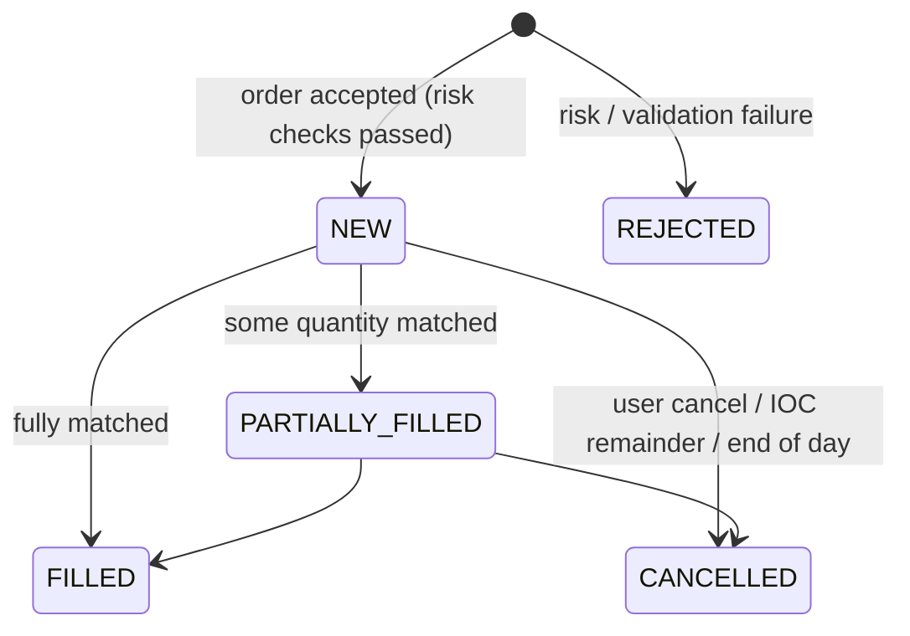
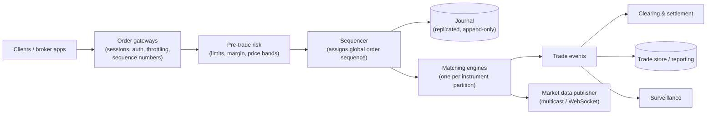
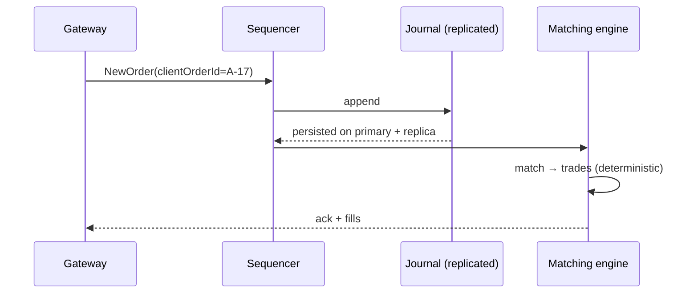

# Stock Trading Platform — Order Matching, Risk Checks, Market Data, and Deterministic Recovery

> **System Design · Financial Domain** — A trading system is where correctness, fairness, and latency all matter at once. This design covers the two sides interviewers mix up — a **broker** (like Zerodha or Groww, routing customer orders) and an **exchange** (like NSE, matching them) — and goes deep on the matching engine: price-time priority, a single-threaded core, event sourcing, and replay.

---

## Table of Contents

1. The Auction House Analogy
2. Broker vs Exchange — Clarify Which One You're Designing
3. Requirements and Scale
4. Order Types and the Order Lifecycle
5. High-Level Architecture
6. Pre-Trade Risk Checks
7. The Matching Engine — Price-Time Priority
8. Why the Matching Core Is Single-Threaded (and Fast)
9. Event Sourcing, Journaling, and Deterministic Replay
10. Market Data Distribution
11. Post-Trade: Clearing, Settlement, Ledgers
12. Safety Mechanisms: Circuit Breakers, Price Bands, Kill Switches
13. Practice Assignments (Low / Medium / High)
14. Mini Project — Matching Engine with Journal and Replay
15. Interview Corner
16. Quick Reference

---

## 1. The Auction House Analogy

Picture a busy auction floor for one item — say, shares of one company.

- Buyers shout bids ("I'll buy 100 at ₹500"), sellers shout asks ("I'll sell 50 at ₹501").
- The **auctioneer** keeps two lists: the best (highest) bids and the best (lowest) asks. When a bid meets an ask, a trade happens.
- If two buyers offered the same price, **whoever spoke first** gets filled first — that's fairness (price-time priority).
- The auctioneer's **clerk** writes every bid, ask, and trade in a ledger, in order. If the auctioneer faints, a replacement reads the ledger from the start and knows exactly where things stood.
- A **floor manager** stops a trader from bidding more money than they have (risk checks) and can halt the auction if prices go wild (circuit breakers).

---

## 2. Broker vs Exchange — Clarify Which One You're Designing

| | **Broker platform** (Zerodha, Groww, Robinhood) | **Exchange** (NSE, BSE, NYSE) |
|--|------------------------------------------------|-------------------------------|
| Main job | Accept customer orders, check risk/margin, route to exchanges, show portfolios | Match buy and sell orders, publish market data |
| Hardest problems | Scale of users (millions), margin/risk, reliability at market open, portfolio accuracy | Latency (microseconds), determinism, fairness, market integrity |
| Matching engine | No (the exchange matches) | **Yes — the core** |
| Regulator view | Client funds safety, suitability, reporting | Fair and orderly markets, surveillance |

<div class="callout-tip">

**Applying this** — Ask "am I designing the broker app or the exchange?" in the first minute. Many candidates design an exchange-grade matching engine when the interviewer meant a Zerodha-like app, where the real challenges are 10x traffic at 9:15 AM, order routing, margin checks, and portfolio consistency. This page covers both, with the matching engine as the deep dive.

</div>

---

## 3. Requirements and Scale

**Functional (exchange-side)**

- Place, modify, cancel orders: market, limit, stop-loss; validity DAY/IOC.
- Match orders per instrument with price-time priority; generate trades.
- Publish market data: order book depth, last traded price, volume.
- Pre-trade risk checks; post-trade clearing and settlement feeds.

**Non-functional**

| Metric | Target (illustrative) |
|--------|-----------------------|
| Instruments | ~10,000 |
| Peak order rate | 100K-1M orders/s across the exchange at open |
| Matching latency | Microseconds per order inside the engine |
| Correctness | No lost, duplicated, or reordered orders; every trade auditable |
| Recovery | Rebuild exact state after a crash from the journal |

---

## 4. Order Types and the Order Lifecycle

| Type | Behavior |
|------|----------|
| **Limit** | Buy at most / sell at least price P; rests on the book if not fully matched |
| **Market** | Execute immediately at the best available prices (with protection limits to avoid absurd fills) |
| **Stop-loss (SL / SL-M)** | Becomes a limit/market order when a trigger price is reached |
| **IOC** (Immediate or Cancel) | Match what's possible now; cancel the rest |
| **FOK** (Fill or Kill) | Fill completely right now, or cancel entirely |



---

## 5. High-Level Architecture



| Component | Key design point |
|-----------|------------------|
| Gateways | Stateless-ish; enforce client throttles; attach client order IDs for idempotency |
| Risk | Must be fast (in-memory limits per account), deterministic |
| **Sequencer** | Gives every input a total order before matching — the foundation of determinism |
| Journal | Every input persisted (replicated) *before* its effect is acknowledged |
| Matching engines | Partitioned by instrument; each partition processed by a single thread |
| Market data | One-to-many distribution; snapshots + incremental updates |

---

## 6. Pre-Trade Risk Checks

| Check | Example |
|-------|---------|
| Instrument valid & trading | Not suspended; within trading hours |
| Price band | Limit price within ±X% of the reference price (fat-finger protection) |
| Quantity limits | Max order size; lot size multiples |
| **Buying power / margin** | Available funds or margin ≥ order value (broker side) |
| Position limits | Max exposure per account/instrument |
| Order rate limits | Max orders per second per client (algo safeguards) |
| Self-trade prevention | Don't match a client's buy against their own sell |

<div class="callout-scenario">

**Scenario**: A trader intends to sell 1,000 shares at ₹2,450 but types 10,00,000 shares at ₹24.50. **Answer**: Pre-trade checks exist precisely for this: the price is far outside the price band (rejected), the quantity exceeds the maximum order size and the client's holdings (rejected), and the order value exceeds limits. Well-known real-world "fat finger" incidents have caused large losses in seconds; exchanges and brokers enforce layered checks so a single typo can't move a market.

</div>

---

## 7. The Matching Engine — Price-Time Priority

**Order book** per instrument: bids sorted by price **descending**, asks by price **ascending**; at each price level, orders queue **FIFO**.

```text
        BIDS (buy)                      ASKS (sell)
  price   qty (in time order)     price   qty (in time order)
  500.10  200, 50                 500.20  100
  500.05  300                     500.25  75, 400
  500.00  1000                    500.30  60
```

A new **buy limit 500.25 × 300** matches: 100 @ 500.20, then 75 @ 500.25, then 125 of the 400 @ 500.25 — trades execute at the **resting** order's price. Remaining quantity: 0.

```java
public final class OrderBook {
    // Prices as long ticks (e.g., paise) — never double
    private final TreeMap<Long, ArrayDeque<Order>> bids = new TreeMap<>(Comparator.reverseOrder());
    private final TreeMap<Long, ArrayDeque<Order>> asks = new TreeMap<>();
    private final Map<Long, Order> byId = new HashMap<>();              // for O(1) cancel lookup

    public List<Trade> submit(Order incoming) {
        List<Trade> trades = new ArrayList<>();
        TreeMap<Long, ArrayDeque<Order>> opposite = incoming.side() == Side.BUY ? asks : bids;

        while (incoming.remaining() > 0 && !opposite.isEmpty()) {
            Map.Entry<Long, ArrayDeque<Order>> best = opposite.firstEntry();
            if (!crosses(incoming, best.getKey())) break;               // price doesn't meet
            ArrayDeque<Order> level = best.getValue();
            Order resting = level.peekFirst();
            long qty = Math.min(incoming.remaining(), resting.remaining());
            trades.add(new Trade(incoming.id(), resting.id(), best.getKey(), qty));   // resting price
            incoming.fill(qty);
            resting.fill(qty);
            if (resting.remaining() == 0) { level.pollFirst(); byId.remove(resting.id()); }
            if (level.isEmpty()) opposite.pollFirstEntry();
        }
        if (incoming.remaining() > 0 && incoming.type() == OrderType.LIMIT && incoming.tif() == TimeInForce.DAY) {
            (incoming.side() == Side.BUY ? bids : asks)
                .computeIfAbsent(incoming.price(), p -> new ArrayDeque<>()).addLast(incoming);   // rest on book
            byId.put(incoming.id(), incoming);
        }
        return trades;                                                  // IOC/market remainder is cancelled
    }

    private boolean crosses(Order o, long bestOpposite) {
        if (o.type() == OrderType.MARKET) return true;
        return o.side() == Side.BUY ? o.price() >= bestOpposite : o.price() <= bestOpposite;
    }
}
```

| Operation | Complexity |
|-----------|------------|
| Best price | O(log P) with `TreeMap` (P = number of price levels); real engines use arrays indexed by tick for O(1) |
| Add at a level | O(1) (deque append) |
| Cancel | O(1) lookup by ID; removing from the middle of a deque is O(n) — production engines use intrusive doubly linked lists per level |
| Modify | Quantity decrease keeps time priority; **price change or quantity increase loses priority** (cancel + new) |

<div class="callout-interview">

**Q: "How does price-time priority work?"**

Orders are ranked first by price — the highest bid and lowest ask are best — and at the same price by arrival time, so each price level is a FIFO queue. An incoming order matches against the best opposite levels while the prices cross, and trades execute at the resting order's price. Any remaining limit quantity rests on the book. Modifications that increase quantity or change price lose time priority, because otherwise a trader could jump the queue.

</div>

---

## 8. Why the Matching Core Is Single-Threaded (and Fast)

Each instrument's order book is processed by **one thread**, sequentially, entirely in memory.

| Why | Explanation |
|-----|-------------|
| **Determinism** | Same input sequence → same trades, always. Essential for fairness, audit, and replay-based recovery |
| No locks | Locks on a hot order book would serialize anyway and add contention and unpredictable latency |
| CPU cache efficiency | One thread owning data in cache is extremely fast |
| Scale-out | Partition instruments across threads/servers (each book is independent) |

The famous **LMAX architecture** (Java) processed millions of orders per second on a single business-logic thread, fed by a **ring buffer (the Disruptor)** with journaling and replication happening in parallel on the input side.

<div class="callout-info">

**Low-latency techniques** used in real engines: pre-allocated object pools (no garbage-collection pauses on the hot path), primitive arrays instead of object graphs, busy-spinning threads pinned to CPU cores, kernel-bypass networking, and binary protocols. You don't need these for an interview answer — but naming *why* single-threaded + in-memory + journaled is the standard design shows depth.

</div>

---

## 9. Event Sourcing, Journaling, and Deterministic Replay

The engine's state (order books) is never stored as the "source of truth" in a database. The **sequence of inputs** is.



| Property | Benefit |
|----------|---------|
| Journal before processing | Nothing acknowledged is ever lost |
| Deterministic processing | Replaying the journal rebuilds identical books and trades |
| **Hot standby** | A replica engine consumes the same sequenced stream and stays in sync; failover in milliseconds |
| Snapshots | Periodic snapshots of books + journal position → fast restarts (load snapshot, replay the tail) |
| Audit | Regulators can reconstruct the market at any moment |

<div class="callout-warn">

**Determinism is fragile.** Using the wall clock, random numbers, `HashMap` iteration order, or multithreading inside the matching logic breaks replay (the replica produces different trades). Timestamps must come from the sequenced input (assigned by the sequencer), and all logic must depend only on the input stream and prior state.

</div>

---

## 10. Market Data Distribution

| Feed | Content | Consumers |
|------|---------|-----------|
| Trades / ticks | Last price, quantity, time | Everyone |
| Level 1 | Best bid/ask | Retail apps |
| Level 2 / depth | Top N price levels | Traders, algos |
| Full order-by-order | Every order event | Market makers, HFT (co-located) |

**Exchange side**: UDP multicast with sequence numbers and gap recovery (retransmission servers + snapshot channels). **Broker side (retail apps)**: consume the exchange feed, then fan out to millions of users over WebSockets with **conflation** — send only the latest price per instrument per interval (e.g., every 250 ms) instead of every tick, since a phone can't render thousands of updates per second anyway.

<div class="callout-scenario">

**Scenario**: At 9:15 AM market open, a broker's app servers fall over pushing every tick to 5 million connected users watching popular stocks. **Decision**: Conflate updates per instrument per interval, shard WebSocket servers by instrument subscription, use a pub/sub fan-out tier (each server subscribes only to instruments its users watch), send deltas instead of full snapshots, prioritize the user's watchlist and open positions, and load-test the open specifically — traffic at the open can be many times the daily average.

</div>

---

## 11. Post-Trade: Clearing, Settlement, Ledgers

After a trade: **clearing** (the clearing corporation becomes counterparty to both sides and computes net obligations), then **settlement** (securities move to the buyer's demat account and money to the seller — in India, on a **T+1** cycle for equities, with same-day settlement being introduced for some stocks).

Broker-side consequences:

| Area | Design |
|------|--------|
| Holdings vs positions | Intraday positions vs settled holdings; T+1 means bought shares aren't in holdings until settlement |
| Ledger | Double-entry ledger for client funds: trade value, brokerage, taxes (STT, GST, stamp duty), charges |
| Money | Integer paise / fixed-scale `BigDecimal` — never `double` |
| Reconciliation | Daily reconciliation with exchange/clearing and depository files; breaks investigated |
| Corporate actions | Splits, bonuses, dividends adjust holdings and average prices |

---

## 12. Safety Mechanisms: Circuit Breakers, Price Bands, Kill Switches

| Mechanism | Purpose |
|-----------|---------|
| **Price bands** per stock | Reject orders outside ±X% of the reference price |
| **Market-wide circuit breakers** | Halt trading if the index moves beyond thresholds (e.g., 10/15/20% levels) |
| Volatility auctions / halts | Pause a single stock after abnormal moves, then reopen with an auction |
| **Kill switch** | Instantly cancel all open orders and block new ones for a client/algo gone wrong |
| Order-to-trade ratio limits | Deter spamming the book with orders that are never meant to trade |
| Surveillance | Detect spoofing, layering, wash trades, insider patterns (post-trade analytics) |

---

## 13. 🏋️ Practice Assignments

### 🟢 Low — Build the reflexes

**L1.** The book has asks: 100 @ 200.00, 50 @ 200.05. A market buy for 120 arrives. What trades happen?

<details>
<summary>Show answer</summary>

100 @ 200.00 (clears the best level), then 20 @ 200.05. Trades execute at the resting orders' prices. 30 remain at 200.05.

</details>

**L2.** Why store prices as `long` ticks instead of `double`?

<details>
<summary>Show answer</summary>

Binary floating point can't represent most decimal prices exactly (e.g., 0.05 increments), so comparisons like `bid >= ask` and sums of trade values can be wrong by tiny amounts — unacceptable for matching and money. Integer ticks (price × 100 or × tick-size multiplier) are exact and faster.

</details>

**L3.** A trader modifies a resting buy order from 100 to 60 shares. Does it keep its place in the queue? From 100 to 150?

<details>
<summary>Show answer</summary>

Decreasing quantity keeps time priority (it doesn't disadvantage others). Increasing quantity (or changing price) typically loses priority — treated as cancel + new order at the back of the queue — otherwise traders could reserve an early position and enlarge it later.

</details>

### 🟡 Medium — Apply it

**M1.** Implement IOC and FOK on top of the `submit` method above.

<details>
<summary>Show answer</summary>

**IOC**: match as usual, then cancel the remainder instead of resting it (already handled by not resting non-DAY orders). **FOK**: before matching, check that enough opposite quantity exists at acceptable prices: iterate the opposite levels while prices cross, summing available quantity until it reaches the order quantity (read-only). If insufficient → reject/cancel without trades; otherwise run the normal matching (which will fully fill). Both remain deterministic since they run on the single matching thread.

</details>

**M2.** Design order submission idempotency for a broker whose mobile app retries on network timeouts.

<details>
<summary>Show answer</summary>

The app generates a unique **client order ID** per user intent (UUID) and reuses it on retries. The broker's order service stores `(accountId, clientOrderId)` with a unique constraint and returns the existing order's status on duplicates instead of creating a new order. When routing to the exchange, the broker's own order ID is used consistently so retries to the exchange are also deduplicated. The UI shows "submitted — waiting for confirmation" and polls/pushes status, rather than inviting the user to press Buy again.

</details>

**M3.** Design the WebSocket price-streaming service for a broker app with 3 million concurrent users.

<details>
<summary>Show answer</summary>

Ingest the exchange feed into an internal pub/sub (e.g., per-instrument channels in a low-latency bus); a fleet of WebSocket servers each hold ~50-100K connections; each server subscribes only to instruments its connected users watch (subscription registry per server); per-instrument **conflation** (latest value every 250-500 ms for retail); binary/compact deltas; heartbeats and reconnect with snapshot-on-reconnect; backpressure: drop intermediate updates for slow clients instead of buffering; autoscale ahead of market open; metrics on fan-out latency and dropped updates.

</details>

### 🔴 High — Think like a senior

**H1.** Your matching engine server crashes during trading. Walk through recovery with zero lost orders and identical results.

<details>
<summary>Show answer</summary>

Inputs were sequenced and journaled (replicated to a standby and to disk) before being processed and acknowledged, so nothing acknowledged is lost. A **hot standby** engine has been consuming the same sequenced stream and holds identical state (deterministic processing); failover promotes it — gateways reconnect to it and it continues from the last sequence number. Outputs (trades, acks) are also sequenced, so consumers deduplicate by output sequence number if the standby re-emits recent outputs. If no hot standby exists: start a new engine from the latest snapshot and replay the journal tail — the resulting books and trades are bit-for-bit identical. Clients reconcile order status via the gateway using their last known sequence numbers. Trading may be halted briefly per exchange rules during failover.

</details>

**H2.** Design a broker platform's order flow for the 9:15 AM open, when 30% of the day's orders arrive in the first 5 minutes.

<details>
<summary>Show answer</summary>

Pre-open: pre-scale gateways and risk services, warm caches (holdings, margins, instrument master), accept AMO (after-market orders) the night before and release them at the open in controlled batches. Order path: stateless API tier → in-memory risk service with account-level margin (fast checks, partitioned by account; reserve margin on order acceptance, release on cancel/rejection) → order management service with idempotent client order IDs → exchange connectivity with per-exchange session throttles (exchange message limits) and priority queues (user cancels prioritized over new orders). Persist orders via append-only logs (Kafka) and write-optimized stores; update positions from exchange execution reports. Graceful degradation: disable non-critical features (charts history, news) at the open, and a queue-and-inform UX if throttled. Rehearse with load tests replaying real open traffic.

</details>

---

## 14. 🛠️ Mini Project — Matching Engine with Journal and Replay

**Goal**: A small but correct matching engine demonstrating determinism. 1 week of evenings, plain Java 21.

**Build**

1. `OrderBook` per instrument (TreeMap + ArrayDeque or your own linked lists), long-tick prices, limit/market/IOC/FOK, cancel, and modify with correct priority rules.
2. A **sequencer + journal**: inputs appended to a file (length-prefixed binary or JSON lines) with sequence numbers *before* processing.
3. The engine runs on a single thread consuming a queue of sequenced inputs; outputs (acks, trades) are written to an output journal.
4. **Replay**: a CLI that rebuilds books from the input journal and verifies the output journal matches byte for byte.
5. **Snapshots**: every 100K inputs, snapshot the books and the sequence number; restart = snapshot + tail replay.
6. A load generator (random orders around a mid price) and a benchmark reporting orders/second and latency percentiles.
7. A simple market-data publisher printing top-5 depth per instrument every 500 ms (conflated).

**Acceptance criteria**

- Unit tests for matching scenarios (partial fills, price-time priority, IOC/FOK, modify rules).
- Replaying 1M journaled orders reproduces identical trades.
- A README explaining why the engine is single-threaded and deterministic, with your benchmark numbers.

---

## 🎯 Interview Corner

<div class="callout-interview">

**Q: "Design a stock exchange's matching engine."**

Orders arrive at gateways, pass fast pre-trade risk checks — price bands, size limits, rate limits — and go to a sequencer that assigns a total order and journals each input to replicated durable storage before processing. Each instrument's order book lives in memory and is owned by a single thread: bids sorted high to low, asks low to high, with FIFO queues per price level for price-time priority. The engine matches incoming orders against the opposite side at the resting price, rests any limit remainder, and emits trades and acknowledgments as a sequenced output stream. Because processing is deterministic, a hot standby consuming the same stream can take over instantly, and snapshots plus journal replay rebuild exact state. Market data is published from the output stream, and trades flow on to clearing and surveillance.

</div>

<div class="callout-interview">

**Q: "Why would you make the matching engine single-threaded? Isn't that a bottleneck?"**

For one order book, matching is inherently sequential: every order must see the book as the previous one left it, and fairness requires a strict order. Multiple threads would need locks around the book, adding contention and unpredictable latency without extra parallelism. A single thread with the data in memory and in CPU cache processes orders in microseconds and, crucially, deterministically, which enables replay-based recovery, hot standbys, and audits. Throughput scales by partitioning instruments across threads and machines, since books are independent, while journaling and networking run on other threads in a pipeline, as in the LMAX Disruptor design.

</div>

<div class="callout-interview">

**Q: "How does a broker app avoid placing duplicate orders when users tap Buy twice or the network retries?"**

Every order intent gets a client-generated order ID, and the order service enforces uniqueness per account, so a retry returns the existing order instead of creating a second one. The UI reflects the pending state immediately and doesn't invite a second tap. Downstream, the broker uses stable order IDs toward the exchange and reconciles using execution reports, so a lost acknowledgment leads to a status query, not a resubmission. The same idempotency principle applies to cancels and modifications, and a daily reconciliation against exchange trade files catches anything that slipped through.

</div>

---

## Quick Reference

| Concept | One-Liner |
|---------|-----------|
| Broker vs exchange | Routing, risk, and portfolios vs matching and market data — clarify first |
| Order book | Bids desc, asks asc; FIFO per price level |
| Matching | Price-time priority; trade at the resting price; rest the limit remainder |
| Order types | Limit, market, SL, IOC, FOK; modify-up loses priority |
| Prices & money | Integer ticks/paise; never `double` |
| Core design | Single-threaded, in-memory, partitioned by instrument |
| Durability | Sequence → journal (replicated) → process → ack |
| Recovery | Deterministic replay; hot standby; snapshots |
| Market data | Multicast + gap recovery (exchange); WebSockets + conflation (broker) |
| Safety | Price bands, circuit breakers, kill switches, self-trade prevention |
| Post-trade | Clearing, T+1 settlement, double-entry ledgers, reconciliation |

---

## Related Topics

- `java-collections-list` — TreeMap and ArrayDeque behind the order book
- `payment-gateway` — ledgers and idempotency for money
- `kafka-deep-dive` — logs, ordering, and replay concepts
- `distributed-transactions` — why sequencing and determinism beat distributed locking here

> **An exchange is fair because it's boring: one ordered stream of inputs, one thread applying clear rules, one journal that can replay history exactly. Speed comes from that simplicity, not in spite of it.**

---

<!-- journey-link:start -->

<div class="callout-journey">

🛒 **ShopNorth Journey** — Extra case study — atomic updates under extreme concurrency, like ShopNorth's stock reservations that never oversell.

**Continue the story:** [Chapter 4 · Data Model & SQL](/tutorials/journey-04-data-sql) · **New here?** [Start the journey](/tutorials/journey-start)

</div>

<!-- journey-link:end -->
