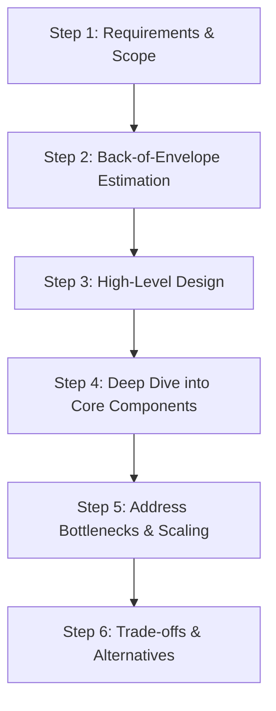
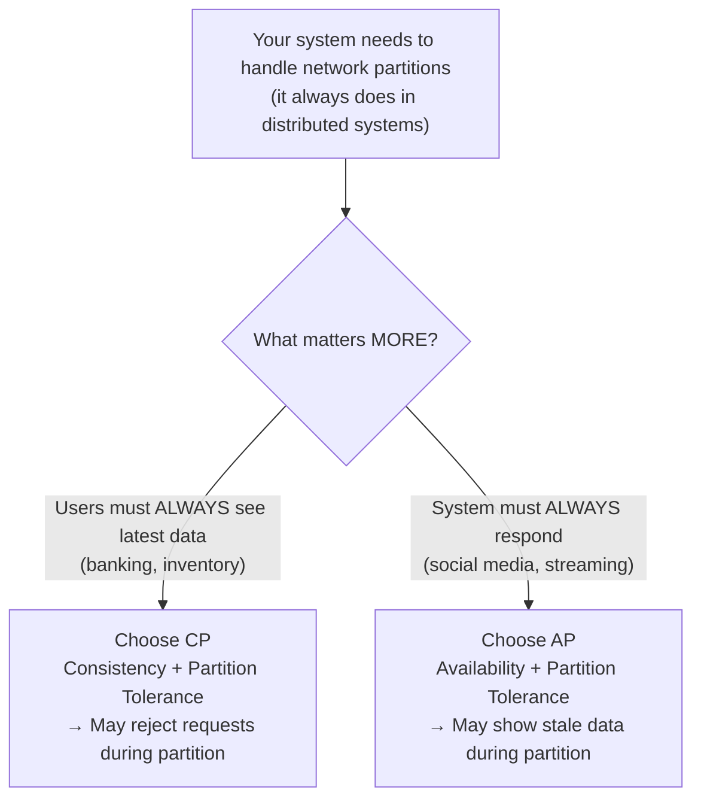
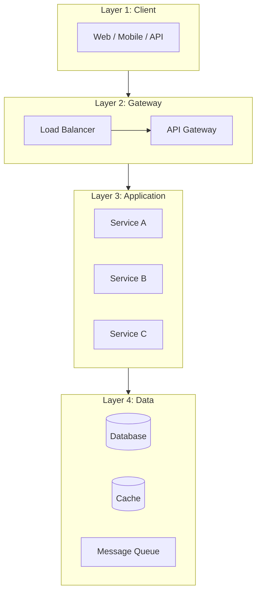
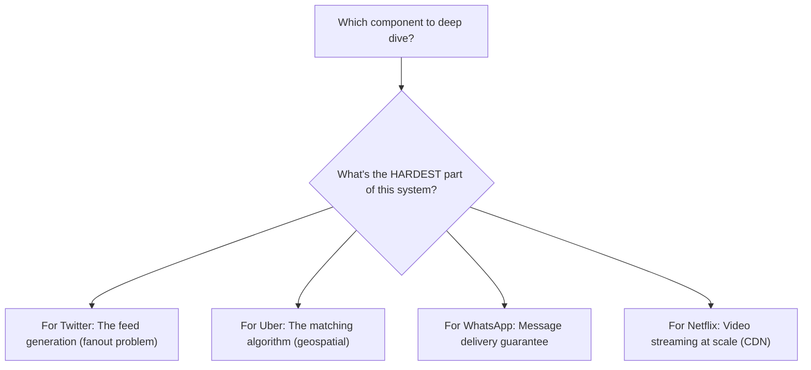
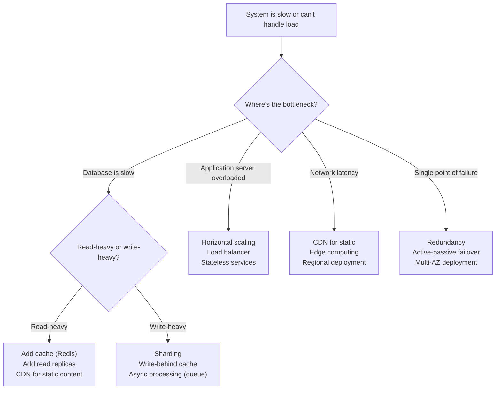

# How to Think in System Design — The Architect's Mental Model

<!-- sdlc-stage:start -->
<div class="sdlc-stage">

📍 **SDLC stage: Design — architecture** · ShopNorth uses this in [Chapter 2 · System Design (HLD)](/tutorials/journey-02-system-design)

</div>
<!-- sdlc-stage:end -->

## Why This Tutorial Exists

System design interviews aren't about memorizing "Uber uses QuadTree" or "Netflix uses CDN." They test whether you can **think through a problem you've never seen** and make reasonable decisions under uncertainty. This tutorial teaches you the thinking process — so you can design ANY system, not just the ones you've practiced.

---

## The 6-Step System Design Framework



---

## Step 1: Requirements — The Most Important 5 Minutes

**The mistake everyone makes**: Start drawing boxes immediately.

**What senior engineers do**: Spend 5 minutes asking questions that SHAPE the entire design.

### The Question Framework

| Category | Questions to ask | Why it matters |
|----------|-----------------|----------------|
| **Users** | How many users? DAU? Peak concurrent? | Determines scale — 1K users vs 1B users = completely different designs |
| **Features** | What's the MVP? What's out of scope? | Prevents over-engineering — you have 45 minutes, not 45 days |
| **Data** | How much data? Read-heavy or write-heavy? | Determines database choice and caching strategy |
| **Latency** | What's acceptable response time? Real-time needed? | Determines sync vs async, caching aggressiveness |
| **Consistency** | Can we show stale data? For how long? | Determines consistency model — strong vs eventual |
| **Availability** | What's the uptime requirement? 99.9% vs 99.99%? | Determines redundancy and failover strategy |

<div class="callout-scenario">

**Scenario**: You're asked "Design Twitter." Instead of jumping to architecture, ask: "Are we designing the tweet posting system, the timeline/feed system, or the search system? What's the expected scale — millions or billions of users? Is the feed real-time or can it be slightly delayed?"

**Why this matters**: Designing Twitter's feed for 1M users = simple database query. For 500M users = you need fanout, caching, sharding. The SAME problem has COMPLETELY different solutions at different scales.

</div>

### The CAP Theorem Decision — Make It Early



<div class="callout-info">

**Key insight**: You're not choosing "consistency OR availability" forever. You're choosing the DEFAULT behavior during failures. Most systems are AP for reads (show cached/stale data) and CP for writes (reject writes if consistency can't be guaranteed). Netflix is AP — showing a slightly stale catalog is fine. A bank is CP — showing wrong balance is not fine.

</div>

**Go deeper:** [CAP Theorem, PACELC & Consistency Models](/tutorials/cap-theorem) covers what CAP really says and how to choose consistency per operation; [Scalability](/tutorials/scalability) and [High Availability & DR](/tutorials/high-availability) cover Steps 5 and 6 in depth.

---

## Step 2: Back-of-Envelope Estimation — Think in Powers of 10

You don't need exact numbers. You need to know if you're dealing with thousands, millions, or billions.

### The Estimation Cheat Sheet

| What | Approximate value |
|------|------------------|
| Seconds in a day | ~100K (86,400) |
| Requests/sec from 1M DAU | ~12 RPS (1M / 86400) |
| Requests/sec from 100M DAU | ~1,200 RPS |
| 1 KB × 1M = | 1 GB |
| 1 KB × 1B = | 1 TB |
| Single server handles | ~10K-50K concurrent connections |
| Single DB handles | ~5K-10K queries/sec |
| Redis handles | ~100K ops/sec |
| SSD read latency | ~0.1ms |
| Network round-trip (same region) | ~1ms |
| Network round-trip (cross-continent) | ~100ms |

### How to Estimate — The Formula

```
Daily data = DAU × actions_per_user × data_per_action
Storage (5 years) = daily_data × 365 × 5
Peak QPS = average_QPS × 3 (rule of thumb)
```

<div class="callout-tip">

**Applying this** — In an interview, say: "Let me do a quick estimation. 100M DAU, each user sends 10 messages/day = 1B messages/day. At 1KB per message = 1TB/day. Over 5 years = ~2PB. Peak QPS = 1B/86400 × 3 ≈ 35K messages/sec." This takes 30 seconds and tells you: you need sharding, you need a write-optimized database, and a single server won't cut it.

</div>

---

## Step 3: High-Level Design — Think in Layers, Not Boxes

**The mistake**: Draw random boxes and connect them with arrows.

**The right approach**: Think in layers. Every system has the same layers:



### The Decision at Each Layer

| Layer | Key decision | How to decide |
|-------|-------------|---------------|
| **Client** | Thin client or thick client? | Mobile-first = thin (server does work). Desktop = can be thicker |
| **Gateway** | Need rate limiting? Auth? Routing? | If multiple services → yes, use API gateway |
| **Application** | Monolith or microservices? | < 10 engineers = monolith. > 50 engineers = microservices. In between = modular monolith |
| **Data** | SQL or NoSQL? Cache? Queue? | Read-heavy → cache. Write-heavy → queue + async. Complex queries → SQL. Simple key-value → NoSQL |

<div class="callout-warn">

**Warning**: Don't jump to microservices by default. In an interview, if the scale doesn't demand it, a well-designed monolith is a BETTER answer. It shows you understand that microservices add complexity (network calls, distributed transactions, deployment overhead) and you only pay that cost when the benefits outweigh it.

</div>

---

## Step 4: Deep Dive — Pick the Most Interesting Component

You can't design everything in 45 minutes. Pick 1-2 components and go deep.

### How to Pick What to Deep Dive



**Rule**: Deep dive into the component that makes this system UNIQUE. Every system has a database, a cache, and an API. What makes Uber different from Netflix? The geospatial matching vs the video streaming. That's where you go deep.

<div class="callout-interview">

🎯 **Interview Ready** — "I've outlined the high-level architecture. The most interesting and challenging component here is [X]. Let me dive deeper into that. Would you like me to focus there, or is there another area you'd prefer?" This shows you can identify the core challenge AND you're collaborative with the interviewer.

</div>

---

## Step 5: Scaling — The Decision Tree



### The Scaling Toolbox — When to Use What

| Problem | Tool | Why THIS tool |
|---------|------|---------------|
| Same data read 1000x | **Cache (Redis)** | O(1) lookup, 100K ops/sec, avoids DB hit |
| Database can't handle writes | **Sharding** | Split data across N databases, each handles 1/N |
| Spiky traffic | **Message Queue (Kafka/SQS)** | Buffer writes, process at your own pace |
| Global users, high latency | **CDN + Regional deployment** | Serve from nearest location |
| Single server = single point of failure | **Replication + Load Balancer** | If one dies, others take over |
| Complex queries on large data | **Read replicas + Materialized views** | Separate read and write paths |

<div class="callout-scenario">

**Scenario**: Your e-commerce site handles 1000 orders/sec during flash sales but only 10 orders/sec normally. Scaling the database to handle 1000/sec permanently is wasteful.

**Decision**: Put a message queue (Kafka/SQS) between the API and the database. The API writes to the queue instantly (handles 1000/sec). A consumer processes orders from the queue at a steady 100/sec. The queue buffers the spike. Users see "Order placed!" immediately, actual processing happens asynchronously. This is the **write-behind** pattern.

</div>

---

## Step 6: Trade-offs — The Mark of a Senior Engineer

Junior engineers give "the right answer." Senior engineers explain "why NOT the other options."

### The Trade-off Framework

For EVERY decision, state:

```
"I chose X over Y because [reason]. 
The trade-off is [what we lose]. 
This is acceptable because [why it's okay for our use case]."
```

### Common Trade-offs

| Decision | Option A | Option B | How to decide |
|----------|----------|----------|---------------|
| SQL vs NoSQL | Strong consistency, complex queries | High throughput, flexible schema | Need JOINs? → SQL. Need scale + simple queries? → NoSQL |
| Sync vs Async | Simple, immediate response | Decoupled, handles spikes | User needs instant result? → Sync. Can wait? → Async |
| Cache vs No cache | Fast reads, stale data risk | Always fresh, slower | Read:Write ratio > 10:1? → Cache. Mostly writes? → Skip cache |
| Monolith vs Microservices | Simple, fast development | Independent scaling, team autonomy | Small team? → Monolith. Large org? → Microservices |
| Push vs Pull | Real-time, more server work | On-demand, less server work | Need instant updates? → Push. Periodic refresh OK? → Pull |
| Consistency vs Availability | Correct data, may reject requests | Always responds, may be stale | Financial data? → Consistency. Social feed? → Availability |

<div class="callout-tip">

**Applying this** — In an interview, after every design decision, proactively say the trade-off. "I'm using Kafka here instead of direct API calls. The trade-off is added complexity and slight delay, but we gain decoupling and spike handling. For this use case, a 2-second delay in processing is acceptable." This is what separates a senior answer from a junior one.

</div>

---

## The Anti-Patterns — What NOT to Do

| Anti-Pattern | Why it's wrong | What to do instead |
|-------------|---------------|-------------------|
| **Jump to solution** | You might solve the wrong problem | Spend 5 min on requirements first |
| **Over-engineer** | Adding Kafka, Redis, 10 microservices for a 1000-user app | Match complexity to scale |
| **Ignore trade-offs** | "Use NoSQL" without explaining why not SQL | Always state what you're giving up |
| **Copy-paste architecture** | "Uber uses X so we should too" | Understand WHY Uber chose X, then decide if YOUR problem is similar |
| **Single database for everything** | One DB can't optimize for all access patterns | Use polyglot persistence — right DB for right data |
| **Forget failure modes** | "What if Redis goes down?" | Design for failure — every component WILL fail eventually |

---

<!-- practice-pack -->

## 🏢 Real-World Scenarios

<div class="callout-scenario">

**Scenario**: In an interview, a candidate is asked to "design Instagram" and immediately draws Kafka, Cassandra, Redis, and 12 microservices. Twenty minutes later the interviewer asks "how many photos per second are we storing?" and the candidate has no idea — the design was never anchored to requirements. **Decision**: Spend the first 5 minutes on scope (which features: upload, feed, likes?), scale (DAU, read/write ratio), and constraints (latency, consistency). A rough estimate — 500M DAU × 2 uploads/day ≈ 12K uploads/s at peak — then *justifies* every later component. Interviewers grade the reasoning chain, not the number of boxes.

</div>

<div class="callout-scenario">

**Scenario**: At work, a team is asked to build an internal reporting tool for 50 users and designs it like a planet-scale system: event sourcing, CQRS, a Kafka backbone, and multi-region failover. It takes 9 months and is hard to change. **Decision**: The same framework applies in real projects — and it often says "simple": a single service with PostgreSQL, a few indexes, and a nightly job. Over-engineering is a requirements failure. State the scale explicitly, design for it with headroom (say 10x), and document what would change at 100x.

</div>

## 🏋️ Practice Assignments

### 🟢 Low — Build the reflexes

**L1.** Estimate: 10M daily active users each make 20 API requests per day. What's the average and peak QPS?

<details>
<summary>Show answer</summary>

10M × 20 = 200M requests/day ÷ ~86,400 s ≈ **2,300 QPS average**. Peak is commonly 2-5x average (time-of-day patterns, events) → plan for **~5,000-12,000 QPS**. Rounding: a day ≈ 10⁵ seconds makes mental math easy (200M / 10⁵ = 2,000).

</details>

**L2.** List five clarifying questions you'd ask before designing "a notification system".

<details>
<summary>Show answer</summary>

Which channels (push, email, SMS, in-app)? Volume and peak (e.g., campaigns to millions)? Latency needs per type (OTP in seconds vs marketing in hours)? Delivery guarantees and deduplication? User preferences/opt-outs and regulations? Who sends (internal services only?), and do we need analytics (delivered/opened)?

</details>

**L3.** Name the trade-off in each: (a) cache-aside with a 10-minute TTL, (b) fan-out on write for feeds, (c) SQL vs a wide-column store for chat messages.

<details>
<summary>Show answer</summary>

(a) Speed and lower DB load vs up to 10 minutes of staleness. (b) Fast feed reads vs expensive writes for users with many followers. (c) Rich queries, joins, and transactions vs horizontal write scalability and time-ordered partition reads at massive volume.

</details>

### 🟡 Medium — Apply it

**M1.** Estimate storage for a photo app: 100M uploads/day, average 2 MB original plus 3 resized versions totalling 500 KB, kept for 5 years, with 3x replication.

<details>
<summary>Show answer</summary>

Per photo ≈ 2.5 MB → 100M × 2.5 MB = **250 TB/day**. Five years ≈ 1,825 days → ~456 PB; with 3x replication ≈ **1.4 EB** (or ~1.5x overhead with erasure coding instead of replication ≈ 680 PB). That number immediately says: object storage with lifecycle tiers (hot → infrequent → archive), erasure coding, and a CDN for reads — never a database.

</details>

**M2.** You have 45 minutes for "design a URL shortener". Write your time plan.

<details>
<summary>Show answer</summary>

0-5 min: requirements and scale (reads ≫ writes, latency, custom aliases, analytics?). 5-10: estimates (QPS, storage, cache size). 10-20: high-level design (API, write path, redirect path with caches, storage choice). 20-35: deep dive on 1-2 interesting parts (ID generation, hot links/caching, analytics pipeline). 35-42: scaling and failures (multi-region, cache stampede, abuse). 42-45: trade-offs and what you'd improve. Check in with the interviewer at each transition.

</details>

**M3.** The interviewer says "now make it 100x bigger". What's your systematic approach?

<details>
<summary>Show answer</summary>

Recompute the numbers and find what breaks first, layer by layer: stateless app tier (add instances, autoscale), cache (more memory, cluster, hot-key handling), database (read replicas → sharding by a well-chosen key; or a horizontally scalable store), async work (queues, partitions), network/edge (CDN, multi-region). Name the new bottleneck and its fix at each step, plus the new costs (operational complexity, consistency trade-offs, cross-region latency). Avoid "just add more servers" without saying *which* component and *how* state is partitioned.

</details>

### 🔴 High — Think like a senior

**H1.** Your design uses a single PostgreSQL primary. At what point do you shard, and how do you choose the shard key?

<details>
<summary>Show answer</summary>

Exhaust simpler options first: query/index tuning, vertical scaling, read replicas for read traffic, caching, partitioning large tables, and archiving cold data. Shard when write throughput or dataset size exceeds what one primary can handle with headroom (measured, not guessed). Choose a shard key that (1) appears in almost every query (so queries hit one shard), (2) distributes load evenly (high cardinality, no hot keys), and (3) keeps related data together (e.g., `tenant_id` for B2B, `user_id` for consumer apps). Plan for cross-shard queries (avoid or handle via async read models), resharding (consistent hashing or many logical shards on fewer physical nodes), and global uniqueness (ID generation without a single sequence).

</details>

**H2.** Write a one-page design review template your team could use before building any new service.

<details>
<summary>Show answer</summary>

Sections: (1) Problem and goals / non-goals; (2) Requirements — functional, scale numbers, latency/availability targets, consistency needs; (3) Estimates — QPS, storage, growth; (4) Design — diagram, APIs, data model, key flows; (5) Alternatives considered and why rejected; (6) Failure modes — what happens when each dependency is down, and recovery; (7) Security and privacy — auth, data classification, PII; (8) Observability — SLIs/SLOs, dashboards, alerts; (9) Operations — deployment, migrations, rollback, cost estimate; (10) Open questions and risks. Keep it short; it's a thinking tool, reviewed by 2-3 peers asynchronously.

</details>

## 🛠️ Mini Project — Your Personal System Design Playbook

**Goal**: Practice the framework until it's automatic. 1-2 weeks, 30 minutes a day.

**Build**

1. A Markdown (or Notion) template with the 6 steps, an estimation cheat sheet (powers of 10, latency numbers, storage sizes), and a trade-offs checklist.
2. Do 8 timed (45-minute) designs using the template — URL shortener, rate limiter, chat, news feed, notification system, payment gateway, typeahead, ride sharing — speaking out loud and recording yourself.
3. After each, compare with the matching tutorial on this site and write down 3 things you missed.
4. Keep a "numbers notebook": every estimate you made and whether it was in the right order of magnitude.
5. Do 2 mock interviews with a peer using the template; swap roles.

**Acceptance criteria**: by the 8th design you finish requirements + estimates in ≤ 10 minutes, and every component in your diagram is justified by a requirement or number.

---

## 🎯 Interview Corner

<div class="callout-interview">

**Q: "How do you approach a system design problem you've never seen before?"**

I follow a structured framework. First 5 minutes: clarify requirements — who are the users, what's the scale, what are the key features, what's the consistency/availability requirement. Next 5 minutes: back-of-envelope estimation — how much data, how many requests/sec, how much storage. Then I draw the high-level architecture in layers — client, gateway, application services, data stores. I identify the hardest/most unique component and deep dive into it. Throughout, I explicitly state trade-offs for every decision. Finally, I address scaling bottlenecks and failure modes. This framework works for ANY system because every system has users, data, and components that need to communicate.

**Follow-up trap**: "What if you don't know the right technology?" → I focus on the REQUIREMENTS the technology must meet, not the specific product. "We need a message queue that guarantees ordering and handles 100K messages/sec" is more valuable than "use Kafka." The interviewer cares about your reasoning, not your product knowledge.

</div>

<div class="callout-interview">

**Q: "How do you decide between SQL and NoSQL?"**

I ask four questions: (1) Do I need complex queries with JOINs? → SQL. (2) Is the schema well-defined and unlikely to change? → SQL. (3) Do I need horizontal scaling for massive write throughput? → NoSQL. (4) Is the access pattern simple key-value or document lookups? → NoSQL. Most systems use BOTH — SQL for transactional data (orders, users) and NoSQL for high-volume data (logs, sessions, analytics). The mistake is treating it as either/or. I'd use PostgreSQL for the order service and DynamoDB for the session store in the same system.

**Follow-up trap**: "What about NewSQL like CockroachDB?" → NewSQL gives you SQL semantics with horizontal scaling, but at the cost of higher latency per query and operational complexity. I'd consider it when I need both complex queries AND massive scale — like a global financial system. For most applications, PostgreSQL with read replicas handles millions of users fine.

</div>

<div class="callout-interview">

**Q: "Your system needs to handle 100x traffic during a flash sale. How?"**

Three layers of defense: (1) **Frontend**: CDN caches static assets, rate limit per user, queue-based "waiting room" if needed. (2) **Application**: Auto-scaling groups that scale from 10 to 100 instances based on CPU/request count. Stateless services so any instance handles any request. (3) **Database**: Read-through cache (Redis) absorbs 90% of reads. Write-behind queue (Kafka/SQS) buffers writes — users see "Order placed!" instantly, actual DB write happens asynchronously. The key insight: you don't scale the database to handle 100x — you put buffers (cache + queue) in front of it. The database processes at its comfortable rate while the buffers absorb the spike.

</div>

---

## Quick Reference — The System Design Cheat Sheet

| Step | What to do | Time in interview |
|------|-----------|-------------------|
| 1. Requirements | Ask scope, scale, features, constraints | 5 min |
| 2. Estimation | DAU → QPS → Storage → Bandwidth | 3 min |
| 3. High-Level Design | Draw layers: Client → Gateway → Services → Data | 10 min |
| 4. Deep Dive | Pick the hardest component, go deep | 15 min |
| 5. Scaling | Identify bottlenecks, apply scaling tools | 7 min |
| 6. Trade-offs | State alternatives and why you chose this | Throughout |

---

> **System design isn't about knowing the answer. It's about having a framework to FIND the answer. The best architects aren't the ones who've memorized the most systems — they're the ones who can reason through any system from first principles.**

---

<!-- journey-link:start -->

<div class="callout-journey">

🛒 **ShopNorth Journey** — Priya uses this framework to design ShopNorth: traffic shape first, then the numbers from Chapter 1, then components and failure cases.

**Continue the story:** [Chapter 2 · System Design (HLD)](/tutorials/journey-02-system-design) · **New here?** [Start the journey](/tutorials/journey-start)

</div>

<!-- journey-link:end -->
