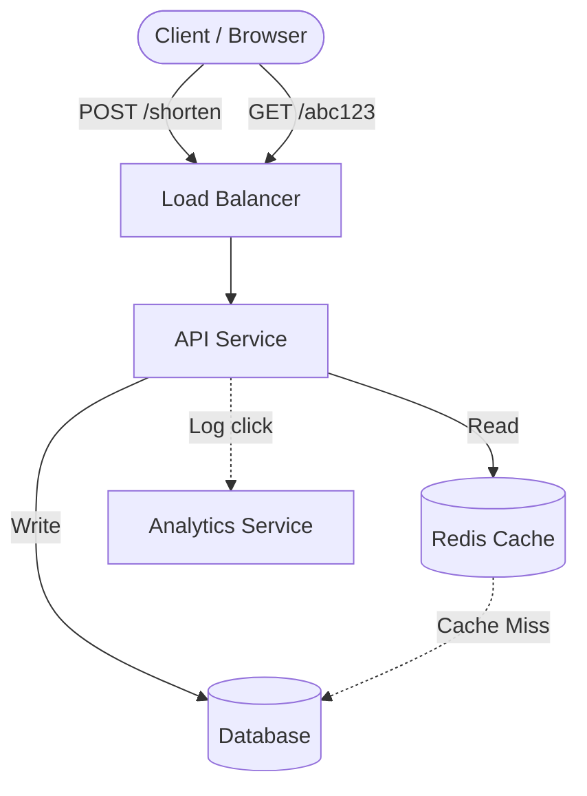
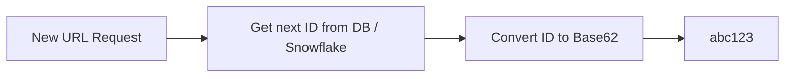
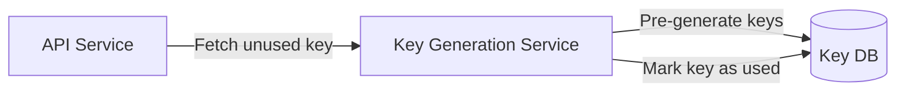
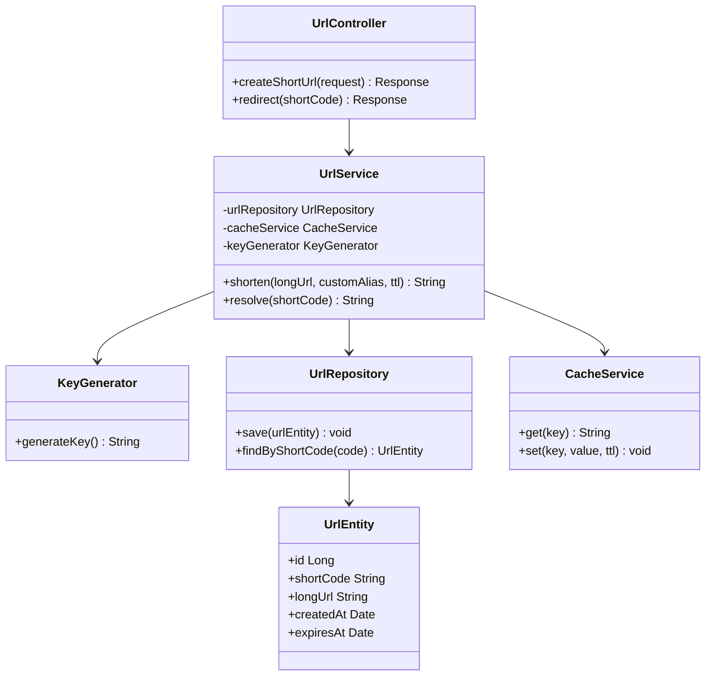
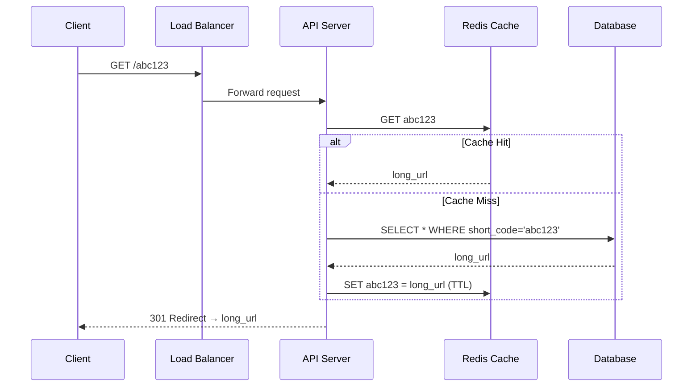
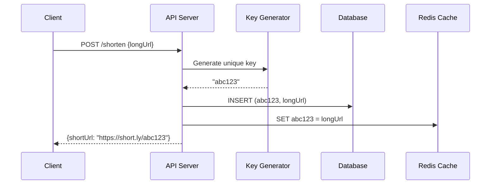
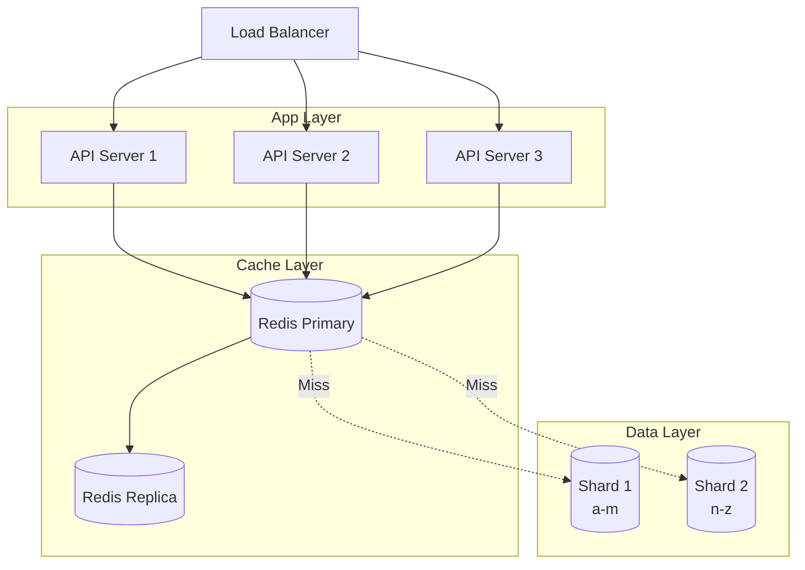

# URL Shortener — Complete System Design

## 1. Problem Statement

Design a URL shortening service (like TinyURL or Bitly) that:
- Takes a long URL and returns a short, unique URL
- Redirects the short URL to the original long URL
- Handles **billions** of URLs with low latency
- Tracks click analytics (optional)

---

## 2. Functional Requirements

| # | Requirement |
|---|-------------|
| 1 | Given a long URL, generate a unique short URL |
| 2 | Given a short URL, redirect to the original URL |
| 3 | Short URLs expire after a configurable TTL |
| 4 | Users can optionally pick a custom alias |

## 3. Non-Functional Requirements

- **High availability** — the redirect service must always be up
- **Low latency** — redirect should happen in < 50ms
- **Short URLs should not be predictable** (security)
- **Scalable** to 100M+ URLs created per month

---

## 4. Capacity Estimation

> Assume 100M new URLs/month, 10:1 read-to-write ratio.

| Metric | Value |
|--------|-------|
| Writes | ~40 URLs/sec |
| Reads (redirects) | ~400 URLs/sec |
| Storage (5 years) | 100M × 12 × 5 = 6B records |
| Storage size | 6B × 500 bytes ≈ **3 TB** |

---

## 5. High-Level Design (HLD)

The system has two main flows: **URL creation** and **URL redirection**.



### Components

1. **Load Balancer** — distributes traffic across API servers
2. **API Service** — stateless service handling create & redirect
3. **Database** — stores the URL mappings
4. **Cache (Redis)** — caches hot/popular URLs for fast redirect
5. **Analytics Service** — async click tracking via message queue

---

## 6. API Design

### Create Short URL

```
POST /api/v1/shorten
Body: { "longUrl": "https://example.com/very/long/path", "customAlias": "mylink", "ttl": 3600 }
Response: { "shortUrl": "https://short.ly/abc123" }
```

### Redirect

```
GET /:shortCode
Response: 301 Redirect → original long URL
```

> **301 vs 302**: Use **301** (permanent) if SEO matters and you want browsers to cache. Use **302** (temporary) if you need to track every click.

---

## 7. Short URL Generation — Approaches

### Approach 1: Base62 Encoding of Auto-Increment ID



- Characters: `a-z, A-Z, 0-9` = 62 chars
- 7 characters → 62^7 = **3.5 trillion** unique URLs
- **Pros**: Simple, no collisions
- **Cons**: Predictable (sequential)

### Approach 2: MD5/SHA256 Hash + First 7 chars

- Hash the long URL, take first 7 characters
- **Pros**: Same URL always gives same short code
- **Cons**: Collision possible — need collision resolution

### Approach 3: Pre-generated Key Service (KGS)



- A separate service pre-generates unique keys
- API fetches an unused key when creating a short URL
- **Pros**: No collision, fast
- **Cons**: Extra service to manage

---

## 8. Database Design (LLD)

### Schema

```sql
CREATE TABLE urls (
    id          BIGINT PRIMARY KEY AUTO_INCREMENT,
    short_code  VARCHAR(10) UNIQUE NOT NULL,
    long_url    TEXT NOT NULL,
    created_at  TIMESTAMP DEFAULT CURRENT_TIMESTAMP,
    expires_at  TIMESTAMP,
    user_id     BIGINT,
    click_count BIGINT DEFAULT 0
);

CREATE INDEX idx_short_code ON urls(short_code);
CREATE INDEX idx_expires_at ON urls(expires_at);
```

### Database Choice

| Option | When to use |
|--------|-------------|
| **SQL (MySQL/PostgreSQL)** | Strong consistency, ACID transactions |
| **NoSQL (DynamoDB/Cassandra)** | Massive scale, high write throughput |

For a URL shortener, **NoSQL** is often preferred because:
- Simple key-value lookups (short_code → long_url)
- Horizontal scaling is easier
- No complex joins needed

---

## 9. Low-Level Design (LLD)

### Class Diagram



### Redirect Flow (Sequence Diagram)



### Create URL Flow



---

## 10. Caching Strategy

- **Cache**: Redis with LRU eviction
- **Cache aside pattern**: Check cache first → if miss, read DB → populate cache
- **TTL**: Match URL expiration or use 24h default
- **Hot URLs**: The top 20% of URLs get 80% of traffic (Pareto principle)

---

## 11. Scaling



### Strategies

| Strategy | Details |
|----------|---------|
| **DB Sharding** | Shard by first char of short_code or hash-based |
| **Read Replicas** | For read-heavy redirect traffic |
| **CDN** | Cache 301 redirects at edge |
| **Rate Limiting** | Prevent abuse on create endpoint |

---

## 12. Summary

| Aspect | Decision |
|--------|----------|
| Short code generation | Base62 or KGS |
| Database | NoSQL (DynamoDB) or SQL with sharding |
| Cache | Redis with LRU, 24h TTL |
| Redirect status | 301 for caching, 302 for analytics |
| Scaling | Horizontal API servers + DB sharding |

---

<div class="callout-tip">

**Applying this**: When approaching any system design problem, follow this flow: Requirements → Capacity Estimation → HLD → LLD. Start broad, then zoom in. This works for real architecture decisions too — always understand the scale before picking technologies.

</div>

<div class="callout-interview">

🎯 **Interview Ready**: "I'd start with functional and non-functional requirements, then do a quick capacity estimation to understand scale. For URL shortener: Base62 encoding or KGS for short codes, NoSQL for simple key-value lookups, Redis cache with LRU for hot URLs, 301 for SEO or 302 for analytics tracking."

</div>

---

<!-- practice-pack -->

## 🏢 Real-World Scenarios

<div class="callout-scenario">

**Scenario**: Short links from a marketing SMS campaign start redirecting to a phishing page. Investigation shows attackers created links on the public shortener pointing to malicious sites, and the brand's domain made them look trustworthy. **Decision**: A public shortener is an abuse magnet: check destinations against threat-intelligence lists (e.g., Google Safe Browsing) at creation and periodically after, rate-limit link creation per account/IP, require accounts for custom aliases, add a reporting flow and an interstitial warning page for suspicious links, and keep an admin kill switch to disable a link instantly (with cache purge).

</div>

<div class="callout-scenario">

**Scenario**: A celebrity tweets a short link and it receives 200K redirects per second; the database hosting the mappings saturates even though 99% of traffic is for that single link. **Decision**: Hot keys belong in caches at every layer: CDN/edge caching of the redirect response (with a short TTL, since links can be disabled), an in-process cache in each redirect server, and Redis in front of the database. Redirects are read-only and tiny — they should almost never reach the database.

</div>

## 🏋️ Practice Assignments

### 🟢 Low — Build the reflexes

**L1.** How many unique codes do 7 characters of Base62 give, and how long would they last at 100M new links per day?

<details>
<summary>Show answer</summary>

62⁷ ≈ **3.5 trillion** codes. At 100M/day ≈ 36.5B/year → about **95 years**. Six characters (≈ 56.8B) would last only ~1.5 years at that rate.

</details>

**L2.** 301 or 302 redirect — which one and why?

<details>
<summary>Show answer</summary>

**302 (or 307)** if you need analytics or the ability to change/disable links: browsers don't cache temporary redirects permanently, so every click reaches your service. **301** is cached by browsers (fewer requests, faster for users) but you lose click tracking and can't reliably change or revoke the destination. Most commercial shorteners use 302/307 for these reasons.

</details>

**L3.** Why is hashing the long URL (e.g., the first 7 chars of MD5) risky as the code-generation method?

<details>
<summary>Show answer</summary>

Truncated hashes collide (different URLs → same 7 chars), so you need collision detection and retries; identical URLs from different users map to the same code (a problem if links have per-user analytics or expiry); and hashes aren't guessable-resistant by themselves. A counter/ID-based approach (with Base62 encoding) or random codes with uniqueness checks avoid collisions more cleanly.

</details>

### 🟡 Medium — Apply it

**M1.** Design ID generation for 10 app servers creating short codes without a single database sequence becoming a bottleneck.

<details>
<summary>Show answer</summary>

Options: (1) **Range allocation** — each server leases a block of 10,000 IDs from a central counter (DB row or ZooKeeper/etcd) and hands them out locally, fetching a new block when exhausted; encode IDs in Base62. (2) **Snowflake-style IDs** (timestamp + machine ID + sequence) → longer codes. (3) Random 7-character codes + a unique constraint and retry on collision (collision probability is tiny while the space is mostly empty). To avoid sequential, guessable codes with ranges, apply a reversible scramble (e.g., a bijective permutation) before encoding.

</details>

**M2.** Estimate storage for 5 years at 100M links/day with ~500 bytes per record.

<details>
<summary>Show answer</summary>

100M × 365 × 5 ≈ **182.5B records** × 500 B ≈ **91 TB** (before replication/indexes). That points toward a horizontally scalable key-value store (Cassandra/DynamoDB) keyed by short code, or sharded relational databases, and toward retention policies (expire unused links).

</details>

**M3.** Design click analytics (counts per link per day, top countries, referrers) without slowing redirects.

<details>
<summary>Show answer</summary>

The redirect path only emits an event (code, timestamp, IP-derived country, user agent, referrer) to Kafka asynchronously (fire-and-forget with a local buffer) and returns the redirect immediately. Stream processing (Flink/Kafka Streams) aggregates per link per day/country into an analytics store (ClickHouse, or a time-series DB); dashboards query the aggregates. Deduplicate bots where needed. Redirect latency is unaffected even if analytics is down.

</details>

### 🔴 High — Think like a senior

**H1.** Support custom aliases (`sho.rt/diwali-sale`), link expiry, and editing the destination — and keep redirects cache-friendly.

<details>
<summary>Show answer</summary>

Custom aliases share the same keyspace as generated codes; enforce uniqueness with the same unique key, reserve patterns (e.g., generated codes never contain `-`, so custom aliases can't collide with future generated ones), block offensive/brand-protected words, and restrict to authenticated accounts. Expiry: store `expires_at`; the redirect service checks it (and returns 404/410 after); caches use TTL = min(default TTL, time to expiry). Editing: update the DB and **purge** the key from Redis and the CDN (or use short CDN TTLs and 302s so changes propagate quickly); keep an audit history of destinations.

</details>

**H2.** Your shortener must serve 1M redirects/second globally with p99 < 50 ms. Sketch the deployment.

<details>
<summary>Show answer</summary>

Multi-region deployment with GeoDNS/anycast routing users to the nearest region. Edge: CDN caching of popular redirects (and edge functions for the lookup where feasible). Each region: stateless redirect servers with an in-process LRU cache (hot links), a regional Redis cluster, and a replicated read store (DynamoDB global tables or Cassandra multi-DC replication) — writes (link creation) go to a home region and replicate asynchronously (eventual consistency: a brand-new link may take a second to work in far regions, so return the link to the creator only after local write, and fall back to the home region on a miss). Analytics via async events. Load-test per region, and plan for a region failure (DNS failover).

</details>

## 🛠️ Mini Project — Build a Production-Shaped URL Shortener

**Goal**: A working shortener with the key design decisions implemented. 3 evenings.

**Build**

1. Spring Boot + Postgres + Redis: `POST /api/links` (auth, rate-limited per user), `GET /{code}` → 302.
2. ID generation with range allocation from a DB counter (blocks of 1,000 per instance) + Base62; custom aliases with validation.
3. Cache-aside for redirects in Redis plus a Caffeine L1 cache; expiry handling; `DELETE /api/links/{code}` purges caches.
4. Safe-browsing check stub at creation (a blocklist of domains) and a disabled-link interstitial.
5. Async click events to Kafka (or Redis Streams); a consumer aggregating daily counts per link.
6. Load test: 5,000 redirects/second locally with a Zipf distribution; report p99 latency and DB QPS (should be near zero for hot links).

**Acceptance criteria**: redirects never block on analytics; disabling a link stops redirects within seconds; README with capacity estimates and your measured numbers.

## 🎯 Interview Corner

<div class="callout-interview">

**Q: "Design a URL shortener like bit.ly."**

Two paths with very different profiles. Creation is low volume: authenticate and rate-limit, validate and safety-check the destination, generate a short code — range-allocated numeric IDs encoded in Base62, so seven characters give about 3.5 trillion codes — and store code to URL with owner, expiry, and status in a key-value or sharded store. Redirects are very high volume and read-only: `GET /code` looks up the mapping through a CDN, an in-process cache, and Redis before touching the database, and returns a 302 so we keep analytics and can revoke links. Click events are emitted asynchronously to a stream for aggregation, so analytics never slows redirects. Around that: abuse protection, multi-region reads, and cache purging on edits.

</div>

<div class="callout-interview">

**Q: "How do you generate unique short codes at scale?"**

A single database auto-increment works at small scale but becomes a bottleneck and single point of failure. I'd have each app server lease ID ranges, say 10,000 at a time, from a central counter and assign locally, encoding the IDs in Base62 — no collisions, and one coordination round trip per range. To avoid predictable sequential codes, I'd apply a reversible permutation before encoding. Alternatives are Snowflake-style IDs, which give longer codes, or random codes with a unique constraint and retry, where collisions are rare while the space is sparse. Hash-based codes need collision handling and conflate identical URLs from different users.

**Follow-up trap**: "What if the counter service goes down?" → Servers keep issuing from their current range, and ranges can be large enough to ride out outages. Losing unused IDs in a crashed server's range is fine, since gaps don't matter.

</div>

<div class="callout-interview">

**Q: "How do you handle a link that suddenly gets millions of clicks?"**

Redirects for that link should be served from caches, not the database. It's cached at the CDN with a short TTL, in each redirect server's in-memory cache, and in Redis, so the database sees almost none of the traffic. Request coalescing on cache misses prevents a stampede when the key expires, and analytics events are buffered and sent asynchronously so they don't add latency. I'd also make sure the system can disable a viral malicious link instantly by purging it from every cache layer, since hot links are exactly the ones attackers abuse.

</div>

---

<!-- journey-link:start -->

<div class="callout-journey">

🛒 **ShopNorth Journey** — Extra case study — Chapter 2 applies the same walkthrough (requirements, estimates, components, failures) to a whole online store.

**Continue the story:** [Chapter 2 · System Design (HLD)](/tutorials/journey-02-system-design) · **New here?** [Start the journey](/tutorials/journey-start)

</div>

<!-- journey-link:end -->
